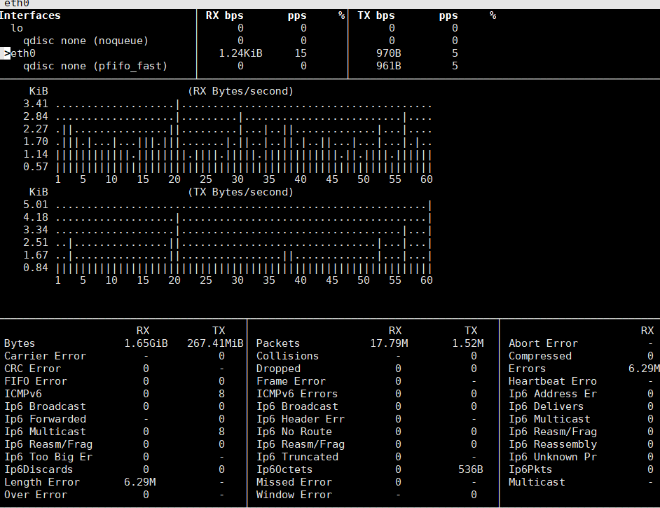
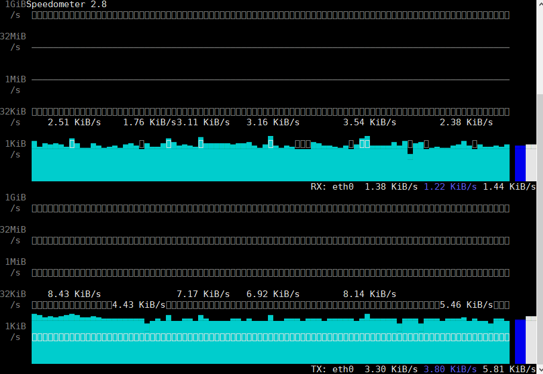
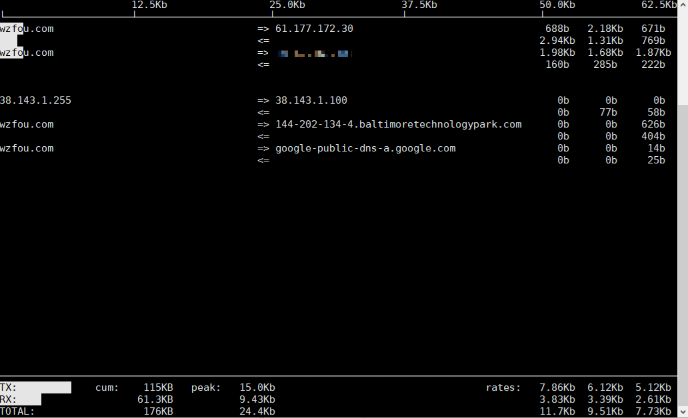
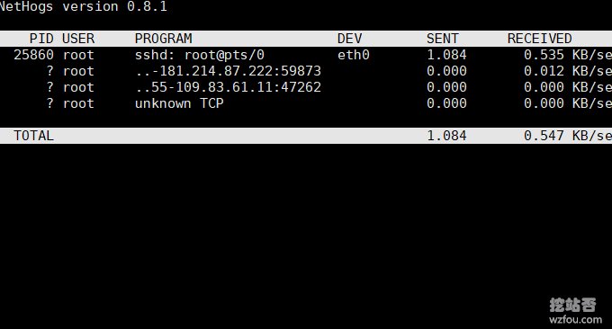
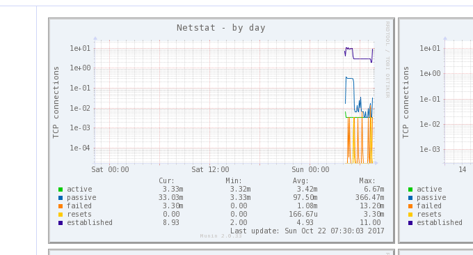

# 三步揪出服务器流量异常“李鬼”-Linux服务器流量带宽监控与统计命令
上次有朋友在挖站否论坛中提出一个关于[英文图片站存储](https://wzfou.com/question/7830/)的问题，问题描述中有一句话让我印象特别深刻——“*我并不推荐VPS裸机给新手，就算你能熟练使用WP建站，你也不一定能搞的定服务器管理。”*这句话其实在我刚刚开始建站时也听说过，以至于走了不少的弯路，吃了不少“哑巴亏”。

对于大流量大存储的图片、影视网站以及访问量大的博客网站上VPS主机主机甚至是独立服务器自然是最好不过的，一来可以节省成本，二来可以分摊风险。至于说的服务器维护的问题，只要前期搭建好了Web环境，后期的维护并不是别人所说的“难于上青天”，多学习多掌握几个命令就好了。

本篇文章就来分享一下当[服务器流量](https://wzfou.com/tag/fuwuqi-liuliang/)出现异常时站长应该采取的操作步骤，挖站否遇到流量异常和网站打开缓慢的情况，最后基本上可以归结为三种：一种是网站正在遭受DD或CC攻击；一种是服务器内存或者CPU耗尽；最后一种就是服务器被“挂马”了。

学会查看[服务器带宽](https://wzfou.com/tag/fuwuqi-daikuan/)异常的命令，可以帮助我们快速定位问题并找出背后的“李鬼”，更多的Linux服务器基础命令用法还有：

1. [Linux Crontab命令定时任务基本语法与操作教程-VPS/服务器自动化](https://wzfou.com/crontab/)
2. [Linux系统监控命令整理汇总-掌握CPU,内存,磁盘IO等找出性能瓶颈](https://wzfou.com/linux-jiankong/)
3. [三个命令工具Rsync,SCP,Tar-快速解决VPS远程网站搬家与数据同步](https://wzfou.com/rsync-scp-tar/)

**PS：2019年2月22日更新，**如果确定流量异常是由CC和DDos攻击导致的，这时候可以采取以下思路来解决：[VPS主机防攻击应对CC和DDOS的基本思路-防扫描防火墙阻止策略](https://wzfou.com/vps-cc-ddos/)。

## 一、第一步：查看带宽总体使用情况

基本命令安装及用法：

> **nload**：`yum install nload`或者`sudo apt-get install nload`，用法：`nload`或者`nload -u M`
> 
> **bmon**：`sudo yum install bmon `或者`sudo apt-get install bmon`，用法：`bmon`
> 
> **bwm-ng**：`sudo apt-get install bwm-ng`或者`sudo yum install bwm-ng`，用法：`bwm-ng`
> 
> **cbm**：`sudo apt-get install cbm`或者`sudo yum install cbm`，用法：`cbm`
> 
> **speedometer**：`apt-get install speedometer `或者`sudo yum install speedometer`，用法：`speedometer`
> 
> **netload**：`sudo apt-get install netload`或者`sudo yum install netload`，用法：`netload`

如果你发现你的[VPS主机](https://wzfou.com/vps/)的变得访问异常缓慢，可以检查一下带宽是否被占用耗尽，以上命令就可以监控网络流量和带宽使用总体情况，可以提供诸如数据交换总量、最小/最大网络带宽使用量等附加信息。这是bmon命令演示：（点击放大）

这是speedometer操作演示，可以看到实时的带宽走向，如果你发现带宽异常那么此处可以看到详细的数据。（点击放大）

## 二、第二步：查看每个连接的流量传输

基本命令安装及用法：

> **iftop**：`yum install iftop`或者`apt-get install iftop`，用法：`iftop`
> 
> **iptraf**：`yum install iptraf`或者`apt-get install iptraf`，用法：`iptraf`
> 
> **tcptrack**：`yum install tcptrack`或者`apt-get install tcptrack`，用法：`tcptrack`
> 
> **pktstat**：`yum install pktstat`或者`apt-get install pktstat`，用法：`pktstat`
> 
> **netwatch**：`yum install netwatch`或者`apt-get install netwatch`，用法：`netwatch`
> 
> **trafshow**：`yum install trafshow`或者`apt-get install trafshow`，用法：`trafshow`

这是iftop命令查看VPS主机上每个连接的带宽使用情况，这里可以看到具体的IP连接情况，一般来说用来攻击的IP会产生非常大的流量，利用此方法就可以揪出异常IP了。

## 三、第三步：查看每个进程的数据传输

基本命令安装及用法：

> **nethogs**：`yum install nethogs`或者`sudo apt-get install nethogs`，用法：`sudo nethogs`

NetHogs用来按进程或程序实时统计网络带宽使用率，send列和received列显示的是按照每个进程的流量统计，总的收发数据带宽在最下方。如下图：

## 四、总结

以上命令上都是Linux自带的命令，可以直接使用yum或者apt安装的方法来安装，用法也都一样，直接输入该命令就可以启动。通过检查总带宽、单个连接流量传输和单个进程数据传输三个步骤，基本上可以定位问题了。

如果你觉得命令太简单了，想要一个更加全面的可持续性的Linux服务器流量及带宽统计，推荐使用Ntopng和Munin，自带Web面板，可用浏览器直接查阅：[两款优秀的服务器网络流量监控工具：Ntopng和Munin-功能强大直观](https://wzfou.com/ntopng-munin/)。

