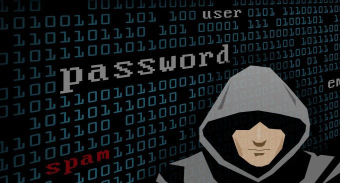

# 五条关于使用免费VPS控制面板的安全建议-不让黑客有可趁之机
对于[VPS主机](https://wzfou.com/vps/)建站新手来说，其实我一直推荐使用VPS主机控制面板。现在市面上免费的VPS主机控制面板很多，很多刚刚从虚拟主机过渡到VPS的朋友于命令还不是很熟悉，VPS主机控制面板上手容易，可以大大提高工作效率。

但是使用免费的VPS控制面板有一个致命的可能性就是存在安全问题，这几天爆出的“VestaCP安全漏洞导致[Digital Ocean](https://wzfou.com/tag/digitalocean/)上百台服务器成为肉机”已经在[VestaCP官网论坛](https://forum.vestacp.com/viewtopic.php?f=10&t=16556&start=260#p68893)和[lowendtalk论坛](https://www.lowendtalk.com/discussion/141728/vestacp-possibly-hit-with-zeroday-exploit-patch-released)上炸开了锅，众多的用户开始吐槽VestaCP安全问题。

根据好友[baoang](https://wzfou.com/hsts-preload/#comment-5876)的留言提醒：流行Linux控制面板VestaCP被发现有0日漏洞，大体说是可能有人在面板程序发布前就在它们的REPO中插入手脚，所以不管用户怎么安装，都有问题。里面的代码装完都是用root权限运行的，会在特定时间把VPS当肉鸡向外攻击。

考虑到有不少的用户是看到挖站否的介绍去尝试了[VestaCP面板](https://wzfou.com/tag/vestacp-mianban/)，在此强烈建议大家赶紧备份好数据（如果有之前的备份就更好，以免当前网站文件或者数据库受到感染），重装VPS系统，重装安装最新版本的VestaCP，同时密切关注VestaCP最新动态。

正好借此机会也来为大家分享如何在使用免费[VPS主机控制面板](https://wzfou.com/tag/vps-mianban/)的前提下，确保自己的服务器安全可靠。关于更多的[建站工具](https://wzfou.com/tag/jianzhan-gongju/)这里有：

1. [三个命令工具Rsync,SCP,Tar-快速解决VPS远程网站搬家与数据同步](https://wzfou.com/rsync-scp-tar/)
2. [Lsyncd搭建同步镜像-用Lsyncd实现本地和远程服务器之间实时同步](https://wzfou.com/lsyncd/)
3. [Linux VPS挂载Google Drive和Dropbox-实现VPS主机数据同步备份](https://wzfou.com/linux-vps-drive/)

## 一、关注官方论坛，更新补丁漏洞

之前Qi做了一个VPS主机控制面板汇总专题：[服务器控制面板榜单](https://wzfou.com/vps-mianban/)，大家可以多多关注一下自己使用的VPS面板，一般来说官方论坛会最先发布面板的补丁以及更新程序，及时更新面板补丁和漏洞是减少损失的最快的方法。

## 二、强化自身安全，定期查看日志

关于服务器自身的安全往往是不少人所忽略的，实际上VPS控制面板即使做得再好如果VPS自身的安全不够好，那也是徒劳。强化服务器自身的安全最好是选购大牌靠谱的VPS商，有关评测参考：[VPS主机排行榜单](https://wzfou.com/vps-bangdan/)。

VPS控制面板如果出现问题，是可以在网站日志中看到蛛丝马迹的。这里推荐两个日志分析工具和性能监控工具，一旦服务器被黑基本上可以从日志+性能监控图表中看到异常信息，帮助我们迅速定位问题。

1. [服务器日志分析利器:ngxtop和GoAccess-实时监控可视化管理快速找出异常来源](https://wzfou.com/ngxtop-goaccess/)
2. [免费开源PHP探针x-prober和酷炫的Linux服务器性能实时监控工具Netdata](https://wzfou.com/x-netdata/)

## 三、做好数据备份，部署异地容灾

要养成网站数据定期备份的好习惯，有条件的朋友还可以部署异地容灾备份方案，总之数据是无价的，一旦服务器被黑也可以在最短的时间内将之前正常的网站数据恢复过来。

关于同步备份这里提供几个自动化的方法：

1. [Linux VPS挂载Google Drive和Dropbox-实现VPS主机数据同步备份](https://wzfou.com/linux-vps-drive/)
2. [Linux共享文件夹目录三种方法-NFS远程挂载,GlusterFS共享存储和samba共享目录](https://wzfou.com/nfs-glusterfs-samba/)
3. [VPS挂载国内外网盘实现免费扩容工具:Rclone,COS-Fuse和OSSFS](https://wzfou.com/rclone-cos-fuse-ossfs/)

## 四、检查程序代码，定期查杀木马

如果你是使用Wordpress，建议不要使用盗版或者破解的Wordpress主题、非官方插件等，这些主题或者插件很有可能被人提前植入了恶意代码。对于新手朋友可以定期给自己的网站程序文件做一次病毒查杀，确保不出现问题。

如何才能知道自己的服务器是否有漏洞或者木马程序？最直接的办法就是实时查看服务器的进程以及端口使用情况，相关的命令如下：

1. [Linux系统监控命令整理汇总-掌握CPU,内存,磁盘IO等找出性能瓶颈](https://wzfou.com/linux-jiankong/)

## 五、放弃免费，改用付费或纯命令

有钱的话还是建议使用付费的VPS控制面板，像WHMCS这样的面板就更要使用付费的了，毕竟安全还是最重要的，参考：[WHMCS从入门到精通](https://wzfou.com/whmcs-jiaocheng/)。有能力的话，建议直接自己手动安装Nginx、MysqL、PHP等建站套件，安全放心。

想要使用纯命令式的LNMP、LAMP脚本建站，推荐以下两个：

1. [OneinStack一键安装脚本-轻松部署Let’s Encrypt证书配置Https站点](https://wzfou.com/oneinstack/)
2. [Linux VPS建站工具LNMP 1.4安装与使用-SSL自动配置续期和多版本PHP支持](https://wzfou.com/lnmp-1-4/)

## 六、总结

关于选择免费VPS控制面板的问题，不管是国内的还是国外的都会存在或多或少的安全问题，那些长期不更新官网长期没有人维护的VPS面板建议不要使用，因为一旦出了问题基本上处于“自救”姿态了。

对于老手们，建议尽快脱离VPS面板的影响，不管VPS面板功能有多强，只要你愿意折腾都可以自己手动用命令来实现。另外，纯命令式的脚本也会有问题，例如openssl漏洞、Nginx漏洞等，都需要给予关注。