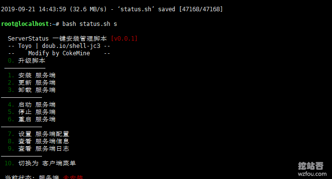
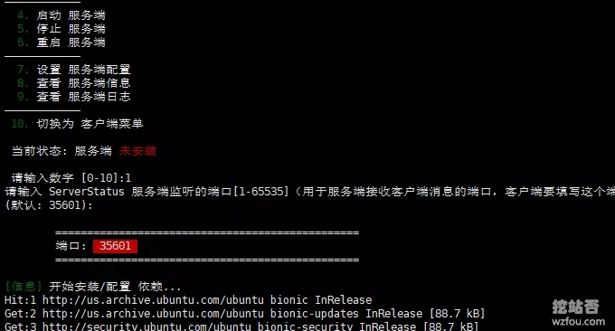
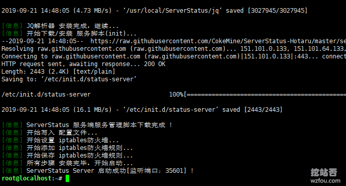
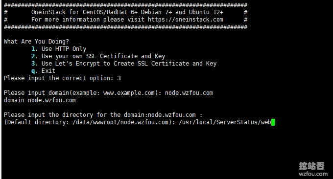
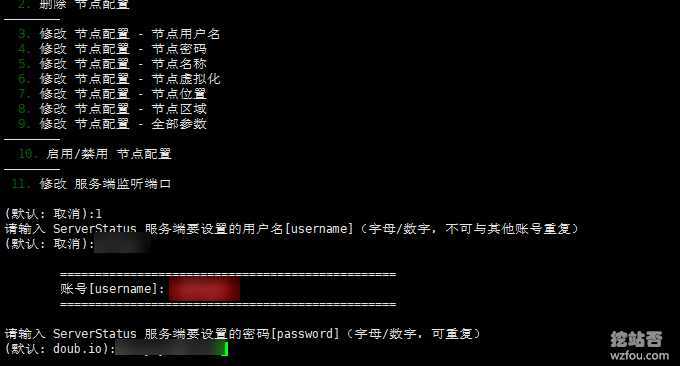
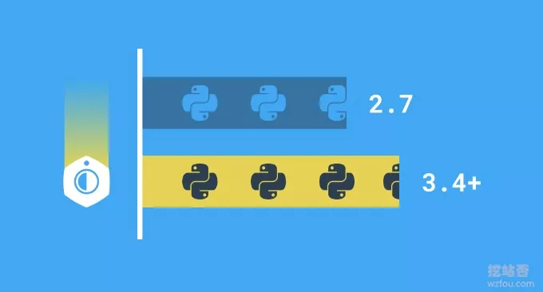
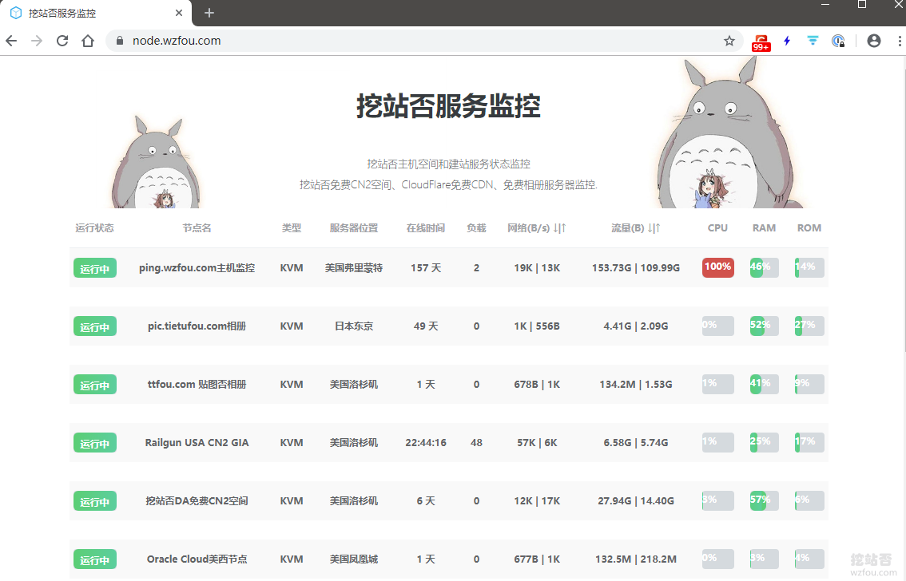
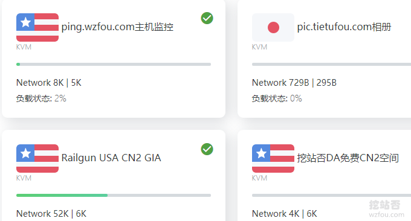

# 利用ServerStatus自建VPS主机和服务器性能和宕机监控平台-效果美化和自定义
ServerStatus是一个优秀的主机服务器云监控脚本，Github有ServerStatus中文版，不过部署和自定义不是很方便，于是就有了各种ServerStatus修改和美化版本。正好最近想要将手里的服务器整合汇总，搭建一个ServerStatus监控平台 ，于是用到了[ServerStatus-Hotaru](https://wzfou.com/tag/serverstatus-hotaru/)这一版。

[ServerStatus-Hotaru](https://wzfou.com/tag/serverstatus-hotaru/)这一版主要是对界面作了美化，同时添加了机房国家旗帜，看起来清爽了不少。这篇文章就来分享一下ServerStatus-Hotaru的安装与使用效果，ServerStatus-Hotaru可以独立安装，也可以安装已经搭建好的Web环境下，整合到Nginx或者Apache当中。

[ServerStatus](https://wzfou.com/tag/serverstatus/)只是对服务器的CPU、内存、磁盘以及系统负载等基本的信息进行监控，想要更为专业更为强大的服务器监控可以试试[Zabbix](https://wzfou.com/zabbix/)，或者只是简单地想要了解Linux服务器的性能只需要掌握一些基本的命令即可：[Linux系统监控命令整理汇总](https://wzfou.com/linux-jiankong/)。

更多的[服务器性能监控](https://wzfou.com/tag/server-perform/)有：

1. [Smokeping安装与配置-免费开源网络性能监控工具可视化主/从部署](https://wzfou.com/smokeping/)
2. [三步揪出服务器流量异常“李鬼”-Linux服务器流量带宽监控与统计命令](https://wzfou.com/fuwuqi-yichang/)
3. [免费开源PHP探针x-prober和酷炫的Linux服务器性能实时监控工具Netdata](https://wzfou.com/x-netdata/)

## 一、ServerStatus服务端

网站：

1. 项目：https://github.com/CokeMine/ServerStatus-Hotaru
2. 备用：https://github.com/freehao123/ServerStatus-Hotaru

ServerStatus脚本命令如下：

1. #下载脚本
2. wget https://raw.githubusercontent.com/CokeMine/ServerStatus-Hotaru/master/status.sh && chmod +x status.sh

4. \# 服务端管理菜单
5. bash status.sh s

7. \# 客户端管理菜单
8. bash status.sh c

### 1.1 安装配置

我们要安装服务器，执行：`bash status.sh s`，然后会有菜单选项，这时我们可以选择安装ServerStatus服务端了。

接下来就是对节点进行相应的配置了。

wzfou.com整合执行过程如下（如果本地没有安装Nginx或者Apache，直接Y，脚本会自动安装Caddy(HTTP服务)并配置好域名和SSL）：

1. root@localhost:~\# bash status.sh s

3. ServerStatus 一键安装管理脚本 \[v0.0.1\]
4. \-\- Toyo | doub.io/shell-jc3 --
5. \-\- Modify by CokeMine --
6. 0. 升级脚本
7. ————————————
8. 1. 安装 服务端
9. 2. 更新 服务端
10. 3. 卸载 服务端
11. ————————————
12. 4. 启动 服务端
13. 5. 停止 服务端
14. 6. 重启 服务端
15. ————————————
16. 7. 设置 服务端配置
17. 8. 查看 服务端信息
18. 9. 查看 服务端日志
19. ————————————
20. 10. 切换为 客户端菜单

22. 当前状态: 服务端 已安装 并 已启动

24. 请输入数字 \[0-10\]:7

26. 你要做什么？

28. 1. 添加 节点配置
29. 2. 删除 节点配置
30. ————————
31. 3. 修改 节点配置 \- 节点用户名
32. 4. 修改 节点配置 \- 节点密码
33. 5. 修改 节点配置 \- 节点名称
34. 6. 修改 节点配置 \- 节点虚拟化
35. 7. 修改 节点配置 \- 节点位置
36. 8. 修改 节点配置 \- 节点区域
37. 9. 修改 节点配置 \- 全部参数
38. ————————
39. 10. 启用/禁用 节点配置
40. ————————
41. 11. 修改 服务端监听端口

43. (默认: 取消):1
44. 请输入 ServerStatus 服务端要设置的用户名\[username\]（字母/数字，不可与其他账号重复）
45. (默认: 取消):wzfouor

47. ================================================
48. 账号\[username\]: wzfou01
49. ================================================

51. 请输入 ServerStatus 服务端要设置的密码\[password\]（字母/数字，可重复）
52. (默认: doub.io):wzfou.com

54. ================================================
55. 密码\[password\]: wzfou.com
56. ================================================

58. 请输入 ServerStatus 服务端要设置的节点名称\[name\]（支持中文，前提是你的系统和SSH工具支持中文输入，仅仅是个名字）
59. (默认: Server 01):Oracle美国西部

61. ================================================
62. 节点名称\[name\]: Oracle美国西部
63. ================================================

65. 请输入 ServerStatus 服务端要设置的节点虚拟化类型\[type\]（例如 OpenVZ / KVM）
66. (默认: KVM):

68. ================================================
69. 虚拟化类型\[type\]: KVM
70. ================================================

72. 请输入 ServerStatus 服务端要设置的节点位置\[location\]（支持中文，前提是你的系统和SSH工具支持中文输入）
73. (默认: Hong Kong):美国

75. ================================================
76. 节点位置\[location\]: 美国
77. ================================================

79. 请输入 ServerStatus 服务端要设置的节点区域\[region\]（用于国旗/区旗图片显示）
80. (默认: HK):US

82. ================================================
83. 节点位置\[region\]: US
84. ================================================

86. \[信息\] 添加节点成功 \[ 节点名称: Oracle美国西部, 节点用户名: wzfou01, 节点密码: wzfou.com \] !
87. \[信息\] ServerStatus Server 停止成功 !
88. \[信息\] ServerStatus Server 启动成功\[监听端口：35601\] !

ServerStatus安装成功。

### 1.2 整合Web

ServerStatus一键安装脚本可以自动下载并配置好Caddy服务器，当然我们也可以将ServerStatus整合到原有的Nginx或者Apache服务器，你只需要在添加虚拟主机时将Web的目录设置为`/usr/local/ServerStatus/web`即可。

### 1.3 基本操作

ServerStatus基本操作命令如下：

1. #客户端操作
2. 启动：service status-client start
3. 停止：service status-client stop
4. 重启：service status-client restart
5. 状态：service status-client status

7. #服务端操作
8. 启动：service status-server start
9. 停止：service status-server stop
10. 重启：service status-server restart
11. 状态：service status-server status

13. #Caddy操作
14. 启动：service caddy start
15. 停止：service caddy stop
16. 重启：service caddy restart
17. 查看状态：service caddy status
18. Caddy配置文件：/usr/local/caddy/Caddyfile

20. #其它文件夹或操作
21. 安装目录：/usr/local/ServerStatus
22. 网页文件：/usr/local/ServerStatus/web
23. 配置文件：/usr/local/ServerStatus/server/config.json
24. 客户端查看日志：tail -f tmp/serverstatus_client.log
25. 服务端查看日志：tail -f /tmp/serverstatus_server.log

## 二、ServerStatus客户端

### 2.1 安装配置

到我们的要安装的客户端的VPS上，执行上面的下载命令，然后运行：`bash status.sh c`，我们选择安装客户端。

ServerStatus客户端安装前需要先到ServerStatus服务端添加节点，得到用户名和密码后，再在ServerStatus客户端安装过程中填入即可。

安装过程记录如下：

1. \[root@instance-20190919-2250 ~\]\# bash status.sh c

3. ServerStatus 一键安装管理脚本 \[v0.0.1\]
4. \-\- Toyo | doub.io/shell-jc3 --
5. \-\- Modify by CokeMine --
6. 0. 升级脚本
7. ————————————
8. 1. 安装 客户端
9. 2. 更新 客户端
10. 3. 卸载 客户端
11. ————————————
12. 4. 启动 客户端
13. 5. 停止 客户端
14. 6. 重启 客户端
15. ————————————
16. 7. 设置 客户端配置
17. 8. 查看 客户端信息
18. 9. 查看 客户端日志
19. ————————————
20. 10. 切换为 服务端菜单

22. 当前状态: 客户端 未安装

24. 请输入数字 \[0-10\]:1
25. \[信息\] 开始设置 用户配置...
26. 请输入 ServerStatus 服务端的 IP/域名\[server\]
27. (默认: 127.0.0.1):node.wzfou.com

29. ================================================
30. IP/域名\[server\]: node.wzfou.com
31. ================================================

33. 请输入 ServerStatus 服务端监听的端口\[1-65535\]（用于服务端接收客户端消息的端口，客户端要填写这个端口）
34. (默认: 35601):

36. ================================================
37. 端口: 35601
38. ================================================

40. 请输入 ServerStatus 服务端中对应配置的用户名\[username\]（字母/数字，不可与其他账号重复）
41. (默认: 取消):wzfou01

43. ================================================
44. 账号\[username\]: wzfou01
45. ================================================

47. 请输入 ServerStatus 服务端中对应配置的密码\[password\]（字母/数字）
48. (默认: doub.io):wzfou.com

50. ================================================
51. 密码\[password\]: wzfou.com
52. ================================================

54. \[信息\] 开始安装/配置 依赖...
55. \[信息\] 开始下载/安装...

### 2.2 Python问题

如果你的系统是CentOS 6的话，那么一般为Python 2.6.6版本，ServerStatus脚本要求是Python 2.7以上，升级的方法请参考：[CentOS 6升级Python 2.7.12并安装最新pip过程记录](https://wzfou.com/question/18085/)。

## 三、ServerStatus监控效果

效果：

1. https://node.wzfou.com/

ServerStatus主机和服务器性能与宕机监控效果如下：（点击放大）

ServerStatus这一版优化的地方主要是可以根据设置的国家或地区显示旗帜，另外界面上也比较好看一些。

## 四、总结

ServerStatus一键安装脚本安装和配置都比较简单，只不过如果是CentOS 6的话会出现Python版本过低的情况，必须升级为Python 2.7以上才可以继续安装。实测发现，CentOS 6在ServerStatus的监控下个别数据会有异常。

ServerStatus的Web页面是可以自己修改的，如果你自己懂得CSS和JS的话，可以直接打开/usr/local/ServerStatus/web修改index.html文件，特别注意如果你的主机已经有了Nginx或者Apache就不要选择自动配置Web服务器了。