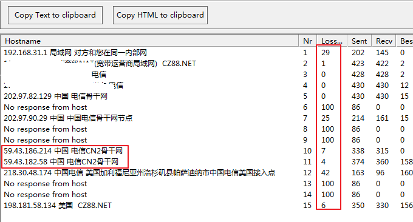
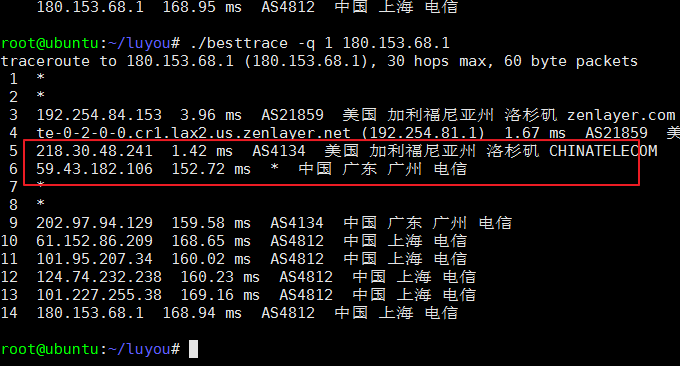
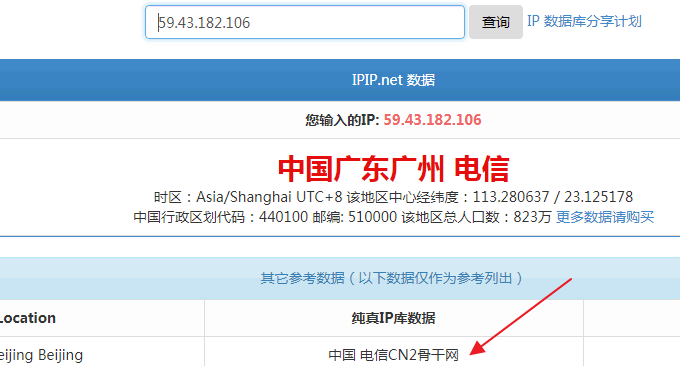
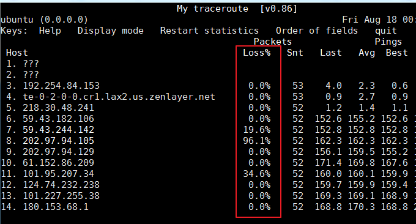

# 接入CN2线路VPS主机商和机房汇总-鉴别真假CN2线路主机参考手册
这是一篇当前接入CN2线路的VPS主机与机房收集整理汇总文章。萌生这篇文章的主要原因是阿里云、经典VPS等纷纷推出了CN2线路主机，自己亲自购买体验后发现CN2线路的VPS主机的下载速度几乎都可以MB/s以上，路由丢包率非常低，这让我对国外的VPS的印象大为改观。

以前有不少的朋友向我咨询有哪些适合建站的VPS主机？如果是想搭建中文网站，我一般是建议购买国内的VPS主机，因为国外的空间与VPS速度比较慢。即使网站可以正常访问，但是网页加载时间一般需要1-2秒，这对于“急躁”的网友肯定是立马关闭浏览器去翻看下一个网站的页面。

但是，用过香港、新加坡、美国等地的CN2线路的VPS主机后，我突然发现其实CN2线路的VPS最适合不想将网站放在国内的朋友使用。上传和下载速度快，响应也很稳定，流量大且价格便宜，几乎满足了大部分建站的需要。当然CN2线路的VPS的价格也普通的VPS价格要贵了不少。

由于市场上对于CN2线路的VPS主机需求非常大，导致出现了一些“鱼目混珠”的情况。本篇文章就是收集整理一下哪些机房和VPS主机走的是双向CN2线路，又有哪些机房和VPS主机走的单向CN2线路，以便于大家在购买VPS主机时作为参考，当然你最好去看看该VPS的评测，这样会有一个更加全面的了解。

[](https://wzfou.com/wp-content/uploads/2017/08/cn2-vps-zhuji_00.gif)

本篇文章部分数据来源于挖站否论坛帖子[CN2线路的VPS](https://wzfou.com/question/2582/)。由于一些VPS主机的“成分”比复杂，欢迎亲自体验过该VPS主机的朋友在文章下方留言或者到论坛[目前走CN2线路的VPS主机商收集汇总-选购前可用作参考](https://wzfou.com/question/2582/)留言反馈，我会及时更新表格数据。

**PS：不想看全文的朋友，请直接点击直接跳到**：[CN2线路VPS主机商/机房列表](https://wzfou.com/cn2-vps-list/#ftoc-heading-7)。我已经制作了一个表格用来统计当前接入CN2线路的VPS主机商家和机房。

更多有关于主机服务与建站工具的专题汇总文章，你也许会感兴趣：

1. [VPS主机排行榜单](https://wzfou.com/vps-bangdan/)
2. [服务器控制面板榜单](https://wzfou.com/vps-mianban/)
3. [WHMCS从入门到精通](https://wzfou.com/whmcs-jiaocheng/)

> **PS：2018年7月31日更新，**更多的CN2 VPS GIA商家可以参考我做的一个专题汇总页面：[CN2 GIA VPS主机收集整理汇总-电信,联通,移动三网CN2 GIA线路VPS主机](https://wzfou.com/cn2-gia-vps/)。

## 一、如何判定CN2是单向还是双向？

我们一般把CN2来回叫双向CN2，这样的线路的速度是比较理想的，但是有一些VPS商家为了节省成本，虽然号称是走了CN2线路，但是实际上回程走的是普通的电信线路，这样的线路我们定义为单向CN2。单向CN2线路的VPS速度肯定是没有双向CN2好。

不过，这也得具体情况具体分析，尤其是碰到一些线路质量比较好的VPS商家，或者是用户数量控制得比较合格的VPS机房，这时单向CN2的VPS速度也会表现不错。关于VPS主机的性能与速度测试方法，有兴趣的朋友可以参考此文：[三大免费工具助你检测VPS服务器真伪-VPS主机性能和速度测试方法](https://wzfou.com/vps-ceping-gongju/)。

### 1.1  判断去程是否走CN2

你可以使用[三大免费工具助你检测VPS服务器真伪](https://wzfou.com/vps-ceping-gongju/)提供的在线路由追踪网站或者是路由追踪软件，在本地运行输入你的服务器IP地址，然后就可以看到去程是不是CN2了。

[](https://wzfou.com/wp-content/uploads/2017/08/cn2-vps-zhuji_01.gif)

### 1.2  判断回程是否走CN2

回程的话，就需要在VPS主机上运行路由追踪软件了。利用Linux自带的traceroute程序Ping出来的IP不会显示位置，这里我们可以下载由 ipip.net 官方开发BestTrace软件：https://www.ipip.net/download.html#ip_trace，备用地址：https://www.ucblog.net/wzfou/besttrace4linux.zip

下载安装traceroute，然后再下载BestTrace，软件不需要编译，直接就可以运行。

```
# CentOS系统：
yum update && yum install traceroute -y
 
# Debian/Ubuntu系统：
apt-get update && apt-get install traceroute -y

wget https://cdn.ipip.net/17mon/besttrace4linux.zip
unzip besttrace4linux.zip -d /root/luyou/
cd luyou
chmod +x *
```

**BestTrace用法。**命令格式：./besttrace -q 1 180.153.68.1，-q 1是限制为1次，因为软件默认的是3次，这样出来的数据会乱得很。180.153.68.1换成你自己的本地IP地址。测试出来的结果除了显示IP地址，还会显示出来位置信息。

[](https://wzfou.com/wp-content/uploads/2017/08/cn2-vps-zhuji_02.gif)

虽然我们得出的IP地址可以看出是走的电信线路，但是怎么知道这个IP就是电信的CN2线路呢？还是利用ipip.net的数据，将IP复制到ipip.net中就会显示是走电信CN2还是走电信普通的骨干线路了。

[](https://wzfou.com/wp-content/uploads/2017/08/cn2-vps-zhuji_03.gif)

### 1.3 判断CN2线路的丢包率

判定去程的丢包率直接使用[三大免费工具助你检测VPS服务器真伪](https://wzfou.com/vps-ceping-gongju/)提供的WinMTR软件，从上面[1.1 判断去程是否走CN2 ](https://wzfou.com/cn2-vps-list/#11nbsp_CN2)图片我们也看出来了线路的丢包情况。判断回程的话，我们可以用到MTR，安装方法如下：

```
# CentOS系统：
yum update && yum install mtr -y
 
# Debian/Ubuntu系统：
apt-get update && apt-get install mtr -y
```

**MTR用法。**命令格式：mtr 180.153.68.1，把IP换成你自己的本地IP地址。默认的mtr会一直发包，不会停止。你也可以指定mtr发出100个包再输出结果，命令如下：mtr -c 100 –report 180.153.68.1。

[](https://wzfou.com/wp-content/uploads/2017/08/cn2-vps-zhuji_04.gif)

## 二、检测CN2线路VPS的速度质量

通过上面的方法我们检测过了VPS主机的线路是不是走CN2，但是不要以为凡是走了CN2线路的速度都会快。打个比方，“高速公路车辆通行速度很快很流畅，但是遇到节假日免费时就变成了拥堵不堪了”。所以，CN2线路速度好不好还得取决于同机房的“邻居”有多少，因为大家都是共享带宽。

**谨慎入手便宜CN2线路。**CN2线路的VPS主机一般都是比普通的VPS主机都要贵，如果你看到某个VPS主机推销的CN2线路VPS主机很便宜，那么你就要小心了。除了重大促销打折外，这些便宜的CN2 VPS一般地都会吸引大量的用户，从而导致线路质量变坏。

[](https://wzfou.com/wp-content/uploads/2017/08/cn2-vps-zhuji_05.jpg)

**谨慎对待CN2线路VPS。**从我使用CN2 VPS主机的经验来看，CN2 VPS主机的速度也并不是一直都是好的，有时也有线路不通的情况，特别在晚上时CN2 VPS的速度会慢一些。原因可能有多方面的，可能是机房的带宽爆掉了，也可能是整个CN2线路出现短暂的问题。

[](https://wzfou.com/wp-content/uploads/2017/08/cn2-vps-zhuji_06.gif)

**如何检测CN2 VPS的线路质量？**从上面的分析可以看出，CN2 VPS线路的速度也是一个动态的过程，不过总体来看CN2线路的VPS的使用体验会好于普通的VPS主机，所以想要知道某一个VPS的CN2线路质量如何，**要么是自己亲自购买一个试用，要么就是看专业的VPS速度测试报告。**

[](https://wzfou.com/wp-content/uploads/2017/08/cn2-vps-zhuji_07.jpg)

## 三、CN2线路VPS主机商/机房汇总

以下就是我收集整理的，到目前为止接入双向CN2线路VPS主机商/机房汇总表格，感谢[dvblog](https://dvblog.win/?p=167)博主、[可乐博客](https://www.cokemine.com/)博主等好友提供相关的参考资料。由于回程线路测试必须要用到某VPS主机的IP，所以欢迎亲自使用过某VPS的朋友留言反馈CN2线路的情况。**本表数据不断更新完善。**

**表格有关说明：**

> **速度测试一栏**的IP来自于官网的速度测试页面提供的IP数据，也有热心朋友提供的测试IP，点击后可以下载一个文件，或者你可以自己用站长工具测试一下该IP。
> 
> **评分一栏**是根据自己的使用体验以及参考身边朋友的反馈数据得出的一个数值化的评分印象，个人评价仅供参考，同时也欢迎大家给出评价。
> 
> **表格排序**-你可以点击表样第一行的三角形来按照评分、价格、内存、流量等数据进行排序。**流量单位：GB；内存单位：MB；月付单位：美元。**
> 
> **双向**即往返全程走CN2；**单向**即去程CN2返程CN1；**双半**即去程CN1+CN2，返程也是CN1+CN2。**N/A**表示该VPS商存在争议，或者暂时无法给出评价，需要继续观察。

### 3.1  CN2线路VPS主机商/机房列表

搜索:

|                        主机商                        | 单/双向 | 内存 |  流量  | 月付 |          机房位置           |                                                            速度测试                                                            |                       评分                        |
| --------------------------------------------------- | ------ | ---- | ----- | ---- | -------------------------- | ----------------------------------------------------------------------------------------------------------------------------- | ------------------------------------------------- |
| [经典VPS商](https://wzfou.com/go/bvpsnet)            | 双向    | 512  | 500   | 3.99 | 洛杉矶C3                    | [美国CN2 VPS](https://wzfou.com/cn2-vps/)                                                                                     | [*8.7*](https://wzfou.com/bvps-pingjia/)          |
| [腾讯云](https://wzfou.com/go/qcloud)                | 双向    | 1024 | 1G/元 | 6    | 香港                       | [腾讯云VPS](https://wzfou.com/tencent-cloud/)                                                                                  | [*8.7*](https://wzfou.com/tengxunyun-pingjia/)    |
| [阿里云新加坡](https://wzfou.com/go/alibabacloud)    | 双向    | 1024 | 1024  | 4.5  | 新加坡                      | [阿里云新加坡](https://wzfou.com/alibabacloud/)                                                                                | [*8.4*](https://wzfou.com/aliyun-vps-pingjia/)    |
| [阿里云香港](https://wzfou.com/go/alibabacloud)      | 双向    | 1024 | 1024  | 9    | 香港                       | [阿里云香港](https://wzfou.com/alibabacloud-hk/)                                                                               | [*8.4*](https://wzfou.com/aliyun-vps-pingjia/)    |
| [阿里云国内](https://wzfou.com/go/aliyun)            | 双向    | 1024 | 1024  | 9    | 香港                       | [国内外版对比](https://wzfou.com/aliyun-alibabacloud/)                                                                         | [*8.4*](https://wzfou.com/aliyun-vps-pingjia/)    |
| [idc.wiki](https://wzfou.com/go/idcwiki)            | 双向    | 512  | 1000  | 6    | 香港  Cera CN2  洛杉矶C3    | [idc.wiki主机](https://wzfou.com/idcwiki-pingce/)                                                                             | [*8.3*](https://wzfou.com/idcwiki-pingjia/)       |
| [GigsGigsCloud](https://wzfou.com/go/gigsgigscloud) | 双向    | 512  | 1000  | 6.8  | 美国                       | [GigsGigsCloud](https://wzfou.com/gigsgigscloud/)                                                                             | [*8.2*](https://wzfou.com/gigsgigscloud-pingjia/) |
| [iON VPS](https://wzfou.com/go/ion)                 | 双向    | 1024 | 1000  | 5    | 洛杉矶KT                    | [iON CN2 VPS](https://wzfou.com/ion-pingce/)                                                                                  | [*7.9*](https://wzfou.com/ion-vps-pingjia/)       |
| [hostkvm](https://wzfou.com/go/hostkvm)             | 双向    | 1024 | 限带宽 | 11.9 | 香港沙田                    | 118.193.216.194                                                                                                               | 7.7                                               |
| [dediserve](https://wzfou.com/go/dediserve)         | 双半    | 2048 | ∞     | 16.4 | 维也纳                      | [79.133.43.50](http://speedtest.c1.vie1.dediserve.com/100MB.test)                                                             | 7.7                                               |
| [hostdare](https://wzfou.com/go/hostdare)           | 双半    | 756  | 1000  | 4.99 | 洛杉矶C3                    | [HostDare美国CN2](https://wzfou.com/hostdare/)                                                                                | [*7.6*](https://wzfou.com/hostdare-pingjia/)      |
| [locvps](https://wzfou.com/go/locvps)               | 双向    | 1024 | 限带宽 | 12.7 | 香港沙田                    | 45.248.87.2                                                                                                                   | 7.5                                               |
| [RAKsmart](https://wzfou.com/go/raksmart)           | 双向    | 512  | 限带宽 | 7.69 | 洛杉矶                      | N/A                                                                                                                           | 7.6                                               |
| [rfchost](https://wzfou.com/go/rfchost)             | 双半    | 512  | 500   | 6.99 | 洛杉矶C3                    | [107.151.180.24](https://v4-lg-lax1.rfchost.com/100MB.test)                                                                   | 7.6                                               |
| [Hostker](https://wzfou.com/go/hostker)             | 双向    | 1024 | N/A   | 9    | 香港沙田                    | [Hostker VPS](https://wzfou.com/hostker-hk/)                                                                                  | 7.2                                               |
| [kvmla](https://wzfou.com/go/kvmla)                 | 双向    | 1024 | 600   | 11.7 | 香港                       | N/A                                                                                                                           | 7.2                                               |
| [BuyVM](https://wzfou.com/go/frantech)              | 单向    | 2048 | ∞     | 10   | 拉斯维加斯                  | [BuyVM VPS评价](https://wzfou.com/buyvm-pingjia/)                                                                             | [*7.1*](https://wzfou.com/buyvm-pingjia/)         |
| [BudgetVM](https://wzfou.com/go/budgetvm)           | 单向    | 512  | 2000  | 2.91 | 洛杉矶enzu                  | [192.157.214.6](http://192.157.214.6/10MB.test)                                                                               | 6.8                                               |
| [hostus.us](https://wzfou.com/go/hostus)            | 单向    | 512  | 750   | 4.35 | 洛杉矶Psychz  香港SoftLayer | [216.189.149.3](http://la-lg.hostus.us/100MB.test)  [45.124.64.3](http://speedtest.hkg02.softlayer.com/downloads/test100.zip) | 6.7                                               |
| [CloudCone](https://wzfou.com/go/cloudcone)         | 双向    | 512  | 1000  | 2.8  | 洛杉矶                      | [CloudCone](https://wzfou.com/cloudcone-pingce/)                                                                              | [*5.9*](https://wzfou.com/cloudcone-pingjia/)     |
| [photonvps](https://wzfou.com/go/photonvps)         | 单向    | 1024 | 2000  | 5.95 | 洛杉矶Psychz                | [104.149.18.203](http://lg.lax.psychz.net/200MB.test)                                                                         | 6.2                                               |
| [anexia-it.com](https://wzfou.com/go/anexia)        | 双向    | N/A  | N/A   | N/A  | 德国Frankfurt              | 独立服务器                                                                                                                     | N/A                                               |
| [CeraNetworks](https://wzfou.com/go/ceranetworks)   | 双向    | N/A  | N/A   | N/A  | 洛杉矶CERA                  | 独立服务器                                                                                                                     | N/A                                               |
| [魔方云](https://wzfou.com/go/cubecloud)             | 双半    | 1024 | 1500  | 8    | 洛杉矶GIA  新加坡 VZ        | 103.213.247.254                                                                                                               | N/A                                               |
| [Dedione](https://wzfou.com/go/dedione)             | 双向    | 512  | 512   | 5.7  | 洛杉矶GIA                   | N/A                                                                                                                           | N/A                                               |