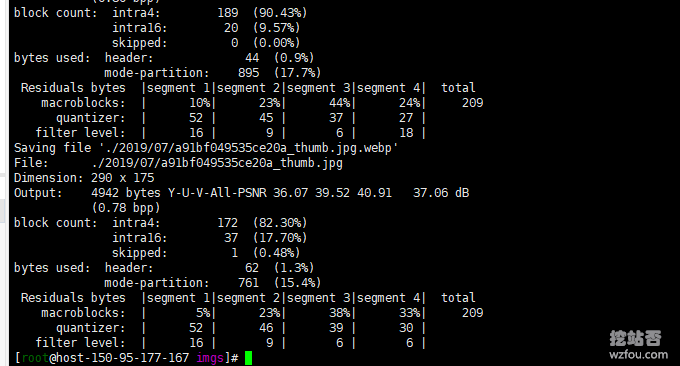
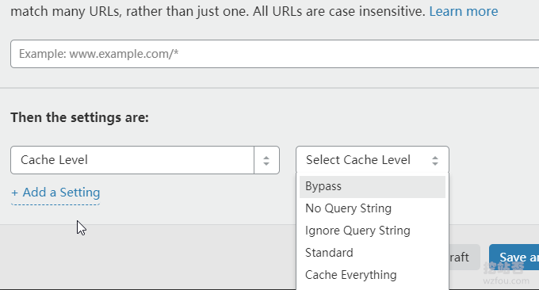
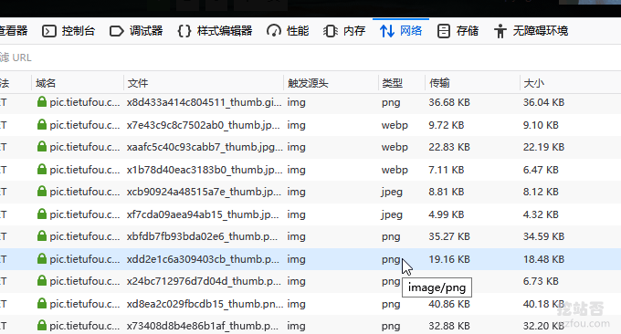
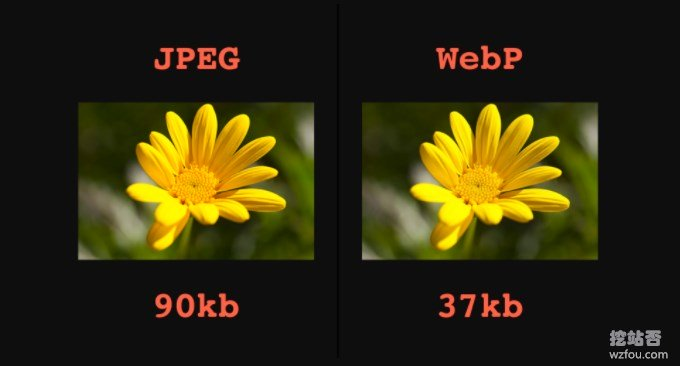

# 网站启用WebP格式图片-PHP和Nginx转化WebP格式和自适应浏览器
网站启用WebP格式图片有两种形式：一种是在本地生成WebP格式图片然后上传到服务器上，用户访问到的全是WebP格式图片；另一种是在远程服务器上生成WebP格式图片，然后根据用户的浏览器是否支持WebP格式图片来决定是否加载WebP格式图片。

前一种显然不适用于当前的网络环境，原因是WebP格式图片在一些老旧浏览器是无法打开了，也包括了苹果的浏览器，所以我们需要一种“折衷”的方案：服务器准备好JPG/PNG/Gif+WebP两种图片，利用PHP和Nginx等方式来判定是否展示WebP格式图片。

这篇文章就来分享一下如何在服务器上批量转换JPG/PNG/Gif格式的图片为[WebP图片](https://wzfou.com/tag/webp-tu/)，同时利用PHP代码和Nginx规则来自动判定当前用户的浏览器WebP适配程度，从而达到加快访问的目的。该方案特别适合图片网站或者是相册网站，提速是显而易见的。

更多的关于[网站建设](https://wzfou.com/jianzhan/)以及[服务器优化](https://wzfou.com/tag/fuwuqi-youhua/)的经验，这里还有：

1. [VPS主机和服务器安全防护:SSH修改端口,添加白名单,仅限密钥登录](https://wzfou.com/linux-vps-sh/)
2. [三步揪出服务器流量异常“李鬼”-Linux服务器流量带宽监控与统计命令](https://wzfou.com/fuwuqi-yichang/)
3. [网站屏蔽和阻止特定地区和国家的IP访问设置方法-PHP代码/Nginx/WordPress设置](https://wzfou.com/zuzhi-ip/)

> **PS：2019年9月29日更新，**Google开发的Nginx PageSpeed组件可以实现自动转化webP和自动适应浏览器请求等一整套图片优化，参考：[PageSpeed服务器优化神器-Nginx部署ngx_pagespeed模块和加速效果体验](https://wzfou.com/ngx-pagespeed/)。
> 
> **PS：2020年2月6日更新，**批量给图片和视频转换格式的软件还可以试试开源免费的FFmpeg：[免费开源的视频音频格式转换和压缩软件FFmpeg-快速转换格式和压缩视频](https://wzfou.com/ffmpeg/)。

## 一、安装WebP命令工具

> **PS：2019年9月16日更新，**更多的批量生成和转化webP格式图片的方法请参考：[网站图片WebP格式批量转换设置及加速效果体验](https://wzfou.com/webp/)。

### 1.1  安装WebP

WebP官网：

1. 网站：https://developers.google.com/speed/webp/

你可以选择直接安装，或者是源码编译，安装命令如下：

#直接安装
#debian install webp
sudo apt-get install webp
#或者
yum install libwebp-tools

你也可以选择源码编译，命令如下：

\# 安装编译器以及依赖包
yum install -y gcc make autoconf automake libtool libjpeg-devel libpng-devel 
\# 请从官网下载最新的webp
wget https://storage.googleapis.com/downloads.webmproject.org/releases/webp/libwebp-1.0.3.tar.gz
\# 解压
tar -zxvf libwebp-1.0.3.tar.gz
\# 进入目录
cd libwebp-1.0.3
\# 源代码安装环境检查
./configure
\# 编译
make
\# 安装
make install

执行命令：cwebp，如果出现错误：error while loading shared libraries: libwebpdemux.so.2，使用以下命令解决：

\[root@qimi libwebp-1.0.3\]# cwebp
cwebp: error while loading shared libraries: libwebpdemux.so.2: cannot open shared object file: No such file or directory
\[root@qimi libwebp-1.0.3\]# echo "export LD\_LIBRARY\_PATH=$LD\_LIBRARY\_PATH:/usr/local/lib" >> ~/.bashrc
\[root@qimi libwebp-1.0.3\]# export LD\_LIBRARY\_PATH=$LD\_LIBRARY\_PATH:/usr/local/lib
\[root@qimi libwebp-1.0.3\]# echo $LD\_LIBRARY\_PATH
:/usr/local/lib
\[root@qimi libwebp-1.0.3\]# cwebp
Usage:

   cwebp \[options\] -q quality input.png -o output.webp

where quality is between 0 (poor) to 100 (very good).
Typical value is around 80.

Try -longhelp for an exhaustive list of advanced options.

### 1.2  批量转化Webp

在Linux上将JPG、PNG和Gif图片批量转化为WebP格式图片的命令如下：

find ./ -name "*.jpg" -exec cwebp -q 85 {} -o {}.webp \\; 
find ./ -name "*.png" -exec cwebp -q 85 {} -o {}.webp \\; 
find ./ -name "*.gif" -exec gif2webp -q 85 {} -o {}.webp \\;

## 二、通过PHP自动加载WebP图片

**假设你已经在本地将图片都转换成了为WebP格式，**一个通用的做法的就是在PHP中判定浏览器是否支持WebP格式图片，如果支持那就调用WebP图片，代码如下：

<?php

$webp\_allowed = (bool)strstr($\_SERVER\['HTTP_ACCEPT'\], 'image/webp');

function __w($url) {
    global $webp_allowed;
    if($webp_allowed) {
        $url .= '.webp';
    }

    return $url;
}

由于要PHP识别并调用WebP格式图片，所以你的网站使用的CDN缓存或者其它类的缓存就需要关掉了，例如CloudFlare的PHP页面缓存就需要关闭了。

## 三、Nginx判定并自动加载WebP图片

**假设你已经在本地将图片都转换成了为WebP格式，**如果想让Nginx来判定浏览器是否支持WebP格式的图片，可以先在 http {} 中加入以下代码：

map $http\_accept $webp\_suffix {
  default   "";
  "~*webp"  ".webp";
}

然后在server {}段加入以下代码：

 location ~ .*\\.(gif|jpg|jpeg|png)$ {
  add_header Cache-Control "public, no-transform";
  add_header Vary "Accept-Encoding";
  try\_files $uri$webp\_suffix $uri =404;
  expires max;
}

这样当浏览器支持Webp格式时就会自动加载webp图片了。

Webp格式浏览器自适应效果见：https://ttfou.com/。

## 四、Nginx-Lua 将 Jpg/png 转 Webp并自适应

网站：

1. 官网：https://github.com/openresty/lua-nginx-module

ngx_lua是Nginx的一个模块，将Lua嵌入到Nginx中，从而可以使用Lua来编写脚本。利用Nginx-Lua ，我们可以让**[Nginx Lua](https://wzfou.com/tag/nginx-lua/)**主机**自动将Jpg/png 转 Webp格式，并且让支持WebP格式的浏览器加载图片。**如果你用的是LNMP，可以使用以下命令来安装：（注意把版本改为最新）

wget https://github.com/openresty/lua-nginx-module/archive/v0.10.11.zip
unzip v0.10.11.zip
wget https://github.com/simpl/ngx\_devel\_kit/archive/v0.3.0.zip
unzip v0.3.0.zip
wget http://luajit.org/download/LuaJIT-2.0.5.zip
unzip LuaJIT-2.0.5.zip
cd LuaJIT-2.0.5
make
make install PREFIX=/usr/local/luajit
cat > /etc/ld.so.conf.d/luajit.conf<<EOF
/usr/local/luajit/lib
EOF

ldconfig

export LUAJIT_LIB=/usr/local/luajit/lib
export LUAJIT_INC=/usr/local/luajit/include/luajit-2.0

然后编辑lnmp1.4/lnmp.conf文件，在Nginx\_Modules\_Options这一行的单引号里面添加：

--with-ld-opt=-Wl,-rpath,/usr/local/luajit/lib --add-module=/root/lua-nginx-module-0.10.11 --add-module=/root/ngx\_devel\_kit-0.3.0

保存之后重新编译nginx，./upgrade.sh nginx。编译成功了之后，打开/usr/local/nginx/conf/nginx.conf文件，在http段添加：

lua\_package\_path "/usr/local/luajit/share/luajit-2.0.5/jit/?.lua;";

然后进入/usr/local/nginx/conf文件夹，新建一个webp.lua文件，内容如下：

function file_exists(name)
local f=io.open(name,"r")
if f~=nil then io.close(f) return true else return false end
end

local newFile = ngx.var.request_filename;
local originalFile = newFile:sub(1, #newFile - 5); -- 去掉 .webp 的后缀

if not file_exists(originalFile) then -- 原文件不存在
ngx.exit(404);
return;
end

os.execute("cwebp -q 75 " .. originalFile .. " -o " .. newFile); -- 转换原图片到 webp 格式，这里的质量是 75 ，你也可以改成别的

if file_exists(newFile) then -- 如果新文件存在（转换成功）
ngx.exec(ngx.var.uri) -- Internal Redirect
else
ngx.exit(404)
end

之后进入/usr/local/nginx/conf/vhost，找到你要用到的网站配置文件，在server段下加入以下：

location ~ {
  expires 365d;
  try_files $uri $uri/ @webp; # 如果文件不存在尝试生成 webp 图片
}

location @webp{
  if ($uri ~ "/(\[a-zA-Z0-9-_\]+)\\.(png|jpg|gif|jpeg)\\.webp") { # 这里可以改成你自己的路径匹配，很重要，否则可能会导致别的文件被恶意覆盖等
    content\_by\_lua_file "/usr/local/nginx/conf/webp.lua";
  }
}

完成以上全部之后，重启nginx：lnmp nginx restart，或者：service nginx restart。访问原图的路径，并在后面加上.webp扩展名，你会发现不会404，而是一张webp的图片被加载了。并且在目录里面也存在一个webp文件。

## 五、PageSpeed自动转化Webp并自适应

Google开发的[PageSpeed](https://wzfou.com/tag/pagespeed/)模块有一个功能，会自动将图像转换成WebP格式或者是浏览器所支持的其它格式。命令如下：

####### 图片########
 
\# 启用图片优化机制(主要是 inline\_images, recompress\_images, convert\_to\_webp\_lossless（这个命令会把PNG和静态Gif图片转化为webp）, and resize\_images.)
 pagespeed EnableFilters rewrite_images;
#组合 convert\_gif\_to\_png, convert\_jpeg\_to\_progressive, convert\_jpeg\_to\_webp, convert\_png\_to\_jpeg, jpeg\_subsampling, recompress\_jpeg, recompress\_png, recompress\_webp, #strip\_image\_color\_profile, and strip\_image\_meta\_data.
 pagespeed EnableFilters recompress_images;
 
#将JPEG图片转化为webp格式
 pagespeed EnableFilters convert\_jpeg\_to_webp;
 # 将动画Gif图片转化为动画webp格式
pagespeed EnableFilters convert\_to\_webp_animated;

PageSpeed是一个非常强大的工具，效果见：https://pic.tietufou.com/

## 六、总结

如果是Windows，可以直接安装WebP软件批量转化图片格式的，如果是Linux主机则需要安装WebP命令来转化。图片格式转化的速度取决于你的服务器的性能，上万张的图片可能需要大量的时间才能转换完成。

最高效率的WebP自适应方法就是利用Nginx来判定是否让浏览器加载[WebP图片](https://wzfou.com/tag/webp-tu/)，不过在大量启用WebP转换的过程中可能会出现服务器负载增高的情况，在转换完成后会放在本地磁盘，后期不影响服务器性能。