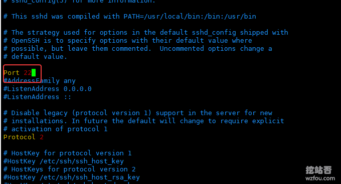

# 解决VPS主机端口22无法使用以及网站IP无法访问的问题
最近有不少的人在[其云否主机](https://wzfou.com/qyfou-ssd-vps/)工单中反馈说自己的VPS主机IP无法使用22端口了，经过检测发现，80、443等端口可以正常使用，也就是说搭建在VPS主机上的网站可以正常访问，但是就是无法使用22端口。

显然这样的情况是个别地区无法使用22端口导致的，解决的办法就是直接修改一下VPS主机默认的22端口即可。也有朋友“雪上加霜”，自己的网站IP被QQ了，导致网站域名不能访问，解决的办法只有一个。

那就是给自己的域名上CDN加速，隐藏真实的IP，这样用户也能正常访问，同时还兼顾了安全防护。本篇文章就来分享一下如何处理VPS主机无法使用22端口以及网站IP被不能使用的问题。更多的关于建站经验有：

1. [Payoneer万事达信用卡到期免费换卡方法-Payoneer实体卡换卡操作](https://wzfou.com/payoneer-xuqi/)
2. [启用CDN后网站获取用户真实IP:Cloudflare CDN真实IP地址(Nginx,Apache)](https://wzfou.com/cdn-real-ip/)
3. [网站屏蔽和阻止特定地区和国家的IP访问设置方法-PHP代码/Nginx/WordPress设置](https://wzfou.com/zuzhi-ip/)

## 一、解决VPS主机端口22无法使用

如果你也遇到了VPS主机无法使用22端口的问题，先通过控制中心进入到SolusVM面板（不同的主机有不同的面板，但是都提供了VNC连接方式）。

然后点击VNC连接。

弹出提示，选择Html5方式。

接着，使用你的VPS主机的Root密码登录。

修改sshd_config文件，将默认的22端口设置其它的，然后重启SSH服务即可。

代码命令如下：

1. #SSH服务的启动与停止
2. service sshd status \# 状态
3. service sshd start \# 启动
4. service sshd stop \# 暂停
5. service sshd restart \# 重启
6. #修改端口号
7. #主配置文件：/etc/ssh/sshd_config
8. Port 22

## 二、解决网站IP无法访问

如果确定是自己的网站IP被QQ的话，我们可以使用[Cloudflare CDN](https://wzfou.com/tag/cloudflare-cdn/)，你可以直接到Cloudflare 官网添加域名，也可以使用[Cloudflare CDN](https://wzfou.com/tag/cloudflare-cdn/)第三方接入平台，例如cdn.wzfou.com。

使用Cloudflare CDN第三方接入平台与直接在Cloudflare CDN官网接入CDN效果是一样的，只不过接第三方可以不用修改NS服务器使用CNAME等方式接入CDN，且cdn.wzfou.com目前启用[Railgun动态加速](https://wzfou.com/cloudflare-railgun/)。

添加了域名后，然后就会给出CNAME、A等记录，你只需要修改任意一个即可。详细方法参考：[CloudFlare免费CDN加速](https://wzfou.com/cloudflare-cdn/)。

使用Cloudflare CDN加速网站效果可以见：https://losa.wzfou.net

## 三、总结

一般来说建议在VPS主机开通后就修改默认的SSH端口，一方面可以保证安全，因为攻击VPS主机后台登录的都采用默认的22端口，另一方面可以防止被Q。

使用CDN加速的方法来解决网站IP无法使用的问题，前提必须是你的域名没有被拉入“黑名单”，否则你需要在DNS解析这一块“下功夫”：[DNS域名解析启用DNSSEC防止DNS劫持](https://wzfou.com/dnssec-dns/)。