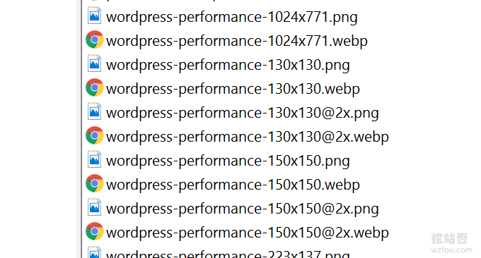

# 让图片飞一会儿！网站图片WebP格式批量转换设置及加速效果体验
由于博客主机是放在国外，虽然说用上了[经典的CN2 GIA](https://wzfou.com/cn2-vps-gia/)，速度比放在普通的美国机房的VPS主机快了不少，但是由于写文章需要插入大量的图片，且Wordpress安装了众多的插件（见：[挖站否Wordpress插件汇总](https://wzfou.com/my-wp-pluins/)），导致浏览器访问页面的请求数量非常多。

如果是在国内的VPS，例如像[腾讯云](https://wzfou.com/tag/tencent-yun/)、[阿里云](https://wzfou.com/my-wp-pluins/)等，天生已经具备了速度优势，所以只经愿意花钱把主机的带宽加大，国内访问的速度还是有保障的。而国外的VPS主机机房带宽给得非常大，但是在晚上上网高峰期间容易线路出现拥堵，可能会影响网站体验。

所以，如果你像挖站否这样主机放在国外同时网页图片、JS、CSS等文件特别多，就应该尽量去优化，比如减少请求、压缩图片、合并JS和CSS、压缩html页面等。这篇文章主要是来分享图片优化的经验：网站[webp图片](https://wzfou.com/tag/webp-tu/)格式设置及加速效果体验。

更多的关于网站优化经验与技巧，请查看：

1. [博客主要应用技术及支持特性-挖站否网站与服务器优化方法总结](https://wzfou.com/readme/)
2. [DirectAdmin空间启用OpCache和redis缓存加速-WP启用redis缓存](https://wzfou.com/directadmin-cache/)
3. [Cloudflare自动拉黑恶意IP到防火墙和自动切换5秒盾脚本防CC攻击](https://wzfou.com/cloudflare-cc/)

> **PS：2019年9月3日更新**，WebP格式适用于图片网站和相册，这里有两个适合个人搭建图床相册的程序：[ImgURL Pro](https://wzfou.com/imgurl/)和[Chevereto](https://wzfou.com/chevereto/)。
> 
> **PS：2019年9月29日更新，**Google开发的Nginx PageSpeed组件可以实现自动转化webP和自动适应浏览器请求等一整套图片优化，参考：[PageSpeed服务器优化神器-Nginx部署ngx_pagespeed模块和加速效果体验](https://wzfou.com/ngx-pagespeed/)。

## 一、WebP图片优势与不足？

### 1.1  最大限度地压缩图片

如果图片在JPEG、PNG以及GIF这些格式的图片已经没有太大的优化空间，使用无损压缩后的WebP比PNG文件少了26％的体积，有损压缩后的WebP图片相比于等效质量指标的JPEG图片减少了25％~34%的体积。

从下图我们可以看到webp有损可以将40多kb的PNG压缩到10kb以下，且保证了图片的质量——肉眼无法区分。 PNG和Webp在浏览器的加速效果详见：https://isparta.github.io/compare-webp/index.html。（点击放大 ）

WebP也支持gif图片转换，换句放说webp格式的动图体积会更小，对比：https://isparta.github.io/compare-webp/index_a.html#12，如下图：

### 1.2  个别老旧浏览器不兼容

[webp图片](https://wzfou.com/tag/webp-tu/)最大的不足就是一些老旧的浏览器不支持，比如IE各个版本、IOS Safari等，不过不用担心，webp格式图片在未来被各大浏览器支持是一个大趋势，webp浏览器兼容详见：https://caniuse.com/#search=webp（点击放大）

> **PS：2019年9月16日更新，**我们可以利用PHP代码和Nginx重写规则让服务器根据客户浏览器来决定是否展示webP图片：[网站启用WebP格式图片-PHP和Nginx转化WebP格式和自适应浏览器](https://wzfou.com/webp-nginx/)。

## 二、本地转换webp

> **PS：2020年2月6日更新，**批量给图片和视频转换格式的软件还可以试试开源免费的FFmpeg：[免费开源的视频音频格式转换和压缩软件FFmpeg-快速转换格式和压缩视频](https://wzfou.com/ffmpeg/)。

最便捷地让网站用上webp格式图片，不是在本地生成，而是直接在线将gif、png、JPG等格式的图片转换为webp格式图片。这类的网站有：

1. https://webp-converter.com/
2. https://ezgif.com/jpg-to-webp
3. https://www.aconvert.com/cn/image/
4. https://zhitu.isux.us/

在线转换webp图片适合小量的图片，如果你有大量的图片转换为webp格式的需要，可以下载webp格式转换软件，例如：XnConvert、iSparta等，直接在电脑上就可以批量转换图片为webp格式了。

1. http://isparta.github.io/
2. https://www.xnview.com/en/xnconvert/

## 三、Linux转换webp

### 3.1  Webp工具安装

Webp各大版本：

1. https://storage.googleapis.com/downloads.webmproject.org/releases/webp/index.html

WebP安装快速安装命令：

#debian install webp
sudo apt-get install webp

WebP源码编译安装命令：

\# 安装编译器以及依赖包
yum install -y gcc make autoconf automake libtool libjpeg-devel libpng-devel
\# 请到官网下载最新版本
wget https://storage.googleapis.com/downloads.webmproject.org/releases/webp/libwebp-0.6.0.tar.gz
\# 解压
tar -zxvf libwebp-0.6.0.tar.gz
\# 进入目录
cd libwebp-0.6.0
\# 源代码安装环境检查
./configure
\# 编译
make
\# 安装
make install

验证webp是否安装成功。在终端输入`cwebp`，显示如下输出，说明已经安装成功：

\[root@linux-server\]# cwebp
Usage:

   cwebp \[options\] -q quality input.png -o output.webp

where quality is between 0 (poor) to 100 (very good).
Typical value is around 80.

Try -longhelp for an exhaustive list of advanced options.

安装成功后，主要有以下几个命令工具：

> `cwebp` → WebP encoder tool
> 
> `dwebp` → WebP decoder tool
> 
> `vwebp` → WebP file viewer
> 
> `webpmux` → WebP muxing tool
> 
> `gif2webp` → Tool for converting GIF images to WebP

### 3.2  命令用法

**JPG 、PNG -> WebP**

使用 cwebp 将 JPG和PNG图片转化为webp格式。

cwebp filename -o filename
cwebp -q 50 /wzfou.com/wp-content/uploads/2019/07/da-wenti\_06.jpg -o /wzfou.com/wp-content/uploads/2019/07/da-wenti\_06.jpg.webp

使用 imagemagic 将 png 转化为 jpg.

\# convert from png to jpg by imagemagic
convert wzfou.com.png wzfou.com.jpg

你还可以设置压缩质量比例，以及方式等：

convert recaptcha\_11.png -quality 50 -define webp:lossless=false,method=6,auto-filter=true,partitions=3 recaptcha\_11.webp

### 3.3  批量转换Webp

利用find命令将指定目录下的所有jpg和png图片转换为webp格式图片，命令如下：

find ./ -name "*.jpg" -exec cwebp -q 50 {} -o {}.webp \\; 
find ./ -name "*.png" -exec cwebp -q 50 {} -o {}.webp \\; 
#或者
find . -name "*.png" | parallel -eta cwebp {} -o {.}.webp
find ./ -type f -name '*.png' | xargs -P 8 -I {} sh -c 'cwebp -q 75 $1 -o "${1%.png}.webp"' _ {} \\;

**自动批量转换Webp图片。**这里就需要用到Linux的定时任务了，不会用的定时任务的可以先学习一下：[Linux Crontab命令定时任务基本语法与操作教程](https://wzfou.com/crontab/)。创建文件：`webp2jpg.sh，`然后粘贴以下代码：

\# webp2jpg.sh

#!/bin/bash
for file in \`ls\`
do
  len=\`xxd -p -l 4 $file\`

  if \[ $len == "52494646" \]; then
    echo "$file is webp"
    if \[ ! -e $file.jpg \]; then
      echo "===== convert $file ====="
      dwebp $file -o $file.png
      convert "$file.png" "$file.jpg"
      rm $file.png
    fi
  fi
done

确保shell文件有执行权限，然后就可以执行`webp2jpg.sh `来转换图片了。

## 四、CDN启用webp

### 4.1  又拍云启用Webp

没有用过又拍云CDN的，可以参考：[又拍云CDN一键镜像,静态动态CDN和免费SSL](https://wzfou.com/upyun/)。又拍云启用webp很简单，直接开启webp自适应即可，当浏览器支持webp格式的图片时，[又拍云WebP](https://wzfou.com/tag/upyun-webp/)会自动返回webp格式，非常不错。（点击放大）

### 4.2  百度云CDN启用Webp

百度云没有自适应webp功能，你需要利用图片处理的方式实现。在图片后面加上：@f\_webp就可以直接转移为webp格式浏览了。例如：https://wzfou.cdn.bcebos.com/wp-content/uploads/2019/05/webp\_09x.png@f_webp。

[百度云CDN Webp](https://wzfou.com/tag/baidu-cdn-webp/)效果如下：

### 4.3  阿里云CDN启用Webp

[阿里云](https://wzfou.com/tag/aliyun/)CDN启用Webp也可以使用图片处理，方法是在图片后面加上：?x-oss-process=image/format,webp，例如：https://uswzfou.oss-us-west-1.aliyuncs.com/webp_10x.png?x-oss-process=image/format,webp。

[阿里云CDN WebP](https://wzfou.com/tag/aliyun-cdn-webp/)效果如下：

## 五、 WordPress启用webp

插件：

1. https://wordpress.org/plugins/webp-express/

WordPress的强大之处在于你想要的功能，插件都能给做到。Wordpress启用webp最快捷的方式就是安装插件了。WebP Express可以将你的WP图片转换为webp格式，并且浏览器自适应，即当浏览器支持webp格式时才会展示webp图片。

[WordPress webp](https://wzfou.com/tag/wordpress-webp/)插件WebP Express支持多种图片转换方式，例如可以调用本地VPS上的: `cwebp`, `gd`, `imagick`来转换，也可以使用在线Webp转换服务的API来实现图片转换。

## 六、总结

网站图片webp格式最大的好处就是极大的压缩了图片的体积，尤其是网页中含有大量的图片，加速访问的效果会非常明显。另外，对于大型网站来说，启用Webp格式的图片会节省流量成本。

网站图片webp格式不好的地方就是老的浏览器不支持，另外webp格式的图片浏览软件支持不全，有些同学可能会将webp图片下载到本地，发现常用的看图可能会打开，这都是网站设计者需要考虑的事情。