# Caddy最容易上手的Web Server-自动化HTTPS一分钟部署网站 网盘
Caddy服务器（或者Caddy Web）是一个开源的使用 GoLang 编写，支持 HTTP/2 的 Web 服务端。它使用 GoLang 标准库提供 HTTP 功能， Caddy 一个显著的特性是默认启用 HTTPS，它是第一个无需额外配置即可提供 HTTPS 特性的 Web 服务器。

[Caddy](https://wzfou.com/tag/caddy/)和我们常用的Nginx、Apache等Web服务器相比，最大的特点就是部署简单，它拥有基本的apache或者nginx有的web server模块，同时还有一些很有特色的功能，比如: HTTP/2、Automatic HTTPS、Multi-core、Websockets、Markdown、IPv6等等。

Caddy可以用于静态和动态网站，当然不少人看到了Caddy易于安装部署的特点，将Caddy与网盘、下载等各类应用整合，这样既发挥了Caddy部署配置简单的优势，同时又可以最大限度地节省服务器资源，专注于第三方应用的开发管理。  
[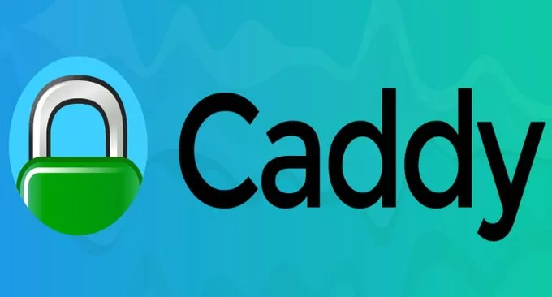](https://wzfou.com/wp-content/uploads/2017/11/FileManager_00.jpg)

本文就来分享一下[Caddy服务器](https://wzfou.com/tag/caddy-fuwuqi/)的安装与使用，更多的网站建站工具和脚本，还有：

1. [三款优秀的在线文件管理器(目录列表)对比-Directory Lister、h5ai和FileRun](https://wzfou.com/directory-lister/)
2. [Smokeping安装与配置-免费开源网络性能监控工具可视化主/从部署](https://wzfou.com/smokeping/)
3. [OneinStack一键安装脚本-轻松部署Let’s Encrypt证书配置Https站点](https://wzfou.com/oneinstack/)

**PS：2018年2月21日更新**，正在找免费的网盘程序，你还可以试试这个：[利用Pydio搭建免费私有云存储-多终端自动同步可在线播放音乐视频](https://wzfou.com/pydio/)。

## 一、Caddy安装方法

Caddy官网：

1. 网站：https://caddyserver.com/
2. 下载：https://caddyserver.com/download
3. Github：https://github.com/mholt/caddy

Caddy安装与部署只有三步。**首先，**根据你的服务器操作系统选择Caddy版本并下载（Linux和Windows都支持）。  
[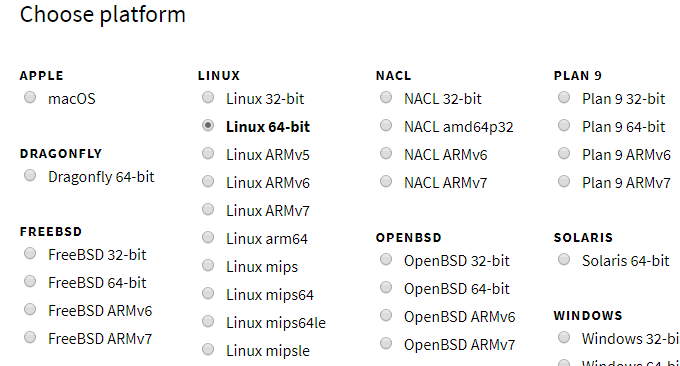](https://wzfou.com/wp-content/uploads/2017/11/FileManager_09_1.gif)

Caddy提供了丰富的插件可供选择，例如http.cache,http.filemanager,http.ipfilter,http.ratelimit等。  
[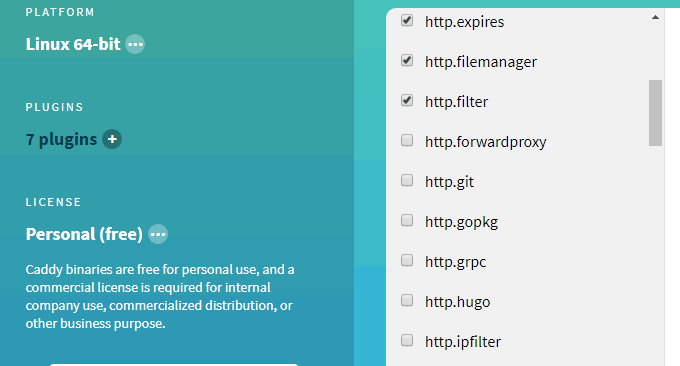](https://wzfou.com/wp-content/uploads/2017/11/FileManager_09_2.gif)

**其次，**将Caddy包下载到VPS主机上并解压，例如我下载的是：`caddy_v0.10.10_linux_amd64_custom_personal.tar.gz`，将压缩包解压到你的网站根目录下载，即index.html放置的地方。

**最后，**在 caddy 解压出来的目录（网站根目录）执行 `./caddy` ，这时访问 `xxx.xxx.xxx.xxx:2015`你的网站可以正常访问了。

**推荐caddy官方一键安装脚本。**脚本如下：

```
curl https://getcaddy.com | bash -s personal
或者
wget -qO- https://getcaddy.com | bash -s personal
如果想要安装插件，请使用以下命令：
curl https://getcaddy.com | bash -s personal http.git,dns

```

使用 `which caddy`，可以看到 caddy 已经被安装到了 /usr/local/bin/caddy 。 进入到网站根目录，然后执行命令：caddy，再打开你的IP：2015，你就可以看到Web页面了。

[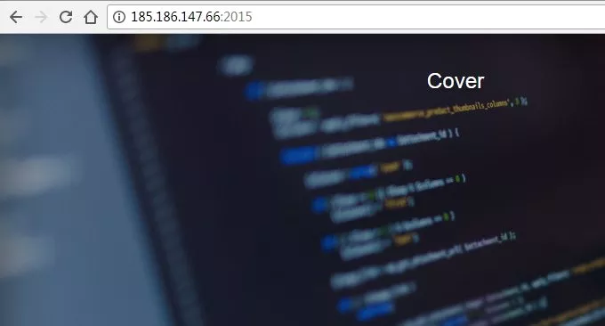](https://wzfou.com/wp-content/uploads/2017/11/FileManager_15.jpg)

## 二、Caddy配置方法

### 2.1  创建配置文件

首先创建配置文件放到 `/etc/caddy` 里。

```
sudo mkdir /etc/caddy
sudo touch /etc/caddy/Caddyfile
sudo chown -R root:www-data /etc/caddy
```

除了配置文件，caddy 会自动生成 ssl 证书，需要一个文件夹放置 ssl 证书。

```
sudo mkdir /etc/ssl/caddy
sudo chown -R www-data:root /etc/ssl/caddy
sudo chmod 0770 /etc/ssl/caddy
```

因为 ssl 文件夹里会放置私钥，所以权限设置成 770 禁止其他用户访问。 最后，创建一下放置网站文件的目录，如果已经有了，就不需要创建了。

```
sudo mkdir /var/www
sudo chown www-data:www-data /var/www
```

### 2.2  设置开机启动

创建好这些文件和目录了之后，我们需要把 caddy 配置成一个服务，这样就可以开机自动运行，并且管理起来也方便。因为目前大多数发行版都使用 systemd 了，所以这里只讲一下如何配置 systemd。

```
sudo curl -s https://raw.githubusercontent.com/mholt/caddy/master/dist/init/linux-systemd/caddy.service -o /etc/systemd/system/caddy.service   # 从 github 下载 systemd 配置文件
sudo systemctl daemon-reload        # 重新加载 systemd 配置
sudo systemctl enable caddy.service # 设置 caddy 服务自启动
sudo systemctl status caddy.service # 查看 caddy 状态
```

### 2.3  编辑Caddyfile。

可以直接 `vim /etc/caddy/Caddyfile` 来修改 Caddyfile，也可以再自己电脑上改好然后上传到服务器上。如果修改了 Caddyfile 发现没有生效，是需要执行一下 `sudo systemctl restart caddy.service` 来重启 caddy 。

### 2.4  Caddyfile 的格式

Caddfile的格式还是比较简单的，首先第一行必须是网站的地址，例如：

```
localhost:8080
```

或

```
wzfou.com
```

地址可以带一个端口号，那么 caddy 只会在这个端口上开启 http 服务，而不会开启 https，如果不写端口号的话，caddy 会默认绑定 80 和 443 端口，同时启动 http 和 https 服务。地址后面可以再跟一大堆指令（directive）。Caddyfile 的基本格式就是这样，由一个网站地址和指令组成。

### 2.5  指令

指令的作用是为网站开启某些功能。指令的格式有三种，先说一下最简单的不带参数的指令比如：

```
wzfou.com    
gzip
```

第二行的 gzip 就是一个指令，它表示打开 gzip 压缩功能，这样网站在传输网页是可以降低流量。第二种指令的格式是带简单参数的指令：

```
wzfou.com
gzip
log /var/log/caddy/access.log
tls iwzfou@gmail.com
root /var/www/
```

第三行，log 指令会为网站开启 log 功能，log 指令后的参数告诉 caddy log 文件存放的位置。第四行的 tls 指令告诉 caddy 为网站开启 https 并自动申请证书，后面的 email 参数是告知 CA 申请人的邮箱。（caddy 会默认使用 let’s encrypt 申请证书并续约，很方便吧）

另外，简单参数也可能不只一个，比如 redir 指令：

```
wzfou.com
gzip
log /var/log/caddy/access.log
tls /etc/ssl/cert.pem /etc/ssl/key.pem
root /var/www/
redir / https://wzfou.com/archive/{uri} 301
```

上面的 redir 指令带了三个参数，意思是把所有的请求使用 301 重定向，这个指令在给网站换域名的时候很有用。另外 tls 指令变了，不单单传 email一个参数， 而是分别传了证书和私钥的路径，这样的话 caddy 就不会去自动申请证书，而是使用路径给出的证书了。

在这个例子里还使用了 `{uri}` 这样的占位符（placeholder），详细的列表可以在这里查询到：https://caddyserver.com/docs/placeholders。最后一种指令是带复杂参数的，这种指令包含可能很多参数，所以需要用一对花括号包起来，比如 header 指令：

```
wzfou.com
gzip
log /var/log/caddy/access.log
tls iwzfou@gmail.com
root /var/www/
header /api {
    Access-Control-Allow-Origin  *
    Access-Control-Allow-Methods "GET, POST, OPTIONS"
    -Server
}
fastcgi / 127.0.0.1:9000 php {
    index index.php
}
rewrite {
    to {path} {path}/ /index.php?{query}
}
```

6-10 行的 header 指令代表为所有的 `/api/xxx` 的请求加上 `Access-Control-Allow-Origin` 和 `Access-Control-Allow-Methods` 这两个 header，从而能支持 javascript 跨域访问 ，第 9 行代表删除 Server header，防止别人看到服务器类型。

11-13 行使用了 fastcgi 指令，代表把请求通过 fastcgi 传给 php，ruby 等后端程序。

14-15 行，使用了 rewrite 指令，这个指令的作用是 **服务器内部重定向** 在下面的参数 `to` 后面，又跟了三个参数，这个功能上有点类似 nginx 的 `try_files` 。告诉 caddy 需要先查看网址根目录 /var/www 里有没有 {path} 对应的文件，如果没有再查看有没有 {path} 对应的目录，如果都没有，则转发给 index.php 入口文件。这个功能一般会用在 PHP 的 MVC 框架上使用。

### 2.6  多域名网站

上面说的都是单个域名的网址，那么如果在同一个服务器上部署多个域名的网站呢？很简单，只需要在域名后面跟一个花括号扩起来就可以了，如下：

```
wzfou.com {
    gzip
    log /var/log/caddy/wzfou_com.log
    tls iwzfou@gmail.com
    root /var/www/
    header /api {
        Access-Control-Allow-Origin  *
        Access-Control-Allow-Methods "GET, POST, OPTIONS"
        -Server
   }
    fastcgi / 127.0.0.1:9000 php {
        index index.php
    }
    rewrite {
        to {path} {path}/ /index.php?{query}
    }
}
wzfou.com{
    tls iwzfou@gmail.com
    log /var/log/caddy/wzfou_com.log
    redir / https://wzfou.com/{uri} 301
}
```

基本的 caddy 配置就这些，更多的内容需要查阅官网文档：https://caddyserver.com/docs。

## 三、Caddy一键建站脚本

看了上面的Caddy的配置，有朋友可能觉得有没有一键建站的Caddy脚本呢？

### 3.1  Caddy-Web-Server-Installer

1. 项目地址：https://github.com/sayem314/Caddy-Web-Server-Installer

**系统要求：**`Ubuntu 14.x`、`15.x`、`16.x`，`Debian 7.x`、`8.x`、`9.x`，`CentOS 6.8`、`7.2`。运行以下命令：

```
wget https://git.io/vra5C -O - -o /dev/null|bash

```

然后使用下列命令进行操作：

```
caddy start  #开启Caddy Web Server
caddy stop  #停止Caddy Web Server
caddy reload  #重载Caddy Web Server
caddy restart  #重启Caddy Web Server
caddy status  #查看Caddy Web Server状态
caddy install  #安装Caddy Web Server
caddy edit  #编辑配置文件Caddyfile
caddy service  #使Caddy Web Server成为一项服务(upstart/systemd)
caddy update  #升级Caddy Web Server
caddy delete  #卸载Caddy and data
caddy about  #关于Caddy Web Server
caddy version  #检测脚本/Caddy/PHP5-fpm版本信息

```

安装插件命令：

```
caddy install http.cache,http.filemanager,http.ipfilter,http.ratelimit
```

安装`caddy`的时候会要求你输入域名，邮箱（帮你自动签发`ssl`），然后使用命令启动`caddy`即可！

```
虚拟主机文件夹：/var/caddywww
配置文件夹：/etc/Caddyfile

```

这是安装成功的界面：  
[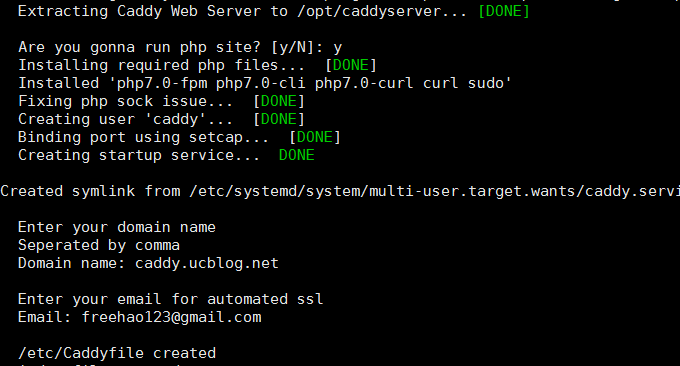](https://wzfou.com/wp-content/uploads/2017/11/FileManager_10.gif)

安装成功后重启Caddy服务。  
[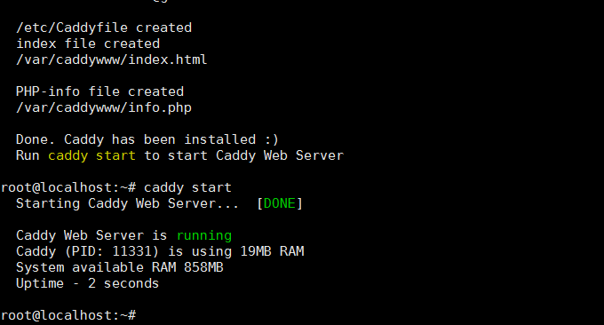](https://wzfou.com/wp-content/uploads/2017/11/FileManager_11.gif)

最后，打开你的域名，你就可成功看到Web页面了。  
[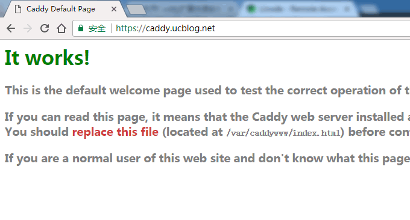](https://wzfou.com/wp-content/uploads/2017/11/FileManager_12.gif)

执行：caddy edit就可以编辑配置文件了，默认的配置如下：

[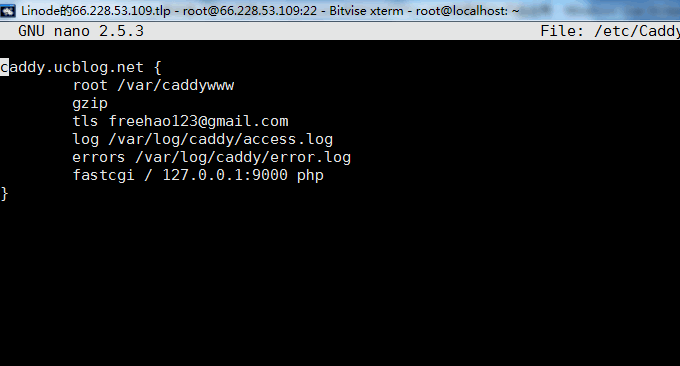](https://wzfou.com/wp-content/uploads/2017/11/FileManager_13.gif)

这是caddy安装的PHP。

[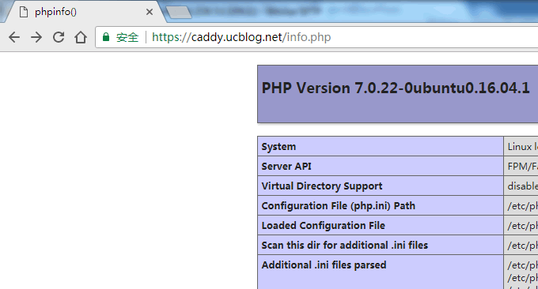](https://wzfou.com/wp-content/uploads/2017/11/FileManager_14.gif)

### 3.2  Caddy FileManager安装脚本

Caddy 有一个扩展FileManager，你可以单独安装，这里介绍一个[Caddy FileManager](https://wzfou.com/tag/caddy-filemanager/)快速部署的脚本，功能没有上面的Caddy-Web-Server-Installer丰富，比较适合利用Caddy FileManager搭建网盘。

运行以下命令：

```
wget -N --no-check-certificate https://raw.githubusercontent.com/ToyoDAdoubi/doubi/master/caddy_install.sh && chmod +x caddy_install.sh && bash caddy_install.sh install http.filemanager
#备用地址
wget -N --no-check-certificate https://www.moerats.com/usr/shell/Caddy/caddy_install.sh && chmod +x caddy_install.sh && bash caddy_install.sh install http.filemanager

```

安装成功后，继续新建一个用于使用的虚拟主机文件夹，例如`file`（可以自己改）：

```
mkdir /usr/local/caddy/www && mkdir /usr/local/caddy/www/file
```

**1、IP访问**

绑定虚拟主机为`IP`（即通过`IP`访问），`HTTP`协议（`80`端口）。

```
# 以下全部内容是一个整体，是一个命令，全部复制粘贴一起执行！
echo ":80 {
 root /usr/local/caddy/www/file
 timeouts none
 gzip
 filemanager / /usr/local/caddy/www/file {
  database /usr/local/caddy/filemanager.db
 }
}" > /usr/local/caddy/Caddyfile

```

**2、域名HTTP访问**

本示例是，绑定虚拟主机为域名（即通过域名访问），`HTTP`协议（`80`端口）。

```
# 以下全部内容是一个整体，是一个命令，全部复制粘贴一起执行（注意替换示例域名）！
echo "http://wzfou.com {
 root /usr/local/caddy/www/file
 timeouts none
 gzip
 filemanager / /usr/local/caddy/www/file {
  database /usr/local/caddy/filemanager.db
 }
}" > /usr/local/caddy/Caddyfile

```

**3、域名HTTPS访问**

本示例是，绑定虚拟主机为域名（即通过域名访问），`HTTPS`协议（`443`端口）。

如果你有`SSL`证书和密匙的话，把`SSL`证书(`xxx.crt`)和密匙(`xxx.key`)文件放到`/root`文件夹下（也可以是其他文件夹，自己改下面代码），然后这样做：

```
# 以下全部内容是一个整体，是一个命令，全部复制粘贴一起执行（注意替换示例域名）！
echo "https://wzfou.com {
 root /usr/local/caddy/www/file
 timeouts none
 tls /root/xxx.crt /root/xxx.key
 gzip
 filemanager / /usr/local/caddy/www/file {
  database /usr/local/caddy/filemanager.db
 }
}" > /usr/local/caddy/Caddyfile

```

**如果你没有`SSL`证书和密匙，那么你可以这样做：**

下面的`xxxx@xxx.xx`改成你的邮箱，同时需要注意的是，申请`SSL`证书前，请务必提前解析好域名记录(解析后最好等一会，以全球生效)，否则`Caddy`会申请并配置失败！

```
# 以下全部内容是一个整体，是一个命令，全部复制粘贴一起执行（注意替换示例域名）！
echo "https://wzfou.com {
 root /usr/local/caddy/www/file
 timeouts none
 tls xxxx@xxx.xx
 gzip
 filemanager / /usr/local/caddy/www/file {
  database /usr/local/caddy/filemanager.db
 }
}" > /usr/local/caddy/Caddyfile

```

**4、域名HTTP重定向HTTPS**

本示例是，域名`HTTP`重定向为`HTTPS`。当你是手动指定`SSL`证书和密匙 来配置的话，`Caddy`只会监听`443`端口(`https`)，并不会自动设置`80`端口(`http`)的重定向，如果要做重定向的话，可以这样做：

下面的示例代码中，是把`http://wzfou.com`重定向到了`https://wzfou.com`。

```
# 以下全部内容是一个整体，是一个命令，全部复制粘贴一起执行（注意替换示例域名）！
echo "http://wzfou.com {
 timeouts none
 redir https://wzfou.com{url}
}
https://wzfou.com {
 root /usr/local/caddy/www/file
 timeouts none
 tls /root/xxx.crt /root/xxx.key
 gzip
 filemanager / /usr/local/caddy/www/file {
  database /usr/local/caddy/filemanager.db
 }
}" > /usr/local/caddy/Caddyfile

```

当你已经配置完上面步骤后，那就需要启动`Caddy`了。

```
/etc/init.d/caddy start
# 如果启动失败可以看Caddy日志： tail -f /tmp/caddy.log

```

Caddy 使用说明：

> **启动：**/etc/init.d/caddy start
> 
> **停止：**/etc/init.d/caddy stop
> 
> **重启：**/etc/init.d/caddy restart
> 
> **查看状态：**/etc/init.d/caddy status
> 
> **查看Caddy启动日志：** tail -f /tmp/caddy.log
> 
> **Caddy配置文件位置：**/usr/local/caddy/Caddyfile
> 
> **Filemanager数据库位置：**/usr/local/caddy/filemanager.db

最后就可以通过`ip`访问`filemanager`了，用户名和密码均为`admin`。如下图：  
[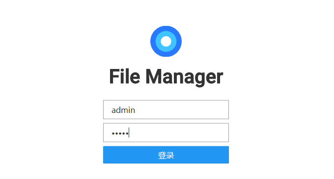](https://wzfou.com/wp-content/uploads/2017/11/FileManager_02.gif)

这是filemanager的界面。

[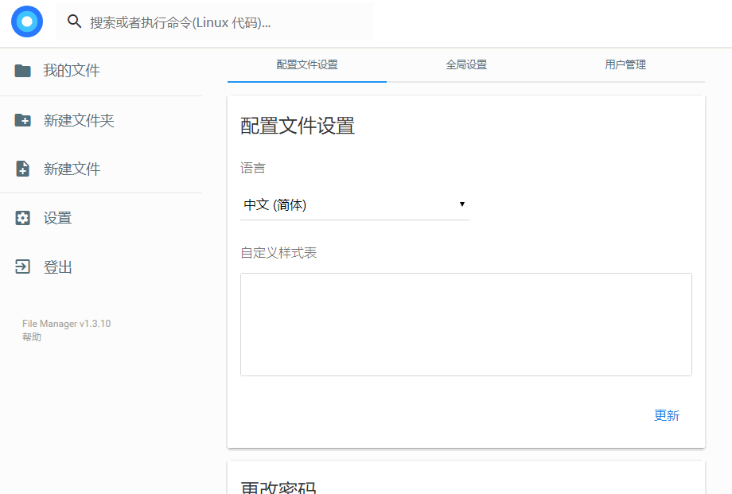](https://wzfou.com/wp-content/uploads/2017/11/FileManager_03.gif)

这是网盘的文件管理界面。（点击放大）

[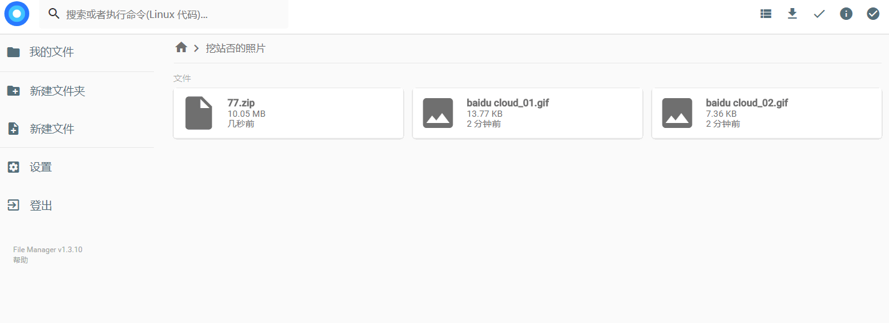](https://wzfou.com/wp-content/uploads/2017/11/FileManager_05.gif)

可以直接在线预览图片。（点击放大）

[](https://wzfou.com/wp-content/uploads/2017/11/FileManager_06.jpg)

也可以在线插入音频、视频等。

[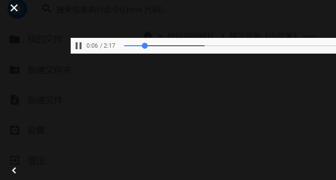](https://wzfou.com/wp-content/uploads/2017/11/FileManager_07.gif)

## 四、总结

用Caddy作为Web服务器，从安装与运行几乎只需要几分钟的时间，当然Caddy也可以像nginx那样实现缓存、镜像等，Caddy的配置规则也比较简单，你只需要花上几分钟的时间学习官网的文档就可以自己“依葫芦画瓢”了。

Caddy会自动签发Let’s Encrypt免费证书，但是你需要先把域名解析到服务器上，否则你在添加虚拟主机时会出现错误。关于能否将Caddy用作正式的生产环境，目前来看还是有待商榷的，但是Caddy用为简单的Http服务器是没有问题的。