# OneinStack一键安装脚本-轻松部署Let’s Encrypt证书配置Https站点
OneinStack是另一个非常优秀的LNMP一键安装脚本，这与上次我们介绍的LNMP 1.4功能类似，只不过LNMP.org的LNMP一键脚本一年才更新一次，PHP 7和Let’s Encrypt证书只有等到LNMP 1.4出来后才能使用，而OneinStack早在去年就可以使用了。

[OneinStack](https://wzfou.com/tag/oneinstack/)更新及时并且经常会新增一些“前沿”功能，这是我当初放弃使用LNMP 1.3 转投OneinStack的原因。OneinStack的作者也一直在更新，部落好几个站都是用OneinStack搭建完成的，特别是它的部署Let’s Encrypt证书和配置Https站点特别好用。

OneinStack 自带了Let’s Encrypt安装组件，想要使用SSL证书的朋友只需要在创建网站时输入域名，然后就可以自动为域名配置SSL证书了，并且OneinStack 还会贴心地设置Let’s Encrypt证书自动续期。至于其它的Memcached、Redis、ionCube、ZendGuardLoader等都可以一键安装。

[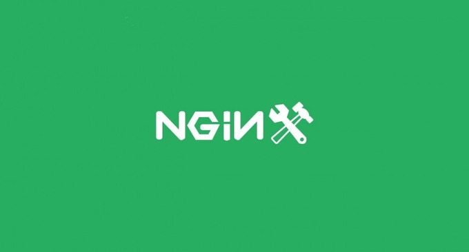](https://wzfou.com/wp-content/uploads/2017/06/conoha_000.jpg)

本篇文章就来分享一下我使用[OneinStack面板](https://wzfou.com/tag/oneinstack-mianban/)的一些心得与体会，更多的关于建站软件与建站工具，你可以看看：

1. [Linux VPS建站工具LNMP 1.4安装与使用-SSL自动配置续期和多版本PHP支持](https://wzfou.com/lnmp-1-4/)
2. [ConoHa日本VPS主机使用感受-东京机房速度一般支付宝付款](https://wzfou.com/conoha/)
3. [用JW Player,ckplayer,Smartideo搭建视频直播站-支持各大视频网站和rtmp](https://wzfou.com/wp-video/)

## 一、OneinStack安装方法

OneinStack支持一键安装的操作系统有：CentOS 6~7（包括redhat） 、Debian 6～8 、Ubuntu 12～16 、Aliyun Linux 15.1。主要包括以下组合：

> lnmp（Linux + Nginx+ MySQL+ PHP）
> 
> lamp（Linux + Apache+ MySQL+ PHP）
> 
> lnmpa（Linux + Nginx+ MySQL+ PHP+ Apache）：Nginx处理静态，Apache（mod_php）处理动态PHP
> 
> lnmt（Linux + Nginx+ MySQL+ Tomcat）：Nginx处理静态，Tomcat（JDK）处理JAVA
> 
> lnmh（Linux + Nginx+ MySQL+ HHVM）

OneinStack安装命令如下（如果有新的变化，请参考官网：https://oneinstack.com/）：

```
yum -y install wget screen curl python #for CentOS/Redhat
# apt-get -y install wget screen curl python #for Debian/Ubuntu
wget http://aliyun-oss.linuxeye.com/oneinstack-full.tar.gz #阿里云经典网络下载
wget http://mirrors.linuxeye.com/oneinstack-full.tar.gz #包含源码，国内外均可下载
wget http://mirrors.linuxeye.com/oneinstack.tar.gz #不包含源码，建议仅国外主机下载
tar xzf oneinstack-full.tar.gz
cd oneinstack #如果需要修改目录(安装、数据存储、Nginx日志)，请修改options.conf文件
screen -S oneinstack #如果网路出现中断，可以执行命令`screen -R oneinstack`重新连接安装窗口
./install.sh #注：请勿sh install.sh或者bash install.sh这样执行
```

在安装过程中，脚本会让你先选择是否安装Nginx、Apache等。根据你自己的需要来选择不同的版本来安装，如果只是建站的话建议使用LNMP，不要使用LNMPA。

[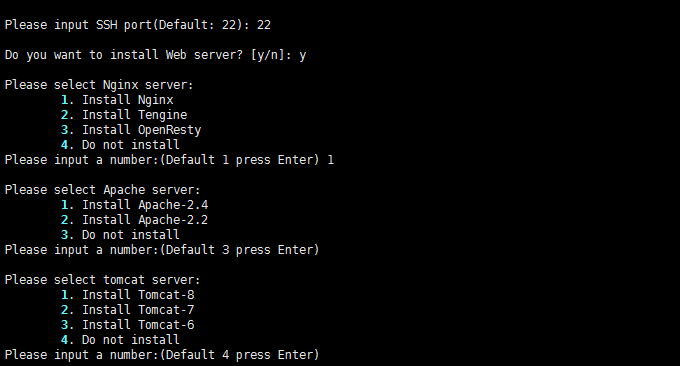](https://wzfou.com/wp-content/uploads/2017/06/conoha_22.gif)

接着会要求你选择MysqL数据库版本，5.7版本在性能上有所提升，但是有些程序可能无法兼容MysqL 5.7以下，请谨慎安装与使用。

[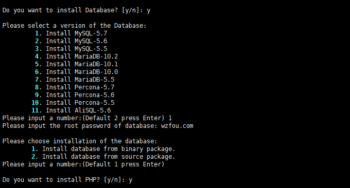](https://wzfou.com/wp-content/uploads/2017/06/conoha_23.gif)

最后就是选择安装PHP的版本，还有各种组件，包括了缓存ZendOPcache、xcache、apcu、eAccelerator；php加解密工具ionCube、ZendGuardLoader ；还有Memcached、Redis等等。

[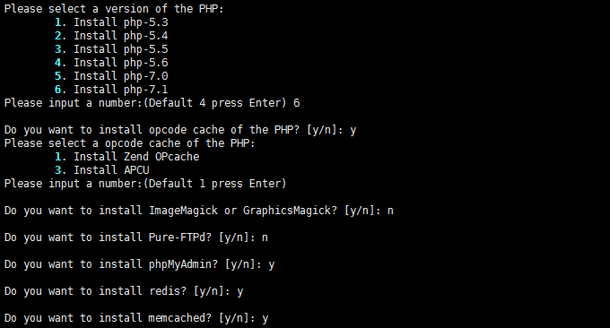](https://wzfou.com/wp-content/uploads/2017/06/conoha_24.gif)

这是OneinStack安装成功的界面。

[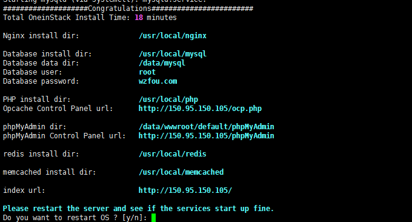](https://wzfou.com/wp-content/uploads/2017/06/conoha_25.gif)

打开你的IP，你就可以看到OneinStack默认页面了，这里会有探针、PHPmyAdmin等，直接点击就可以打开了。建议在正式生产环境中将此页面重命名或者直接删除，防止被人利用。

[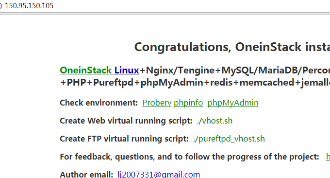](https://wzfou.com/wp-content/uploads/2017/06/conoha_25_1.gif)

## 二、OneinStack一键部署Https站点

首先，如果你自己没有购买证书的话，可以先安装OneinStack提供的Let’s Encrypt申请部署组件，执行命令：./addons.sh，选择Let’s Encrypt安装。

[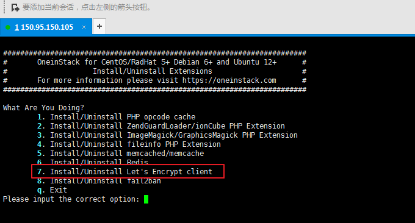](https://wzfou.com/wp-content/uploads/2017/06/conoha_27.gif)

接着，到你的域名DNS管理处，将域名的A记录解析到服务器上，**因为我们在申请Let’s Encrypt证书时需要验证域名，如果没有解析会出失败的情况。**

[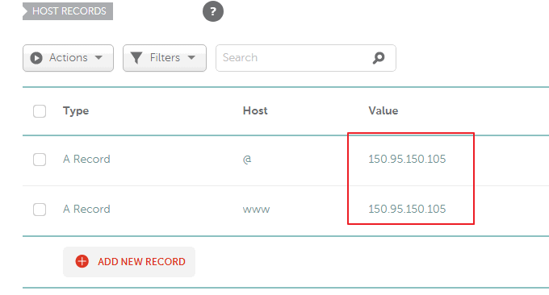](https://wzfou.com/wp-content/uploads/2017/06/conoha_26.gif)

然后，你就可以执行命令：./vhost.sh，开始添加新的虚拟主机了。下面的配置是绑定wzfou.net域名，同时将www跳转到非www的，其它的文件目录都是默认，在最后一项选择安装Let’s Encrypt。

[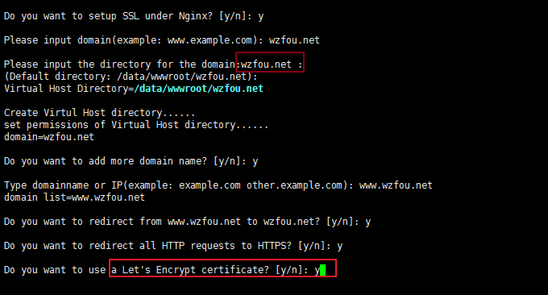](https://wzfou.com/wp-content/uploads/2017/06/conoha_28.gif)

最后，选择OneinStack提供的默认URL重写规则，自带了Wordpress、DZ、typecho等热门程序。这是OneinStack添加虚拟主机成功的界面。

[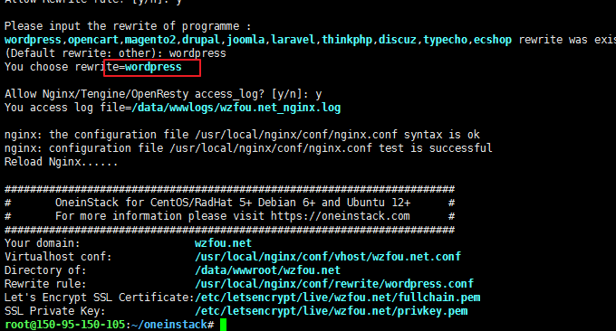](https://wzfou.com/wp-content/uploads/2017/06/conoha_29.gif)

打开你的域名，这时你就可以看到Https站点已经部署成功了。

[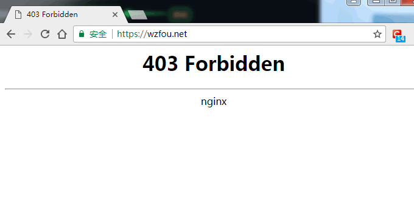](https://wzfou.com/wp-content/uploads/2017/06/conoha_30.gif)

## 三、OneinStack多版本PHP共存

经过测试，[LNMP](https://howsvps.com/tag/lnmp/) 1.4实现多版本PHP共存比较简单，有这个需要的朋友建议使用LNMP 1.4：[Linux VPS建站工具LNMP 1.4安装与使用-SSL自动配置续期和多版本PHP支持](https://wzfou.com/lnmp-1-4/)。

OneinStack实现多版本PHP有些麻烦，以下内容参考自官网。如果你之前安装的是PHP 5.4，想要安装PHP 7，命令如下：

```
service php-fpm stop #后面需要再安装php，需要停止php
mv /etc/init.d/php-fpm{,_bk} #后面需要再安装php会覆盖，备份启动脚本
默认php5.4安装路径是/usr/local/php，如果再次安装会提示php已经安装，因此必须修改options.conf的php安装目录，将php7安装路径设置为/usr/local/php7，修改/root/oneinstack/options.conf：
php_install_dir=/usr/local/php7
再次执行./install.sh，选择Install php-7，其余均选择n，等待ing
```

修改php配置文件：

```
service php-fpm stop #停止php7启动脚本
mv /etc/init.d/php-fpm /etc/init.d/php7-fpm  #重命名php7启动脚本
mv /etc/init.d/php-fpm_bk /etc/init.d/php-fpm  #恢复php5.4启动脚本
设置php5.4、php7开机自启动：
# CentOS:
chkconfig --add php7-fpm
chkconfig --add php-fpm
chkconfig php7-fpm on
chkconfig php-fpm on
# Ubuntu/Debian:
update-rc.d php7-fpm defaults
update-rc.d php-fpm defaults
防止php5.4、php7监听sock冲突，修改php7的listen，更改配置文件/usr/local/php7/etc/php-fpm.conf：
listen = /dev/shm/php-cgi.sock
#改成
listen = /dev/shm/php7-cgi.sock
手工启动php5.4、php7：
service php-fpm start  #启动php5.4
service php7-fpm start #启动php7
```

修改nginx虚拟主机配置文件：

```
./vhost.sh绑定域名，默认是运行在php5.4，如需要将网站运行在php7下，需要修改/usr/local/nginx/conf/vhost/www.oneinstack.com.conf（www.oneinstack.com改成自己绑定域名）：
fastcgi_pass unix:/dev/shm/php-cgi.sock;
#改成
fastcgi_pass unix:/dev/shm/php7-cgi.sock;
重新加载nginx，使配置生效：
service nginx reload
```

## 四、使用OneinStack遇到的问题

**第一个问题：let’s encpty SSL证书自动续期失败。**我之前遇到过这样的问题，猜测的原因可能是OneinStack在执行let’s encpty 续期时因为80端口被Nginx占用而导致失败的。解决的办法停止Nginx，然后自己手动执行一下Crontab定时任务。或者直接强制执行：

```
/usr/local/python/bin/certbot renew –force-renewal –renew-hook “/etc/init.d/nginx reload”
```

**第二个问题：修改PHP后不生效。**这是因为在安装OneinStack时默认地给PHP环境默认加载了Opcache模块（PHP5.5、5.6、7.0、7.1），修改PHP代码后一般要1分钟后才见效。解决办法可以卸载Opcache，或者自己访问http://公网IP/ocp.php，重置缓存。

[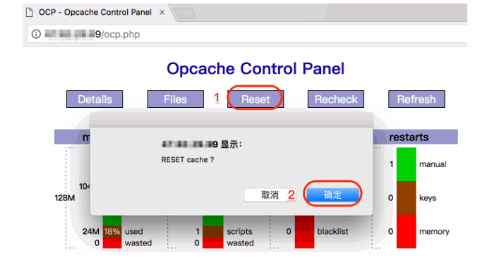](https://wzfou.com/wp-content/uploads/2017/06/conoha_30_2.gif)

**第三个问题：OneinStack无法发送邮件。**这是因为OneinStack没有PHP mail，你需要自己安装postfix或者使用第三方的SMTP如sendcloud、Amazon SES、MailGun等发送。