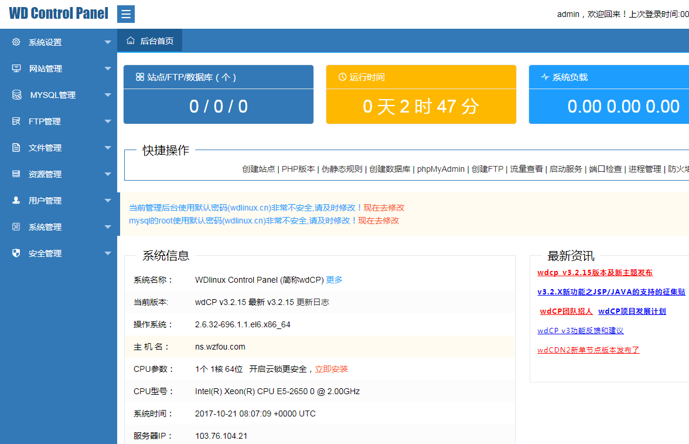
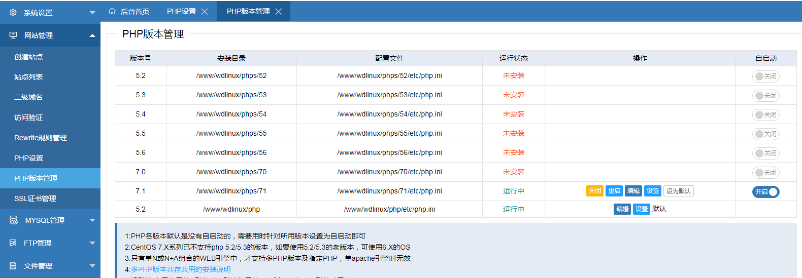

# WDCP免费服务器控制面板-切换Nginx Apache和PHP版本一键SSL
WDCP是一个国产的老牌服务器控制面板，我在以前建站的时候有用过WDCP，总体感觉是WDCP安装起来简单，控制面板后台功能强大，特别适合需要Apache环境使用。但是后来又放弃的原因是WDCP长期不更新，频繁出现漏洞，让人担惊受怕。

之前我在[新版BT.cn宝塔VPS主机面板](https://wzfou.com/bt-cn/)的文章就提到过国内做免费服务器面板的，普遍遇到的问题就是收费。AMH就是一个典型的例子，不收费做服务器的团队无以为继，可是一旦转为收费又会遇到“无人问津”的尴尬，所以国内很难有像国外那样一直维护下去的面板。

好在WDCP团队这几年又开始不断地更新了，服务器面板也加入了不少的功能，例如支持PHP 7.0，可以自由切换Apache和Nginx，现在又可以在服务器面板后台一键开通激活letsencrypt证书了，总体而言WDCP面板和BT.cn宝塔面板是走得越来越“近”了，大家在用VPS建站时又多了一项选择了。

[](https://wzfou.com/wp-content/uploads/2017/10/wdcp_00.gif)

本篇文章就来分享一下WDCP面板的安装与使用体验，更多的服务器面板可以在我之前建了一个专题页面：[服务器控制面板榜单](https://wzfou.com/vps-mianban/) 找到。其实，如果仅仅是个人使用，还是推荐使用[Oneinstack](https://wzfou.com/tag/oneinstack/)、[LNMP](https://wzfou.com/tag/lnmp/)这类的命令工具，安全又可自由编译：

1. [OneinStack一键安装脚本-轻松部署Let’s Encrypt证书配置Https站点](https://wzfou.com/oneinstack/)
2. [Linux VPS建站工具LNMP 1.4安装与使用-SSL自动配置续期和多版本PHP支持](https://wzfou.com/lnmp-1-4/)
3. [新版BT.cn宝塔VPS主机面板建站使用体验-清爽傻瓜式操作功能全面](https://wzfou.com/bt-cn/)

感谢[Dwigh](https://wzfou.com/wdcp/#comment-4260)提醒，如果你发现WDCP后台没有推送更新，需要手动修改脚本里的ver为最新版本号 运行就能手动更新到你想要的版本号了：

```
脚本:
http://down.wdlinux.cn/in/install_v3.sh
或者
wget http://wdcp3.wdlinux.cn/down/update.sh

```

**PS：2018年1月15日更新**，这里还有一个基于OpenLiteSpeed的服务器控制面板，有WHMCS插件，经过测试并发和性能都非常不错：[CyberPanel免费服务器面板安装与使用-基于OpenLiteSpeed一键SSL](https://wzfou.com/cyberpanel/)。

## 一、WDCP面板安装方法

官网：

1. http://www.wdlinux.cn/wdcp/

wdcp\_v3 支持wdOS/CentOS5.x/6.x/7.x，支持组件zend,memcache,rewrite,pdo\_mysql,mysqli等。安装方法如下：

```

源码安装(s-s-h登录服务器,执行如下操作即可,需root用户身份安装)
wget http://dl.wdlinux.cn/lanmp_laster.tar.gz
tar zxvf lanmp_laster.tar.gz
sh lanmp.sh

```

默认安装的是Apache+Nginx，如果你只想使用其中的一个，你可以在WDCP后台进行切换：

```
默认安装软件版本为：
nginx-1.8.1
apache-2.2.31
mysql-5.5.54
php-5.5.38
memcache
redis
zend

```

如需要自定义软件版本，后加cus,如下:

```

sh lanmp.sh cus

```

```
如需PHP多版本共存指定使用功能，也需安装，如
sh lib/phps.sh
(共支持7个版本的PHP，如5.2.17/5.3.29/5.4.45/5.5.38/5.6.30/7.0.18/7.1.4)

```

```
也可指定安装某一版本，如sh lib/phps.sh 5.2.17

```

```
多版本的zend,redis,memcache,opcache.sh扩展支持安装.
sh lib/phps_zend.sh
sh lib/phps_redis.sh
sh lib/phps_memcache.sh

```

```
默认安装全部PHP版本，也可指定安装某PHP版本，同上.

```

软件安装目录如下：

```

/www/wdlinux
数据库文件目录
/www/wdlinux/mysql/data

```

卸载、重启等操作如下：

```

rm -fr /www/wdlinux
reboot

wdcp后台的启动，重起，关闭方法
service wdcp start
service wdcp restart
service wdcp stop

多版本PHP的手动启动|停止|重起
如:5.5
/www/wdlinux/phps/55/bin/php-fpm start
/www/wdlinux/phps/55/bin/php-fpm stop
/www/wdlinux/phps/55/bin/php-fpm restart
如是其它版本，把55替换为相应版本即可

```

这是WDCP面板界面，主要功能有系统设置、网站管理、MYSQL管理、FTP管理、文件管理、资源管理、用户管理、系统管理、安全管理等等。（点击放大）

[](https://wzfou.com/wp-content/uploads/2017/10/wdcp_01.gif)

WDCP支持直接在后台升级版本，升级后重新登录即可。

## 二、WDCP系统设置

WDCP默认的后台访问端口是8080，为了安全请修改成其它的端口。

[](https://wzfou.com/wp-content/uploads/2017/10/wdcp_01_1.gif)

如果你想修改WDCP默认的目录，也可以直接在后台修改。

[](https://wzfou.com/wp-content/uploads/2017/10/wdcp_01_2.gif)

[WDCP](https://wzfou.com/tag/wdcp/)默认的是Nginx+Apache组合，你也可在WDCP后台进行切换，例如只使用Nginx或者Apache等。

[](https://wzfou.com/wp-content/uploads/2017/10/wdcp_01_3.gif)

## 三、WDCP绑定域名建站

在绑定域名之前，请先将域名DNS解析到服务器上。

[](https://wzfou.com/wp-content/uploads/2017/10/wdcp_02.gif)

然后点击网站管理中的创建站点，输入域名，选择PHP版本，是否启用Https等等。

[](https://wzfou.com/wp-content/uploads/2017/10/wdcp_03.gif)

在网站创建还有页面跳转、错误页面、伪静态等设置，你可以设置是否开启访问日志。

[](https://wzfou.com/wp-content/uploads/2017/10/wdcp_04.gif)

在PHP版本管理中，你可以看到自己已经安装的PHP，没有的话可以按照上面的方法重装安装即可。

[](https://wzfou.com/wp-content/uploads/2017/10/wdcp_05.gif)

创建好了网站后，WDCP支持一键开启SSL证书，可以一键申请开通letsencrypt证书。

[](https://wzfou.com/wp-content/uploads/2017/10/wdcp_06.gif)

也可以上传自己的证书。

[](https://wzfou.com/wp-content/uploads/2017/10/wdcp_10.gif)

## 四、WDCP数据库管理

WDCP可以直接创建数据库，输入数据库用户名、密码即可。

[](https://wzfou.com/wp-content/uploads/2017/10/wdcp_07.gif)

WDCP还可以快速设置MysqL的缓存、临时表等，这对于不会调整MysqL的朋友将会非常方便的。

[](https://wzfou.com/wp-content/uploads/2017/10/wdcp_08.gif)

虽然WDCP的PhpMyAdmin可以用来管理MysqL，但是版本太旧了。

[](https://wzfou.com/wp-content/uploads/2017/10/wdcp_09.gif)

## 五、WDCP其它实用功能

### 5.1  在线文件管理

WDCP的在线文件管理器还是蛮强大的，可以直接打包、解压、删除、复制、移动等。

[](https://wzfou.com/wp-content/uploads/2017/10/wdcp_11.gif)

### 5.2  多用户管理

WDCP可以添加多个用户，方便共享使用，当然用户权限无法自由设置。

[](https://wzfou.com/wp-content/uploads/2017/10/wdcp_14.gif)

WDCP也可以直接从后台重启MysqL、PHP、服务器等等。

[](https://wzfou.com/wp-content/uploads/2017/10/wdcp_17.gif)

### 5.3  设置DNS

通过WDCP，可以直接设置VPS服务器的DNS地址。

[](https://wzfou.com/wp-content/uploads/2017/10/wdcp_15.gif)

国内的VPS主机最好不要设置8.8.8.8。

[](https://wzfou.com/wp-content/uploads/2017/10/wdcp_16.gif)

### 5.4  系统负载管理

WDCP可以直接查看VPS系统负载、网卡流量、内存管理、用户管理、系统管理、安全管理等。

[](https://wzfou.com/wp-content/uploads/2017/10/wdcp_12.gif)

特别是磁盘使用情况，WDCP如果开启的服务器日志的话记得设置好切割，否则容易被日志占满磁盘空间。

[](https://wzfou.com/wp-content/uploads/2017/10/wdcp_13.gif)

### 5.5  安全设置

主要有防火墙设置、Selinux设置、S-S-H管理、ping开关等。

[](https://wzfou.com/wp-content/uploads/2017/10/wdcp_18.gif)

[WDCP](https://wzfou.com/tag/wdcp/)可以直接修改S-S-H端口，这个设置可以避免被人破解服务器登录密码。

[](https://wzfou.com/wp-content/uploads/2017/10/wdcp_19.gif)

另外一个实用的功能就是开启密钥登录，WDCP可以直接生成密钥登录，开启了密钥登录后你也可以关闭密码登录。

[](https://wzfou.com/wp-content/uploads/2017/10/wdcp_20.gif)

WDCP支持从后台关闭Ping。

[](https://wzfou.com/wp-content/uploads/2017/10/wdcp_21.gif)

## 六、总结

总得来说，WDCP是一个非常不错的[服务器面板](https://wzfou.com/tag/fuwuqi-mianban/)，特别适合新手在VPS主机上搭建网站使用。Apache和Nginx可以自由切换，支持上传自己的SSL证书，当然也可以一键开通letsencrypt证书，安全管理功能也非常不错。

WDCP目前存在的问题是letsencrypt证书开通老是不成功，在服务器资源占用这一块，WDCP相对于LNMP、Oneinstack等会高一些，不推荐小内存的朋友使用。WDCP面板在使用过程请及时关注官网做好程序更新。