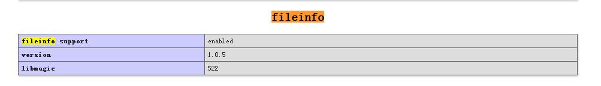

# php多共享版本安装fileinfo的方法
https://www.wdlinux.cn/bbs/viewthread.php?tid=58654&page=1&extra=#pid101727

偶是linux的菜鸟，准备装个flarum论坛来玩玩，结果它说必须要装fileinfo组件，研究了1天1夜吧，终于把这个弄出来了。  
  
系统环境 centos 6.5，wdcp 3.2.13  
目标：php 7.1.0 上安装 fileinfo  
  
其实我已经安好了 php 7.1.0，但是我以为重新编译会让整个php重装，所以迟迟没有用编译的方法来安装，找了一些旁门左道来试，结果才弄懂这个编译是只针对于 fileinfo 的安装编译，根本不会重装 php。汗颜啦:L ，看来我对 linux 的理解还不够  
  
先下载和解压php编译包，你什么版本，下面就什么版本号  
  

> wget -c http://cn2.php.net/distributions/php-7.1.0.tar.gz  
>   
> tar -xzvf php-5.3.29.tar.gz  
> cd /root/php-5.3.29/ext/fileinfo

  
  
如果没装 php-devel，后面的步骤就会提示 phpize 错误，所以装上  
  

> yum install php-devel

  
  
获取装好的 phpize 路径  

> which phpize

  
  
在 ext/fileinfo 目录下执行 phpize  

> /usr/bin/phpize

  
  
编译 fileinfo  

> ./configure --with-php-config=/www/wdlinux/phps/71/bin/php-config  
> make && make install

  
  
现在去 /www/wdlinux/phps/71/lib/php/extensions/no-debug-non-zts-20160303/ 看看，是不是多了一个 fileinfo.so  
  
接下来用 wdcp 给php7.1 的 php.ini 添加  

> extension= /www/wdlinux/phps/71/lib/php/extensions/no-debug-non-zts-20160303/fileinfo.so

  
  
重启php 7.1，用探针可以看到 fileinfo support        enabled 的字样，就算启动了。  

最后删除安装文件
rm -f php-5.6.30.tar.gz
rm -rf php-5.6.30

经过测试不一定要下载的。wdcp安装php7.1的时候就已经有下载源码包的了。在root/src目录下就有你要下载的文件。参考：https://www.shangtao.net/forumdetail-1854.html

经过测试，phpize是不需要安装的，我安装的是php7.2版本（7.2的源码和10楼一样）, 在php7.2的fileinfo目录下执行 ：/www/wdlinux/phps/72/bin/phpize 就可以和楼主一样的效果，然后执行楼主所说的make命令

我知道，有一天你也会搜wdcp如何升级到php7.3或者php7.2  

如果你要升级版本，看这里，我就是通过下面的地址升级的
https://www.wdlinux.cn/bbs/viewthread.php?tid=63336&highlight=php7.

