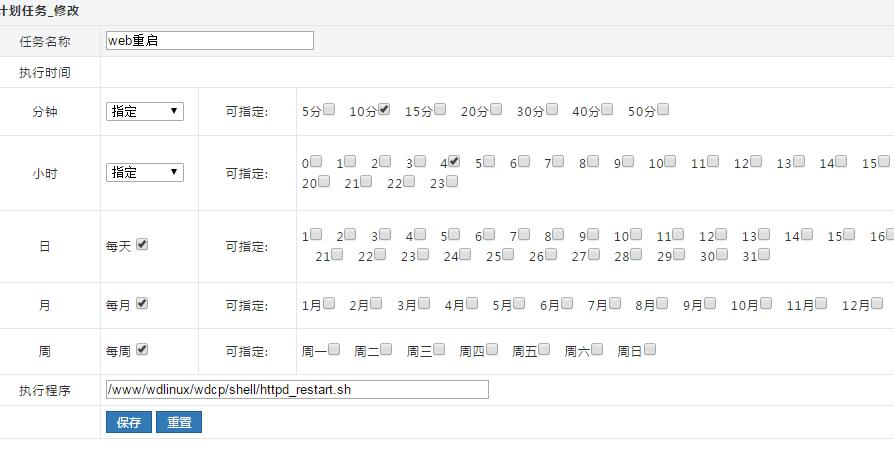
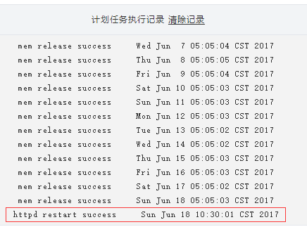

# wdcp计划任务设定方法，亲测可用，有日志显示！
https://www.wdlinux.cn/bbs/thread-58087-1-1.html

>   
> 很多网友反应wdcp的计划任务无法执行的问题。这里我做一个汇总贴，希望可以帮助到大家。首先，确认你的默认计划任务是否可以执行，并产生日志。如果默认计划任务也不执行的话，请执行以下命令

1. yum install -y crontabs vixie-cron

*复制代码*

  
  
  
增加一个新的计划任务  
以重启web服务为例  
  
1、在SSH中添加执行下面的代码：  
  
echo '/etc/rc.d/init.d/httpd restart' > /www/wdlinux/wdcp/shell/httpd_restart.sh  
chmod 755 /www/wdlinux/wdcp/shell/httpd_restart.sh  
  
2、登陆WDCP后台-系统设置-**计划任务**-增加任务，如下图  
  
  
添加后记得点“**更新计划任务**”才能生效。这样就已经完成了WEB自动重启服务！  
  
**重头戏来了，很多人反应为啥执行记录里面，没有显示新增的计划任务的执行记录呢。**  
原来系统的默认计划任务的配置文件里面，还写入了其他内容。大家在httpd_restart.sh文件中写入以下内容，就可以实现日志显示了  

1. tld="/www/wdlinux/wdcp/logs"  
    
2. \[ ! -d $tld \] && mkdir -p $tld  
    
3. tlf=$tld/task.log  
    
4. /etc/rc.d/init.d/httpd restart  
    
5. echo -n "httpd restart success     " >> $tlf && date >> $tlf && exit 0

*复制代码*

  
  
显示效果如下  
  
  
  
  
  
ok，这下就能知道你的计划任务到底有没有执行过了。