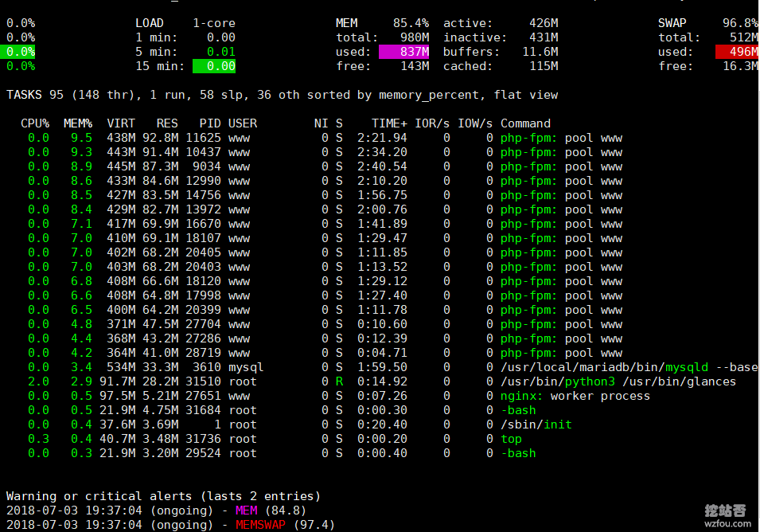
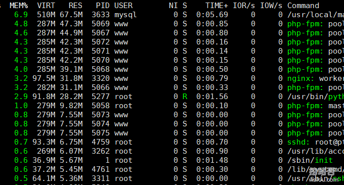
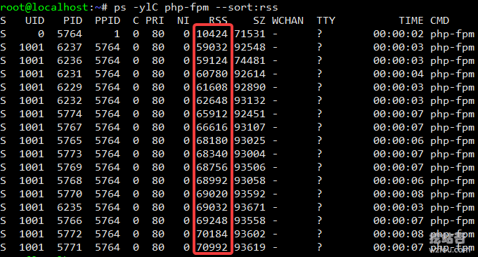
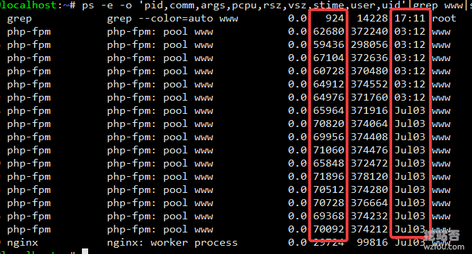
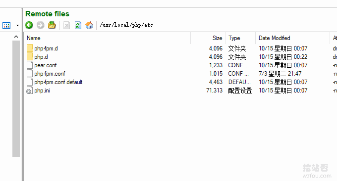
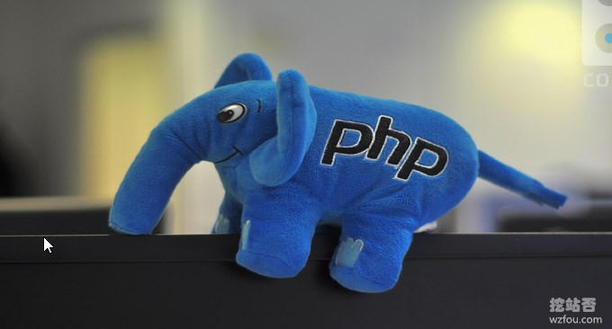
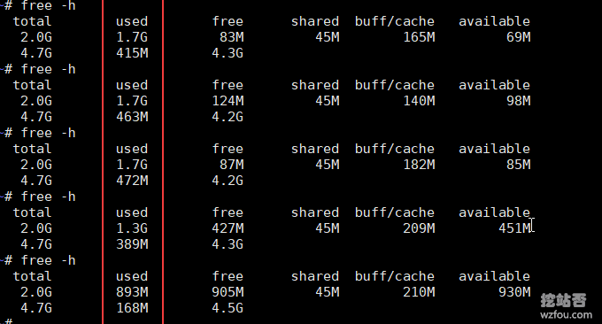

# Linux的php-fpm优化心得-php-fpm进程占用内存大和不释放内存问题
最近发现博客的内存老是隔三差五地被“吃掉”了，登录到后台后偶尔会出卡顿的情况，一开始怀疑是Swap不够导致的，于是给VPS主机增加了几个G的Swap，观察了一段时间后发现再大的Swap也被慢慢地“吃掉”了！

很显然是PHP某些服务一直在占用着VPS的内存没有释放，导致物理内存耗尽后调用了Swap，显然Swap没有物理内存运行的效率高，于是就出现了进程卡死的情况了。考虑到挖站否现在用的Wordpress用的主题与插件过多，出现这样的情况也是正常。

LNMP架构中PHP是运行在FastCGI模式下，按照官方的说法，php-cgi会在每个请求结束的时候会回收脚本使用的全部内存，但是并不会释放给操作系统，而是继续持有以应对下一次PHP请求。而php-fpm是FastCGI进程管理器，用于控制php的内存和进程等。

[](https://wzfou.com/wp-content/uploads/2018/07/php-fpm_13.jpg)

所以，解决的办法就是通过php-fpm优化总的进程数和单个进程占用的内存，从而解决php-fpm进程占用内存大和不释放内存的问题。更多的Linux服务器优化方法以及建站心得，还有：

1. [Linux Crontab命令定时任务基本语法与操作教程-VPS/服务器自动化](https://wzfou.com/crontab/)
2. [阿里云日本VPS主机速度性能评测-日本软银SoftBank\\香港NTT线路](https://wzfou.com/aliyun-jp/)
3. [DNS域名解析启用DNSSEC防止DNS劫持-Google Cloud DNS设置DNSSEC](https://wzfou.com/dnssec-dns/)

> **PS：2018年12月14日更新，**如果你的VPS主机的内存和性能不是很好的话，这时最好是启用缓存可以大大节省资源消耗：[WordPress开启Nginx fastcgi_cache缓存加速方法-Nginx配置实例](https://wzfou.com/nginx-fastcgi-cache/)。
> 
> **PS：2019年9月29日更新，**由于Google主导开发的服务器优化神器ngx_pagespeed，集成了图片延迟加载、自适应webp、JS和CSS优化、图片优化等一整套优化工具：[PageSpeed服务器优化神器-Nginx部署ngx_pagespeed模块和加速效果体验](https://wzfou.com/ngx-pagespeed/)。

## 一、分析判断php-fpm内存占用情况

如果你发现VPS主机出现了卡顿的情况，首先查看一下内存的占用情况，常用的命令就是Top、Glances、Free等，不了解这些命令的朋友可以先看看挖站否做的专题：[Linux系统监控命令整理汇总-掌握CPU,内存,磁盘IO等找出性能瓶颈](https://wzfou.com/linux-jiankong/)。

使用Glances命令，再按下m，就可以查看到当前VPS主机进程内存占用情况了，按照占用内存由多到少排序（或者使用Top命令，按下M，效果是一样的）。如下图（点击放大）：

[](https://wzfou.com/wp-content/uploads/2018/07/php-pfm_01.gif)

这是一张重启后进程内存占用情况图，从前后对比中可以发现：随着开机时间的增长，php-fpm占用的内存越来越大，最终php-fpm耗尽了VPS所有物理内存。

[](https://wzfou.com/wp-content/uploads/2018/07/php-pfm_02.gif)

**查看当前php-fpm总进程数**，命令：`ps -ylC php-fpm --sort:rss`。其中RSS就是占用的内存情况。如下图：

[](https://wzfou.com/wp-content/uploads/2018/07/php-pfm_04.gif)

**查看当前php-fpm进程的内存占用情况及启动时间**，命令如下：

```
ps -e -o 'pid,comm,args,pcpu,rsz,vsz,stime,user,uid'|grep www|sort -nrk5
```

从下图可以看出当前php-fpm所有进程平均每个进程占用了60-70MB的内存，启动时间，是当天的话就是3：12，否则会显示是X月X日。

[](https://wzfou.com/wp-content/uploads/2018/07/php-pfm_06.gif)

**查看当前php-fpm进程平均占用内存情况**，一般来说一个php-fpm进程占用的内存为30-40MB，本次查询的结果是60MB，显然是多了。命令如下：

```
ps --no-headers -o "rss,cmd" -C php-fpm | awk '{ sum+=$1 } END { printf ("%d%s\n", sum/NR/1024,"M") }'
结果61M
```

## 二、熟悉php-fpm配置文件说明

php-fpm.conf就是php-fpm的配置文件，路径一般在：`/usr/local/php/etc`，如下图：

[](https://wzfou.com/wp-content/uploads/2018/07/php-pfm_05.gif)

php-fpm.conf几个重要的参数说明如下：

```
pm = dynamic #指定进程管理方式，有3种可供选择：static、dynamic和ondemand。
pm.max_children = 16 #static模式下创建的子进程数或dynamic模式下同一时刻允许最大的php-fpm子进程数量。
pm.start_servers = 10 #动态方式下的起始php-fpm进程数量。
pm.min_spare_servers = 8 #动态方式下服务器空闲时最小php-fpm进程数量。
pm.max_spare_servers = 16 #动态方式下服务器空闲时最大php-fpm进程数量。
pm.max_requests = 2000 #php-fpm子进程能处理的最大请求数。
pm.process_idle_timeout = 10s
request_terminate_timeout = 120
```

pm三种进程管理模式说明如下：

> pm = static，始终保持一个固定数量的子进程，这个数由pm.max_children定义，这种方式很不灵活，也通常不是默认的。
> 
> pm = dynamic，启动时会产生固定数量的子进程（由pm.start\_servers控制）可以理解成最小子进程数，而最大子进程数则由pm.max\_children去控制，子进程数会在最大和最小数范围中变化。闲置的子进程数还可以由另2个配置控制，分别是pm.min\_spare\_servers和pm.max\_spare\_servers。如果闲置的子进程超出了pm.max\_spare\_servers，则会被杀掉。小于pm.min\_spare\_servers则会启动进程（注意，pm.max\_spare\_servers应小于pm.max_children）。
> 
> pm = ondemand，这种模式和pm = dynamic相反，把内存放在第一位，每个闲置进程在持续闲置了pm.process\_idle\_timeout秒后就会被杀掉，如果服务器长时间没有请求，就只会有一个php-fpm主进程。弊端是遇到高峰期或者如果pm.process\_idle\_timeout的值太短的话，容易出现504 Gateway Time-out错误，因此pm = dynamic和pm = ondemand谁更适合视实际情况而定。

## 三、解决php-fpm进程占用内存大问题

### 3.1  调整管理模式

static管理模式适合比较大内存的服务器，而dynamic则适合小内存的服务器，你可以设置一个pm.min\_spare\_servers和pm.max\_spare\_servers合理范围，这样进程数会不断变动。ondemand模式则更加适合微小内存，例如512MB或者256MB内存，以及对可用性要求不高的环境。

[](https://wzfou.com/wp-content/uploads/2018/07/php-fpm_10.jpg)

### 3.2  减少php-fpm进程数

如果你的VPS主机的内存被占用耗尽，可以检查一下你的php-fpm进程数，按照php-fpm进程数=内存/2/30来计算，1GB内存适合的php-fpm进程数为10-20之间，具体还得根据你的PHP加载的附加组件有关系。

[](https://wzfou.com/wp-content/uploads/2018/07/php-fpm_09.jpg)

### 3.3  php-fpm配置示例

这里以1GB内存的VPS配置php-fpm为演示，实际操作来看设置数值还得根据服务器本身的性能、PHP等综合考虑。

```
pm = dynamic #dynamic和ondemand适合小内存。
pm.max_children = 15 #static模式下生效，dynamic不生效。
pm.start_servers = 8 #dynamic模式下开机的进程数量。
pm.min_spare_servers = 6 #dynamic模式下最小php-fpm进程数量。
pm.max_spare_servers = 15 #dynamic模式下最大php-fpm进程数量。

```

## 四、解决php-fpm进程不释放内存问题

上面通过减少php-fpm进程总数来达到减少php-fpm内存占用的问题，实际使用过程中发现php-fpm进程还存长期占用内存而不释放的问题。解决的方法就是减少pm.max_requests数。

[](https://wzfou.com/wp-content/uploads/2018/07/php-fpm_12.jpg)

最大请求数max\_requests，即当一个 PHP-CGI 进程处理的请求数累积到 max\_requests 个后，自动重启该进程，这样达到了释放内存的目的了。以1GB内存的VPS主机设置为例（如果你设置的数值没有达到释放内存可以继续调低）：

```
pm.max_requests = 500 
```

[](https://wzfou.com/wp-content/uploads/2018/07/php-fpm_11.jpg)

当php-fpm进程达到了pm.max_requests设定的数值后，就会重启该进程，从而释放内存。下图是我测试后的效果，可以看出php-fpm进程被强制结束并释放了内存。

[](https://wzfou.com/wp-content/uploads/2018/07/php-pfm_03.gif)

## 五、总结

对于大内存以及对并发和可用性要求的话，建议使用static管理模式+最大的pm.max\_children。如果是小内存的服务器，建议使用dynamic或者ondemand模式，同时降低pm.start\_servers和pm.max\_spare\_servers进程数。

为什么我调整了参数没有达到应有的效果？根据wzfou.com的经验，php-fpm配置文件参数不能一概而论，必须要结合服务器自身的性能、WEB动态内容以及对可用性的要求来进行调整，内存长期占用最好是再检查一下是否有内存泄露。

**2019年10月9日更新，**如果你的php-fpm参数调整得过小，有可能出现502错误，解决办法：[解决WordPress后台编辑保存菜单出现502错误](https://wzfou.com/question/18791/)。