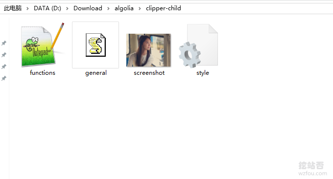

# WordPress子主题创建与使用方法-防止修改过的CSS,JS和代码失效
前一段时间在折腾yhfou.com网站时，发现网站的主题可以升级了，于是随手点击了升级，等到反应过来已经晚了，之前直接在Wordpress主题上修改过的CSS、JS以及函数代码都已经被升级后的主题覆盖掉了，没办法花了大半天的时间才恢复过来。

其实，早就知道Wordpress有子主题这么一个功能，主要使用在于方便你自己对主题进行自定义，例如重新调整CSS、JS以及函数代码，而不受[WordPress主题](https://wzfou.com/tag/wordpress-zhuti/)升级的影响。如果对子主题不满意，可以直接删除子主题，而原来的Wordpress主题依然正常。

这篇文章就来分享一下如何给自己的[WordPress主题](https://wzfou.com/tag/wordpress-zhuti/)创建一个子主题，更多关于Wordpress优化加速的文章，这里还有：

1. [十分钟内给你的WordPress快速搬家：一行代码+三个步骤](https://wzfou.com/wp-banjia/)
2. [WordPress开启Nginx fastcgi_cache缓存加速方法-Nginx配置实例](https://wzfou.com/nginx-fastcgi-cache/)
3. [网站优化加速-开启TLSV1.3和Brotli压缩-Oneinstack,LNMP,宝塔面板](https://wzfou.com/tlsv1-3-brotli/)

> **PS：2019年9月15日更新**，如果你的Wordpress的文章比较长，这时候加一个目录导航是非常有必要的：[WordPress文章目录侧边固定滚动-Easy Table 和LuckyWP Table插件](https://wzfou.com/wp-toc/)。

## 一、一键创建WP子主题

插件：

1. https://wordpress.org/plugins/orbisius-child-theme-creator/

不想继续深入折腾Wordpress的朋友，可以直接下载[Child Theme Creator by Orbisius](https://wzfou.com/tag/child-theme-creator-by-orbisius/)插件，该插件可以帮你一键创建Wordpress子主题，而且支持单个WP主题创建多个子主题。

Child Theme Creator by Orbisius这个插件还支持在线编辑子主题，当然你也可以自己手动编辑子主题。

## 二、手动创建WP子主题

### 2.1 新建子主题文件夹

用FTP或者SFTP登录到你的服务器，在 wp-content/themes/ 下新建一个文件夹，文件夹命名为：你的主题名称-child，或者你也可以直接在本地新建文件夹，然后命名。如下图：

### 2.2 新建子主题CSS

在子主题文件夹，新建一个style.css 文件，代码如下：

/*
Theme Name:     Twenty Fifteen Child
Theme URI:      http://example.com/
Description:    Child theme for the Twenty Fifteen theme 
Author:         Your name here
Author URI:     http://example.com/
Template:       twentyfifteen
Version:        1.0
*/

@import url(../twentyfifteen/style.css);

Template 后填写父主题的文件夹名称，Theme Name 后填写子主题的名称，其他项目非必填。然后导入父主题的 CSS 文件。要注意的是Template必须和父主题名完全一致，在除注释外**第一行**需要用 @import规则将父主题（Xxxx）的样式表（style.css）调入；然后便可以在这之后自定义样式，添加的样式若与父主题重复，会自动替换父主题的样式。

最后一句@import url(../twentyfifteen/style.css);是导入主题的CSS，如果不写上，你需要在子主题函数写上。

/*
Theme Name:     Clipper 优惠否子主题
Theme URI:      https://yhfou.com/
Description:    one child theme for the Clipper theme
Author:         qi
Author URI:     https://wzfou.com/
Template:       clipper
Version:        2019.8.15
\*/

/\* Add you custom styles below */

### 2.3 新建子主题JS

**该选项为可选**。主要为了在子主题里自定义JS，名称为：`general.js`，如果你要添加JS，就可以放在这里了。

### 2.4 新建functions.php

**该选项为可选**。子主题中的`functions.php`不会覆盖父主题中对应功能，而是将新的功能加入到父主题的functions.php中，因而它不是必须的。（其实它会在父主题文件加载之前先载入）

functions.php文件的结构非常简单：将PHP起始标签置于顶部，关闭标签置于底部，它们之间就写上你自己的PHP函数。按你的需要任意添加函数，下面的示例是一个基本的`functions.php`文件的写法，作用是防止垃圾评论。

<?php
 
function scp\_comment\_post( $incoming_comment ) {
    $pattern = '/\[一-龥\]/u';

    // 禁止全英文评论
    if(!preg\_match($pattern, $incoming\_comment\['comment_content'\])) {
        wp_die( "You should type some Chinese word (like \\"你好\\") in your comment to pass the spam-check, thanks for your patience! 您的评论中必须包含汉字!" );
    }
    return( $incoming_comment );
}
add\_filter('preprocess\_comment', 'scp\_comment\_post');

// 禁止日文评论
function BYMT\_comment\_jp\_post( $incoming\_comment ) {
$jpattern ='/\[ぁ-ん\]+|\[ァ-ヴ\]+/u';
if(preg\_match($jpattern, $incoming\_comment\['comment_content'\])){
wp_die( "禁止有日文字符的评论 You should type some Chinese word" );
}
return( $incoming_comment );
}
add\_filter('preprocess\_comment', 'BYMT\_comment\_jp_post');
 
?>

以下functions.php是让子主题加载CSS、JS以及自定义函数。

<?php 
/\* Clipper child theme functions.
 \*
 \* BEFORE USING: Move the clipper-child theme into the /themes/ folder.
 \*
 \* @package Clipper\\Functions
 \* @author AppThemes
 \* @since Clipper 2.0.2
 \*/ 

/\*\*
 \* Registers the stylesheet for the child theme.
 */
function clipper\_child\_styles() { 
  global $clpr_options; 
  wp\_enqueue\_style( 'child-style', get\_stylesheet\_uri() );

  // Enqueue color scheme. 
  wp\_enqueue\_style( 'at-color', get\_template\_directory\_uri() . '/styles/' . $clpr\_options->stylesheet );

  // Disable the Clipper default styles.
  //wp\_dequeue\_style( 'at-main' );

  // Disable the Foundation framework styles.
  //wp\_dequeue\_style( 'foundation' );
}

add\_action( 'wp\_enqueue\_scripts', 'clipper\_child_styles', 999 );

/\*\*
 \* Registers the scripts for the child theme.
 */
function clipper\_child\_scripts() {

  wp\_enqueue\_script( 'child-script', get\_stylesheet\_directory_uri() . '/general.js' );

  // Disable the Clipper default scripts.
  //wp\_dequeue\_script( 'theme-scripts' );

  // Disable the Foundation framework scripts.
  //wp\_dequeue\_script( 'foundation' );
  //wp\_dequeue\_script( 'foundation-motion-ui' );
}

add\_action( 'wp\_enqueue\_scripts', 'clipper\_child_scripts', 999 );

/\*\*
 \* This function migrates parent theme mods to the child theme.
 */
function clipper\_child\_assign\_mods\_on_activation() {

  if ( empty( get\_theme\_mod( 'migrated\_from\_parent' ) ) ) {

    $theme = get_option( 'stylesheet' );
    update\_option( "theme\_mods_$theme", get\_option( 'theme\_mods_clipper' ) );
    set\_theme\_mod( 'migrated\_from\_parent', 1 );
  }
}

add\_action( 'after\_switch\_theme', 'clipper\_child\_assign\_mods\_on\_activation' );

// 现可以添加自定义函数了.

## 三、启用编辑WP子主题

### 3.1 启用子主题

你还可以给你的子主题添加一个预览图片：screenshot.png，最后你的子主题文件夹应该看起来文件结构如下：

现在将你的子主题文件夹上传到你的Wordpress父主题所在的目录下，如下图：

回到你的Wordpress主题管理页面，点击就可以启用WP子主题了。

### 3.2 编辑子主题

仔细观察一下，你的Wordpress主题会自动加载子主题的CSS、JS和`functions.php`，你只需要编辑Wordpress子主题的CSS、JS和functions.php文件就可以达到自定义主题的目的了。

## 四、总结

如果你在themeforest有过购买Wordpress主题，创建一个[WordPress子主题](https://wzfou.com/tag/wordpress-zi/)还是非常有用的，国外的Wordpress主题基本上都支持子主题，而且经常保持更新。我们在修改WP主题时可以完全不受主题升级的影响。

如果要修改父主题中某一模板文件，如footer.php，我们就可以把父主题中的footer.php复制到子主题目录中，然后编辑子主题中的footer.php，这样既更新了网站的footer，又不修改父主题的代码。以后主题要更新的时候我们就可以轻松把父主题替换掉，再根据子主题中的文件做微调了。