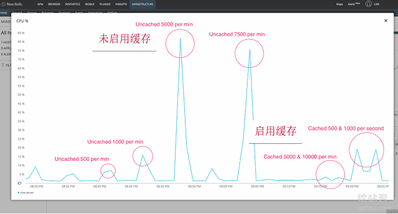

# WordPress开启Nginx fastcgi_cache缓存加速方法-Nginx配置实例
使用[WordPress建站](https://wzfou.com/wordpress-jianzhan/)的过程中，对于优化Wordpress性能、加快网站访问速度这一环节走了不少的“弯路”。当网站出现访问缓慢、CPU内存耗尽的情形时，最开始想到的是升级服务器配置，后来发现有些无良的VPS商家背后限制资源严重，加钱升级真的很伤人。

最大的体会就是同样的配置，在不同的VPS商家那里跑同一个网站，在同样的流量情况下，居然一个顺畅而另一个卡顿，这个给我最大的感受就是在购买VPS之前一定要看看别人的评测，尤其是VPS主机性能评测这一块，一定要仔细对比，否则容易花不少冤枉钱。

后来给Wordpress做优化时，关注在页面缓存上，之前用过的缓存插件包括但不限于WordPress Super Cache、WP Fastest Cache、W3 Total Cache、cos-html-cache、Cachify……总得来说，安装了缓存插件后提速还是有效果的，但是也带来了不少的问题。

例如配置复杂、生成规则、插件冲突以及无法应对突发流量，也就是说使用缓存插件还是无法达到应对大流量冲击的情况。最后，在朋友的推荐下启用了Nginx fastcgi_cache缓存，直接使用Nginx为页面生成缓存，效率比使用PHP缓存插件要高得多，特别适合小配置的VPS上使用。

更多的关于Wordpress和[服务器优化](https://wzfou.com/tag/fuwuqi-youhua/)的经验文章，这里还有：

1. [Linux的php-fpm优化心得-php-fpm进程占用内存大和不释放内存问题](https://wzfou.com/php-fpm/)
2. [WordPress添加支付宝,微信打赏按钮制作实例和Paypal.me打赏链接](https://wzfou.com/dashang-anniu/)
3. [Linux Crontab命令定时任务基本语法与操作教程-VPS/服务器自动化](https://wzfou.com/crontab/)

> **PS：2018年12月19日更新，**WordPress自带的站内搜索不仅搜索慢而且还无法搜索更多的关键字，我们可以自建一个或者使用第三方的搜索嵌入WP：[改进网站站内搜索-百度,Google自定义搜索和Elasticsearch自建搜索](https://wzfou.com/baidu-google-es/)。
> 
> **PS：2019年9月29日更新，**由于Google主导开发的服务器优化神器ngx_pagespeed，集成了图片延迟加载、自适应webp、JS和CSS优化、图片优化等一整套优化工具：[PageSpeed服务器优化神器-Nginx部署ngx_pagespeed模块和加速效果体验](https://wzfou.com/ngx-pagespeed/)。

## 一、安装Nginx ngx\_cache\_purge模块

网站：

1. http://labs.frickle.com/files/

### 1.1  LNMP

如果你用的是[LNMP一键安装包](https://wzfou.com/lnmp-1-4/)，编辑lnmp安装包目录下的 lnmp.conf 文件，在Nginx\_Modules\_Options=”  的单引号中加上 –add-module=/root/ngx\_cache\_purge-2.3 保存，升级一下nginx就安装上了，其他模块也参考这个就行。

ngx\_cache\_purge-2.3需要你从frickle.com官网中下载安装包并解压，目前最新版是2.3。

### 1.2  Oneinstack

如果你用的是[OneinStack面板](https://wzfou.com/tag/oneinstack-mianban/)，可以通过以下命令来编译ngx\_cache\_purge模块。

\# nginx -V 2>&1 | grep -o ngx\_cache\_purge 查看ngx\_cache\_purge是否安装,没有数据表示未安装
cd /root/oneinstack/src
wget http://labs.frickle.com/files/ngx\_cache\_purge-2.3.tar.gz
tar xzf ngx\_cache\_purge-2.3.tar.gz

#以下几个安装包都是Oneinstack自带的，不同的版本可能会不同，请根据情况调整
tar xzf nginx-1.14.0.tar.gz
tar xzf pcre-8.42.tar.gz
tar xzf openssl-1.0.2o.tar.gz
cd /root/oneinstack/src/nginx-1.14.0

nginx -V #查看nginx编译参数，最后加上--add-module=../ngx\_cache\_purge-2.3
./configure --prefix=/usr/local/nginx --user=www --group=www --with-http\_stub\_status\_module --with-http\_v2\_module --with-http\_ssl\_module --with-http\_gzip\_static\_module --with-http\_realip\_module --with-http\_flv\_module --with-http\_mp4\_module --with-openssl=../openssl-1.0.2o --with-pcre=../pcre-8.42 --with-pcre-jit --with-ld-opt=-ljemalloc --add-module=../ngx\_cache\_purge-2.3

make  #编译
mv /usr/local/nginx/sbin/nginx{,_\`date +%F\`}  #备份nginx
cp objs/nginx /usr/local/nginx/sbin
nginx -V 2>&1 | grep -o ngx\_cache\_purge
\# 显示ngx\_cache\_purge表示已经安装成功

使用`Nginx -V`查看编译参数添加add-module时，一定要根据你自己的Nginx的编译参数来操作，也就是说保留原来的Nginx参数再加上add-module。例如我的：

安装Nginx ngx\_cache\_purge模块成功。

### 1.3  其它面板

如果你用的是其它的面板（专题：[服务器控制面板榜单](https://wzfou.com/vps-mianban/)），例如[WDCP](https://wzfou.com/wdcp/)、[BT宝塔面板](https://wzfou.com/bt-cn/)等，请查阅官网的文档。

## 二、Nginx开启fastcgi_cache缓存-配置实例

### 2.1  配置实例

下面我直接贴出wzfou.com的Nginx开启[fastcgi_cache缓存](https://wzfou.com/tag/fastcgi_cache-jiasu/)配置实例，详细的说明如下：

#路径需要提前创建好
fastcgi\_cache\_path /tmp/nginx-cache levels=1:2 keys\_zone=WORDPRESS:250m inactive=1d max\_size=500m;
fastcgi\_temp\_path /tmp/nginx-cache/temp;
fastcgi\_cache\_key "$scheme$request\_method$host$request\_uri";
fastcgi\_cache\_use\_stale error timeout invalid\_header http_500;
#忽略一切nocache申明，避免不缓存伪静态等
fastcgi\_ignore\_headers Cache-Control Expires Set-Cookie;

server {
   listen 80;
   listen 443 ssl http2;
  …………………此部省略……………………
  
   set $skip_cache 0;
   #post访问不缓存
   if ($request_method = POST) {
            set $skip_cache 1;
        }   
   #动态查询不缓存
   if ($query_string != "") {
            set $skip_cache 1;
        }   
   #后台等特定页面不缓存（其他需求请自行添加即可）
   if ($request\_uri ~* "/wp-admin/|/xmlrpc.php|wp-.*.php|/feed/|/zhuye/|/wzfou.com/||/question/|/bbs/|/dongtai/|/haoyou/|/qun/|index.php|sitemap(\_index)?.xml") {
            set $skip_cache 1;
        } 
   #对登录用户、评论过的用户不展示缓存
   if ($http\_cookie ~* "comment\_author|wordpress_\[a-f0-9\]+|wp-postpass|wordpress\_no\_cache|wordpress\_logged\_in") {
            set $skip_cache 1;
        }
   #这里请参考你网站之前的配置，特别是sock的路径，弄错了就502了！		
   location ~ \[^/\]\\.php(/|$) {
    #fastcgi\_pass remote\_php_ip:9000;
    fastcgi_pass unix:/dev/shm/php-cgi.sock;
    fastcgi_index index.php;
    include fastcgi.conf;
    add_header Strict-Transport-Security "max-age=63072000; includeSubdomains; preload";
    #新增的缓存规则
    fastcgi\_cache\_bypass $skip_cache;
    fastcgi\_no\_cache $skip_cache;
    add\_header X-Cache "$upstream\_cache_status From $host";
    add_header Cache-Control  max-age=0;
    add\_header Nginx-Cache "$upstream\_cache_status";
    add\_header Last-Modified $date\_gmt;
    add_header X-Frame-Options SAMEORIGIN; # 只允许本站用 frame 来嵌套
    add_header X-Content-Type-Options nosniff; # 禁止嗅探文件类型
    add_header X-XSS-Protection "1; mode=block"; # XSS 保护
    etag  on;
    fastcgi_cache WORDPRESS;
    fastcgi\_cache\_valid 200 301 302 1d;
  }
  
  #缓存清理配置（可选）
  location ~ /purge( /.*) { #为防止转义，请去掉{ /之间的空格
    allow 127.0.0.1;
    #此处填写你的服务器IP
    allow 89.208.xxx.xxx;
    deny all;
    #请注意此处的WORDPRESS要与上面的keys_zone保持一致
    fastcgi\_cache\_purge WORDPRESS "$scheme$request_method$host$1";
    }
  …………………此部分省略……………………	

}

### 2.2  有关说明

本地or内存？在fastcgi\_cache\_path和fastcgi\_temp\_path中，有人会建议将它设置为内存路径，例如：`/dev/shm/nginx-cache levels=1:2 keys_zone=WORDPRESS:100m inactive=60m;`，如果你的磁盘IO很慢的话建议采用此方式，毕竟内存的读写速度非常快。

`add_header Cache-Control `如果是动态内容要实时更新的话，可以设置为0，否则可以设置时间大一些。

## 三、安装Nginx Helper插件-自动刷新缓存

通过上面的方法我们已经配置好了fastcgi_cache缓存，接下来我们就要解决当Wordpress有新评论、新文章时自动刷新Nginx缓存页面了。直接搜索Nginx Helper插件下载，然后是设置，首先是开启，清除方式选择本地文件。

插件还提供了其它的一些设置，例如发表新文章、新评论时是否更新Nginx缓存。

由于插件作者定义的缓存路径是 /var/run/nginx-cache ，而我们可能会根据服务器实际情况来自定义缓存路径，这样一来缓存路径的不同就会导致插件无法找到缓存文件并删除！

**解决办法是**在 WordPress 根目录下的 wp-config.php 中新增如下代码即可：

//根据实际情况定义缓存的存放路径
define( 'RT\_WP\_NGINX\_HELPER\_CACHE_PATH','/tmp/wpcache');

如果你发现上述定义路径的代码不生效，你可以采用“[自然](https://wzfou.com/nginx-fastcgi-cache/#comment-10039)”博主的建议：

> 一是修改插件，将插件中路径改成你自己的，二是使用软连接，/var/run/nginxcache 和/tmp/wpcache

## 三、Nginx fastcgi_cache效果预览

启用了[Nginx fastcgi_cache](https://wzfou.com/tag/nginx-fastcgi_cache/)后，我们就可以在浏览器Header 头部信息中看到已经命中了。

对于已经设置了不缓存的页面，Nginx fastcgi_cache会直接显示**BYPASS。**

另外，对于已经登录的用户还有发表过评论的用户，Nginx fastcgi_cache也会直接BYPASS。

同时，我们服务器的缓存路径中也能看到Nginx fastcgi_cache生成的缓存文件。

如果你发现你的评论过的用户依然用的是缓存，那应该是WP没有记住cookie，把以下代码加入到`functions.php` 中即可。

add\_action('set\_comment\_cookies','coffin\_set_cookies',10,3);
function coffin\_set\_cookies( $comment, $user, $cookies_consent){
   $cookies_consent = true;
   wp\_set\_comment\_cookies($comment, $user, $cookies\_consent);
}

## 四、总结

Nginx开启[fastcgi_cache缓存](https://wzfou.com/tag/fastcgi_cache-jiasu/)对于加快网页响应速度以及节省服务器资源有着非常重要的意义，下图是alibabacloud.com的测试结果，可以看出来启用缓存后服务器的承载能力有了非常大的提升。

wzfou.com挖站否在启用fastcgi_cache缓存时，发现在Nginx配置文件中添加了Cache-Control信息，但是总是不生效。HTTP头部信息会总会包含以下信息：

> Cache-Control: no-store,no-cache,must-revalidate,post-check=0,pre-check=0 和 Pragma: no-cache，

经过排查，问题出在了LNMP和Oneinstack一键包中的`session.cache_limiter`的PHP.ini设置部分， 默认值是nocache，我们需要将它设置为none即可。

