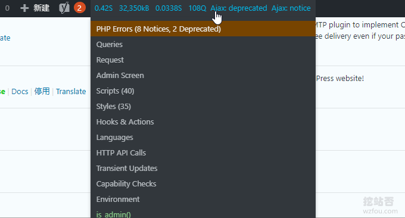

# WordPress错误诊断模式-专治WP页面空白,服务器500错误,插件冲突
我们在使用Wordpress时，经常会遇到Wordpress页面空白，Wordpress后台无法登录以及服务器500错误等问题，常见于Wordpress版本更新升级、安装插件之后，以及服务器PHP、Mysql等大版本更新之后，Wordpress函数不受支持的原因导致的。

另外，像挖站否wzfou.com这样，如果Wordpress的插件安装数量过多的话，也是很容易导致冲突的。之前在[我正在用的WordPress插件](https://wzfou.com/my-wp-pluins/)一文中有分享过我正在用的插件就是这样的问题，老版的[MailPoet](https://wzfou.com/tag/mailpoet/)居然与PHP 7.2 和 PHP 7.3 不兼容，导致Wordpress页面空白。

这篇文章就来分享一下[WordPress错误](https://wzfou.com/tag/wordpress-wrong/)诊断模式，主要用于处理Wordpress页面空白,服务器500错误和插件冲突等问题，更多的[WordPress优化](https://wzfou.com/tag/wordpress-jiasu/)技巧如下：

1. [WordPress利用MailPoet自建RSS更新邮件通知系统-用户订阅和管理](https://wzfou.com/mailpoet-3/)
2. [用Algolia给WordPress添加实时站内搜索功能-搜索质量更高内容更准](https://wzfou.com/algolia/)
3. [WooCommerce支付宝付款-WooCommerce支付插件设置和使用](https://wzfou.com/woocommerce-alipay/)

> **PS：2019年12月8日更新，**对于Wordpress没有自带移动端自适应功能或者是本身的移动主题不是很好看，我们可以试试AMP自适应： [WordPress AMP移动优化-打造适合移动搜索引擎和手机浏览访问WP ](https://wzfou.com/wordpress-amp/)。
> 
> **PS：2019年12月25日更新**，有时在Wordpress后台操作时容易出现502错误，解决办法： [解决WordPress后台编辑保存菜单出现502错误 ](https://wzfou.com/question/18791/)。

## 一、手动开启WP错误调试

打开在 `wp-config.php` 文件，添加以下代码（注意如果原配置文件中有`define('WP_DEBUG', true);`等代码，请把它们注释掉）：

1. /**
2. \* This will log all errors notices and warnings to a file called debug.log in
3. \* wp-content (if Apache does not have write permission, you may need to create
4. \* the file first and set the appropriate permissions)
5. */
6. **define**('WP_DEBUG', true);
7. **define**('WP\_DEBUG\_LOG', true);
8. **define**('WP\_DEBUG\_DISPLAY', false);
9. @**ini_set**('display_errors',0);

保存后，你就可以在 `wp-content/debug.log `文件中看到相应的错误信息了。如果你想直接显示错误信息在网页上，替换成：

1. **define**('WP_DEBUG', true);
2. **define**('WP\_DEBUG\_DISPLAY', true);

**最后，测试完成后一定要注释掉或者删除以上代码，以防坏人！**

## 二、WP错误诊断调试插件

### 2.1 Query Monitor

> 插件：https://wordpress.org/plugins/query-monitor/

[Query Monitor](https://wzfou.com/tag/query-monitor/)插件可以帮助你调试database queries, PHP errors, hooks和actions, block editor blocks, enqueued scripts and stylesheets, HTTP API calls等等，启用后显示如下图：

Query Monitor可以显示Wordpress详细的错误信息以及查询信息，以便于参考：

### 2.2 Debug Bar

> 插件：https://wordpress.org/plugins/debug-bar/

启用插件前，你需要编辑你的WP配置文件，加入以下代码（**用完了记得删除它们**）：

1. #Debug Bar插件
2. **define**(  'WP_DEBUG', true );
3. **define**(  'SAVEQUERIES', true );

[Debug Bar](https://wzfou.com/tag/debug-bar/)插件可以显示PHP错误、mysql queries查询等，在Wordpress右上角显示Debug Bar按钮。

点击后可以查看详细的PHP错误、Mysql查询信息，如下图：

## 三、总结

手动开启[WordPress错误](https://wzfou.com/tag/wordpress-wrong/)诊断模式，可以选择是否直接在页面上显示错误信息，还是输出到目录下日志当中，对于一些重要的网站建议不显示错误信息，而是在日志当中进行查看。

使用Query Monitor和Debug Bar开启模式诊断模式，相对于手动开启诊断模式，显示错误信息会直观，查询起来会比较容易一些。总之，为了尽量避免WP错误，我们还是少用插件为好。