# 利用W3 Total Cache配置Memcached和Redis缓存 优化加速WP速度
Memcached和Redis有点类似：都是内存型数据库，数据保存在内存中，通过tcp直接存取，优势是速度快，并发高。所以，很多人都会在自己的服务器安装和配置Memcached和Redis缓存加速，例如[Oneinstack](https://wzfou.com/oneinstack/)、[LNMP](https://wzfou.com/tag/lnmp/)、[宝塔BT面板](https://wzfou.com/bt-cn/)就可以一键安装[Memcached](https://wzfou.com/tag/memcached-huancun/)和Redis。

为了可以最大化地利用Memcached和Redis缓存加速Wordpress，我们可以利用W3 Total Cache插件将Wordpress的文章页面生成静态缓存，放到Memcached和Redis中，当用户第二次访问时就可以从内存中读取页面，大大减少了PHP执行时间，加快了Wordpress的访问速度。

这篇文章就来分享一下[W3 Total Cache](https://wzfou.com/tag/w3-total-cache/)插件的安装与配置方法，更多的[WordPress建站](https://wzfou.com/wordpress-jianzhan/)和优化方法有：（本站的优化汇总专题见：[挖站否网站与服务器优化方法总结](https://wzfou.com/readme/)）

1. [用Algolia给WordPress添加实时站内搜索功能-搜索质量更高内容更准](https://wzfou.com/algolia/)
2. [DirectAdmin空间启用OpCache和redis缓存加速-WP启用redis缓存](https://wzfou.com/directadmin-cache/)
3. [WordPress开启Nginx fastcgi_cache缓存加速方法-Nginx配置实例](https://wzfou.com/nginx-fastcgi-cache/)

> **PS：2019年11月23日更新，**觉得 W3 Total Cache 功能太多了只是想简单地启用内存加速，可以试试这个插件 ： [利用Cachify插件将WordPress页面缓存到Memcached实现优化加速 ](https://wzfou.com/cachify-memcached/)。

## 一、Memcached和Redis

插件：

1. 网站：https://wordpress.org/plugins/w3-total-cache/

Memcached和Redis手动安装比较麻烦，且配置起来复杂，如果你正在使用[Oneinstack](https://wzfou.com/oneinstack/)、[LNMP](https://wzfou.com/tag/lnmp/)、[宝塔BT面板](https://wzfou.com/bt-cn/)，直接在控制面板中一键安装即可。

[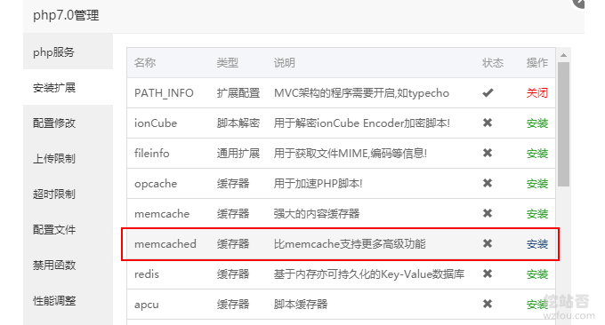](https://wzfou.com/wp-content/uploads/2019/09/w3tc_00.png)

## 二、W3 Total Cache配置

启用了[W3 Total Cache](https://wzfou.com/tag/w3-total-cache/)插件后，就是开始配置了，我们主要用到的是W3 Total Cache的页面缓存、数据库缓存、对象缓存以及CDN、页面压缩等。

### 2.1 页面缓存

W3 Total Cache页面缓存功能，可以帮助你将生成的页面缓存到本地硬盘、Memcached和Redis缓存中，此项功能比较重要，**建议开启。**

[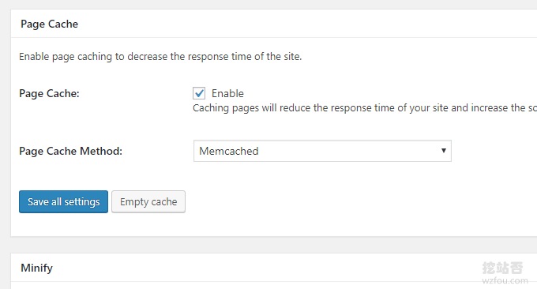](https://wzfou.com/wp-content/uploads/2019/09/w3tc_01.png)

### 2.2 页面压缩

W3 Total Cache的页面压缩功能主要是压缩HTML、JS、CSS等文件，还可以合并JS、CSS等，该功能容易导致页面而已错乱，**一般不建议开启。**

[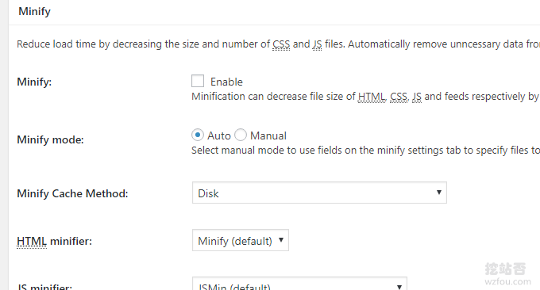](https://wzfou.com/wp-content/uploads/2019/09/w3tc_02.png)

### 2.3 数据库缓存

W3 Total Cache的数据库可以增加查询命中率，有利于提高数据库效率，支持缓存到本地硬盘、Memcached和Redis缓存中，**建议开启。**

[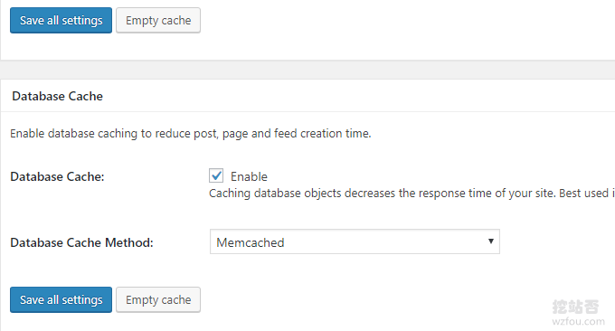](https://wzfou.com/wp-content/uploads/2019/09/w3tc_03.png)

### 2.4 对象缓存

W3 Total Cache的Object Cache对象缓存支持本地硬盘、Memcached和Redis缓存，该功能可以极大地提高WP的运行效率，建议开启。

[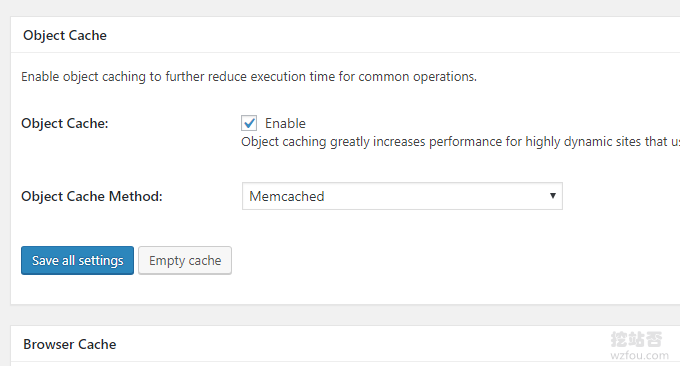](https://wzfou.com/wp-content/uploads/2019/09/w3tc_04.png)

### 2.5 CDN加速

如果你想让你的图片、CSS、JS等静态文件通过[七牛云](https://wzfou.com/qiniu-cdn/)、[又拍云](https://wzfou.com/tag/youpaiyun/)、[百度云CDN](https://wzfou.com/tag/baiduyun-cdn/)、[阿里云OSS](https://wzfou.com/tag/aliyun-oss/)等CDN加速，你可以在W3 Total Cache的CDN选项中选择Generic Mirror。

[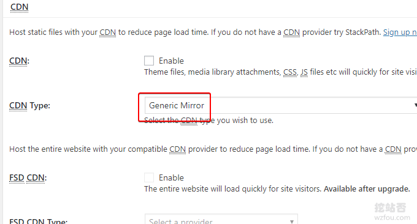](https://wzfou.com/wp-content/uploads/2019/09/w3tc_05.png)

## 三、排除或禁止缓存设置

### 3.1 禁用数据库缓存

如果你的某一项功能需要用到实时动态的Wordpress数据库，那么你可以在W3 Total Cache的数据库缓存中排除该项，例如如果你用了[WordPress添加实时站内搜索功能Algolia](https://wzfou.com/algolia/)，插件会很细心提示你将Algolia的数据库排除在W3 Total Cache的缓存之外。

[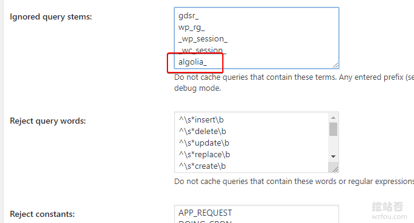](https://wzfou.com/wp-content/uploads/2019/09/w3tc_06.png)

### 3.2 禁用对象缓存

个别的Wordpress插件或者主题功能可能在Object Cache对象缓存下无法使用，这时我们可以在W3 Total Cache的Object Cache对象缓存中排除它，主要是填写好要排除的Key和Group。

[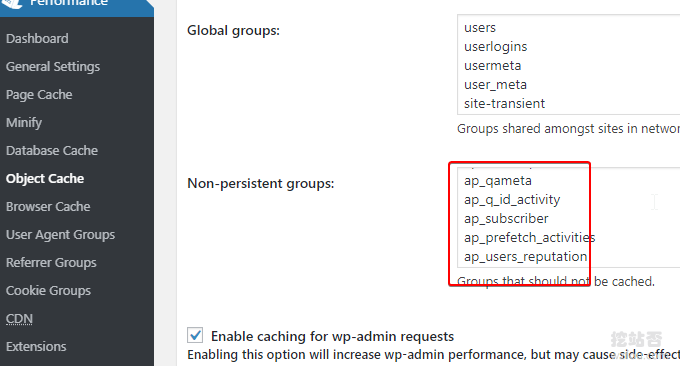](https://wzfou.com/wp-content/uploads/2019/09/w3tc_06_1.png)

有些主题或者插件不能兼容 Object Cache对象缓存 ，我们可以使用 W3 Total Cache 的Debug模式，找出需要忽略的Key和Groups填入即可，例如Anspress论坛，我们就可以填入：

1. anspress
2. ap
3. ap\_prefetch\_activities
4. ap\_q\_id_activity
5. ap\_users\_reputation
6. ap_qameta
7. ap\_prefetch\_activities
8. ap_subscriber
9. ap\_votes\_queries
10. ap_vote

### 3.3 禁用页面缓存

W3 Total Cache支持你设置某一个分类、某一个标签、某一个作者或者是某一个以xxx开头的页面不使用页面缓存。

[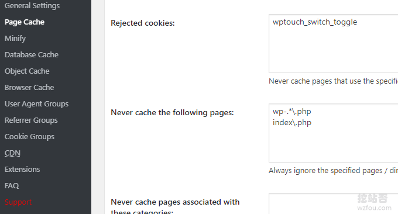](https://wzfou.com/wp-content/uploads/2019/09/w3tc_06_2.png)

## 四、W3 Total Cache效果

### 4.1 确认缓存生效

W3 Total Cache如果是Nginx服务器的话，会在网站根目录生成一个Nginx.conf配置文件，里面会有规则。要想让W3 Total Cache缓存生效，你需要重启Nginx服务，同时退出登录状态。

[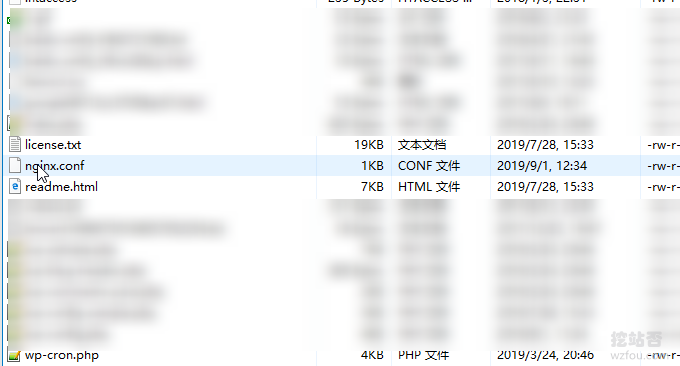](blob:https://wzfou.com/c9769d88-bf4f-4a84-adfd-1972f9b8d781)

### 4.2 缓存加速效果

以挖站否wzfou.com为例，未使用W3 Total Cache加速前，打开一个页面需要1s时间，TTFB时间过长。

[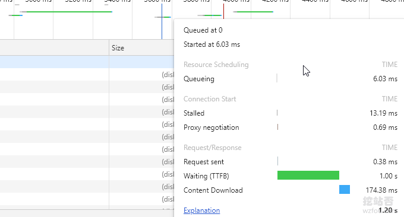](https://wzfou.com/wp-content/uploads/2019/09/w3tc_08.png)

使用了W3 Total Cache加速后，TTFB等待时间缩短到了230左右，页面打开速度明显加快。

[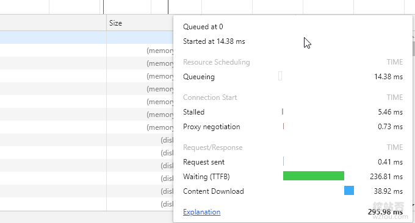](https://wzfou.com/wp-content/uploads/2019/09/w3tc_09.png)

未使用W3 Total Cache加速前，数据库查询超过200个。

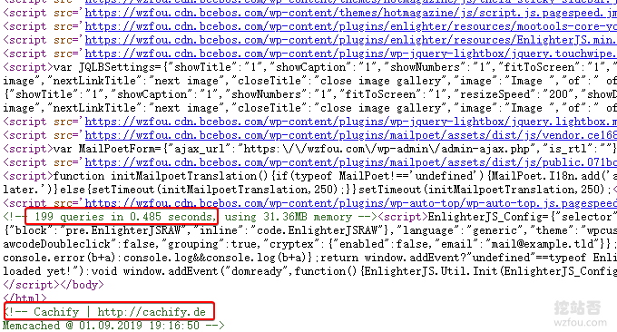

使用了W3 Total Cache加速后，数据库查询减少到80以下，数据库加速效果明显。

[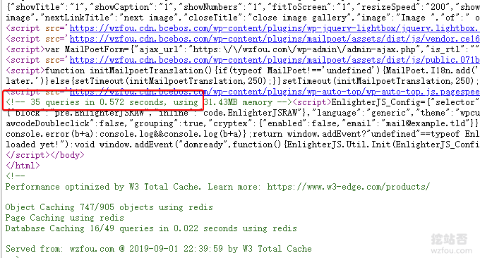](https://wzfou.com/wp-content/uploads/2019/09/w3tc_10.png)

## 五、总结

W3 Total Cache是一个老牌插件，但是更新及时，在我很早以前建站前就用过它，可能是用户基数大，感觉在使用的过程中与其它的插件兼容性比较高，设置起来不会出什么差错。

[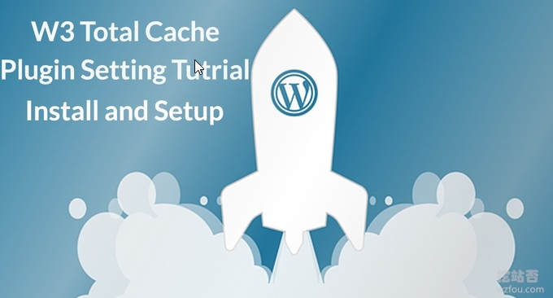](https://wzfou.com/wp-content/uploads/2019/09/w3tc_000_1-1.jpg)

W3 Total Cache插件优化加速效果明显，但是也有问题，比较耗服务器资源，建议开启缓存后不要频繁地清除缓存，重新生成缓存是一个比较消耗服务器内存和CPU的过程。