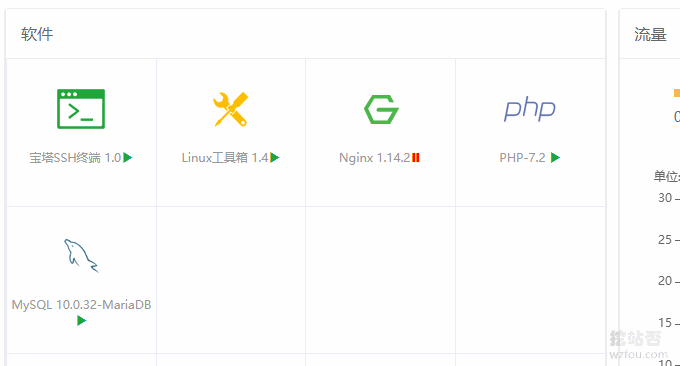
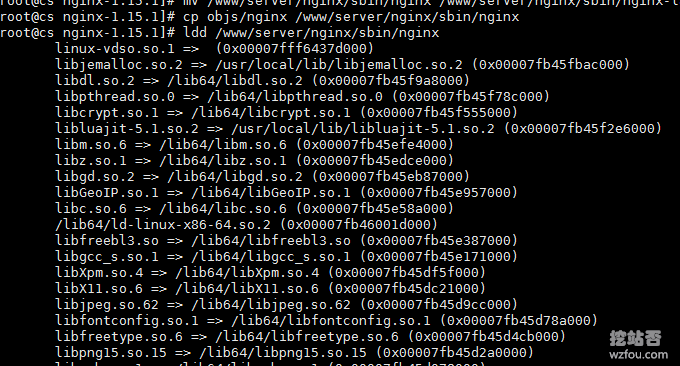
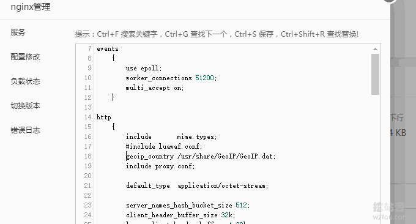
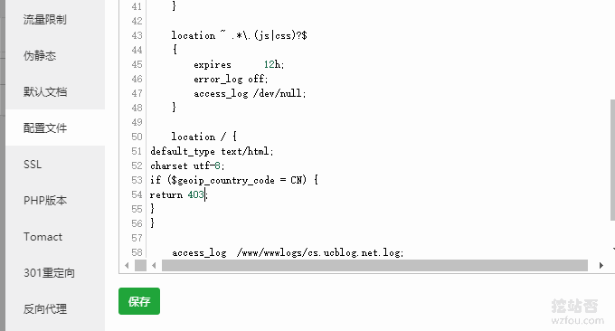
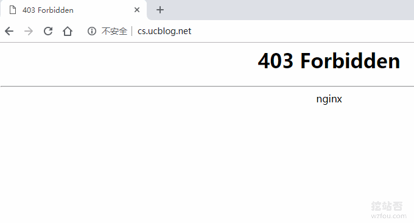
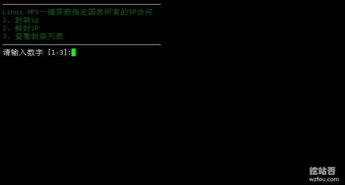
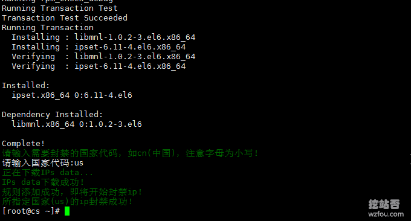
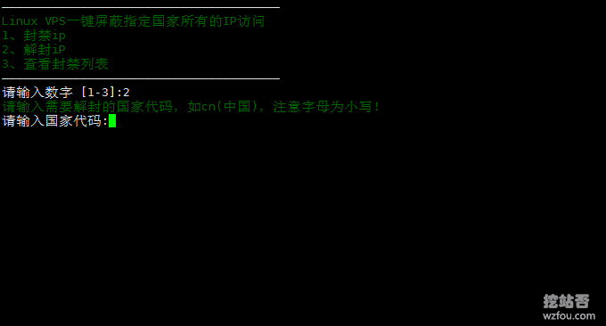
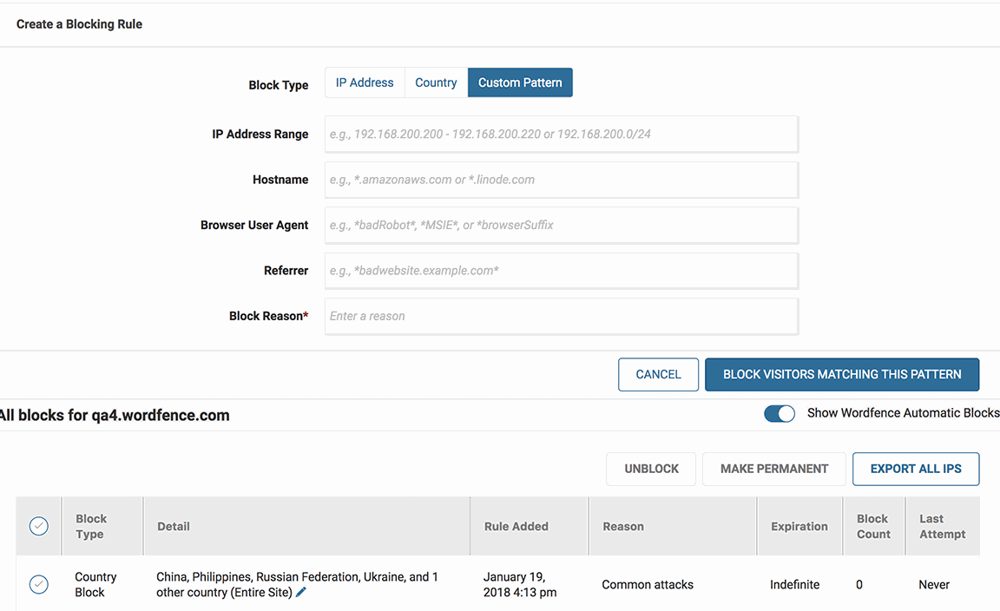
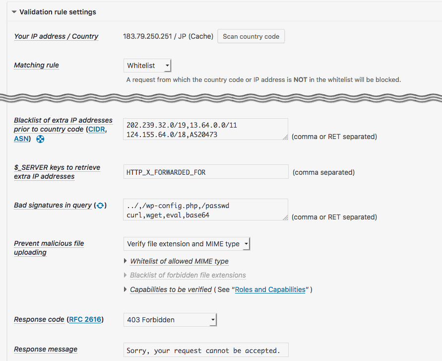

# 网站屏蔽和阻止特定地区和国家的IP访问设置方法-PHP代码 Nginx WordPress设置
有不少的朋友搭建了外贸站的朋友想要限制自己的网站不让国内的IP访问，也有一些朋友网站存放的资源可能因为各种原因需要阻止特定的IP访问，还有一些朋友看到攻击源IP大部分来自国外，想要阻止国外的IP访问网站。

无论是出于什么原因，屏蔽和阻止特定地区和国家的IP访问都是我们日常建站中经常要用到的。如果你用的是PHP，比较简单的方法就是在PHP文件加入判断IP的代码，利用IP库进行比对，如果IP为限定访问范围内，则阻止其继续访问。

如果网站是Nginx，则可以直接使用Nginx-ngx\_http\_geoip_module模块，该模块可以精确到国家、省、市等一级的IP，并且全部由Nginx执行识别和阻止访问，所以相对于PHP来说比较省资源，但是Nginx编译起来比较费事。

如果网站是搭建在VPS或者[独立服务器](https://wzfou.com/dedicated-servers/)上，那么可以直接使用Linux防火墙，利用iptables规则来阻止特定国家和省份的IP访问。当是，Wordpress用户完全不用担心Nginx、iptables等配置的问题，因为Wordpress早就有了各种限制IP访问的插件了。

本篇文章就来分享一下网站屏蔽和阻止特定地区和国家的IP访问设置四种方法：PHP代码、Nginx模块、iptables防火墙和Wordpress插件。如果你在网站建设的过程总是被各种恶意攻击所困扰，可以试试以下方法：

1. [五条关于使用免费VPS控制面板的安全建议-不让黑客有可趁之机](https://wzfou.com/vps-control-panel/)
2. [WordPress开启Nginx fastcgi_cache缓存加速方法-Nginx配置实例](https://wzfou.com/nginx-fastcgi-cache/)
3. [十个你可能不知道的CloudFlare免费CDN加速技巧-SSL\\DDOS\\Cache](https://wzfou.com/cloudflare/)

**PS：2019年3月25日更新，**对于VPS的安全问题，很朋友可能会忽视VPS本身的SSH配置，这里有强化策略：[VPS主机和服务器安全防护:SSH修改端口,添加白名单,仅限密钥登录](https://wzfou.com/linux-vps-sh/)。

## 一、PHP代码屏蔽特定IP

PHP代码比较简单，直接将以下代码丢到你的PHP文件中就可以实现阻止特定范围内IP访问网站了，根据IP库的精准度，可以准确到国家、省、市等一级的IP，代码示例如下（这段代码可以用来在BA期间使用）：

1. <?php
2. /**
3. *
4. \* test.php(屏蔽国家IP)
5. *
6. */

8. $verification  =  '美国';//需要屏蔽国家的IP
9. **function**  get\_client\_ip()  {
10. $ip  =  $_SERVER\['REMOTE_ADDR'\];
11. **if**  (**isset**($_SERVER\['HTTP\_X\_REAL\_FORWARDED\_FOR'\])  &&  preg_match('/^(\[0-9\]{1,3}\\.){3}\[0-9\]{1,3}$/', $_SERVER\['HTTP\_X\_REAL\_FORWARDED\_FOR'\]))  {
12. $ip  =  $_SERVER\['HTTP\_X\_REAL\_FORWARDED\_FOR'\];
13. }
14. **elseif**  (**isset**($_SERVER\['HTTP\_X\_FORWARDED_FOR'\])  &&  preg_match('/^(\[0-9\]{1,3}\\.){3}\[0-9\]{1,3}$/', $_SERVER\['HTTP\_X\_FORWARDED_FOR'\]))  {
15. $ip  =  $_SERVER\['HTTP\_X\_FORWARDED_FOR'\];
16. }
17. **elseif**  (**isset**($_SERVER\['HTTP\_CLIENT\_IP'\])  &&  preg_match('/^(\[0-9\]{1,3}\\.){3}\[0-9\]{1,3}$/', $_SERVER\['HTTP\_CLIENT\_IP'\]))  {
18. $ip  =  $_SERVER\['HTTP\_CLIENT\_IP'\];
19. }
20. **return**  $ip;
21. }
22. $ip  =  get\_client\_ip();//获取访客IP
23. $antecedents  =  $_SERVER\['HTTP_REFERER'\];//访客来路地址
24. $result  =  file\_get\_contents("http://ip.taobao.com/service/getIpInfo.php?ip=".$ip);//IP数据库来自淘宝。
25. $address  =  json_decode($result,true);
26. //判断访客是否属于美国，是否来自百度，是否来自谷歌
27. **if**($address\['data'\]\['country'\]  ==  $verification  &&  strpos($antecedents, 'baidu')  ===  false  &&  strpos($antecedents, 'google')  ===  false){
28. sleep(10);//设置一个10秒等待。
29. header('HTTP/1.1 503 Service Temporarily Unavailable');
30. header('Status: 503 Service Temporarily Unavailable');
31. header('Retry-After: 3600000');
32. **exit**;
33. }

36. /\*\*\*\*\*\* 如果需要阻止某一个省份的IP访问，使用以下代码*********/

39. <?php
40. /**
41. *
42. \* test.php(屏蔽地方IP)
43. *
44. */

46. $verification  =  '江西省';//需要屏蔽省份的IP
47. **function**  get\_client\_ip()  {
48. $ip  =  $_SERVER\['REMOTE_ADDR'\];
49. **if**  (**isset**($_SERVER\['HTTP\_X\_REAL\_FORWARDED\_FOR'\])  &&  preg_match('/^(\[0-9\]{1,3}\\.){3}\[0-9\]{1,3}$/', $_SERVER\['HTTP\_X\_REAL\_FORWARDED\_FOR'\]))  {
50. $ip  =  $_SERVER\['HTTP\_X\_REAL\_FORWARDED\_FOR'\];
51. }
52. **elseif**  (**isset**($_SERVER\['HTTP\_X\_FORWARDED_FOR'\])  &&  preg_match('/^(\[0-9\]{1,3}\\.){3}\[0-9\]{1,3}$/', $_SERVER\['HTTP\_X\_FORWARDED_FOR'\]))  {
53. $ip  =  $_SERVER\['HTTP\_X\_FORWARDED_FOR'\];
54. }
55. **elseif**  (**isset**($_SERVER\['HTTP\_CLIENT\_IP'\])  &&  preg_match('/^(\[0-9\]{1,3}\\.){3}\[0-9\]{1,3}$/', $_SERVER\['HTTP\_CLIENT\_IP'\]))  {
56. $ip  =  $_SERVER\['HTTP\_CLIENT\_IP'\];
57. }
58. **return**  $ip;
59. }
60. $ip  =  get\_client\_ip();//获取访客IP
61. $antecedents  =  $_SERVER\['HTTP_REFERER'\];//访客来路地址
62. $result  =  file\_get\_contents("http://ip.taobao.com/service/getIpInfo.php?ip=".$ip);//IP数据库来自淘宝。
63. $address  =  json_decode($result,true);
64. //判断访客是否属于江西省，是否来自百度，是否来自谷歌
65. **if**($address\['data'\]\['region'\]  ==  $verification  &&  strpos($antecedents, 'baidu')  ===  false  &&  strpos($antecedents, 'google')  ===  false){
66. sleep(99999999);//设置一个999999秒的等待。
67. Header("HTTP/1.1 204 No Content");
68. **exit**;
69. }

## 二、Nginx-ngx\_http\_geoip_module模块

IP库下载：

1. https://dev.maxmind.com/geoip/legacy/geolite/

### 2.1  禁止特定国家IP访问

ngx\_http\_geoip\_module模块可以让Nginx根据来访者的IP实现不同的需要，这里我们利用ngx\_http\_geoip\_module模块来阻止特定IP地址访问网站。

首先是将ngx\_http\_geoip_module编译到Nginx中。如果你用的是宝塔BT面板，可以采用以下命令：

1. #安装geoip库
2. yum -y install epel-release
3. yum -y install geoip-devel

6. #先查看一下本机的Nginx配置情况
7. \[root@cs ~\]# nginx -V
8. nginx version: nginx/1.14.2
9. built by gcc 4.8.5 20150623 (Red Hat 4.8.5-36) (GCC)
10. built with OpenSSL 1.0.2l 25 May 2017
11. TLS SNI support enabled
12. configure arguments: --user=www --group=www --prefix=/www/server/nginx --with-openssl=/www/server/nginx/src/openssl --add-module=/www/server/nginx/src/ngx\_devel\_kit --add-module=/www/server/nginx/src/lua\_nginx\_module --add-module=/www/server/nginx/src/ngx\_cache\_purge --add-module=/www/server/nginx/src/nginx-sticky-module --add-module=/www/server/nginx/src/nginx-http-concat --with-http\_stub\_status\_module --with-http\_ssl\_module --with-http\_v2\_module --with-http\_image\_filter\_module --with-http\_gzip\_static\_module --with-http\_gunzip\_module --with-stream --with-stream\_ssl\_module --with-ipv6 --with-http\_sub\_module --with-http\_flv\_module --with-http\_addition\_module --with-http\_realip\_module --with-http\_mp4_module --with-ld-opt=-Wl,-E --with-pcre=pcre-8.40 --with-ld-opt=-ljemalloc

14. #开始下载Nginx，这里用的是1.15.1，你也可以下载其它的版本
15. wget http://nginx.org/download/nginx-1.15.1.tar.gz
16. tar -xzvf nginx-1.15.1.tar.gz
17. cd nginx-1.15.1

19. #下面的命令只是在上面的Nginx -v得到的配置详情后加上了--with-http\_geoip\_module，目的是为了保持原来的配置不变同时又增加新的模块

21. ./configure --user=www --group=www --prefix=/www/server/nginx --with-openssl=/www/server/nginx/src/openssl --add-module=/www/server/nginx/src/ngx\_devel\_kit --add-module=/www/server/nginx/src/lua\_nginx\_module --add-module=/www/server/nginx/src/ngx\_cache\_purge --add-module=/www/server/nginx/src/nginx-sticky-module --add-module=/www/server/nginx/src/nginx-http-concat --with-http\_stub\_status\_module --with-http\_ssl\_module --with-http\_v2\_module --with-http\_image\_filter\_module --with-http\_gzip\_static\_module --with-http\_gunzip\_module --with-stream --with-stream\_ssl\_module --with-ipv6 --with-http\_sub\_module --with-http\_flv\_module --with-http\_addition\_module --with-http\_realip\_module --with-http\_mp4\_module --with-ld-opt=-Wl,-E --with-pcre=pcre-8.40 --with-ld-opt=-ljemalloc --with-http\_geoip_module

23. #只编译不安装
24. make

如果你用的是[LNMP脚本](https://wzfou.com/lnmp-1-4/)或者[Oneinstack](https://wzfou.com/oneinstack/)，可以参考这里：[Oneinstack](https://wzfou.com/nginx-fastcgi-cache/#12_Oneinstack)。启用Nginx-ngx\_http\_geoip_module模块。先停用Nginx。

然后替换新的Nginx并查看geoip模块是否已经加载。命令如下：

1. mv /www/server/nginx/sbin/nginx /www/server/nginx/sbin/nginx-lala.im
2. cp objs/nginx /www/server/nginx/sbin/nginx
3. ldd /www/server/nginx/sbin/nginx

到你的宝塔面板点击Nginx，修改配置文件，加入以下代码：

1. geoip_country /usr/share/GeoIP/GeoIP.dat;

操作如下图：

现在启动Nginx，你可以往网站的Nginx配置中添加规则了，例如你可以将特定国家的IP访问返回指定错误或者导向另一个页面和网站，代码示例：

1. #返回403  502  404等错误
2. location / {
3. default_type text/html;
4. charset utf-8;
5. **if**  ($geoip\_country\_code  = CN)  {
6. **return**  403;
7. }
8. }
9. #导向另一个网站目录
10. location / {
11. default_type text/html;
12. charset utf-8;
13. **if**  ($geoip\_country\_code  = CN)  {
14. root /home/www/wzfou.com-cn/;
15. }
16. }

这是添加网站配置。

最后效果如下：

### 2.2  仅允许指定国家IP访问

方法和上面是一样的，先在Nginx主配置中引入IP库，然后在在网站的Nginx配置中加入阻止任何国家IP但允许指定国家IP的代码，示例如下 ：

1. \# 引入IP库

3. geoip_country /usr/share/GeoIP/GeoIP.dat;
4. geoip_city /usr/share/GeoIP/GeoLiteCity.dat;

7. map $geoip\_country\_code  $allowed_country  {
8. **default** no;
9. CN yes;
10. }

12. \# 在配置中阻止IP
13. **if**  ($allowed_country  = no)  {
14. **return**  403;
15. }

## 三、iptables 防火墙

先熟悉一下iptables用法和ipset ：

> 1、iptables 包含几个表，每个表由链组成。默认的是 filter 表，最常用的也是 filter 表，另一个比较常用的是 nat 表。一般封 IP 就是在 filter 表的 INPUT 链添加规则。
> 
> 2、在进行规则匹配时，是从规则列表中从头到尾一条一条进行匹配。
> 
> 3、ipset 提供了把这个 O(n) 的操作变成 O(1) 的方法：就是把要处理的 IP 放进一个集合，对这个集合设置一条 iptables 规则。像 iptable 一样，IP sets 是 Linux 内核中的东西，ipset 这个命令是对它进行操作的一个工具。

iptables只允许指定ip访问本机的指定端口，命令如下：

1. 1、在tcp协议中，禁止所有的ip访问本机的3306端口。

3. iptables -I INPUT -p tcp –dport 3306 -j DROP

5. 2、允许123.456.789访问本机的3306端口

7. iptables -I INPUT -s 123.456.789-p tcp –dport 3306 -j ACCEPT

9. 以此类推…………………………………

11. 封掉一个IP段：
12. iptables -I INPUT -s 121.0.0.0/8 -j DROP

14. 以上命令的顺序不能错

16. 然后保存iptables
17. \# service iptables save
18. 重启防火墙
19. #service iptables restart

iptables规则删除、清空、关闭以及保存方法：

1. #CentOS 7请停止firewalld并安装iptables-services
2. systemctl stop firewalld
3. systemctl mask firewalld

5. #安装 iptables-services
6. yum install iptables-services

8. ################
9. 保存 iptables 规则
10. service iptables save

12. 重启 iptables
13. service iptables restart

15. #################
16. 执行清除命令 iptables -F时可能会断开与服务器的连接，如果想清空的话，先执行
17. /sbin/iptables -P INPUT ACCEPT
18. 然后执行
19. /sbin/iptables -F

21. 如果关闭防火墙，执行
22. /etc/init.d/iptables stop
23. 或者是 services iptables stop

25. #######################
26. iptables 规则若重启后消失，请用以下方法
27. 步骤1：备份
28. iptables-save > /etc/iptables.up.rules.bak

30. 步骤2：删除规则
31. vim /etc/sysconfig/iptables
32. 或 vim /etc/iptables.up.rules

34. 手动删除即可。

36. 步骤3：导入新规则

38. iptables-restore < /etc/sysconfig/iptables

40. 最后，重启VPS就可以生效了。

### 3.1  一键屏蔽指定国家IP访问

1. https://github.com/iiiiiii1/Block-IPs-from-countries

原理是下载指定国家的IP段，然后将IP段添加到iptables规则当中，直接执行以下命令：

1. wget https://raw.githubusercontent.com/iiiiiii1/Block-IPs-from-countries/master/block-ips.sh
2. chmod +x block-ips.sh
3. ./block-ips.sh

然后会要你选择是封禁IP还是解封IP。

选择封禁IP后会让你输入国家代码，请到这里查看：http://www.ipdeny.com/ipblocks，例如美国就是输入us，确定好完成对整个US的IP封禁。

如果想要解封的话，再次执行命令，然后选择2即可。

### 3.2  一键仅允许指定国家IP访问

上面我们实现了一键屏蔽特定国家的IP访问，但是有不少人希望让自己的网站仅让某一个国家的IP访问，其它的则禁止访问，这时我们就可以使用以下命令了：

1. wget https://www.ucblog.net/wzfou/block-any.sh
2. chmod +x block-ips.sh
3. ./block-ips.sh

上面的代码仅允许国内的IP访问，并会在：/etc/rc.d/rc.local写入规则，每次系统重启后都会重新导入iptables规则，如果你调整了iptables规则，需要编辑：/etc/rc.d/rc.local删除相应的启动自运行代码。block-any.sh代码如下：

1. #! /bin/bash
2. #判断是否具有root权限
3. **root_need**()  {
4. if \[\[ $EUID -ne 0  \]\]; then
5. echo "Error:This script must be run as root!"  1>&2
6. exit 1
7. fi
8. }

10. #检查系统分支及版本(主要是：分支->>版本>>决定命令格式)
11. **check_release**()  {
12. if uname -a | grep el7 ; then
13. release="centos7"
14. elif uname -a | grep el6 ; then
15. release="centos6"
16. yum install ipset -y
17. elif cat /etc/issue |grep -i ubuntu ; then
18. release="ubuntu"
19. apt install ipset -y
20. fi
21. }

23. #安装必要的软件(wget),并下载中国IP网段文件(最后将局域网地址也放进去)
24. **get\_china\_ip**()  {
25. #安装必要的软件(wget)
26. rpm --help >/dev/null 2>&1 && rpm -qa |grep wget >/dev/null 2>&1 ||yum install -y wget ipset >/dev/null 2>&1
27. dpkg --help >/dev/null 2>&1 && dpkg -l |grep wget >/dev/null 2>&1 ||apt-get install wget ipset -y >/dev/null 2>&1

29. #该文件由IPIP维护更新，大约一月一次更新(也可以用我放在国内的存储的版本，2018-9-8日版)
30. \[ -f china\_ip\_list.txt \] && mv china\_ip\_list.txt china\_ip\_list.txt.old
31. wget https://github.com/17mon/china\_ip\_list/blob/master/china\_ip\_list.txt
32. cat china\_ip\_list.txt |grep 'js-file-line">' |awk -F'js-file-line">'  '{print $2}' |awk -F'<'  '{print $1}' >\> china_ip.txt
33. rm -rf china\_ip\_list.txt
34. #wget https://qiniu.wsfnk.com/china_ip.txt

36. #放行局域网地址
37. echo "192.168.0.0/18" >\> china_ip.txt
38. echo "10.0.0.0/8" >\> china_ip.txt
39. echo "172.16.0.0/12" >\> china_ip.txt
40. }

42. #只允许国内IP访问
43. **ipset\_only\_china**()  {
44. echo "ipset create whitelist-china hash:net hashsize 10000 maxelem 1000000" \> /etc/ip-black.sh
45. for i in $( cat china_ip.txt )
46. do
47. echo "ipset add whitelist-china $i" >\> /etc/ip-black.sh
48. done
49. echo "iptables -I INPUT -m set --match-set whitelist-china src -j ACCEPT" >\> /etc/ip-black.sh
50. #拒绝非国内和内网地址发起的tcp连接请求（tcp syn 包）（注意，只是屏蔽了入向的tcp syn包，该主机主动访问国外资源不用影响）
51. echo "iptables -A INPUT -p tcp --syn -m connlimit --connlimit-above 0 -j DROP" >\> /etc/ip-black.sh
52. #拒绝非国内和内网发起的ping探测（不影响本机ping外部主机）
53. echo "iptables -A INPUT -p icmp -m icmp --icmp-type 8 -j DROP" >\> /etc/ip-black.sh
54. #echo "iptables -A INPUT -j DROP" >> /etc/ip-black.sh
55. rm -rf china_ip.txt
56. }

58. **run_setup**()  {
59. chmod +x /etc/rc.local
60. sh /etc/ip-black.sh
61. rm -rf /etc/ip-black.sh
62. #下面这句主要是兼容centos6不能使用"-f"参数
63. ipset save whitelist-china -f /etc/ipset.conf || ipset save whitelist-china > /etc/ipset.conf
64. \[ $release = centos7 \] && echo "ipset restore -f /etc/ipset.conf" >\> /etc/rc.local
65. \[ $release = centos6 \] && echo "ipset restore < /etc/ipset.conf" >\> /etc/rc.local
66. echo "iptables -I INPUT -m set --match-set whitelist-china src -j ACCEPT" >\> /etc/rc.local
67. echo "iptables -A INPUT -p tcp --syn -m connlimit --connlimit-above 0 -j DROP" >\> /etc/rc.local
68. echo "iptables -A INPUT -p icmp -m icmp --icmp-type 8 -j DROP" >\> /etc/rc.local
69. #echo "iptables -A INPUT -j DROP" >> /etc/rc.local
70. }

72. **main**()  {
73. check_release
74. get\_china\_ip
75. ipset\_only\_china

77. case "$release" in
78. centos6)
79. run_setup
80. ;;
81. centos7)
82. chmod +x /etc/rc.d/rc.local
83. run_setup
84. ;;
85. ubuntu)
86. sed -i '/exit 0/d' /etc/rc.local
87. run_setup
88. echo "exit 0" >\> /etc/rc.local
89. ;;
90. esac
91. }
92. main

如果你要排除一些IP，允许这些IP作为例外继续访问，可以使用iptables -I命令新增iptables规则，或者手动添加iptables规则，注意要将规则放在最上面，因为iptables执行顺序是从上往下。

### 3.3  手动设置仅允许特定国家IP访问

手动设置和上面的一键设置方法是一样的，按照下面的命令一条一条地执行就可以了。

1. 1、安装ipset

3. #Debian/Ubuntu系统
4. apt-get -y install ipset

6. #CentOS系统
7. yum -y install ipset
8. CentOS 7还需要关闭firewall防火墙：

10. systemctl stop firewalld.service
11. systemctl disable firewalld.service

13. 2、清空之前的规则

15. #防止设置不生效，建议清空下之前的防火墙规则
16. iptables -P INPUT ACCEPT
17. iptables -F

19. 3、创建新规则

21. #创建一个名为cnip的规则
22. ipset -N cnip hash:net
23. #下载国家IP段，这里以中国为例，其它国家IP下载参考：http://www.ipdeny.com/ipblocks/
24. wget -P . http://www.ipdeny.com/ipblocks/data/countries/cn.zone
25. #将IP段添加到cnip规则中
26. **for** i **in** $(cat /root/cn.zone ); **do** ipset -A cnip $i; **done**

28. 4、设置IP段白名单

30. #放行IP段
31. iptables -A INPUT -p tcp -m set --match-set cnip src -j ACCEPT
32. #关掉所有端口
33. iptables -P INPUT DROP
34. 这时候就只有指定国家的IP能访问服务器了。

36. #如果你在国内，网站不允许被国内人访问，建议别关所有端口，这样你的S-S-H会上不去，我们可以只关闭80/443端口。

38. #关闭指定端口，比如80/443
39. iptables -A INPUT -p tcp --dport 80 -j DROP
40. iptables -A INPUT -p tcp --dport 443 -j DROP
41. 这时候其他国家的IP是无法访问你服务器的80/443端口，等于无法访问你的网站，其它端口还是可以访问的。

43. 5、删除规则

45. #将参数里的-A改成-D就是删除规则了，如
46. iptables -D INPUT -p tcp -m set --match-set cnip src -j ACCEPT
47. iptables -D INPUT -p tcp --dport 443 -j DROP

## 四、Wordpress屏蔽特定IP

WordPress插件

1. https://wordpress.org/plugins/wordfence/
2. https://wordpress.org/plugins/all-in-one-wp-security-and-firewall/
3. https://wordpress.org/plugins/ip-geo-block/

上面三个Wordpress安全插件都带有屏蔽IP访问的设置，可以根据IP的来源、国家、范围和域名等进行屏蔽。（点击放大）

IP Geo Block稍微专业一些，除了可以屏蔽特定的IP地址，还可以对不同的IP地址访问不同的页面进行屏蔽或者阻止，功能非常强大。（点击放大）

## 五、总结

网站屏蔽特定国家IP最简单的方法就是本文介绍的PHP代码，引用了淘宝IP库，准确度非常高，而且还可以精确到省、市，自己可以根据需要来调整。不足的地方是不支持Https以及仅限PHP运行。

实际上常用的应该是iptables，直接以Linux防火墙的方式来阻止IP访问，不消耗资源，阻止得干净彻底。Nginx的Geo IP模块应用范围比较广泛，结合Nginx你可以实现对不同的IP用户展现不同的内容。