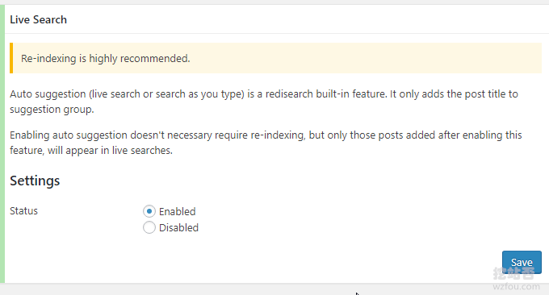
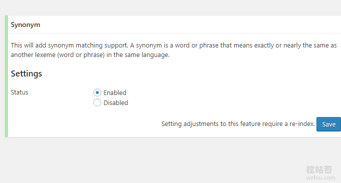
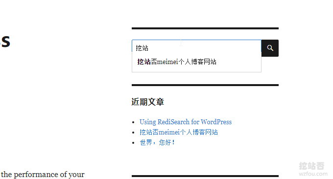

# RediSearch高性能全文搜索引擎-整合WordPress打造高质量搜索
Redisearch在Redis上面实现了一个搜索引擎，但与其他[Redis](https://wzfou.com/tag/redis/)搜索库不同，它不使用内部数据结构，如排序集。数据存储在内存中，使用内存-有效的自定义数据结构，强大的自动提示引擎，支持多种使用UTF-8编码的语言，支持已经在Redis中存在的HASH对象作为文件的索引。

RediSearch也可以整合到Wordpress，替换Wordpress默认的搜索引擎，而且支持搜索词提示、自动纠错、同义词等，它可以让我们的搜索更快更强大。RediSearch可以安装在本机VPS上，与Wordpress同属一个服务器，索引速度快，且当文章更新后会自动更新索引。

这篇文章就来分享一下如何将[RediSearch](https://wzfou.com/tag/redisearch/)整合到Wordpress，替换Wordpress默认的搜索功能。更多的关于Wordpress优化的文章，这里有（参考：[我正在用的WordPress插件](https://wzfou.com/my-wp-pluins/)）：

1. [网站启用WebP格式图片-PHP和Nginx转化WebP格式和自适应浏览器](https://wzfou.com/webp-nginx/)
2. [WordPress文章目录侧边固定滚动-Easy Table 和LuckyWP Table插件](https://wzfou.com/wp-toc/)
3. [WordPress子主题创建与使用方法-防止修改过的CSS,JS和代码失效](https://wzfou.com/wp-zi-zhuti/)

> **PS：2019年12月2日更新，**WordPress插件用的多的话容易出现各种冲突与问题，检测的方式有： [WordPress错误诊断模式-专治WP页面空白,服务器500错误,插件冲突 ](https://wzfou.com/wordpress-debug/)。

## 一、RediSearch安装配置

网站：

1. 官网：https://oss.redislabs.com/redisearch/
2. 插件：https://wordpress.org/plugins/redisearch/

先确保你的服务器上已经启用了Redis服务，一般来说如果你用的是[Oneinstack](https://wzfou.com/oneinstack/)、[LNMP](https://wzfou.com/tag/lnmp/)和[宝塔BT面板](https://wzfou.com/bt-cn/)，可以一键安装Redis服务。然后，使用以下命令安装RediSearch：

1. apt update
2. apt install cmake build-essential git -y

5. cd /tmp
6. git clone https://github.com/RedisLabsModules/RediSearch.git
7. cd RediSearch/cmake
8. cmake .. -DCMAKE\_BUILD\_TYPE=RelWithDebInfo

10. #看到如下输出表示成功
11. root@150-95-177-167:~\# cd /tmp
12. root@150-95-177-167:/tmp\# git clone https://github.com/RedisLabsModules/RediSearch.git
13. Cloning into 'RediSearch'...
14. remote: Enumerating objects: 178, done.
15. remote: Counting objects: 100% (178/178), done.
16. remote: Compressing objects: 100% (122/122), done.
17. remote: Total **23273**  (delta 91), reused **100**  (delta 54), pack-reused 23095
18. Receiving objects: 100% (23273/23273), 16.46 MiB | 7.09 MiB/s, done.
19. Resolving deltas: 100% (16751/16751), done.
20. root@150-95-177-167:/tmp\# cd RediSearch/cmake
21. root@150-95-177-167:/tmp/RediSearch/cmake\# cmake .. -DCMAKE\_BUILD\_TYPE=RelWithDebInfo
22. \-\- The C compiler identification is GNU 6.3.0
23. \-\- The CXX compiler identification is GNU 6.3.0
24. \-\- Check for working C compiler: /usr/bin/cc
25. \-\- Check for working C compiler: /usr/bin/cc -- works
26. \-\- Detecting C compiler ABI info
27. \-\- Detecting C compiler ABI info - done
28. \-\- Detecting C compile features
29. \-\- Detecting C compile features - done
30. \-\- Check for working CXX compiler: /usr/bin/c++
31. \-\- Check for working CXX compiler: /usr/bin/c++ -- works
32. \-\- Detecting CXX compiler ABI info
33. \-\- Detecting CXX compiler ABI info - done
34. \-\- Detecting CXX compile features
35. \-\- Detecting CXX compile features - done
36. \-\- Performing Test HAVE\_W\_INCOMPATIBLE\_POINTER\_TYPES
37. \-\- Performing Test HAVE\_W\_INCOMPATIBLE\_POINTER\_TYPES - Success
38. \-\- Performing Test HAVE\_W\_DISCARDS_QUALIFIERS
39. \-\- Performing Test HAVE\_W\_DISCARDS_QUALIFIERS - Failed
40. v1.6.0-251-g5baf48bd
41. CMake **Warning**  (dev) at CMakeLists.txt:**127**  (GET\_TARGET\_PROPERTY):
42. Policy CMP0045 is not set: Error on non-existent target in
43. get\_target\_property. Run "cmake --help-policy CMP0045" for policy details.
44. Use the cmake_policy command to set the policy and suppress this warning.

46. **get\_target\_property**() called with non-existent target "example_extension".
47. This warning is for project developers. Use -Wno-dev to suppress it.

49. \-\- Configuring done
50. \-\- Generating done
51. \-\- Build files have been written to: /tmp/RediSearch/cmake

53. #开始编译
54. make

编译完成后，执行以下命令将 `redisearch.so` 放入目录下：

1. mkdir -p /etc/redis/modules
2. cp /tmp/RediSearch/cmake/redisearch.so /etc/redis/modules/redisearch.so

然后编辑 `redis.conf` 文件，添加以下代码，最后重启Redis。

1. loadmodule /etc/redis/modules/redisearch.so
2. #重启
3. sudo service redis-server restart

`redis.conf` 文件常用的路径是`/etc/redis/redis.conf`，也有在其它地方的，例如Oneinstack的路径如下：

## 二、RediSearch插件使用

### 2.1 配置服务器

到[WordPress](https://wzfou.com/wordpress-jianzhan/)官网下载RediSearch插件，启用后首先在Redis服务器配置填写你的Redis服务器地址、端口以及索引名称。（点击放大）

### 2.2 索引内容设置

完成后，点击索引选项，在这里你可以设置分类、标签、文章、页面等是否列入到索引当中。（点击放大）

回到插件页面，你可以看到[RediSearch](https://wzfou.com/tag/redisearch/)提示需要更新一下索引，点击同步更新。

索引添加完成。

### 2.3 实时搜索

RediSearch支持添加实时搜索，即当用户输入关键词时会有提示。

### 2.4 同义词设置

RediSearch的同义词设置允许你添加相关的词语用于提高搜索质量。

## 三、RediSearch搜索效果

### 3.1 索引是否成功

通过以下命令你可以检测RediSearch索引是否成功。

1. root@150-95-177-167: redis-cli #进入Redis server
2. 127.0.0.1:6379\> MODULE list #检查 modules 是否成功加载
3. 1)  1)  "name"
4. 2)  "ft"
5. 3)  "ver"
6. 4)  (integer)  999999
7. 127.0.0.1:6379\> INFO keyspace #查看数据库
8. \# Keyspace
9. db0:keys=135,expires=0,avg_ttl=0
10. 127.0.0.1:6379\> SELECT 0  #选择0数据库
11. OK
12. 127.0.0.1:6379\> KEYS * #列出所有的Key
13. 1)  "ft:meimei/\\xe4\\xb8\\x80\\xe7\\x9b\\xb4\\xe4\\xbb\\xa5\\xe6\\x9d\\xa5\\xef\\xbc\\x8c\\xe6\\x88\\x91\\xe6\\x9c\\x89\\xe4\\xb8\\x80\\xe4\\xb8\\xaa\\xe5\\x86\\x99\\xe2\\x80\\x9c\\xe9\\x95\\xbf\\xe6\\x96\\x87\\xe7\\xab\\xa0\\xe2\\x80\\x9d\\xe7\\x9a\\x84\\xe4\\xb9\\xa0\\xe6\\x83\\xaf\\xe3\\x80\\x82\\xe6\\x9c\\x80\\xe5\\xbc\\x80\\xe5\\xa7\\x8b\\xe7\\x9a\\x84\\xe6\\x97\\xb6\\xe5\\x80\\x99\\xe5\\x83\\x8f\\xe5\\x86\\x99\\xe6\\xb6\\x88\\xe6\\x81\\xaf\\xe4\\xb8\\x80\\xe6\\xa0\\xb7\\xe6\\x9d\\xa5\\xe5\\x86\\x99\\xe5\\x8d\\x9a\\xe5\\xae\\xa2\\xef\\xbc\\x8c\\xe6\\x96\\x87\\xe7\\xab\\xa0\\xe7\\xae\\x80\\xe7\\x9f\\xad\\xef\\xbc\\x8c\\xe4\\xbd\\x86\\xe4\\xbe\\x9d\\xe7\\x84\\xb6\\xe8\\xa7\\x89\\xe5\\xbe\\x97\\xe5\\xbe\\x88\\xe9\\x9a\\xbe\\xe5\\x86\\x99\\xef\\xbc\\x8c\\xe6\\x89\\xbe\\xe4\\xb8\\x8d\\xe5\\x88\\xb0\\xe5\\x90\\x88\\xe9\\x80\\x82\\xe7\\x9a\\x84\\xe8\\xaf\\xad\\xe5\\x8f\\xa5\\xe6\\x9d\\xa5\\xe8\\xa1\\xa8\\xe8\\xbe\\xbe\\xe3\\x80\\x82\\xe5\\x90\\x8e\\xe6\\x9d\\xa5\\xe6\\x83\\xb3\\xe5\\x87\\xba\\xe4\\xb8\\x80\\xe4\\xb8\\xaa\\xe2\\x80\\x9c\\xe6\\x87\\x92\\xe4\\xb8\\xbb\\xe6\\x84\\x8f\\xe2\\x80\\x9d\\xe2\\x80\\x94\\xe2\\x80\\x94\\xe7\\xbb\\x99\\xe6\\x96\\x87\\xe7\\xab\\xa0\\xe6\\xb7\\xbb\\xe5\\x8a\\xa0\\xe5\\xa4\\xa7\\xe9\\x87\\x8f\\xe7\\x9a\\x84\\xe5\\x9b\\xbe\\xe7\\x89\\x87\\xef\\xbc\\x8c\\xe4\\xb8\\x80\\xe6\\x9d\\xa5\\xe5\\x8f\\xaf\\xe4\\xbb\\xa5\\xe5\\xa2\\x9e\\xe5\\x8a\\xa0\\xe6\\x96\\x87\\xe7\\xab\\xa0\\xe5\\x86\\x85\\xe5\\xae\\xb9\\xef\\xbc\\x8c\\xe4\\xba\\x8c\\xe6\\x9d\\xa5\\xe5\\x9b\\xbe\\xe6\\x96\\x87\\xe7\\xbb\\x93\\xe5\\x90\\x88\\xe7\\x9a\\x84\\xe6\\x96\\x87\\xe7\\xab\\xa0\\xe8\\xaf\\xbb\\xe8\\xb5\\xb7\\xe6\\x9d\\xa5\\xe6\\x9b\\xb4\\xe6\\x9c\\x89\\xe4\\xb9\\x90\\xe8\\xb6\\xa3\\xe3\\x80\\x82"
14. 2)  "ft:meimei/content"
15. 3)  "nm:meimei/menu_order"
16. 4)  "ft:meimei/fixed"
17. 5)  "ft:meimei/15"
18. 6)  "ft:meimei/\\xef\\xbc\\x89"
19. 7)  "ft:meimei/mp4"

21. 127.0.0.1:6379\> exit #退出

### 3.2 实时搜索效果

启用了RediSearch后，Wordpress搜索的结果会自动展示来自RediSearch索引的结果，同时也支持词语联想，即实时搜索建议，如下图：

## 四、总结

RediSearch官方宣称对中文搜索已经有了改进，实际测试过程中发现RediSearch对中文搜索不是很友好，但是英文搜索这一块确实非常给力，不仅速度快，而且结果也很准确。

使用[RediSearch搜索](https://wzfou.com/tag/redisearch-so/)时关键是配置好RediSearch服务器，由于服务器重启后Redis就会消失，建议在RediSearch插件后台勾选Write redis data to the disk，这样重启后不用重新索引了。