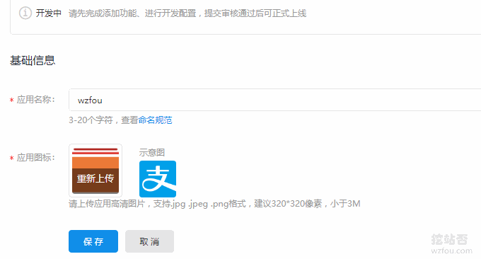
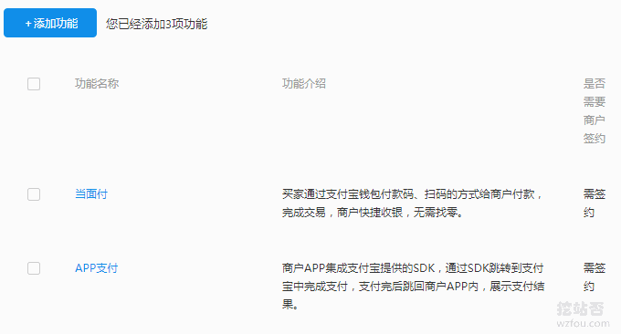
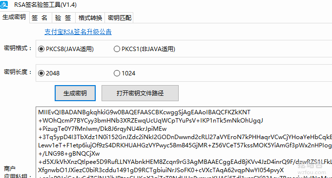
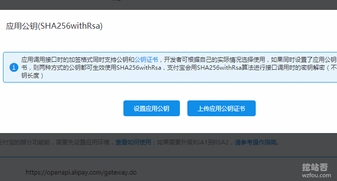
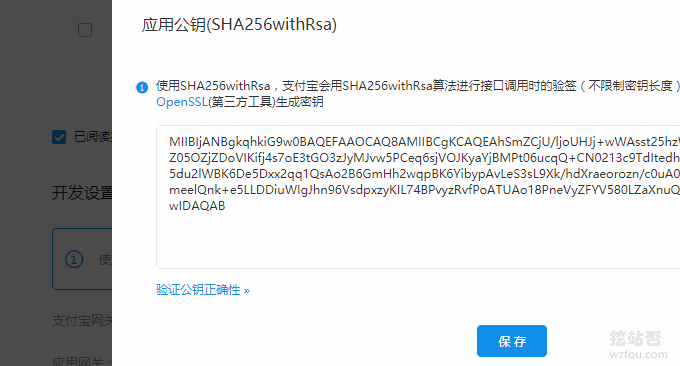
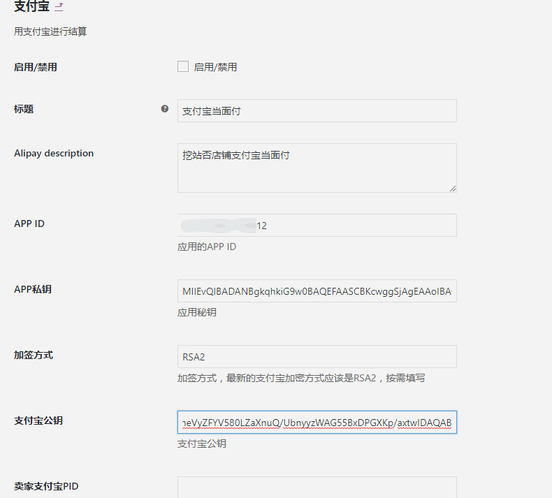
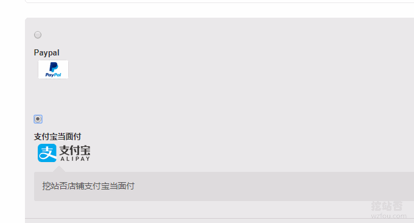
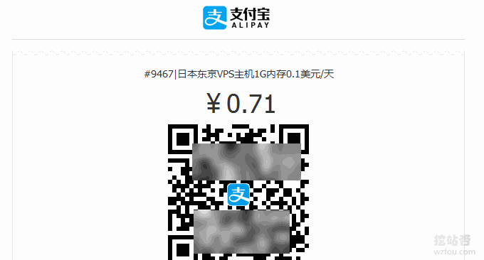
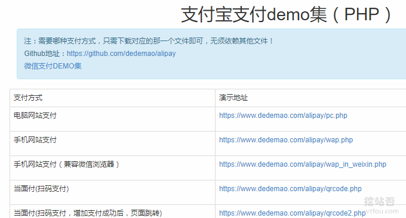

# WooCommerce支付宝付款-WooCommerce支付插件设置和使用
WooCommerce是一个让你的Wordpress变成商城的插件，虽然是Wordpress插件，但是WooCommerce功能强大，WooCommerce各种子插件也是层出不穷。例如WooCommerce支付插件、WooCommerce物流插件以及用户中心插件等。

从我使用[WooCommerce](https://wzfou.com/tag/woocommerce/)的体验来看，WooCommerce完全可以满足虚拟产品和实体物品的销售。有很多人卖主机、卖插件还有卖“XX账号”的都会使用WHMCS，但是WHMCS每月授权费就高达20美元，小卖家的话还是选择WooCommerce好一些。

不过，国人使用WooCommerce有一个最大的问题，那就是WooCommerce支付。默认的WooCommerce可以直接使用Paypal接口，但是像支付宝、微信等国内常用的支付接口，WooCommerce暂未提供，需要自己开发。

本篇文章就来分享一下[WooCommerce支付宝](https://wzfou.com/tag/woocommerce-alipay/)接入方法，更多的关于[WordPress建站](https://wzfou.com/tag/wordpress-jz/)，参考：

1. [改进网站站内搜索-百度,Google自定义搜索和Elasticsearch自建搜索](https://wzfou.com/baidu-google-es/)
2. [WordPress添加支付宝,微信打赏按钮制作实例和Paypal.me打赏链接](https://wzfou.com/dashang-anniu/)
3. [\[荐书\]一本让你学会建站的书《零基础学WordPress-从新手到高手》清华大学出版社](https://wzfou.com/0wordpress/)

## 一、支付宝开放平台公钥和私钥

蚂蚁开放平台：

1. https://open.alipay.com/platform/home.htm

WooCommerce支付宝插件都会用到支付宝开放平台的公钥和私钥，你需要先到支付宝开放平台注册一个账号并提交应用开发。

选择支付接入，然后填写你的应用开发信息。

在下方会APP支付、网站支付、当面付等功能选项，根据你自己的实际情况“签约”，否则应用上线也无法使用支付。

然后是下载支付宝提供的RSA密钥工具，点击生成公钥和私钥。

点击“加签方式”，选择填入应用公钥。

填入你的应用公钥保存。

等你的应用审核上线后，你就可以得到APP ID、支付宝公钥（提交应用公钥后会自动生成）和应用私钥（之前本地生成的，记得保存下来）。

## 二、WooCommerce支付宝插件：woocommerce-alipay

对WooCommerce不熟悉的朋友可参考这两篇文章：

> [WordPress商城搭建-WooCommerce安装和Paypal,支付宝,微信设置](https://wzfou.com/woocommerce/)
> 
> [WooCommerce实用代码汇总-如何自定义WooCommerce功能与设计](https://wzfou.com/woocommerce-code/)

项目：

1. https://github.com/wzhih/woocommerce-alipay

woocommerce-alipay插件安装启用界面如下，对照上面的操作分别将APP ID、支付宝公钥、应用私钥和用户PID填入进去。（点击放大）

同时，记得到支付宝开放平台设置一下回调地址，示例如下：

1. http://wzfou.com/?wc-api=woocommerce\_api\_wc\_gateway\_alipay

woocommerce-alipay启用效果如下：

## 三、WooCommerce支付宝插件：xunhupay

插件：

1. https://wordpress.org/plugins/xunhu-alipay-payment-for-woocommerce/

这是国内一家公司开发的WooCommerce支付宝插件，实际上它不是一个免费的产品，虽然可以免费安装，但是每次交易会收取1%的手续费。

> 接入流程：先注册：https://mp.xunhupay.com 创建应用，获取appid,插件填入appid，手机安装app，登陆账户，开始收款
> 
> 使用教程完整版：https://www.xunhupay.com/19.html
> 
> 插件下载：https://www.xunhupay.com/plugin.html
> 
> 常见问题：https://www.xunhupay.com/faq.html

启用支付宝插件后，就可以使用[WooCommerce支付宝](https://wzfou.com/tag/woocommerce-alipay/)结账了。体验地址：https://wzfou.com/product/woocommerce/

WooCommerce支付宝插件xunhupay使用时要保持手机一直开机，不过xunhupay也提供了PC端挂机，比较适合用在VPS或者服务器挂。

## 四、自定义WooCommerce支付

网站：

1. 项目：https://github.com/dedemao/alipay
2. 演示：https://www.dedemao.com/alipay/demo.html

WooCommerce不知道是不是用的人太少的原因，开源又免费的WooCommerce支付插件很少，有能力的朋友可以参考“一个PHP文件搞定支付宝支付系列”自己开发一个：

项目对应的文件有：

> pc.php 电脑网站支付
> 
> wap.php   手机网站支付
> 
> qrcode.php   当面付（扫码支付）
> 
> barcode.php   当面付（条码支付）
> 
> jsapi.php js原生支付（支付宝扫码打开网页，在网页中调起支付宝原生支付）
> 
> transfers.php 单笔转账到支付宝账户
> 
> settle.php 交易结算（分账、分润）
> 
> authorize.php 网页授权获取用户信息
> 
> close.php 交易关闭接口
> 
> refund.php 退款
> 
> return.php   同步回调通知
> 
> notify.php   异步回调通知

## 五、总结

woocommerce-alipay这个插件为免费插件，但是问题也有不少，关键的地方就是个人如果没有签约支付宝网站和APP支付的话就无法使用。

xunhupay不需要签约就可以直接使用，资金直接到支付宝账号，不好的地方你需要一直开着APP来接收订单，当然你也可以用他们的PC端挂机。