# WordPress AMP移动优化-打造适合移动搜索引擎和手机浏览访问WP
AMP全称为 Accelerated Mobile Pages，由Google和其他几家企业共同研发，旨在帮助开发人员创建能够在移动设备上良好运行的网站。[AMP](https://wzfou.com/tag/amp/) 的 HTML 代码是标准 HTML 的一个子集，大大简化了 html 的代码，大大简化 css，且只能写在 HTML 中，不能调用外部 CSS 文件。

AMP充分利用高速缓存，Google 将 AMP 页面缓存在自身的服务器上，以加快检索速度，因此AMP 很适合新闻、博客等信息资讯类的网站，尤其是在Google移动搜索结果中，**已经创建了 AMP 网页的所有类型的网站都将在整个 Google 移动搜索结果页面中获得更高的曝光率。**

如果你用的是Wordpress，那么启用AMP真的是太方便了，AMP官方已经开发一个AMP官方插件，直接安装即可启用。不过AMP官方插件功能比较简单，只是简单地生成AMP网页，而我们可以使用AMP for WP – Accelerated Mobile Pages这款插件。

[AMP for WP](https://wzfou.com/tag/amp-for-wp/) 最大的优势就是兼容性比较高，可以与SEO插件整合兼容，同时支持自定义[AMP主题](https://wzfou.com/tag/wordpress-amp-zhuti/)、支持WP评论、添加自定义Html代码、移动设备自动跳转等，尤其是移动设置自动跳转功能，如果Wordpress自带的移动设备主题不好，完全可以利用[AMP for WP](https://wzfou.com/tag/amp-for-wp/) 打造一个新的移动主题。

[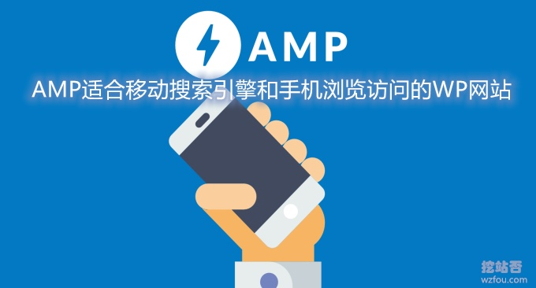](https://wzfou.com/wp-content/uploads/2019/10/amp-wp_0000.jpg)

本篇文章就来分享一下Wordpress AMP页面生成方法，主要是介绍AMP for WP – Accelerated Mobile Pages这款插件安装与配置，更多的关于[WordPress建站](https://wzfou.com/wordpress-jianzhan/)的文章，这里有：

1. [WordPress文章目录侧边固定滚动-Easy Table 和LuckyWP Table插件](https://wzfou.com/wp-toc/)
2. [WordPress子主题创建与使用方法-防止修改过的CSS,JS和代码失效](https://wzfou.com/wp-zi-zhuti/)
3. [用Algolia给WordPress添加实时站内搜索功能-搜索质量更高内容更准](https://wzfou.com/algolia/)

## 一、为什么要用AMP？

最重要的原因就是搜索引擎对AMP的重视，尤其是Google，现在已经优先收录和展示移动页面了，同时在搜索引擎排名中也给予了AMP页面更多的权重，国内的百度也是支持AMP页面收录，只不过自己又单独搞了个“没有一丁点浪花”的MIP。

[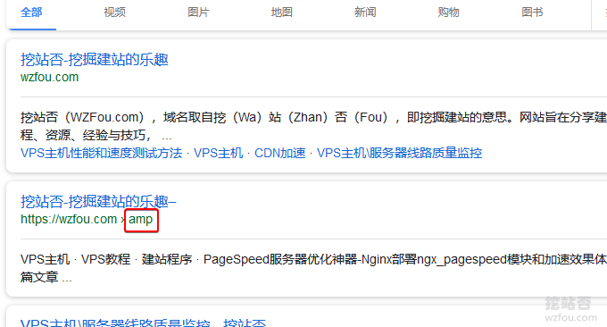](https://wzfou.com/wp-content/uploads/2019/10/amp-wp_00.png)

## 二、WP AMP插件介绍

1. https://wordpress.org/plugins/amp/
2. https://wordpress.org/plugins/accelerated-mobile-pages/

WordPress启用AMP最简单的方法就是使用AMP插件了，目前Wordpress AMP插件一个是由AMP官方开发的WP AMP插件，另一个是由WP开发者开的插件AMP for WP – Accelerated Mobile Pages。

AMP for WP – Accelerated Mobile Pages这款插件比起官方版本的AMP插件，功能要强大不少，兼容性也比较高，我们完全可以利用AMP for WP 打造一个WP手机主题

> Gutenberg 编辑器支持  
> Addthis Sharing 支持  
> AMP Infinity Scroll 支持  
> GDPR 支持  
> 兼容SEO插件，例如 Yoast SEO, All in One Seo, Rank Math, Genesis, SEOPress, Bridge Qode SEO, The SEO Framework and Squrilly SEO Plugin.  
> 支持 Page Builder 3.0 for AMP!  
> 支持在网页显示一键拨号OneSignal Push Notifications  
> 支持 WooCommerce  
> 页面导航支持Page Break / NextPage (Pagination)  
> 广告支持9 Advertisement sizes – 2 More AD slots added recently  
> WP原生评论支持Comments Forms in AMP.  
> Disqus 评论支持  
> 自定义AMP支持Custom AMP Editor  
> 移动设备重定向Mobile Redirection  
> Google Analytics Support.

## 三、AMP for WP基本设置

到Wordpress后台下载并启用AMP for WP插件，以下为AMP for WP界面，点击放大：

[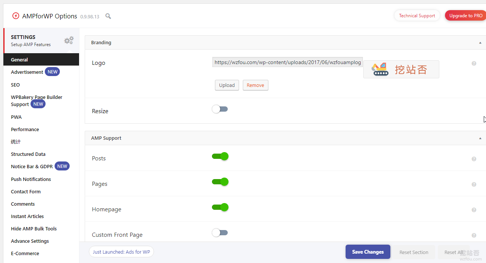](https://wzfou.com/wp-content/uploads/2019/10/amp-wp_01.png)

### 3.1 AMP广告

AMP for WP可以很方便地在AMP页面中添加广告，已经预设了八个广告位，足以满足我们在AMP页面中插入广告了。

[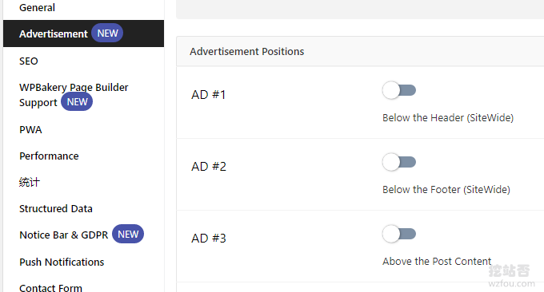](https://wzfou.com/wp-content/uploads/2019/10/amp-wp_02.png)

### 3.2 SEO优化

如果你的Wordpress已经自带了各类SEO优化插件，AMP for WP可以很轻松地从这些SEO插件中导入数据。

[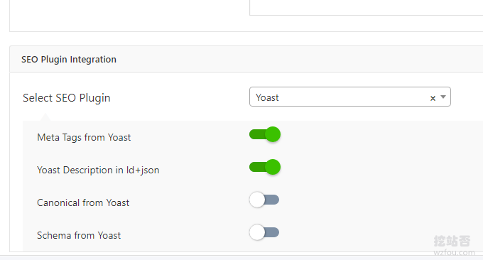](https://wzfou.com/wp-content/uploads/2019/10/amp-wp_03.png)

### 3.3 网页加速

AMP for WP插件支持对CSS、JS等页面进行优化，有利于加快网页浏览速度。

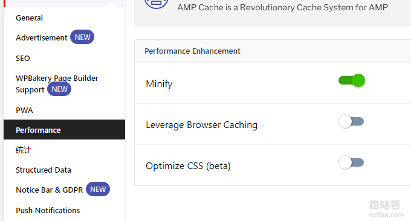

### 3.4 网站统计

AMP for WP已经自带了Google统计，直接点击开启即可，如果你想要启用百度统计，你可以直接在高级设置中加入Html代码即可。

[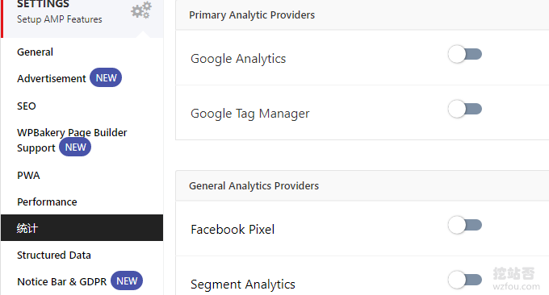](https://wzfou.com/wp-content/uploads/2019/10/amp-wp_05.png)

**如何添加百度统计？**首先检查一下你的AMP页面`</head>`前有没有加载以下代码，没有的话先手动添加：

1. 

然后在所有的AMP页面中加入百度统计代码，将`你的token`替换一下。在百度统计代码 hm 后面的 token 就是你的了。

1. <amp-analytics type="baiduanalytics" id="analytics2">
2. 
15. </amp-analytics>

挖站否在实际操作的过程中发现，百度统计中的代码安装检测中会提示没有正确安装，但是统计前台有数据返回，说明成功。参考官方的手动检测方法是可以看到AMP百度统计代码正常安装的。

> https://tongji.baidu.com/web/help/article?id=268
> 
> https://tongji.baidu.com/web/help/article?id=93

### 3.5 页面提示

AMP for WP可以让你在AMP页面中加入提示，用户打开页面后就可以看到。

[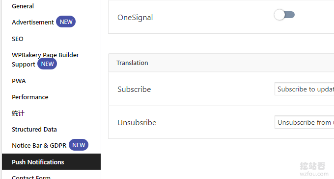](https://wzfou.com/wp-content/uploads/2019/10/amp-wp_06.png)

### 3.6 AMP评论

一般的AMP页面是不带WP评论的，AMP for WP插件支持在AMP页面中显示评论，同时也可以发表评论。

[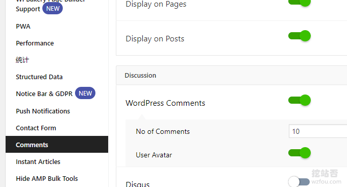](https://wzfou.com/wp-content/uploads/2019/10/amp-wp_07.png)

### 3.7 自定义代码

AMP for WP的高级设置中就可以自定义Html了，你可以添加一些自定义的Html代码方便你自己修改。

[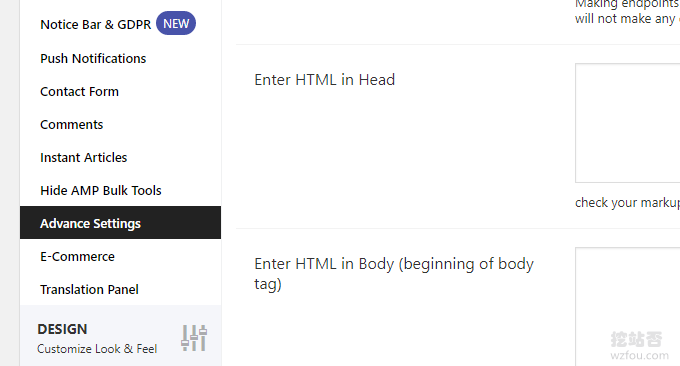](https://wzfou.com/wp-content/uploads/2019/10/amp-wp_08.png)

## 四、AMP for WP高级技巧

### 4.1 AMP中文

AMP for WP提供的AMP主题可以自定义语言，部分语言我们可以自己手动翻译为中文。

[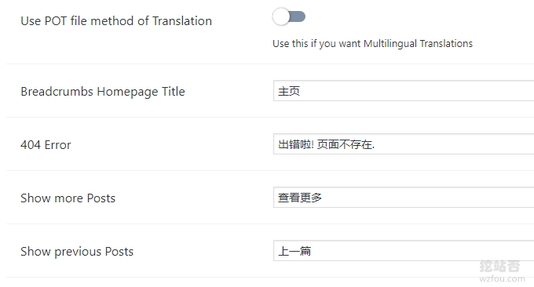](https://wzfou.com/wp-content/uploads/2019/10/amp-wp_11.png)

### 4.2 AMP主题

AMP for WP已经提供了四个免费的AMP主题，页面效果比一般的AMP要好看一些。

[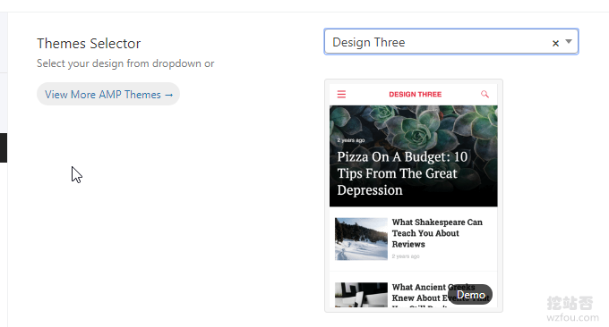](https://wzfou.com/wp-content/uploads/2019/10/amp-wp_12.png)

AMP for WP的免费AMP主题如下：（点击放大）

[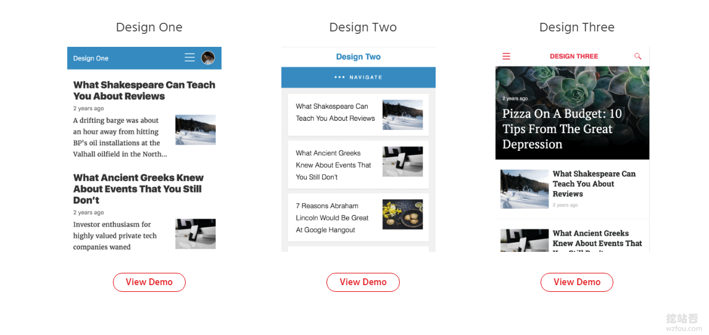](https://wzfou.com/wp-content/uploads/2019/10/amp-wp_13.png)

效果如下图：

[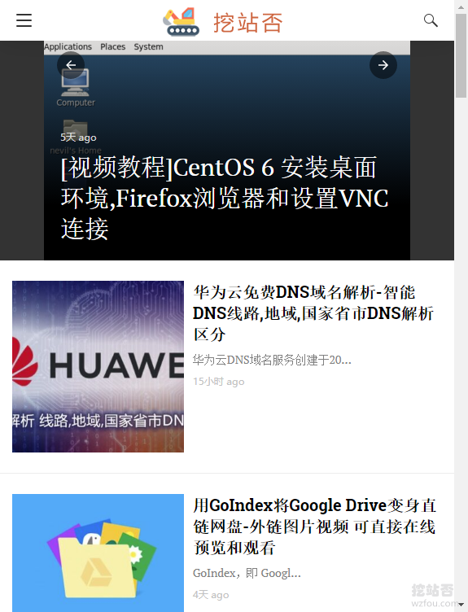](https://wzfou.com/wp-content/uploads/2019/10/amp-wp_14.png)

### 4.3 禁用字体

AMP for WP自带了Google字体，在国内加载会变慢，我们可以在设置中禁用它。

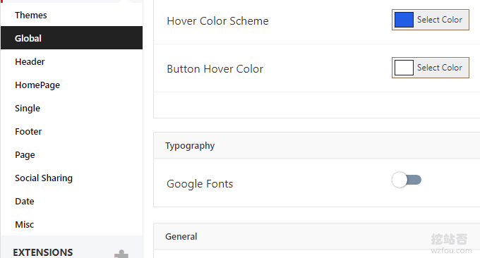

### 4.4 头部链接

AMP for WP可以自动在AMP头部添加no-amp的链接，实际过程中并不怎么适合我们的使用习惯，我们可以禁用它。

[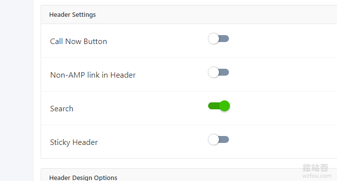](https://wzfou.com/wp-content/uploads/2019/10/amp-wp_16.png)

### 4.5 社会化分享

AMP for WP自带的社会化分享都是国外的，对于国内的用户来说基本上没有什么用，我们可以直接禁用它。

[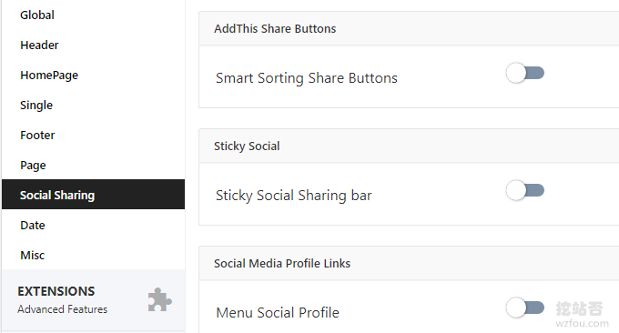](https://wzfou.com/wp-content/uploads/2019/10/amp-wp_17.png)

## 五、AMP for WP使用问题

### 5.1 标签分类404

如果出现标签和分类AMP为404，如下图：

[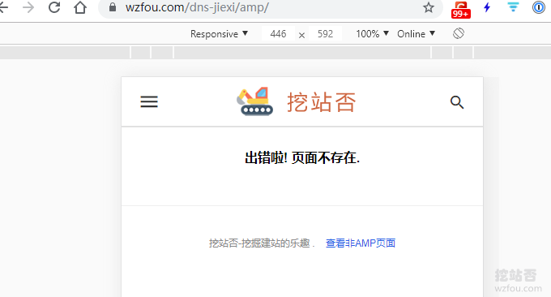](https://wzfou.com/wp-content/uploads/2019/10/amp-wp_18.png)

首先检查一下AMP for WP是否开启了标签和分类AMP。

[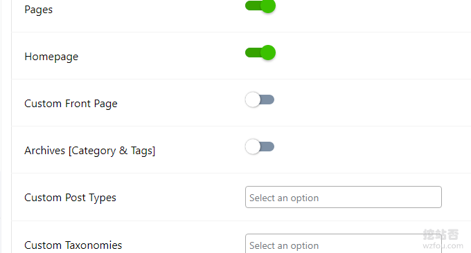](https://wzfou.com/wp-content/uploads/2019/10/amp-wp_19.png)

如果开启了，那么应该是伪静态规则导致无法访问，AMP for WP还提供了url为`?amp`这样的格式，我们直接开启它即可。

[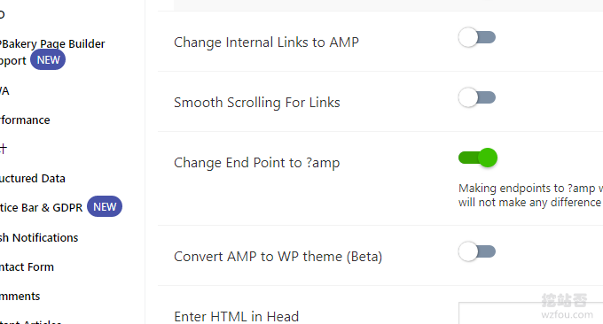](https://wzfou.com/wp-content/uploads/2019/10/amp-wp_20.png)

### 5.2 标题大小不正常

AMP for WP提供了对标题H1-H6的大小设置，个别主题的标题大小显示不正常我们可以通过该功能重新定义。

[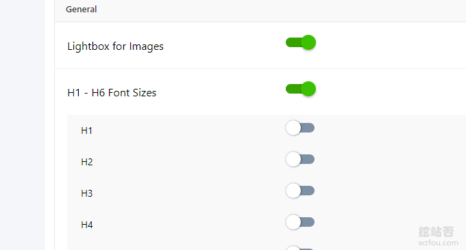](https://wzfou.com/wp-content/uploads/2019/10/amp-wp_23.png)

另外，AMP for WP还提供了对时间格式的修改。

[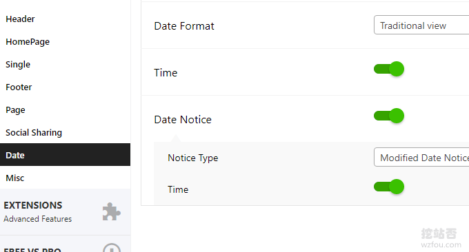](https://wzfou.com/wp-content/uploads/2019/10/amp-wp_24.png)

### 5.3 AMP自定义CSS

AMP for WP提供了自定义CSS的功能，利用它我们可以修改AMP主题，以达到适合自己的网站的目的。

[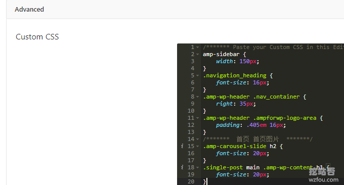](https://wzfou.com/wp-content/uploads/2019/10/amp-wp_25.png)

## 六、WP AMP移动访问优化

### 6.1 自动提交AMP

这里说的自动提交AMP网页，主要是给百度搜索引擎，谷歌搜索引擎会自动索引并展示你的AMP页面，而百度的话目前会收录你的AMP页面，但是不一定会展示你的AMP页面，代码如下：

1. **if**(!**function_exists**('Baidu_amp')){
2. function **Baidu_amp**($post_ID)  {
3. //已成功推送的文章不再推送
4. **if**(**get\_post\_meta**($post_ID,'Baiduamp',true) == 1) return;
5. $url = **get_permalink**($post_ID);
6. **if**(**get\_post\_type**($post_ID)=='page'){
7. $url=$url.'?amp';
8. }
9. **if**(**get\_post\_type**($post_ID)=='post'){
10. $url=$url.'/amp/';
11. }
12. $api = 'http://data.zz.baidu.com/urls?site=网站首页地址&token=密钥&type=amp';
13. //登录百度搜索资源平台 >> 网站支持 >> 数据引入 >\> MIP&AMP >> AMP 下方的数据提交就能看到 AMP 推送接口调用地址
14. $request = new WP_Http;
15. $result = $request->**request**( $api , **array**(  'method' =\> 'POST', 'body' =\> $url , 'headers' =\> 'Content-Type: text/plain')  );
16. $result = **json_decode**($result\['body'\],true);
17. //如果推送成功则在文章新增自定义栏目 Baiduamp，值为 1
18. **if**  (**array\_key\_exists**('success_amp',$result))  {
19. **add\_post\_meta**($post_ID, 'Baiduamp', 1, true);
20. }
21. }
22. **add_action**('publish_post', 'Baidu_amp', 0);
23. }

### 6.2 自动跳转AMP

首先，在AMP for WP插件中开启Mobile Redirection功能。

[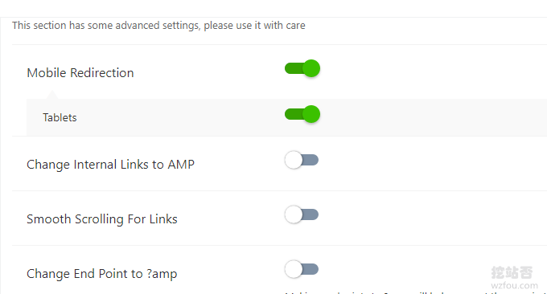](https://wzfou.com/wp-content/uploads/2019/10/amp-wp_09.png)

如果你用的缓存插件，如WP Super Cache、W3 Total Cache等，你需要在缓存插件中开启移动设备模式，更多参考：`https://ampforwp.com/tutorials/article/how-to-redirect-all-mobile-visitors-to-amp/`

### 6.3 Nginx跳转AMP

如果你的Wordpress用了其它的缓存插件，出现了移动设置不自动跳转到AMP页面的情况，可以使用Nginx自动判定访问者是否来自移动设备，如果是的话就跳转到AMP页面。将以下代码加在网站的配置文件中`server{}`里就可以了。

1. set $amp 0;

3. **if**  ( $http\_user\_agent ~ "(MIDP)|(WAP)|(UP.Browser)|(Smartphone)|(Obigo)|(Mobile)|(AU.Browser)|(wxd.Mms)|(WxdB.Browser)|(CLDC)|(UP.Link)|(KM.Browser)|(UCWEB)|(SEMC-Browser)|(Mini)|(Symbian)|(Palm)|(Nokia)|(Panasonic)|(MOT-)|(SonyEricsson)|(NEC-)|(Alcatel)|(Ericsson)|(BENQ)|(BenQ)|(Amoisonic)|(Amoi-)|(Capitel)|(PHILIPS)|(SAMSUNG)|(Lenovo)|(Mitsu)|(Motorola)|(SHARP)|(WAPPER)|(LG-)|(LG/)|(EG900)|(CECT)|(Compal)|(kejian)|(Bird)|(BIRD)|(G900/V1.0)|(Arima)|(CTL)|(TDG)|(Daxian)|(DAXIAN)|(DBTEL)|(Eastcom)|(EASTCOM)|(PANTECH)|(Dopod)|(Haier)|(HAIER)|(KONKA)|(KEJIAN)|(LENOVO)|(Soutec)|(SOUTEC)|(SAGEM)|(SEC-)|(SED-)|(EMOL-)|(INNO55)|(ZTE)|(iPhone)|(Android)|(Windows CE)|(Wget)|(Java)|(curl)|(Opera)"  )
4. {
5. set $amp "${amp}1";
6. }

8. **if**  ( $request_uri !~ "/amp")
9. {
10. set $amp "${amp}1";
11. }

13. **if**  ($amp = "011"){
14. rewrite ^/(.*) https://www.example.com/$1/amp redirect;
15. }

如果你用的不是默认的`/amp/`的URL格式，而是用的是`?amp`，你可以使用以下代码：

1. \# 启用amp自动跳转 开始
2. set $amp 0;

4. **if**  ( $http\_user\_agent ~ "(MIDP)|(WAP)|(UP.Browser)|(Smartphone)|(Obigo)|(Mobile)|(AU.Browser)|(wxd.Mms)|(WxdB.Browser)|(CLDC)|(UP.Link)|(KM.Browser)|(UCWEB)|(SEMC-Browser)|(Mini)|(Symbian)|(Palm)|(Nokia)|(Panasonic)|(MOT-)|(SonyEricsson)|(NEC-)|(Alcatel)|(Ericsson)|(BENQ)|(BenQ)|(Amoisonic)|(Amoi-)|(Capitel)|(PHILIPS)|(SAMSUNG)|(Lenovo)|(Mitsu)|(Motorola)|(SHARP)|(WAPPER)|(LG-)|(LG/)|(EG900)|(CECT)|(Compal)|(kejian)|(Bird)|(BIRD)|(G900/V1.0)|(Arima)|(CTL)|(TDG)|(Daxian)|(DAXIAN)|(DBTEL)|(Eastcom)|(EASTCOM)|(PANTECH)|(Dopod)|(Haier)|(HAIER)|(KONKA)|(KEJIAN)|(LENOVO)|(Soutec)|(SOUTEC)|(SAGEM)|(SEC-)|(SED-)|(EMOL-)|(INNO55)|(ZTE)|(iPhone)|(Android)|(Windows CE)|(Wget)|(Java)|(curl)|(Opera)"  )
5. {
6. set $amp "${amp}1";
7. }

9. **if**  ( $request_uri !~ "\\?amp")
10. {
11. set $amp "${amp}1";
12. }

14. **if**  ($amp = "011"){
15. rewrite ^/(.*) https://wzfou.com/$1\\?amp redirect;
16. }
17. \# 启用amp 结束

## 七、总结

通过对比可以发现[WordPress AMP](https://wzfou.com/tag/wordpress-amp/)官方插件与AMP for WP 还是各有各的优势与不足，AMP插件生成的AMP页面非常标准，在谷歌站长平台里几乎不会有报错，而AMP for WP 插件生成的AMP页面则有个别的小错误。

[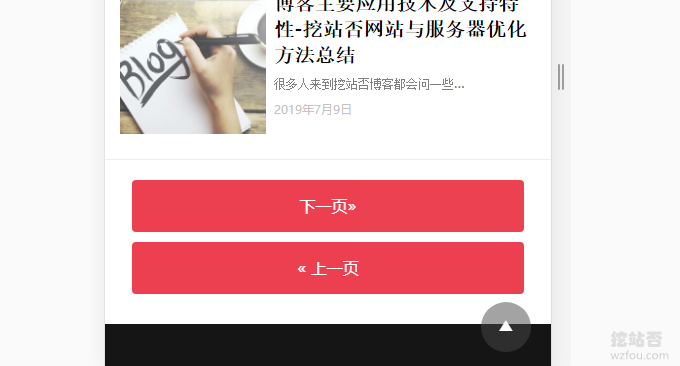](https://wzfou.com/wp-content/uploads/2019/10/amp-wp_21.png)

AMP for WP 可以自定义AMP主题、添加广告、自定义Html代码等，利用移动设备自动跳转的功能，我们可以将手机移动用户访问网站的页面跳转到AMP页面，从而有利于加快网页访问速度，提升用户体验。