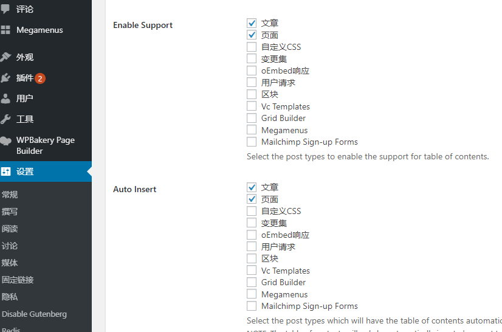
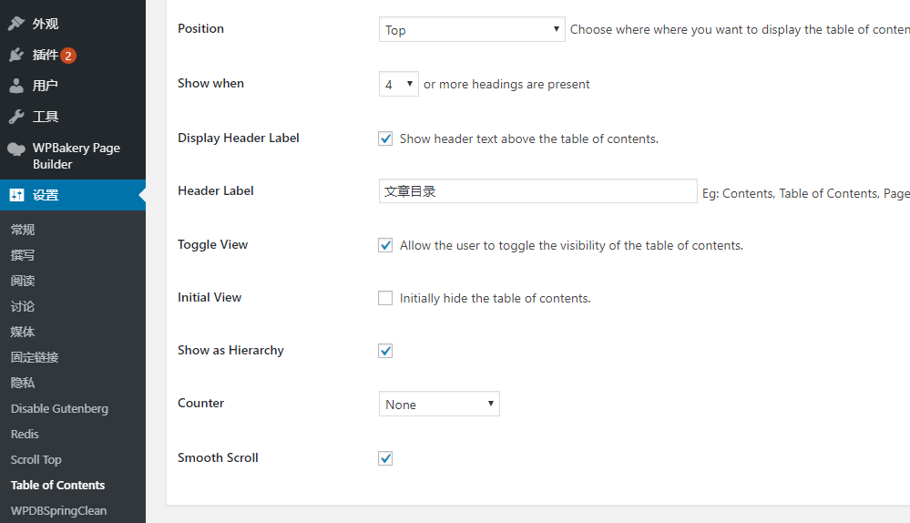
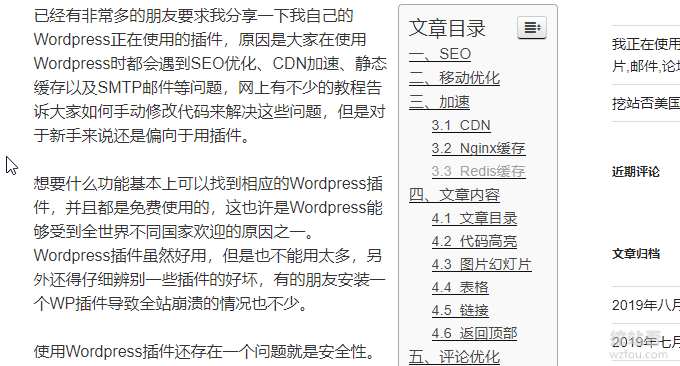
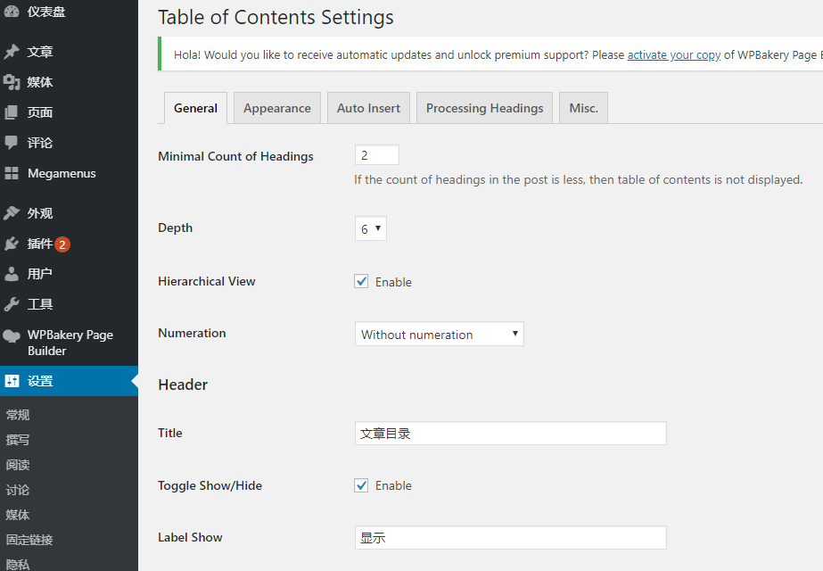
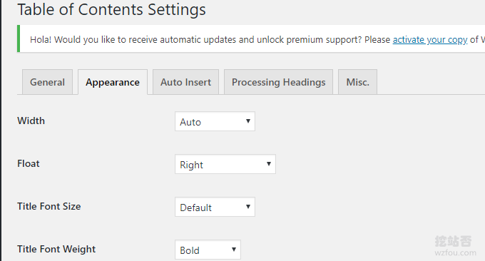
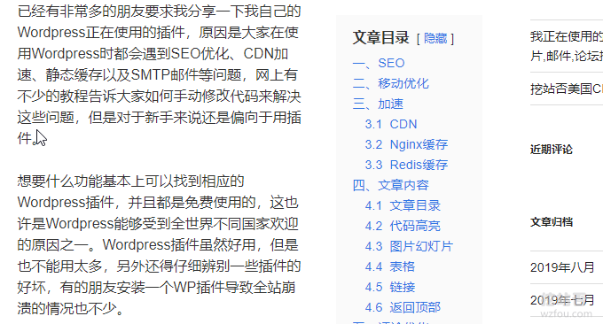
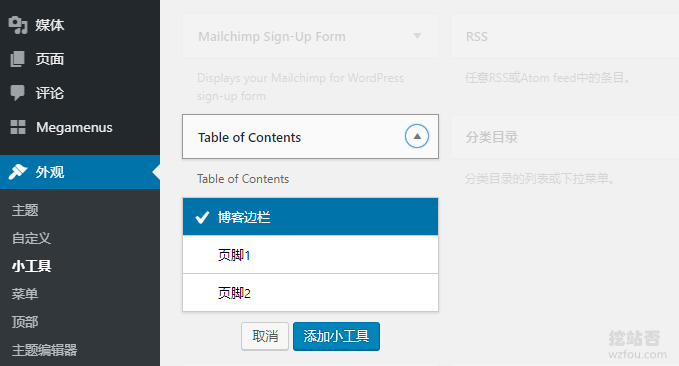
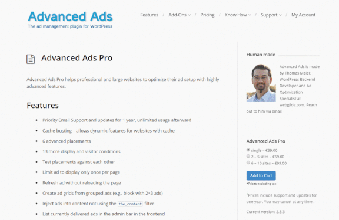
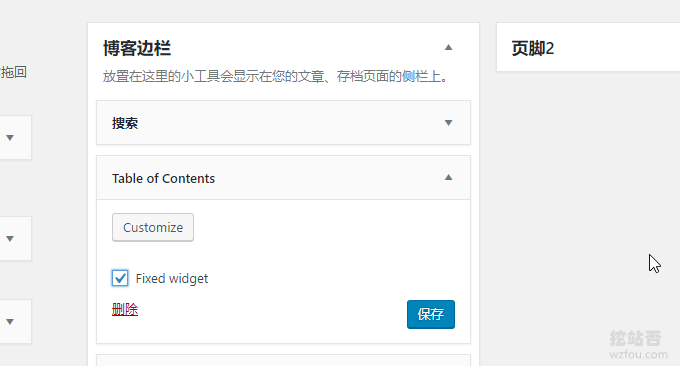

# WordPress文章目录侧边固定滚动-Easy Table 和LuckyWP Table插件
一直以来，我有一个写“长文章”的习惯。最开始的时候像写消息一样来写博客，文章简短，但依然觉得很难写，找不到合适的语句来表达。后来想出一个“懒主意”——给文章添加大量的图片，一来可以增加文章内容，二来图文结合的文章读起来更有乐趣。

但是图文结合的文章一般来说都比较长，有时网页拉到了最下方才能完整地看完一篇文章，非常地不方便。又听说文章目录有利于SEO（PS：事实上经常能够在搜索结果中看到文章目录链接），于是就有了挖站否的文章目录，自动插入，看起来也很顺眼。

为了能够将文章目录最大化的利用，我们还可以将文章目录在侧边栏固定，随着网页下拉而滚动，读者可以随时返回自己关注的内容，用户体验非常地好，常见的一些开发文档就是这样的。本文就来分享一下给Wordpress设定侧边栏固定并滚动的文章目录方法。

更多的关于[WordPress建站](https://wzfou.com/wordpress-jianzhan/)以及[网站建设](https://wzfou.com/jianzhan/)的文章，请查看：

1. [我正在用的WordPress插件-WP SEO,CDN,缓存,图片,邮件,论坛插件](https://wzfou.com/my-wp-pluins/)
2. [网站优化加速-开启TLSV1.3和Brotli压缩-Oneinstack,LNMP,宝塔面板](https://wzfou.com/tlsv1-3-brotli/)
3. [改进网站站内搜索-百度,Google自定义搜索和Elasticsearch自建搜索](https://wzfou.com/baidu-google-es/)

> **PS：2019年11月3日更新，**WordPress服务器如果内存足够大的话，可以将页面缓存到内存达到加速的目的，参考：[利用Cachify插件将WordPress页面缓存到Memcached实现优化加速](https://wzfou.com/cachify-memcached/)。
> 
> **PS：2019年12月2日更新，**WordPress插件用的多的话容易出现各种冲突与问题，检测的方式有： [WordPress错误诊断模式-专治WP页面空白,服务器500错误,插件冲突 ](https://wzfou.com/wordpress-debug/)。

## 一、利用插件自动插入文章目录

如果有代码能力的朋友可以使用代码，本着能用代码就少用插件的原则，有利于加快Wordpress运行速度，这里分享两款自动给Wordpress文章插入目录的插件。

### 1.1 Easy Table of Contents

插件：

1. 网站：https://wordpress.org/plugins/easy-table-of-contents/

Easy Table of Contents插件主要特点：

> 1.自动在Wordpress文章中插入目录，也支持手动在任意位置插入目录。
> 
> 2.包含多项样式，可以选择是显示数字还是显示符号等。
> 
> 3.支持是否显示分层，支持小工具，可设置例外。

激活Easy Table of Contents插件后，你就可以选择是否在某一个页面启用文章目录了。（点击放大）

接着，你就可以设置目录位置、是否分层、是否包括序号、平滑滚动等。（点击放大 ）

[Easy Table of Contents](https://wzfou.com/tag/easy-table/)文章目录效果如下：

### 1.2  LuckyWP Table of Contents

插件：

1. 网站：https://wordpress.org/plugins/luckywp-table-of-contents/

[LuckyWP Table of Contents](https://wzfou.com/tag/luckywp-table/)这款插件和Easy Table of Contents的功能非常类似，两者设置也差不多，同样包括外观、位置、分层、平滑滚动等。（点击放大）

两个插件都支持自定义CSS，你可以根据自己的Wordpress主题来选择。

LuckyWP Table of Contents插件效果如下：

## 二、文章目录侧边固定下拉滚动

### 2.1 添加小工具

打开Wordpress的小工具，添加Easy Table of Contents和LuckyWP Table of Contents小工具。

### 2.2 固定侧边栏

有些Wordpress主题是自带了侧边栏固定和下拉滚动，所以你只需要添加小工具到侧边栏就可以实现该效果了。个别不支持的，可以下载插件：Q2W3 Fixed Widget for WordPress

1. https://wordpress.org/plugins/q2w3-fixed-widget/

[Q2W3 Fixed Widget for WordPress](https://wzfou.com/tag/q2w3-fixed/)固定侧边栏的效果如下图：

启用了Q2W3 Fixed Widget for WordPress后，到你的小工具下面就可以选择中固定位置了。

### 2.3 固定效果演示

按照上面的方法，我们可以看到[WordPress文章目录](https://wzfou.com/tag/wordpress-mulu/)固定在侧边栏了，同时当页面往下拉时会自动滚动提示，wzfou.com测试的效果如下图：

视频播放器

00:00

00:14

## 三、总结

给Wordpress添加文章目录比较适合长文章或者是图文结合的文章，一来方便读者阅读，二来有利于SEO。Easy Table 和LuckyWP Table这两个插件功能都差不多，且都支持自定义CSS，效果也不错。

Q2W3 Fixed Widget for WordPress是一个非常强大的插件，它可以让任意的侧边栏固定并下拉滚动，如果你发现没有效果，检查一下有没有JS冲突，最好用Chrome审查元素检测一遍。