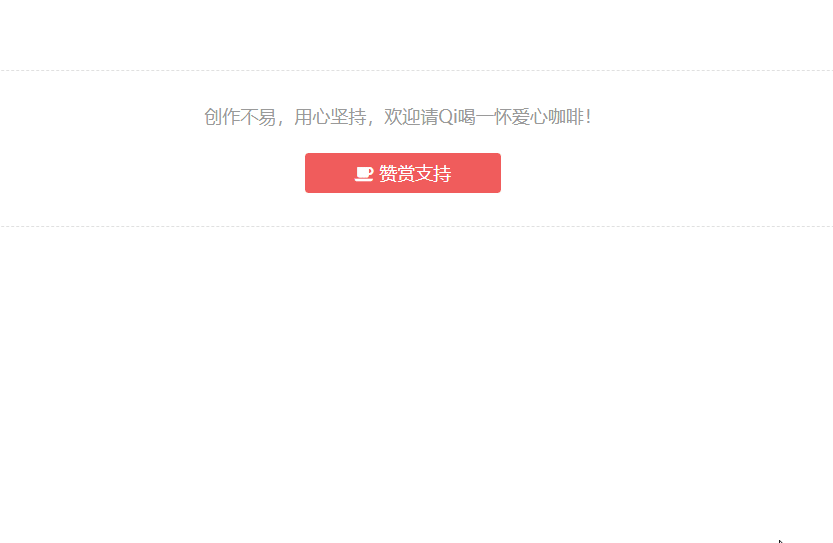
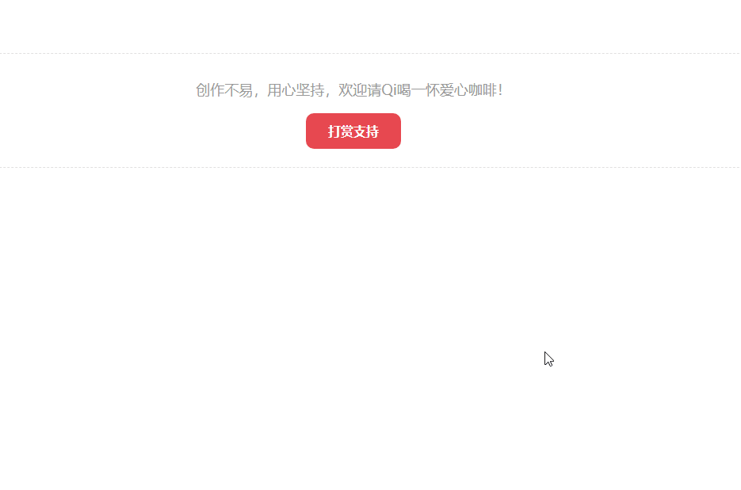
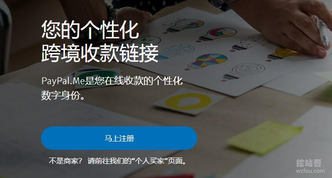
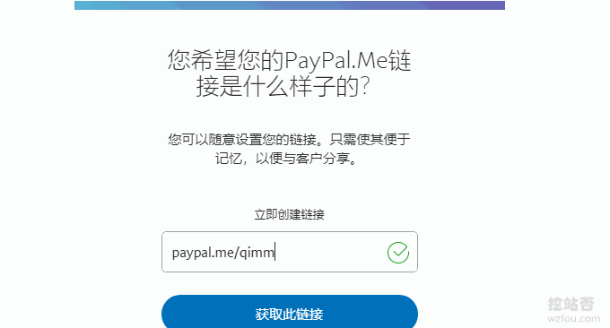
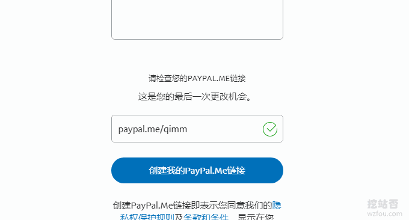

# WordPress添加支付宝,微信打赏按钮制作实例和Paypal.me打赏链接
一直以来就有给网站添加打赏按钮的想法，一来现在写博客没有什么收入了，搞个打赏按钮说不定哪天就被某位“大佬”看上了岂不美哉？二来现在搞自媒体例如微信公众号等，都比较流行添加打赏按钮，知识付费与知识变现正方兴未艾。

最近恰好有朋友在博客留言有问到打赏的事情，于是从网上找了两个比较好的利用JS、Jquery制作的[网站打赏按钮](https://wzfou.com/tag/dashang-anniu/)实例，经过修改后可以直接嵌入到Wordpress任意文章中。有需要的朋友可以直接拿去稍微调整一下就代码可以使用了。

目前给网站添加的打赏按钮比较简单，就是鼠标点击打赏按钮，然后弹出二维码，用户再拿出手机扫描二维码才能转账。这个实现形式比较适合PC网页端，对于手机等移动客户端不怎么友好，想要直接在手机上调用支付宝或者微信还得接入开发平台，实现起来麻烦。

[Paypal.me](https://wzfou.com/tag/paypal-me/)是Paypal推出的快速收款链接，用户直接点击这个链接就可以完成打赏，相当地方便。总得来说给网站添加打赏按钮“聊胜于无”，有兴趣的朋友可以搞一个。更多的Wordpress建站教程，还有：

1. [使用MailPoet Newsletters插件为WordPress搭建RSS邮件订阅支持SMTP](https://wzfou.com/mailpoet/)
2. [用JW Player,ckplayer,Smartideo搭建视频直播站-支持各大视频网站和rtmp](https://wzfou.com/wp-video/)
3. [WordPress评论微信通知和邮件提醒-Server酱和第三方SMTP发信](https://wzfou.com/wp-weixin-mail/)

**PS：2018年10月5日更新，**Paypal提现一直是困扰国内用户的大问题，这里有一个更为快捷的Paypal余额提现方法：[Paypal通过Payoneer提现到国内银行全过程-新Paypal余额提现方法](https://wzfou.com/paypal-payoneer-tixian/)。

## 一、网站打赏按钮-基于prototype.js和lightbox.js

下载地址：

1. https://www.ucblog.net/wzfou/dashang01.zip

这是一个基于prototype.js和lightbox.js的弹出层效果，准备好一个整合支付宝和微信支付收款二维码的照片替换即可。打赏效果如下图（点击放大）：

修改注意事项：

> 1、代码中引用了Font Awesome字体，你需要将Font Awesome字体CSS文件替换为你自己的，或者直接使用图片代替。
> 
> 2、引用了prototype.js和lightbox.js两个JS文件，可能在你移植的过程中与你原来的JS或者JQuery产生冲突。

## 二、网站打赏按钮-基于JQuery

下载地址：

1. https://www.ucblog.net/wzfou/dashang.html.zip

这是JQuery的网站打赏按钮，也是本站正在使用的方法，具体效果如下（点击放大）：

修改注意事项：

> 1、网站打赏按钮代码全部在一个Html中，引用了外部的图片还有JQuery等，你需要替换为你自己的，尤其是收款二维码的图片需要更改为自己的。
> 
> 2、如你在移植的过程中出现错误：“$ is not a function”，可以将`$(this).addClass('checked')`改成`jQuery(this).addClass('checked')`即可。

## 三、添加Paypal.me打赏链接

网站地址：

1. https://paypal.me
2. https://www.paypal.com/c2/paypalme/grab

Paypal.me是Paypal推出的方便个人或者企业收款的在线服务，虽然没有像微信支付、支付宝等提供二维码扫描，但是每个人会得到一个专属收款链接地址，其它人只要打开这个链接就可以转账了。

首先你需要一个Paypal账号，然后进入到Paypal.me快捷收款创建链接的页面。

Paypal.me快捷收款链接只能创建一次，所以在创建之前一定要想清楚，后面就不能更改了。

然后就是设置Paypal.me快捷收款主页的头像、颜色还有简介等等了。具体收款主页效果可以参见wzfou.com的收款链接地址。

## 四、总结

上文也说过了，给网站添加支付宝,微信打赏按钮聊胜于无，大家不要有太多的期待，这个东西感觉主要用来装点“门面”，显得“高大上”一些，特别适合草根站长还有自媒体人使用。

创建[Paypal.me打赏](https://wzfou.com/tag/paypal-me-ds/)链接不好找，打开Paypal.me就会自动跳转到Paypal的介绍页面，然后登录账号后又找不到创建页面，大家可以直接从我本文中找到的创建自定义链接的页面开始创建。