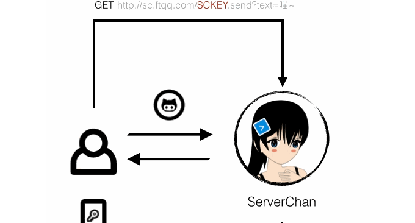
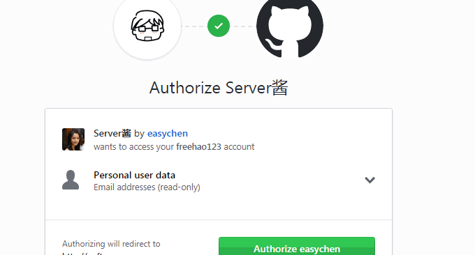
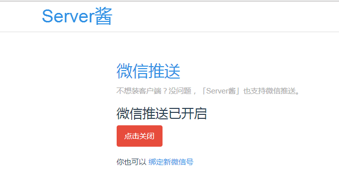
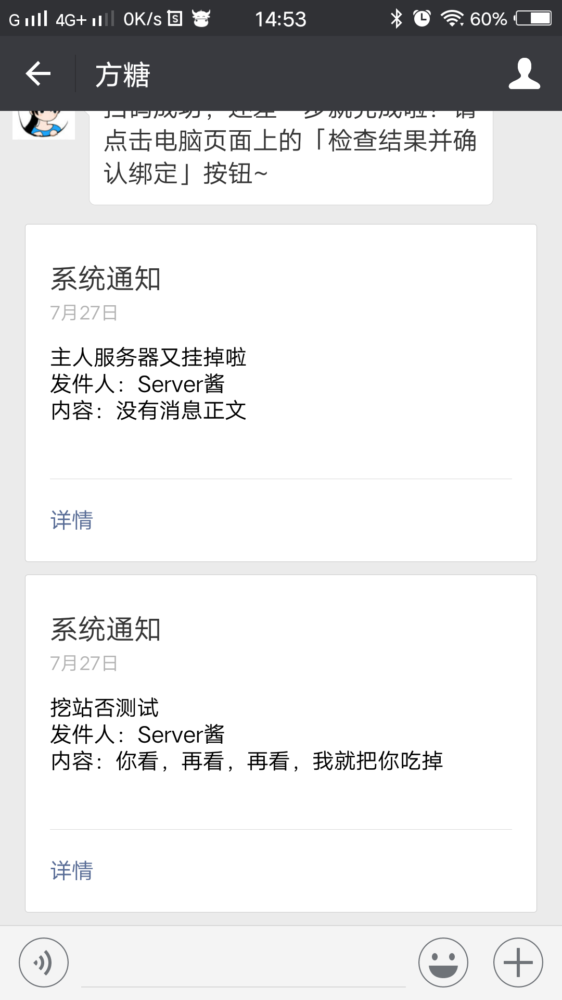
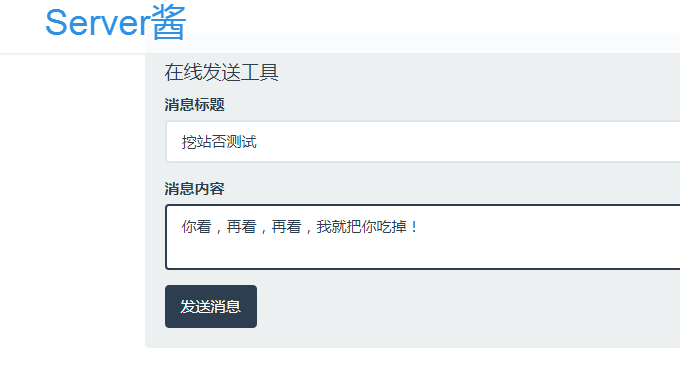
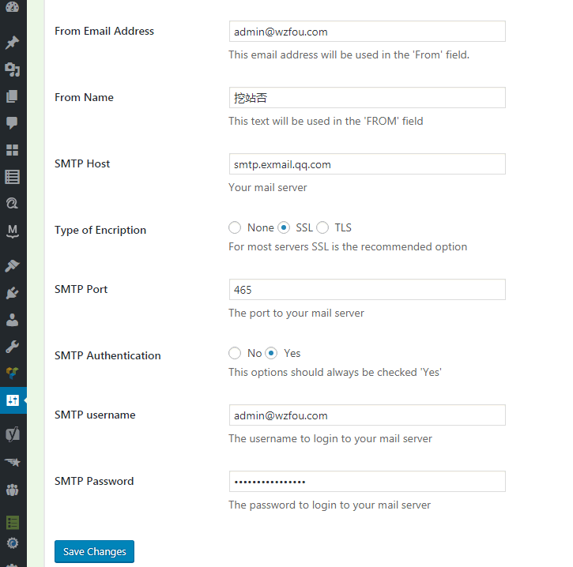

# WordPress评论微信通知和邮件提醒-Server酱和第三方SMTP发信
WordPress评论提醒功能一直是大家在建站过程比较需要的，尤其是对于小博客来说就至关重要了，及时地了解网站的评论可以帮助自己提升博客人气，同时也可以了解自己的内容是否受到欢迎。记得在微信还没有普及的前几年，我们一般都用邮件接收提醒。

不过，现在微信已经逐渐成为了大家喜爱的沟通方式，Wordpress与微信整合也慢慢变成了需求了。就目前来看，利用Wordpress的API架构一个微信小程序应该是首选，它可以完美地将[WordPress](https://wzfou.com/tag/wordpress-jiaocheng/)变成用户手机上的“APP”，微信用户众多，流量价值非常可观。

利用Wordpress开发小程序难度不小，不过今天我们分享一个将Wordpress评论与微信整合的方法，即Wordpress有新的评论时你的微信就可以收到提醒，这个比邮件提醒要快捷方便的多。实际测试后，发现这个功能还是各取所需吧，如果你觉得“鸡肋”，这里再分享几个SMTP发信服务。

[](https://wzfou.com/wp-content/uploads/2017/07/Server-jiang_00.jpg)

更多的关于Wordpress建站的教程，你还可以看看：

1. [用JW Player,ckplayer,Smartideo搭建视频直播站-支持各大视频网站和rtmp](https://wzfou.com/wp-video/)
2. [使用MailPoet Newsletters插件为WordPress搭建RSS邮件订阅支持SMTP](https://wzfou.com/mailpoet/)
3. [利用MailChimp建立RSS邮件订阅平台-每月免费12000封邮件可加2000用户](https://wzfou.com/mailchimp/)

**PS：2018年6月29日更新，**想要给自己的Wordpress添加打赏按钮的可以参考此文：[WordPress添加支付宝,微信打赏按钮制作实例和Paypal.me打赏链接](https://wzfou.com/dashang-anniu/)。

## 一、WP微信通知Server酱

有能力的朋友可以自己整个服务器，然后将Wordpress与微信联系起来，不过，目前最方便的就是使用Server酱，这是一个由牛人开发的从服务器推报警和日志到手机的工具。官网：http://sc.ftqq.com/

Server酱就是Wordpress服务器与微信之间通信的中间人角色，登入获得一个SCKEY，往 http://sc.ftqq.com/SCKEY.send 发GET请求，就可以在微信里收到消息。示意图如下：

[](https://wzfou.com/wp-content/uploads/2017/07/Server-jiang_05.gif)

操作示意：第一步使用Github登录账号：http://sc.ftqq.com/?c=github&a=login

[](https://wzfou.com/wp-content/uploads/2017/07/Server-jiang_01.gif)

第二步：点击「微信推送」，扫码关注同时即可完成绑定。

[](https://wzfou.com/wp-content/uploads/2017/07/Server-jiang_02.gif)

第三步：修改你的Wordpress的function.php，注意替换你的Key，text文本你也可以自己修改。

```
//评论微信推送
function sc_send($comment_id)
{
$text = '博客上有一条新的评论';
$comment = get_comment($comment_id);
$desp = $comment->comment_content;
$key = '你自己的SCKEY';
$postdata = http_build_query(
array(
'text' => $text,
'desp' => $desp
)
);
 
$opts = array('http' =>
array(
'method' => 'POST',
'header' => 'Content-type: application/x-www-form-urlencoded',
'content' => $postdata
)
);
$context = stream_context_create($opts);
return $result = file_get_contents('http://sc.ftqq.com/'.$key.'.send', false, $context);
}
add_action('comment_post', 'sc_send', 19, 2);
```

最后，当你的Wordpress有新的评论时，你的微信就可以收到通知提醒了。

[](https://wzfou.com/wp-content/uploads/2017/07/Server-jiang_04.png)

## 二、Server酱更多应用场景

试用了Server酱，发现这个程序确实有很多的应用场景，想要深入学习和开发Server酱，可以看看作者的文档说明：http://old.ftqq.com/2015/09/serverchan-server-alert-pusher/

Server酱的发送消息页面提供了在线向手机摄像头消息的功能，直接输入标题与内容，点击发送即可。

[](https://wzfou.com/wp-content/uploads/2017/07/Server-jiang_03.gif)

而实际上最简单的消息发送方式是通过浏览器，在地址栏输入以下URL，回车后即可发送（text：消息标题，最长为256，必填。desp：消息内容，最长64Kb，可空，支持MarkDown。）：

```
https://sc.ftqq.com/[SCKEY(替换你的)].send?text=你的内容~
```

在PHP中，可以直接用file\_get\_contents来调用：

```
file_get_contents('https://sc.ftqq.com/[SCKEY(登入后可见)].send?text='.urlencode('主人服务器又挂掉啦~'));
```

也可以把它封装成一个函数：

```
function sc_send(  $text , $desp = '' , $key = '[SCKEY(登入后可见)]'  )
{
	$postdata = http_build_query(
    array(
        'text' => $text,
        'desp' => $desp
    )
);

$opts = array('http' =>
    array(
        'method'  => 'POST',
        'header'  => 'Content-type: application/x-www-form-urlencoded',
        'content' => $postdata
    )
);
$context  = stream_context_create($opts);
return $result = file_get_contents('https://sc.ftqq.com/'.$key.'.send', false, $context);

}
```

## 三、WP邮件提醒SMTP

WordPress发信可以选择使用PHP或者SMTP两种方式，而在实际的使用过程中推荐SMTP，一来免去了PHP发信的服务器配置之苦，二来SMTP发信用的都是第三方系统，邮件的到达率非常高。

以下是[WordPress STMP](https://wzfou.com/tag/wordpress-stmp/)发信插件，大体功能都是差不多的，个别的例如发信模板、接口等可能有所不同，大家可以进入Wordpress插件官网查看详情：

> WP Mail SMTP by WPForms：https://wordpress.org/plugins/wp-mail-smtp/
> 
> WP Mail SMTP Plugin by Mail Bank：https://wordpress.org/plugins/wp-mail-bank/
> 
> Easy WP SMTP：https://wordpress.org/plugins/easy-wp-smtp/
> 
> WP Email SMTP：https://wordpress.org/plugins/wp-email-smtp/
> 
> SMTP Mailer：https://wordpress.org/plugins/smtp-mailer/
> 
> SMTP by BestWebSoft：https://wordpress.org/plugins/wp-mail-smtp-mailer/
> 
> WP Mail Smtp Mailer：https://wordpress.org/plugins/wp-mail-smtp-mailer/

目前挖站否用的是Easy WP SMTP，正如这个插件的名字一样，非常简洁，没有花哨的功能，以下是设置图（点击放大）：

[](https://wzfou.com/wp-content/uploads/2017/07/Server-jiang_06.gif)

关于[SMTP](https://wzfou.com/tag/smtp-mail/)。一般来我们平常用的QQ邮箱、网易邮箱、Gmail等都提供了免费的SMTP发信功能，但是如果你的博客的发信量比较大，使用SMTP频率比较高的话，建议还是使用域名邮箱或者企业邮箱。目前这类也有免费配额。

**国内可供选择有**：

> Sendcloud：http://sendcloud.sohu.com/
> 
> 阿里云邮件：https://www.aliyun.com/product/directmail
> 
> 腾讯企业邮：https://exmail.qq.com/
> 
> Zoho：https://www.zoho.com.cn/mail/
> 
> 网易企业邮：http://ym.163.com/

**国外的免费SMTP大批量发信服务**有：

> Mandrill：https://www.mandrill.com/
> 
> Sendgrid：https://sendgrid.com/
> 
> Mailjet：https://www.mailjet.com/
> 
> Postmarkapp：https://postmarkapp.com/
> 
> MailChimp：https://mailchimp.com/

## 四、总结

WordPress的微信通知提醒功能可以用来代替短信通知提醒，比邮件通知提醒功能更为方便、更为快捷。目前，唯一担心的就是稳定性了，关于“[Server酱](https://wzfou.com/tag/server-jiang/)这个平台稳定么？我可以长期使用么？”作者自己说：“依赖于SAE和LeanCloud的稳定性。因为花不了多少云豆和推送配额，所以应该会一直维护着她。”

WordPress STMP发信设置基本上都是大同小异，我在使用SMTP有几点感触：一是国外的服务器可能连接国内的SMTP服务器花费更多的时间；二是使用SMTP发信会导致Wordpress的评论提交变慢；三是第三方的SMTP会审核发信内容而导致部分邮件发送失败。