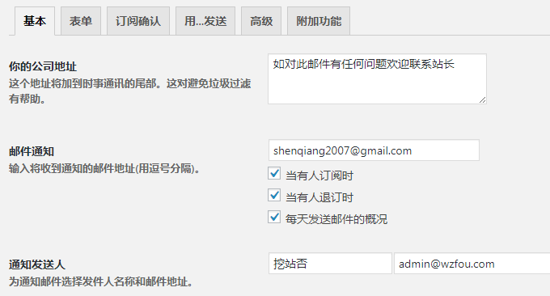
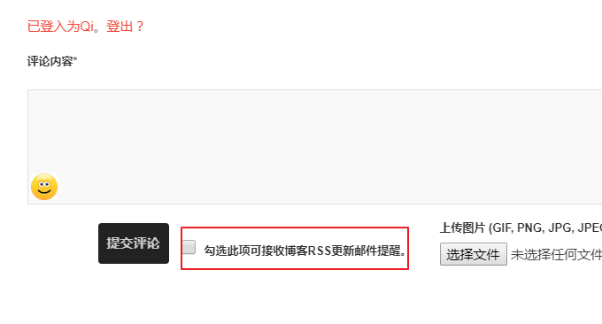

# 使用MailPoet Newsletters插件为WordPress搭建RSS邮件订阅支持SMTP
前几天分享的使用[MailChimp](https://wzfou.com/tag/mailchimp/)来搭建博客RSS更新邮件提醒系统，全部按照MailChimp官网提供的RSS教程构建，但是在执行发送RSS邮件提醒时却收到了MailChimp发来的账号被禁用的通知，按照要求提交了回复到系统但是一直都没有收到账号解封的提示。

看到有朋友提示说可以用用MailPoet Newsletters，这是一款Wordpress的RSS邮件订阅插件，功能上已经集成了表单生成、邮件模板制作等。相对于MailChimp的劣势就是没有那么强大的统计与跟踪系统，同时发送邮件量受本地邮件系统或者SMTP限制。

不过，MailPoet Newsletters好处也很明显，那就是完全是基于Wordpress搭建的RSS邮件订阅系统，用户数据都保存在Wordpress，也可以直接从本地添加用户、删除用户，用户也能选择是否接受邮件订阅服务，完全可以满足Wordpress搭建RSS邮件订阅的需求。

更多的关于[独立服务器](https://wzfou.com/dedicated-servers/)、[网站建设](https://wzfou.com/jianzhan/)还有[邮件邮箱](https://wzfou.com/mail/)服务，你可以看看：

1. [服务器虚拟化面板SolusVM安装与使用-支持新建管理OpenVZ, KVM和Xen VPS](https://wzfou.com/solusvm/)
2. [利用MailChimp建立RSS邮件订阅平台-每月免费12000封邮件可加2000用户](https://wzfou.com/mailchimp/)
3. [再见-那段8年的部落之旅，你好-即将开始未知的坚持：挖站否？](https://wzfou.com/new-beginning/)

**PS：2017年9月3日更新，**WordPress评论回复除可以用邮件通知，也可以整合微信实现微信提醒，方法参考：[WordPress评论微信通知和邮件提醒-Server酱和第三方SMTP发信](https://wzfou.com/wp-weixin-mail/)。

**PS：2019年2月22日更新，**新版的MailPoet 3安装与使用可以参考这个：[WordPress利用MailPoet自建RSS更新邮件通知系统-用户订阅和管理](https://wzfou.com/mailpoet-3/)。

## 一、MailPoet Newsletters安装与配置

首先，打开你的Wordpress，搜索下载安装MailPoet Newsletters插件，启动后在WP后台可以看到MailPoet Newsletters设置选项。

打开MailPoet Newsletters设置，可以设置你的公司地址、当有人订阅退订时邮件通知、是否开启在文章里提交评论的访问人可以选中选择订阅、是否允许在网站注册的用户订阅你选择的订阅组、“退订”链接的文字等等。

MailPoet Newsletters默认的已经有了中文版本的，有个别的地方你可以直接在设置中修改。

在表单可以创建用户提交订阅的申请表格，这里修改的样式都直接在小工具中体现。

在确认订阅中可以开启二次确认，这样可以避免一些垃圾信息。

在第三方邮件发送选项中，你可以填写你的SMTP发信信息，建议不要使用主机自带的PHP函数来发信，一旦RSS订阅量很大的话很容易被判定为垃圾邮件。

## 二、MailPoet 创建RSS更新邮件通知

[MailPoet](https://wzfou.com/tag/mailpoet/) 已经提供了邮件通知模板了，我们只需要复制这个模板，然后添加进去自己的内容就可以了。首先是选择“自动时事通讯”，这是用来设置自动发送邮件的。选择自动发送的时间以及标题和用户组。

接着就是编辑MailPoet的邮件模板了，你可以直接在上面编辑修改文字 、插入图片、下划线等等。

选择MailPoet右边的“最新自动内容”拖过去，就是插入RSS更新内容了。

在RSS更新内容设置中，你可以设置文章类型、显示文章的数量、显示摘要还是全文、标题、图片等等。（点击放大）

设置好了内容后，你就可以点击查看一下预览，有什么问题还可以再次修改。

最后，就是再次确定你的邮件发送时间、发送人、回复人等信息了。

## 三、MailPoet 添加订阅表单工具

先在MailPoet 的表单中编辑表单内容，然后到小工具里找到MailPoet 的小工具，直接拖到侧边栏。

修改自己的CSS样式，使它和主题兼容，效果如下：

## 四、MailPoet邮件订阅操作过程

按照上面的设置完成后，用户就可以输入自己的邮箱，点击申请订阅了。

申请完成后，用户的邮箱会收到MailPoet的确认邮件，要求用户再次点击确认才算真正完成。

当博客有RSS更新时，就会收到MailPoet发给用户的RSS更新邮件提醒了。

如果你在后台开启了在评论处允许用户选择是否接受邮件RSS订阅，你可以在评论提交处看到有一个方框按钮。

同时，如果开放了Wordpress注册，也可以在用户注册时是否选择接受RSS更新提醒服务。

MailPoet 后台也提供了简单的邮件统计，包括已发送、已打开、已退订等等。

## 五、总结

MailPoet Newsletters功能简单实用，可以满足我们建立RSS邮件订阅管理系统的需要。而且，我们还可以自己导入用户邮件地址，轻松实现[WordPress邮件订阅](https://wzfou.com/tag/wordpress-rss-email/)。

MailPoet发信时要注意设置好发信频率，不要太高。同时，建议使用SMTP第三方发信，这样有利于提高邮件的到达率，如果你的发信量大的话就考虑专业的SMTP了。