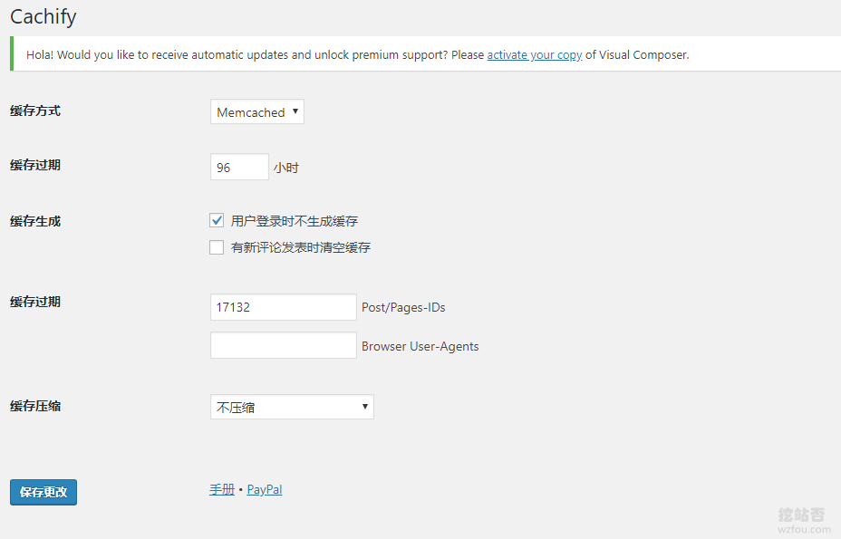

# 利用Cachify插件将WordPress页面缓存到Memcached实现优化加速
将网站搭建国外VPS主机或者服务器上，有一个最不好的地方就是网站的速度。为了加快网站的打开速度，利用了各种一切可以用上的方法，例如将JS、CSS、图片等静态文件放在[七牛云](https://wzfou.com/qiniu-cdn/)、[又拍云](https://wzfou.com/tag/youpaiyun/)、[百度云CDN](https://wzfou.com/tag/baiduyun-cdn/)等，这在一定程度上可以加快网页的打开速度。

解决了静态文件访问加速的问题，重点就是解决服务器访问响应的速度了。首先，从硬件上加快网络访问速度，可以选择[韩国VPS](https://wzfou.com/tag/kr-vps/)、美国[CN2 GIA VPS](https://wzfou.com/tag/cn2-gia-vps/)、[香港VPS](https://wzfou.com/tag/hk-vps/)等国内访问速度快的线路，土豪的话可以尝试[Kdatacenter韩国VPS](https://wzfou.com/kdatacenter/)和[腾讯云韩国VPS主机](https://wzfou.com/tencent-kr-pingce/)。

其次，就是优化VPS主机的响应速度了。同样的机房与线路，采取的服务器优化方式的差异可能会导致网站访问速度的巨大差别。本篇文章就是要分享WordPress缓存加速的方法，利用[Cachify](https://wzfou.com/tag/cachify/)插件将WordPress页面缓存到Memcached，实现内存终极加速。

[](https://wzfou.com/wp-content/uploads/2019/08/cachify_00.jpg)

关于挖站否的博客建站以及服务器优化专题可以见：[挖站否网站与服务器优化方法总结](https://wzfou.com/readme/)，更多的高效的[服务器优化](https://wzfou.com/tag/fuwuqi-youhua/)方法可参考：

1. [WordPress开启Nginx fastcgi_cache缓存加速方法-Nginx配置实例](https://wzfou.com/nginx-fastcgi-cache/)
2. [网站优化加速-开启TLSV1.3和Brotli压缩-Oneinstack,LNMP,宝塔面板](https://wzfou.com/tlsv1-3-brotli/)
3. [VPS主机加速方法 – 一键安装加速模块 从“软件”上提升VPS主机速度](https://wzfou.com/vps-jiasu/)

> **PS：2019年11月13日更新，**WordPress的反垃圾策略可以试试reCAPTCHA：[反垃圾和作弊利器reCAPTCHA验证码服务-WordPress,WHMCS和Chevereto设置](https://wzfou.com/recaptcha/)。
> 
> **PS：2019年11月23日更新，**WordPress还有一个经典的缓存插件，用户量巨大，效果也不错：  [利用W3 Total Cache配置Memcached和Redis缓存 优化加速WP速度 ](https://wzfou.com/w3-total-cache/)。

## 一、服务器配置Memcached

Cachify插件：

1. 下载：https://wordpress.org/plugins/cachify/
2. 开源：https://github.com/pluginkollektiv/cachify/wiki

[Cachify插件](https://wzfou.com/tag/cachify-chajian/)支持把静态内容缓存到 WordPress 数据库，硬盘，APC（PHP 缓存）或者 Memcached 中，缓存到数据库最为简单，但是一般建议缓存到Memcached，利用服务器内存存储和读取速度才是最快的。

[](https://wzfou.com/wp-content/uploads/2019/08/cachify_02.jpg)

如果你的用的是[Oneinstack](https://wzfou.com/oneinstack/)或者[LNMP](https://wzfou.com/tag/lnmp/)一键包，或者是宝塔BT面板，直接使用脚本一键安装和配置Memcached，虚拟主机一般来说不支持Memcached，更多的服务器控制面板参考：[服务器控制面板榜单](https://wzfou.com/vps-mianban/)。

[](https://wzfou.com/wp-content/uploads/2019/08/cachify_01.png)

## 二、Cachify插件安装启用

到Wordpress后台直接搜索Cachify插件即可安装，启用Cachify插件后界面如下图：（点击放大）

[](https://wzfou.com/wp-content/uploads/2019/08/cachify_03.png)

## 三、调用Cachify缓存加速

### 3.1 数据库

如果你在[Cachify插件](https://wzfou.com/tag/cachify-chajian/)中选择了使用数据库Database作为你的页面缓存，无需其它的操作，直接保存后就可以使用了。

[](https://wzfou.com/wp-content/uploads/2019/08/cachify_04.png)

### 3.2 APC缓存

如果你使用APC缓存来调用Cachify，你需要按照下面的要求修改你的.htaccess或者是Nginx配置文件：

```
#.htaccess example (Apache):
<Files index.php>
    php_value auto_prepend_file /absolute path to/plugins/cachify/apc/proxy.php
</Files>
#Example for nginx instances:
location ~ .php {
    include fastcgi_params;
    fastcgi_pass 127.0.0.1:9000;
    fastcgi_param PHP_VALUE auto_prepend_file=/absolute path to/plugins/cachify/apc/proxy.php;
    location ~ /wp-admin/ {
        include fastcgi_params;
        fastcgi_pass 127.0.0.1:9000;
        fastcgi_param PHP_VALUE auto_prepend_file=;
    }
}
```

### 3.3 硬盘缓存

如果你是想让Cachify将缓存页面放在你的硬盘上，你需要按照下面的要求来修改你的.htaccess或者是Nginx配置文件：

```
#A description for only https and sites that are accessible via https and http follows below.
#Extension of the .htaccess (Apache), if the website is only accessible via http: (https://gist.github.com/sergejmueller/2027249#file-htaccess)
#.htaccess extension for websites that can be reached under both http and https: (https://gist.github.com/mcguffin/31f80070d631d56da23cefb4ef1b6649)
# BEGINN CACHIFY
<IfModule mod_rewrite.c>
    # ENGINE ON
    RewriteEngine On
    # GZIP FILE
    <IfModule mod_mime.c>
        RewriteCond %{REQUEST_URI} /$
        RewriteCond %{REQUEST_URI} !^/(wp-admin|wp-content/cache)/.*
        RewriteCond %{REQUEST_METHOD} !=POST
        RewriteCond %{QUERY_STRING} =""
        RewriteCond %{HTTP_COOKIE} !(wp-postpass|wordpress_logged_in|comment_author)_
        RewriteCond %{HTTP:Accept-Encoding} gzip
        RewriteCond %{DOCUMENT_ROOT}/path to/wp-content/cache/cachify/%{HTTP_HOST}%{REQUEST_URI}index.html.gz -f
        RewriteRule ^(.*) /path to/wp-content/cache/cachify/%{HTTP_HOST}%{REQUEST_URI}index.html.gz [L]
        AddType text/html .gz
        AddEncoding gzip .gz
    </IfModule>
    # HTML FILE
    RewriteCond %{REQUEST_URI} /$
    RewriteCond %{REQUEST_URI} !^/(wp-admin|wp-content/cache)/.*
    RewriteCond %{REQUEST_METHOD} !=POST
    RewriteCond %{QUERY_STRING} =""
    RewriteCond %{HTTP_COOKIE} !(wp-postpass|wordpress_logged_in|comment_author)_
    RewriteCond %{DOCUMENT_ROOT}/path to/wp-content/cache/cachify/%{HTTP_HOST}%{REQUEST_URI}index.html -f
    RewriteRule ^(.*) /path to/wp-content/cache/cachify/%{HTTP_HOST}%{REQUEST_URI}index.html [L]
</IfModule>
# END CACHIFY
#Nginx configuration file extension (https://gist.github.com/sergejmueller/1939164#file-gistfile1-nginxconf)
## GZIP
gzip_static on;
 
## CHARSET
charset utf-8;
 
## INDEX LOCATION
location / {
    if ( $query_string ) {
        return 405;
    }
    if ( $request_method = POST ) {
        return 405;
    }
    if ( $request_uri ~ /wp-admin/ ) {
        return 405;
    }
    if ( $http_cookie ~ (wp-postpass|wordpress_logged_in|comment_author)_ ) {
        return 405;
    }
    error_page 405 = @nocache;
    try_files /wp-content/cache/cachify/https-${host}${uri}index.html /wp-content/cache/cachify/${host}${uri}index.html @nocache;
}
 
## NOCACHE LOCATION
location @nocache {
    try_files $uri $uri/ /index.php?$args;
}
 
## PROTECT CACHE
location ~ /wp-content/cache {
    internal;
}
```

### 3.4 Memcached

如果你是想要使用Memcached来缓存你的页面，你需要按照下面的要求修改你的Nginx配置文件：（该模式仅支持Nginx）

```
#Extension of the Nginx configuration file (https://gist.github.com/sergejmueller/6113816#file-gistfile1-txt)
#If you have errors please try to change memcached_pass localhost:11211; to memcached_pass 127.0.0.1:11211; This forces IPv4 because some servers that allow ipv4 and ipv6 are configured to bind memcached to ipv4 only.
## GZIP
gzip_static on;
## CHARSET
charset utf-8;
## INDEX LOCATION
location / {
    error_page 404 405 = @nocache;
 
    if ( $query_string ) {
        return 405;
    }
    if ( $request_method = POST ) {
        return 405;
    }
    if ( $request_uri ~ "/wp-" ) {
        return 405;
    }
    if ( $http_cookie ~ (wp-postpass|wordpress_logged_in|comment_author)_ ) {
        return 405;
    }
    default_type text/html;
    add_header X-Powered-By Cachify;
    set $memcached_key $host$uri;
    memcached_pass localhost:11211;
}
location @nocache {
    try_files $uri $uri/ /index.php?$args;
}
```

该配置规则仅仅是官方给出的示例，你需要根据你自己的Nginx配置情况来适当调整，这里给出wzfou.com正在用的Nginx配置规则，仅供参考（本站采用[Oneinstack](https://wzfou.com/oneinstack/)架构）：

```
#因oneinstack加载了Wordpress重写规则，故直接在wordpress.conf中修改
location / {
 #注释掉原有的重写规则
 #try_files $uri $uri/ /index.php?$args;
  
  #启用Cachify开始
   error_page 404 405 = @nocache;
 
    if ( $query_string ) {
        return 405;
    }
    if ( $request_method = POST ) {
        return 405;
    }
    if ( $request_uri ~ "/wp-" ) {
        return 405;
    }
    if ( $http_cookie ~ (wp-postpass|wordpress_logged_in|comment_author)_ ) {
        return 405;
    }
    default_type text/html;
    add_header X-Powered-By Cachify;
    set $memcached_key $host$uri;
    memcached_pass 127.0.0.1:11211;
   #启用Cachify结束
  
}
#启用Cachify开始
location @nocache {
    try_files $uri $uri/ /index.php?$args;
}
#启用Cachify结束
#以下为原配置规则，继续保留
rewrite /wp-admin$ $scheme://$host$uri/ permanent;
location ~* ^/wp-content/uploads/.*\.php$ {
  deny all;
}
```

我们还可以指定不缓存页面，例如我们可以增加对所有的移动设备用户不启用缓存，这个功能在全站使用了AMP时特别有用，规则如下：

```
#启用Cachify开始
charset utf-8;
#启用Cachify结束
location / {
 #try_files $uri $uri/ /index.php?$args;
 
 #启用Cachify开始
   error_page 404 405 = @nocache;
 
    if ( $query_string ) {
        return 405;
    }
    if ( $request_method = POST ) {
        return 405;
    }
  
  #移动端不缓存
  if ( $http_user_agent ~ "(MIDP)|(WAP)|(UP.Browser)|(Smartphone)|(Obigo)|(Mobile)|(AU.Browser)|(wxd.Mms)|(WxdB.Browser)|(CLDC)|(UP.Link)|(KM.Browser)|(UCWEB)|(SEMC-Browser)|(Mini)|(Symbian)|(Palm)|(Nokia)|(Panasonic)|(MOT-)|(SonyEricsson)|(NEC-)|(Alcatel)|(Ericsson)|(BENQ)|(BenQ)|(Amoisonic)|(Amoi-)|(Capitel)|(PHILIPS)|(SAMSUNG)|(Lenovo)|(Mitsu)|(Motorola)|(SHARP)|(WAPPER)|(LG-)|(LG/)|(EG900)|(CECT)|(Compal)|(kejian)|(Bird)|(BIRD)|(G900/V1.0)|(Arima)|(CTL)|(TDG)|(Daxian)|(DAXIAN)|(DBTEL)|(Eastcom)|(EASTCOM)|(PANTECH)|(Dopod)|(Haier)|(HAIER)|(KONKA)|(KEJIAN)|(LENOVO)|(Soutec)|(SOUTEC)|(SAGEM)|(SEC-)|(SED-)|(EMOL-)|(INNO55)|(ZTE)|(iPhone)|(Android)|(Windows CE)|(Wget)|(Java)|(curl)|(Opera)" )
    {    
       return 405;
    }
  #移动端不缓存
  
    if ( $request_uri ~ "/wp-" ) {
        return 405;
    }
    if ( $http_cookie ~ (wp-postpass|wordpress_logged_in|comment_author)_ ) {
        return 405;
    }
    default_type text/html;
    add_header X-Powered-By Cachify;
    set $memcached_key $host$uri;
    memcached_pass 127.0.0.1:11211;
   #启用Cachify结束
  
   
}
#启用Cachify开始
location @nocache {
    try_files $uri $uri/ /index.php?$args;
}
#启用Cachify结束
rewrite /wp-admin$ $scheme://$host$uri/ permanent;
location ~* ^/wp-content/uploads/.*\.php$ {
  deny all;
}
```

## 四、Memcached缓存管理

### 4.1 更新缓存

Cachify插件允许你在更新一篇文章是清空所有的[Memcached缓存](https://wzfou.com/tag/memcached-huancun/)，还是仅清空某页面的Memcached缓存。

[](https://wzfou.com/wp-content/uploads/2019/08/cachify_05.png)

### 4.2 手动删除

在Wordpress后台右上角可以手动一键删除[Memcached缓存](https://wzfou.com/tag/memcached-huancun/)。

[](https://wzfou.com/wp-content/uploads/2019/08/cachify_06.png)

### 4.3 查看缓存

在Wordpress后台可以直接查看和更新Cachify插件缓存配置。

[](https://wzfou.com/wp-content/uploads/2019/08/cachify_07.png)

## 五、Cachify缓存加速效果

### 5.1 确认缓存生效

打开网页源代码，可以看到：`<!-- Cachify | http://cachify.de Memcached @ 31.08.2019 01:22:51 -->`等字样，表示该页面是由Cachify缓存生成的。


查看`Response Headers`，可以看到：`x-powered-by: Cachify`的字样，表示该页面是由Cachify缓存生成的。

[](https://wzfou.com/wp-content/uploads/2019/08/cachify_11.png)

### 5.2 加速效果明显

以wzfou.com首页作为测试，启用了Cachify Memcached缓存加速后，浏览器的TTFB时间大大缩短，这是未启用Cachify Memcached缓存加速时的TTFB时间，大约需要700ms以上。

[](https://wzfou.com/wp-content/uploads/2019/08/cachify_08.png)

这是启用了[Cachify Memcached](https://wzfou.com/tag/cachify-memcached/)缓存加速时的TTFB时间，大约在190ms，与未启用Cachify Memcached缓存加速相比，时间缩短了一倍以上。

[](https://wzfou.com/wp-content/uploads/2019/08/cachify_09.png)

## 六、总结

为了达到Cachify插件最大化的Wordpress优化加速效果，建议使用Memcached缓存加速方式，它相对于使用数据库或者硬盘，直接在内存中写入和读取缓存，速度快了不少。

使用[Cachify Memcached](https://wzfou.com/tag/cachify-memcached/)缓存加速最大的问题就是配置Nginx规则，你需要根据实际配置情况来调整。另外，Cachify插件支持忽略某个页面的缓存，有一些动态页面就非常有用了。