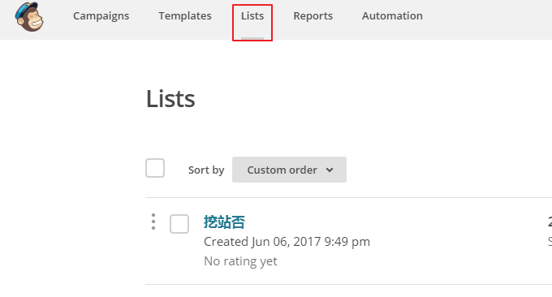
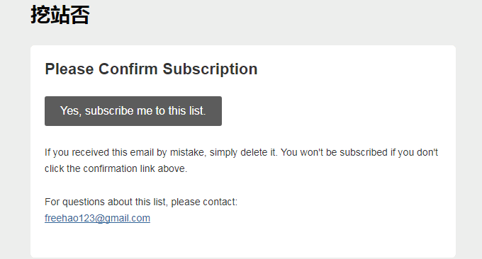

# 利用MailChimp建立RSS邮件订阅平台-每月免费12000封邮件可加2000用户
MailChimp是美国一家专门提供邮件营销服务（email marketing service）的平台，成立于2001年，目前已经成为了企业大批量发送邮件的首选，据称每月有100亿的邮件从MailChimp发出。2016年在forbes cloud 100（福布斯）排名第7位。

[MailChimp](https://wzfou.com/tag/mailchimp/)能够做到如此大的规模，除了与MailChimp的良好服务有一定的关系外，MailChimp还为用户提供免费邮件发送服务，每个月每月可以发送12000封的邮件，每个账户可以添加2000个用户，而且还提供了API，可供开发者开发使用。

MailChimp可以满足大批量的邮件发送服务，同时提供了广告邮件、用户欢迎邮件、通知邮件等各类邮件模板，使用者可以跟踪邮件的发送情况、退订数据以及改进建议，可以说功能很强大。今天就来为大家分享一下MailChimp申请使用方法。

另外，很多人都知道以前腾讯搞了个叫QQ邮箱列表的，这个东西被很多人用在了RSS邮件订阅上了。不过，现在已经停止申请和使用了。MailChimp有一项功能就是RSS邮件订阅，利用它我们可以整合到Wordpress里，方便收集用户订阅和发送RSS更新。

更多的关于网站运营和服务器方面的文章，可以看看：

1. [服务器虚拟化面板SolusVM安装与使用-支持新建管理OpenVZ, KVM和Xen VPS](https://wzfou.com/solusvm/)
2. [再见-那段8年的部落之旅，你好-即将开始未知的坚持：挖站否？](https://wzfou.com/new-beginning/)

> **PS：2017年9月3日更新，**WordPress评论回复除可以用邮件通知，也可以整合微信实现微信提醒，方法参考：[WordPress评论微信通知和邮件提醒-Server酱和第三方SMTP发信](https://wzfou.com/wp-weixin-mail/)。
> 
> **PS：2019年9月1日更新，**不想折腾百度和谷歌自定义搜索的朋友，可以试试这个优秀的第三方站内搜索引擎：[用Algolia给WordPress添加实时站内搜索功能-搜索质量更高内容更准](https://wzfou.com/algolia/)

## 一、MailChimp申请与使用

先到MailChimp官网注册一个MailChimp注册账号。官方首页：https://mailchimp.com/

添加自定义域名并验证。虽然说MailChimp不需要使用自己的域名就可以发送邮件，但是为了保证邮件不被判定为垃圾邮件，建议还是添加自己的域名并通过验证。先在设置里找到域名验证。

然后点击添加域名。

接着输入你的域名邮箱。这一步需要你已经有了域名后缀的邮箱，用来接收MailChimp发来的邮件。

这是我用腾讯企业邮箱做的域名邮箱，收到了来自MailChimp的验证邮件。

输入邮件中的验证码，然后就可以看到MailChimp要求域名做CNAME和TXT记录了。

到域名DNS管理处，添加CNAME和TXT记录，完成验证。

## 二、MailChimp用户列表

先进入到MailChimp ，点击列表，添加一个新的列表。

列表添加完成后接下来就是为该列表设计好表单了，主要是申请表单、邮件通知和确认页面的模板。点击设置中的“General Forms”（点击放大）。

MailChimp的表单分为订阅、退订、修改档案三类，每一项都有详细的详细的表单可以自定义。

主要是包括文字大小、颜色、布局等。

另外，MailChimp的翻译选项，可以提供自动翻译功能。不过根据我的测试，该翻译不是很到位，还不如自己手动修改。

## 三、MailChimp邮件任务

在MailChimp的Campaigns中，可以添加邮件任务了。在这里MailChimp已经提供非常多的邮件任务，你只需要一步一步点击就要可以创建完成，例如用户欢迎邮件、商品促销邮件、信息通知邮件等。

当然，本文要说的RSS邮件订阅通知也在MailChimp的Campaigns，输入RSS就可以出来了。

先给MailChimp邮件任务设定一个名称。

然后是添加RSS地址，还有发送的时间。

选择接收该邮件通知的用户列表。

这一步会设置邮件的标题、发件人、发件地址，还有设置邮件跟踪等信息。

## 四、MailChimp设置邮件内容

MailChimp邮件内容你可以在MailChimp的模板中统一设置，也可以在创建邮件任务时设计一个。就像上面添加RSS邮件订阅任务一样，你可以从模板中挑选一个邮件内容版块，然后按照自己的需求来修改。（点击放大）

如果是设置RSS订阅的话，记得把RSS Header和RSS Items这两个内容拖过去，要不然你的RSS订阅邮件就没有内容了。

设计完成后，在发布之前建议点击页面右上角的预览模式，查看一下你的邮件效果。

这是我利用MailChimp建立RSS订阅平台发送的RSS更新订阅邮件效果。（点击放大）

## 五、Wordpress整合MailChimp

WordPress整合MailChimp只需要一个插件：**MailChimp for WordPress**，大家可以到WP插件官网下载安装。MailChimp for WordPress安装好了后，先到后台添加API，连接成功。

接着你就可以设置表格样式、提示信息还有为订阅用户设置好列表分类。

MailChimp for WordPress有小工具，你可以直接在后台给侧边栏添加小工具，最后显示的效果就是这样的。

用户提交订阅后，就可以收到一封确认邮件了。

## 六、总结

**MailChimp封号。**MailChimp貌似喜欢封号，我才创建的MailChimp RSS订阅还没有发几封邮件，就收到了MailChimp封号处理。而且提交了解封申请也迟迟没有答复，这一点希望引起大家的注意。

**MailChimp垃圾邮件。**经过我自己的测试，MailChimp发送出来的邮件到达率还是挺高的，对于国内的QQ邮箱、网易邮箱，国外的Gmail都是可以收到，但是MailChimp会强制加一个广告链接在邮件最下方，这会导致邮件判定为了垃圾邮件。