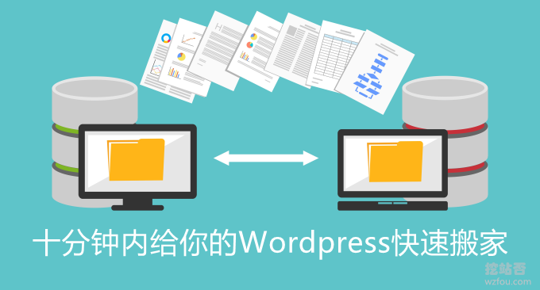
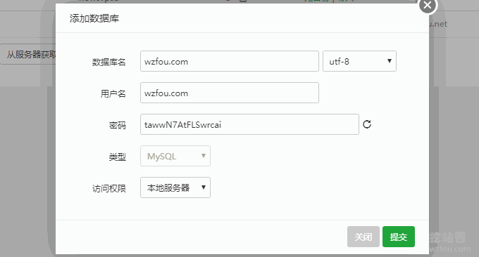
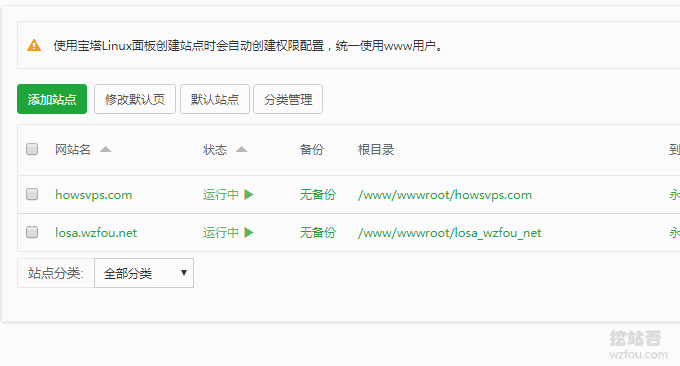
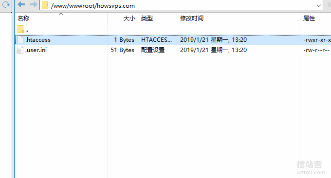
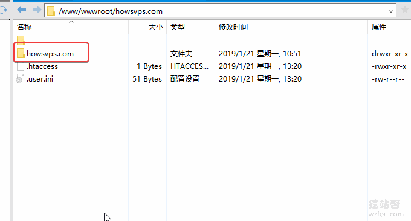
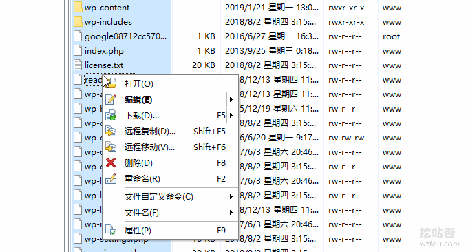
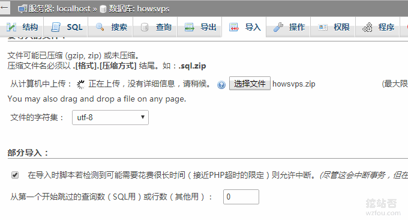
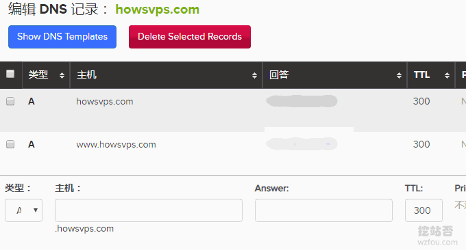

# 十分钟内给你的WordPress快速搬家：一行代码+三个步骤
有朋友在使用VPS的过程中有咨询过如何快速给自己的Wordpress网站搬家的问题。其实，对于网站数据迁移方法有很多。如果你的主机商已经提供了快照迁移和自定义镜像的话，那么很容易将某一个服务器的内容全部克隆到另一个服务器上。

这类的服务典型就是[腾讯云](https://wzfou.com/tag/tencent-yun/)、[阿里云](https://wzfou.com/tag/aliyun-vps/)以及[Linode](https://wzfou.com/linode/)、[DigitalOcean](https://wzfou.com/digitalocean/)等大牌主机商。也有一些主机商没有提供自定义镜像功能，那么就需要我们手动来迁移网站数据了，另外跨主机商迁移的话也得需要手动来完成，不可能做到自动部署网站。

之前有分享过[三个命令工具Rsync,SCP,Tar-快速解决VPS远程网站搬家与数据同步](https://wzfou.com/rsync-scp-tar/)，本篇文章就来分享一下如何使用快速同步备份命令，将你的Wordpress从一个VPS主机搬家到另一个VPS主机。熟练掌握搬家命令后，十分钟内就可以搞定任意网站搬家。

更多的关于网站数据同步与备份的方法这里还有：

1. [SolusVM KVM VPS主机迁移搬家方法-SolusVM KVM备份恢复教程](https://wzfou.com/solusvm-banjia/)
2. [三步揪出服务器流量异常“李鬼”-Linux服务器流量带宽监控与统计命令](https://wzfou.com/fuwuqi-yichang/)
3. [Linode VPS搬家必备:Clone克隆镜像,IP Swap保留原IP和Backup自动备份](https://wzfou.com/linode-clone-swap/)

## 一、一行代码

**Tar远程边压缩边传输边解压命令**：

1. cd /data/wwwroot #进入网站目录
2. tar czf - www.wzfou.com | ssh root@198.xxx.xxx.xxx -p 12345 tar xzf - -C /data/wwwroot/www.wzfou.net

说明：进入A主机下的`wwwroot`目录，然后将`www.wzfou.com`下所有的文件打包压缩，传输到B主机198.xxx.xxx.xxx 的`/data/wwwroot/www.wzfou.net` 目录下。`-p 12345`是因为B主机S-S-H默认的端口不是22，如果你用的默认的可以不用加这一句。

## 二、第一步：搭建新站环境

为保证搬家后网站可以正常运行，建议新站环境采用与原站一样的配置，例如原站使用的是[宝塔BT面板](https://wzfou.com/bt-cn/)，那么建议新站也用宝塔BT面板，安装的PHP、Mysql等最好与原来的一样。

同时创建一样的网站目录路径、同样的数据库账号和密码（数据库版本最好选择一致），这样是为了保证新的Wordpress可以正常运行而不会出任何错误。

## 三、第二步：开始迁移数据

使用**Tar远程边压缩边传输边解压命令**将原站的数据快速迁移到新的站中，以下是新站的目录。

命令操作如下：

1. root@localhost:~\# cd /data/wwwroot #进入目录
2. root@localhost:/data/wwwroot\# ls #显示多少文件
3. default howsvps.com
4. root@localhost:/data/wwwroot\# tar czf - howsvps.com | ssh root@104.xxx.xxx.xxx -p 22 tar xzf - -C /www/wwwroot/howsvps.com #开始打包压缩解压
5. ssh: /usr/local/openssl/lib/libcrypto.so.1.0.0: no version information **available**  (required by ssh)
6. ssh: /usr/local/openssl/lib/libcrypto.so.1.0.0: no version information **available**  (required by ssh)
7. The authenticity of host '104.238.xxx.xxx (104.xxx.xxx.xxx)' can't be established.
8. ECDSA key fingerprint is SHA256:pKCha7ZLLxys5fYnotxSSw6Lb1LTVVdkQub+mertxr0.
9. Are you sure you want to continue **connecting**  (yes/no)? yes #确认
10. Warning: Permanently added '104.xxx.xxx.xxx'  (ECDSA) to the list of known hosts.
11. root@104.xxx.xxx.xxx's password: #输入密码
12. root@localhost:/data/wwwroot\# #完成

使用迁移命令后稍等一会儿就可以看到打包解压过来的网站根目录了，该命令特别适合大型网站搬家。

如果你发现根目录有重复的话，可以用Winscp工具移动数据。

如果你的网站数据库也比较大的话，也可以使用快速迁移命令，如下：

1. cd /data/mariadb

3. tar czf - wzfou | ssh root@104.238.xxx.xxx -p 22 tar xzf - -C /www/server/data/wzfou

对于数据库不大的网站，可以使用PhpMyAdmin导入数据库。

## 四、第三步：修改域名DNS

数据数据迁移完成后，接下来就是修改域名的DNS解析记录了，切换到新的IP即可。

同时，检查一下新站运行是否正常，以及各个插件是否有错误提示。

## 五、总结

使用快速搬家方法的关键之处就是在于你创建新站的环境最好与原来的网站的环境一致，例如选择同一个版本的PHP、Apache或者Nginx、MysqL数据库等，尤其是数据库，如果版本不一致在导致时会出现错误。

对于大型网站搬家，或者动态内容的网站，最好在搬家前做好充分的准备，新站迁移后要观察一段时间再决定是否清除数据。另外，DNS更新也会需要一段时间，一般来说24小时内DNS同步就会完成。