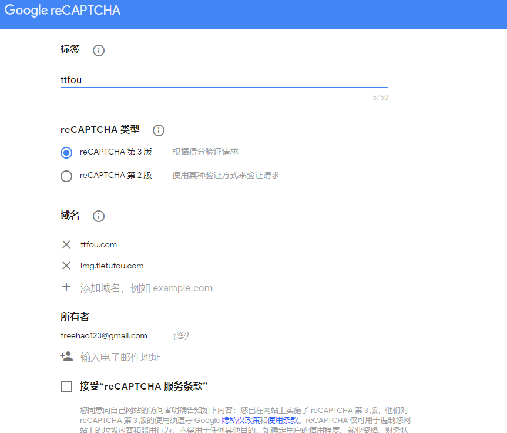
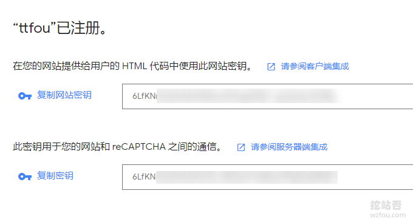
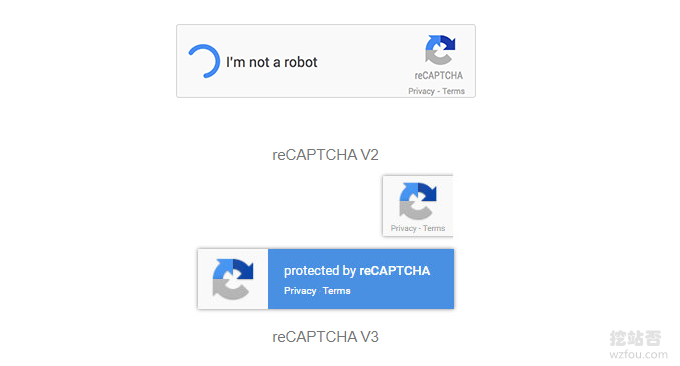
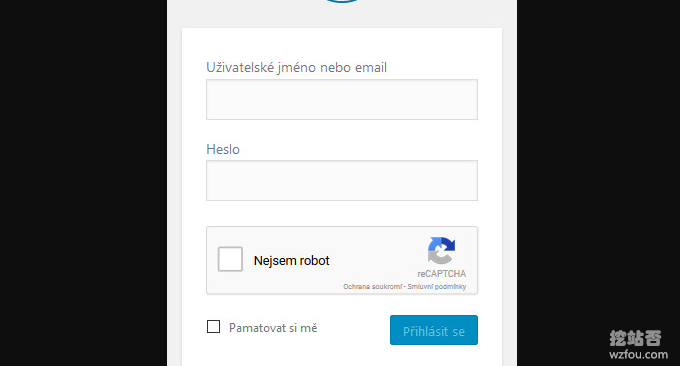
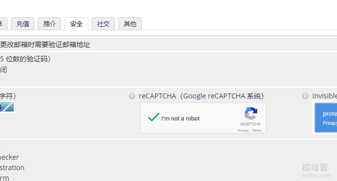
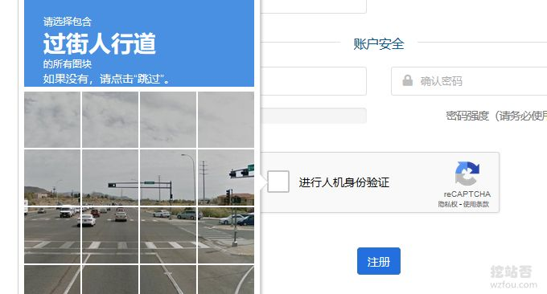
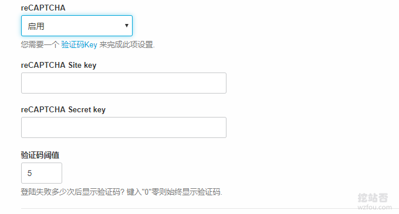
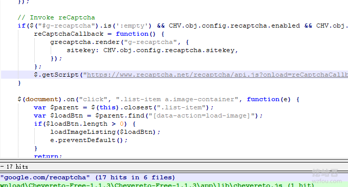
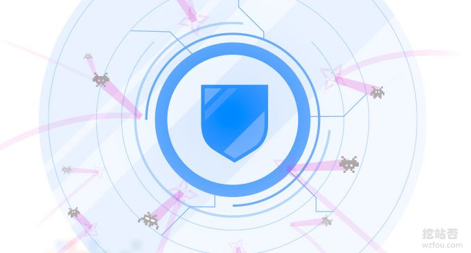

# 反垃圾和作弊利器reCAPTCHA验证码服务-WordPress,WHMCS和Chevereto设置
自从用上了Wordpress和WHMCS后，发现国外的垃圾邮件真的是疯狂，自己留的管理员邮箱一天之内能收到几百封垃圾邮件。由于我在WHMCS和DirectAdmin中设置是SMTP发信，垃圾邮件都被判定为正常邮件而收下了，浪费大量的时间。

无奈之下，启用了号称是Google反垃圾和防作弊利器reCAPTCHA验证码服务，而且经过多年的开发与完善，现在的reCAPTCHA验证码服务不再难以辨认了，尤其是新出来的[reCAPTCHA V3](https://wzfou.com/tag/recaptcha-v3/)版本，可以智能判定是否为机器人，从而免去输入验证码之苦。

[reCAPTCHA](https://wzfou.com/tag/recaptcha/)强大地方还在它与各大建站程序兼容，例如我们常用的[WordPress](https://wzfou.com/wordpress-jianzhan/)、[WHMCS](https://wzfou.com/tag/whmcs/)、[DirectAdmin](https://wzfou.com/tag/directadmin/)以及[Chevereto](https://wzfou.com/tag/chevereto/)程序都自带了reCAPTCHA验证码服务，用户直接在后台填入密码就可以启用了，还免去了自己开发的烦恼。

不过，国内使用[reCAPTCHA](https://wzfou.com/tag/recaptcha/)验证码服务有一个问题就是无法加载reCAPTCHA验证码的JS和网站，这篇文章就来分享一下reCAPTCHA验证码服务在[WordPress](https://wzfou.com/wordpress-jianzhan/)、[WHMCS](https://wzfou.com/tag/whmcs/)、[DirectAdmin](https://wzfou.com/tag/directadmin/)以及[Chevereto](https://wzfou.com/tag/chevereto/)程序设置方法，以及解决在国内使用reCAPTCHA问题。

更多的关于网站建设的方法，请参考：

1. [博客主要应用技术及支持特性-挖站否网站与服务器优化方法总结](https://wzfou.com/readme/)
2. [cPanel和DirectAdmin面板备份和恢复方法-cPanel和DirectAdmin搬家](https://wzfou.com/cpanel-directadmin/)
3. [idc.wiki 微基主机VPS主机性能与速度测评-日本香港及美国波特兰KVM](https://wzfou.com/idcwiki-pingce/)

## 一、reCAPTCHA使用

网站：

1. https://www.google.com/recaptcha/

首先你需要在reCAPTCHA官网中创建好密钥。（点击放大）

创建好了reCAPTCHA会生成公钥与私钥，请保存好。

reCAPTCHA目前有V2和V3两个版本，主要区别就是V3更加智能化，会自动判定是否要求输入验证码，极大地方便了人工而阻止了机器人。

## 二、Wordpress reCAPTCHA

插件：

1. https://cn.wordpress.org/plugins/google-captcha/
2. https://wordpress.org/plugins/simple-google-recaptcha/

目前，Wordpress reCAPTCHA还没有支付V3版本的（2019年7月数据统计），比较好的就是支持reCAPTCHA v2的隐形样式，未来不排除会有[WordPress reCAPTCHA V3](https://wzfou.com/tag/wp-recaptcha-v3/)。

## 三、WHMCS reCAPTCHA

教程：

1. [WHMCS从入门到精通](https://wzfou.com/whmcs-jiaocheng/)

WHMCS已经自带了reCAPTCHA插件了，不过目前仅支持到reCAPTCHA v2的隐形样式，还没有[WHMCS reCAPTCHA](https://wzfou.com/tag/whmcs-recaptcha/) v3。

体验WHMCS reCAPTCHA效果可以到qyfou.com网站。

## 四、Chevereto reCAPTCHA

教程：

1. [Chevereto免费相册程序安装与使用-免费自建图床和公共图片相册](https://wzfou.com/chevereto/)

Chevereto已经自带了reCAPTCHA，直接在后台“第三方服务”中启用即可。

## 五、reCAPTCHA国内无法使用

网站：

1. 官网1：https://www.google.com/recaptcha/api.js
2. 官网2：https://www.google.com/recaptcha/api/siteverify
3. 镜像1：https://www.recaptcha.net/recaptcha/api.js
4. 镜像2：https://www.recaptcha.net/recaptcha/api/siteverify
5. 镜像3：https://recaptcha.google.cn/recaptcha/api.js
6. 镜像4：https://recaptcha.google.cn/recaptcha/api/siteverify

目前，我们可以用reCAPTCHA镜像地址替换reCAPTCHA中的google地址，这样解决了reCAPTCHA在国内无法使用的问题了，reCAPTCHA在国内使用的具体效果可以到qyfou.com体验一番。

## 六、总结

reCAPTCHA安装和使用都挺方便的，国外的各大程序都集成了reCAPTCHA验证码服务，而且reCAPTCHA的反垃圾能力也是相当厉害，机器人想要绕过reCAPTCHA这一关还是挺困难的。

reCAPTCHA在国内无法使用主要是因为api.js和api/siteverify两个网址无法使用，好在已经有了recaptcha.net镜像（查询到IP为谷歌在北京的服务器IP），响应速度快，用起来不错。