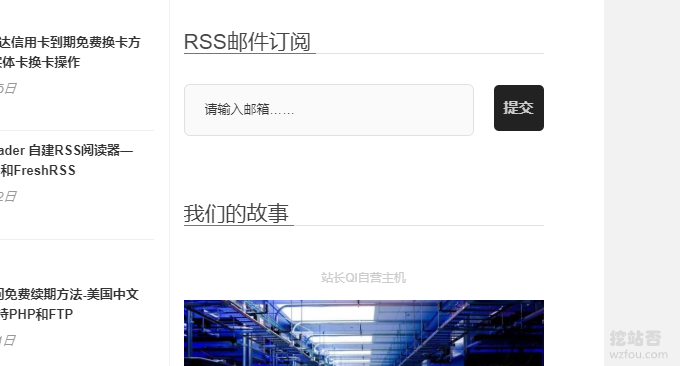

# 我正在用的WordPress插件-WP SEO,CDN,缓存,图片,邮件,论坛插件
已经有非常多的朋友要求我分享一下我自己的Wordpress正在使用的插件，原因是大家在使用Wordpress时都会遇到SEO优化、CDN加速、静态缓存以及SMTP邮件等问题，网上有不少的教程告诉大家如何手动修改代码来解决这些问题，但是对于新手来说还是偏向于用插件。

想要什么功能基本上可以找到相应的Wordpress插件，并且都是免费使用的，这也许是Wordpress能够受到全世界不同国家欢迎的原因之一。Wordpress插件虽然好用，但是也不能用太多，另外还得仔细辨别一些插件的好坏，有的朋友安装一个WP插件导致全站崩溃的情况也不少。

使用Wordpress插件还存在一个问题就是安全性。由于Wordpress插件也是由开发者自己维护的，有些插件有可能长年不再更新，也不再兼容新版的Wordpress，这很容易导致网站安全问题。还有一些插件没有通过WP官方的安全审核，留下后门，严重时会导致黑客入侵。

所以，对于Wordpress插件我们要辩证地看待，能尽量少用就尽量少用，否则尽量选择那些有专门团队维护且经过时间考验的Wordpress插件。这篇文章挖站否wzfou.com就来分享一下自己正在使用的Wordpress插件，内容涉及到SEO,CDN,缓存,图片,邮件,论坛以及WP会员，希望对大家有所帮助。

更多的Wordpress建站教程，还有：

1. [WordPress添加支付宝,微信打赏按钮制作实例和Paypal.me打赏链接](https://wzfou.com/dashang-anniu/)
2. [Linux的php-fpm优化心得-php-fpm进程占用内存大和不释放内存问题](https://wzfou.com/php-fpm/)
3. [使用MailPoet Newsletters插件为WordPress搭建RSS邮件订阅支持SMTP](https://wzfou.com/mailpoet/)

## 一、SEO

关于Wordpress的SEO优化方面，没有怎么深入研究过，都是照着别人“依葫芦画瓢”，以前用过All in One SEO Pack，后来试用了Yoast SEO，感觉两个插件都非常强大。

> 1.**Yoast SEO：**插件可以评估页面的可读性，根据内容长度，alt属性，关键词密度，标题标签，元描述，出站链接和URL等给建议，我用的最多的是Yoast SEO的标题重写还有XML站点地图功能。
> 
> 2.https://wordpress.org/plugins/wordpress-seo/

**不足：**升级太频繁了，好多功能也基本上用不着，感觉插件是偏“大”了，容易引起Wordpress臃肿。

## 二、移动优化

一般来说现在的Wordpress主题都已经自带了移动页面，需要优化的就是Google AMP，好在Wordpress早就有了AMP插件了，直接启用AMP插件就会自动为Wordpress生成AMP页面了。

> 1.Google AMP 会禁止掉原先许多的 JavaScript 脚本，经优化后的 AMP 网页将全部通过 Google CDN。实测中，Google AMP在国内也能正常使用（效果见：https://wzfou.com/new-linode/amp/），且已经被百度认可和索引。
> 
> 2.https://wordpress.org/plugins/amp/

**不足：**启用了AMP后，Wordpress评论等互动功能就会被“砍掉”，同时可能还会出现一些不兼容问题。

## 三、加速

### 3.1  CDN

挖站否的图片比较多，所以将图片放在了[七牛云](https://wzfou.com/qiniu-cdn/)、[又拍云](https://wzfou.com/upyun/)等静态云存储空间。将图片的URL批量替换，有非常多的插件，CDN Enabler功能非常单一，就是启用CDN，适用七牛云、又拍云等镜像存储服务。

> 1.https://wordpress.org/plugins/cdn-enabler/

为了让AMP页面增强SEO，还可以安装一个叫Glue for Yoast SEO & AMP的插件，主要是为了让AMP页面也可以使用**Yoast SEO**的优化。

> 1.https://wordpress.org/plugins/glue-for-yoast-seo-amp/

### 3.2  Nginx缓存

除了将图片、JS、CSS等静态文件进行加速后，同时也启用Nginx fastcgi_cache缓存（方法：[WordPress开启Nginx fastcgi_cache缓存加速方法-Nginx配置实例](https://wzfou.com/nginx-fastcgi-cache/)），Nginx Helper主要是用来清除Nginx fastcgi_cache生成的缓存。

> 1.https://wordpress.org/plugins/nginx-helper/

### 3.3  Redis缓存

Redis缓存主要为了动态加速，有利于减少数据库查询次数，对于Wordpress有一定的加速作用。Redis Object Cache就是这样一个插件，前提是你需要在你的VPS主机上启用Redis。

> 1.https://wordpress.org/plugins/redis-cache/

## 四、文章内容

### 4.1  文章目录

挖站否的文章比较长，所以给每个文章加个目录会感觉阅读起来更好一些，Easy Table of Contents可以自动生成文章目录，效果可以见本文。

> 1.https://cn.wordpress.org/plugins/easy-table-of-contents/

### 4.2  代码高亮

平时写文章时经常要插入一些代码，有了Enlighter – Customizable Syntax Highlighter插件就可以突出代码，看起来也会非常地美观了，支持HTML、JSON、Java、Javascript、MarkDown、PHP等各种语言。

> 1.https://cn.wordpress.org/plugins/enlighter/

### 4.3  图片幻灯片

文章的图片比较多，这时候可以安装WP jQuery Lightbox，点击图片可以放大，同时也支持图片幻灯片放大显示。效果见本站的图片。

> 1.https://wordpress.org/plugins/wp-jquery-lightbox/

### 4.4  表格

挖站否在写专题时比较喜欢用表格，一是方便浏览和查找，二是用户看起来也很舒服。常用的Wordpress表格插件是TablePress。效果见本站。

> 1.https://tablepress.org/

### 4.5  链接

写文章时会插入一些Affiliate URL，不过这些URL容易产生变动，这时使用Pretty Links插件可以方便快捷地管理全站的Affiliate URL。

> 1.https://wordpress.org/plugins/pretty-link/

### 4.6  返回顶部

WPFront Scroll Top是一个让Wordpress生成一个返回顶部的按钮，可选的样式非常多，移动兼容性好。

> 1.https://wordpress.org/plugins/wpfront-scroll-top/

## 五、评论优化

### 5.1  评论插入图片

Embed Images in Comments 可以在评论中插入图片的URL，然后自动显示图片。

> 1.https://wordpress.org/plugins/embed-comment-images/

## 六、邮件

### 6.1  SMTP

主机自带的邮局发信很容易被各大邮件商拒绝，所以我习惯在Wordpress中使用SMTP。插件Post SMTP可以很好地支持Gmail等SMTP，发信统计和兼容性等都做得非常好。

> 1.https://wordpress.org/plugins/post-smtp/

### 6.2  RSS邮件

当文章RSS更新时，用户可以选择使用邮箱来接收提醒，MailPoet 2这样的插件就可以实现此效果。用户只要填写自己的邮箱，确认订阅后就可以定期收到邮件提醒了。

> 1.https://wordpress.org/plugins/wysija-newsletters/
> 
> 2.教程：https://wzfou.com/mailpoet/
> 
> 3.教程：https://wzfou.com/mailpoet-3/

## 七、功能强化

### 7.1  计数

WP-PostViews用来统计文章浏览数，同时插件也提供了非常多的调用接口，即使Wordpress启用了缓存也会正常统计。

> 1.https://wordpress.org/plugins/wp-postviews/

### 7.2  商城

WooCommerce可以让Wordpress变身一个商城系统，用户可以购买商品，专家可以发货、跟踪物流、支付宝付款等。

> 1.https://woocommerce.com/  
>   
> 2.教程：https://wzfou.com/woocommerce/

### 7.3  论坛

AnsPress插件可以让Wordpress摇身一变成为BBS论坛，同时又可以与Wordpress完美兼容。效果见wzfou.com的论坛。

> 1.https://anspress.io/

## 八、总结

WordPress之所以受大家的欢迎，在我的看来有一个重要的原因就是Wordpress的插件非常地丰富，几乎你想要的功能都可以找到对应的Wordpress插件来解决。

当然，Wordpress用了插件过多也会导致问题，例如运行缓慢、不兼容以及各种冲突等等，所以在选择插件时还得根据自己的实际情况来决定。