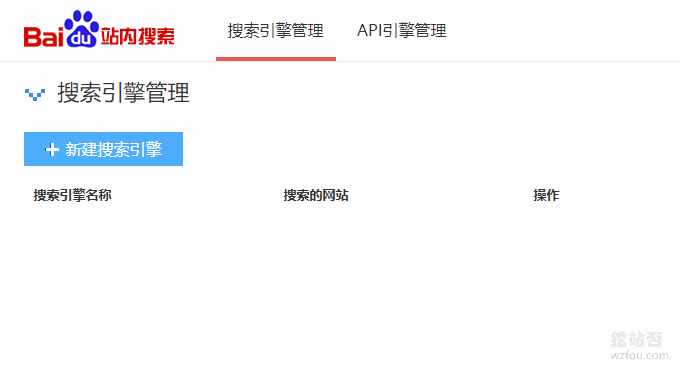
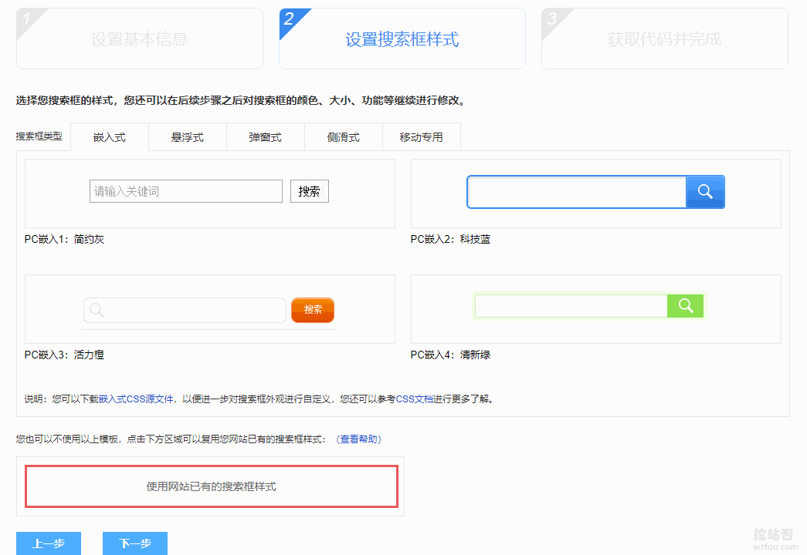
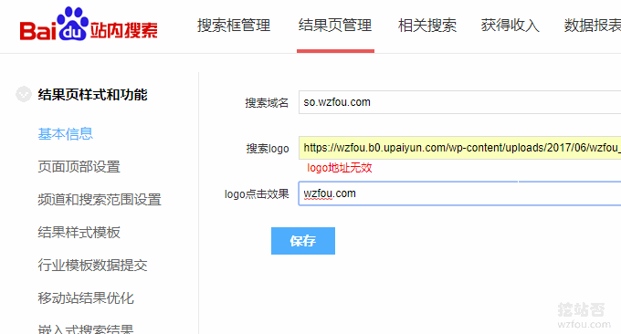
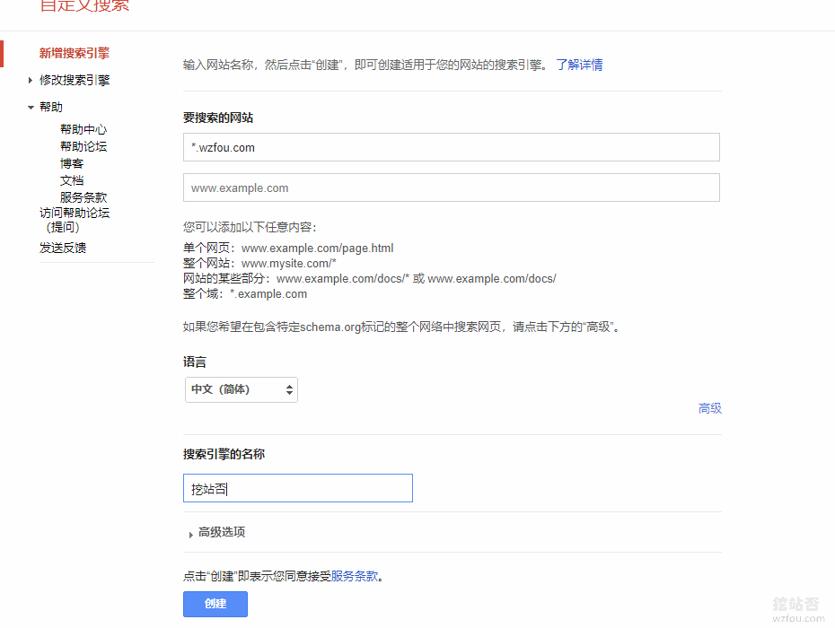
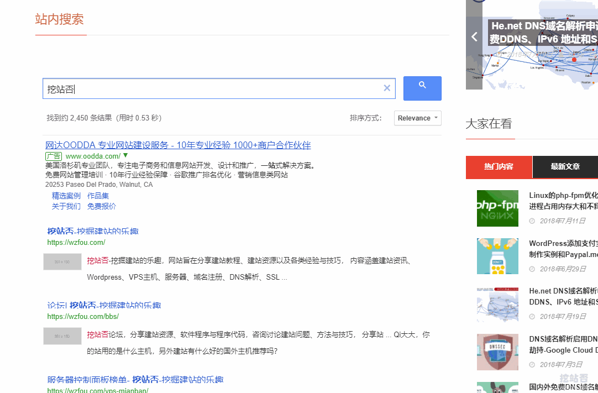
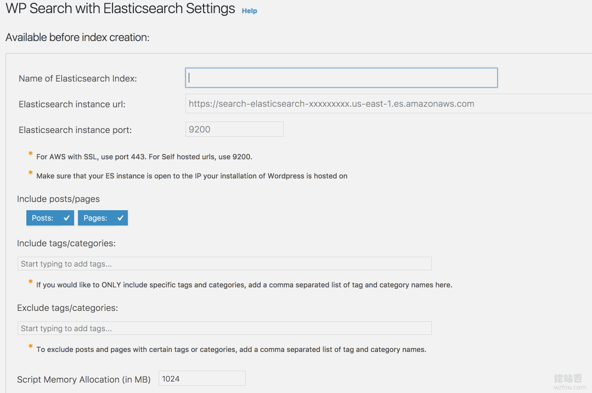
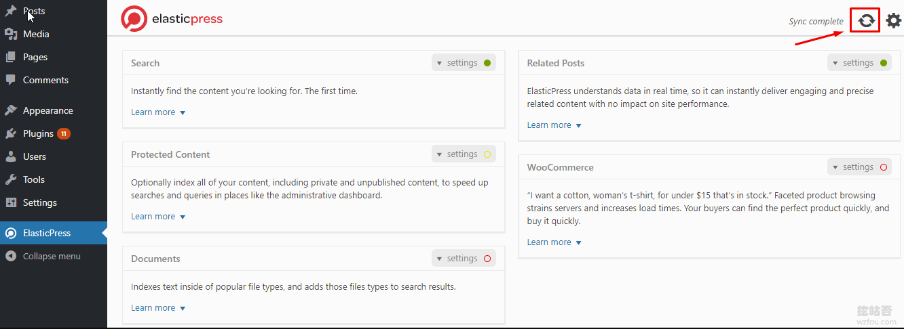

# 改进网站站内搜索-百度,Google自定义搜索和Elasticsearch自建搜索
WordPress自带的搜索虽然说可以搜出一些东西出来，但是有时搜索的结果不一定满意，而且没有联词搜索和模糊搜索，导致有时候必须指定准确的关键字才能搜索出结果来。况且Wordpress自带的搜索对MysqL数据库查询依赖大，数据库大的话比较消耗时间。

替换Wordpress默认的搜索也不是什么难事，懂行的人基本上都知道site:wzfou.com xxx就可以搜索出指定网站的站内内容，而百度、Google都推出了自定义搜索，就是把site:wzfou.com xxx直接嵌入到站内，用户点击搜索后不用跳转到百度\\Google就可以看到结果。

不过百度,Google自定义搜索依赖于搜索引擎的索引，这对于索引少或者是新站来说，有时新的文章搜索不出来，影响了用户体验。于是，Elasticsearch这种开源免费的自建搜索引擎诞生了，这是一个分布式、可扩展、实时的搜索与数据分析引擎，可以处理全文搜索和结构化数据的实时统计。

本篇文章就来分享一下百度,Google自定义搜索和Elasticsearch自建搜索整合Wordpress的方法，更多的关于[WordPress建站](https://wzfou.com/wordpress-jianzhan/)及WP优化的文章还有：

1. [Linux的php-fpm优化心得-php-fpm进程占用内存大和不释放内存问题](https://wzfou.com/php-fpm/)
2. [WordPress添加支付宝,微信打赏按钮制作实例和Paypal.me打赏链接](https://wzfou.com/dashang-anniu/)
3. [五款优秀的RSS阅读器推荐-附国内外各大RSS阅读器收集整理汇总](https://wzfou.com/rss-readers/)

> **PS：2019年9月1日更新，**不想折腾百度和谷歌自定义搜索的朋友，可以试试这个优秀的第三方站内搜索引擎：[用Algolia给WordPress添加实时站内搜索功能-搜索质量更高内容更准](https://wzfou.com/algolia/)。
> 
> **PS：2019年12月2日更新，**想要构建更为强大的更为快速的免费站内搜索，你还可以试试 RediSearch高性能全文搜索引擎：[RediSearch高性能全文搜索引擎-整合WordPress打造高质量搜索](https://wzfou.com/redisearch/)。

## 一、百度站内搜索引擎

网站：

1. https://ziyuan.baidu.com/cse/wiki/introduce

### 1.1  百度站内搜索引擎使用

首先是到[百度站内搜索引擎](https://wzfou.com/tag/baidu-zhannei/)添加想要使用的网站域名。

然后是选择百度站内搜索引擎样式，有嵌入式、悬浮式、侧边式以及与原站的搜索框整合型，请根据你自己的需要来选择。（点击放大）

[百度自定义搜索](https://wzfou.com/tag/baidu-custom/)引擎还有一些高级可供我们优化站内搜索结果，例如可以设置关键词，搜索提示以及内文提词等等。

百度站内搜索引擎还允许你自定义二级域名，同时还可以添加Logo等信息。

### 1.2  百度站内搜索引擎不支持Https

**非常可惜，百度站内搜索引擎至今不支持Https。**虽然说百度搜索宣称Https有利于安全，但是自己的产品也不怎么热心于Https，而且看一下百度站内搜索引擎的官网，基本上有快两年没有更新了，大家要做好百度关闭该产品的准备。

如果是Https站点的话，要么使用Nginx的反代（见：[Nginx反向绑定](https://wzfou.com/nginx-cdn/)），要么就不要使用嵌入式，改用托管式的，即点击搜索按钮后跳转到百度自定义搜索网站。代码改进如下（请将s=xxx换成你自己的）：

<input type="text" name="q" id="bdcsMain" value="搜索全站内容" onfocus="if (value =='搜索全站内容'){value =''}" onblur="if (value ==''){value='搜索全站内容'}" >
<button class="search-submit" id="btnPost" type="submit" onclick="window.open('http://zhannei.baidu.com/cse/search?s=14135322191061470907&entry=1&q='+document.getElementById('bdcsMain').value)">搜索</button>

嵌入效果如下：

  
搜索

## 二、Google自定义搜索

网站：

1. https://cse.google.com/

### 2.1  Google自定义搜索使用

首先登录到[Google自定义搜索](https://wzfou.com/tag/google-custom/)官网页面，然后点击新建一个自定义搜索。

接着就是设置你要索引的网址，命名一个名称等。（点击放大）

创建完成后，你就可以点击获取代码了。

[Google站内搜索](https://wzfou.com/tag/google-zhannei/)同样提供了外观设置、搜索结果优化等功能，你可以根据自己的需要来调整。（点击放大）

Google自定义搜索允许你置顶某一个搜索结果、自动填充、同义词等等。

这是Google自定义搜索搜索效果，嵌入到网页可能还会受到原CSS的影响，需要自己再一步微调。（点击放大）

Google自定义搜索还可以搜索图片，实在很强大。

### 2.2  Google自定义搜索不显示问题

由于众所周知的原因，Google自定义搜索在国内是无法正常显示，那么如何解决此问题呢？一个可行的方法就是用反代（见：[Nginx反向绑定](https://wzfou.com/nginx-cdn/)），或者将Google自定义搜索相关文件本地化。实现难度比较大……

Google自定义搜索其实也是可以托管的，效果如下：

1. https://cse.google.com/cse/publicurl?cx=011545314673148308753:3gbnph6-kfc

## 三、Elasticsearch自建搜索

网站：

1. https://www.elastic.co

### 3.1  安装Elasticsearch

[Elasticsearch](https://wzfou.com/tag/elasticsearch/)安装基本上可以参考官方的教程了，这里直接引用[imququ.com](https://imququ.com/post/elasticsearch.html)的安装方法：

虚拟机和线上环境都是 Ubuntu 14.04.4 LTS，Elasticsearch 用的是最新版。一切开始之前，先要检查机器上是否装有 java 环境，如果没有可以通过以下命令安装：

sudo apt-get install openjdk-7-jre-headless

下载 Elasticsearch 2.3.0 压缩包并解压：

wget -c https://download.elasticsearch.org/elasticsearch/release/org/elasticsearch/distribution/zip/elasticsearch/2.3.0/elasticsearch-2.3.0.zip
unzip elasticsearch-2.3.0.zip

将解压得到的 `elasticsearch-2.3.0` 目录重命名为 `~/es_root`（名称及位置没有限制，可以将它挪到你认为合适的任何位置）。Elasticsearch 无需安装，直接可以运行（注意：不能用 root 帐号运行）：

BASHcd ~/es_root/bin/
chmod a+x elasticsearch
./elasticsearch

如果屏幕上没有打印错误信息，说明 Elasticsearch 服务已经成功启动。新建一个终端，用 curl 验证下：

BASHcurl -XGET http://127.0.0.1:9200/?pretty

{
  "name" : "Melissa Gold",
  "cluster_name" : "elasticsearch",
  "version" : {
    "number" : "2.3.0",
    "build_hash" : "8371be8d5fe5df7fb9c0516c474d77b9feddd888",
    "build_timestamp" : "2016-03-29T07:54:48Z",
    "build_snapshot" : false,
    "lucene_version" : "5.5.0"
  },
  "tagline" : "You Know, for Search"
}

如果看到以上信息，说明一切正常，否则请根据屏幕上的错误信息查找原因。尽管 Elasticsearch 本身是用 java 写的，但它对外可以通过 RESTful 接口交互，十分方便。

默认情况下 Elasticsearch 的 RESTful 服务只有本机才能访问，也就是说无法从主机访问虚拟机中的服务。为了方便调试，可以修改 `~/es_root/config/elasticsearch.yml` 文件，加入以下两行：

network.bind_host: "0.0.0.0"
network.publish\_host: \_non\_loopback:ipv4\_

**但线上环境千万不要这样配置**，否则任何人都可以通过这个接口修改你的数据。

### 3.2  安装 IK Analysis

[Elasticsearch搜索](https://wzfou.com/tag/elasticsearch-sou/)自带的分词器会粗暴地把每个汉字直接分开，没有根据词库来分词。为了处理中文搜索，还需要安装中文分词插件。我使用的是 [elasticsearch-analysis-ik](https://github.com/medcl/elasticsearch-analysis-ik/)，支持自定义词库。

首先，下载与 Elasticsearch 匹配的 elasticsearch-analysis-ik 插件：

wget -c https://github.com/medcl/elasticsearch-analysis-ik/archive/v1.9.0.zip
unzip v1.9.0.zip

解压后，进入插件源码目录编译：

BASHsudo apt-get install maven
cd elasticsearch-analysis-ik-1.9.0
mvn package

如果一切顺利，在 `target/releases/` 目录下可以找到编好的文件。将其解压并拷到 `~/es_root` 对应目录：

mkdir -p ~/es_root/plugins/ik/
unzip target/releases/elasticsearch-analysis-ik-1.9.0.zip -d ~/es_root/plugins/ik/

elasticsearch-analysis-ik 的配置文件在 `~/es_root/plugins/ik/config/ik/` 目录，很多都是词表，直接用文本编辑器打开就可以修改，改完记得保存为 utf-8 格式。

现在再启动 Elasticsearch 服务，如果看到类似下面这样的信息，说明 IK Analysis 插件已经装好了：

plugins \[analysis-ik\]

### 3.3  配置同义词

Elasticsearch 自带一个名为 synonym 的同义词 filter。为了能让 IK 和 synonym 同时工作，我们需要定义新的 analyzer，用 IK 做 tokenizer，synonym 做 filter。听上去很复杂，实际上要做的只是加一段配置。

打开 `~/es_root/config/elasticsearch.yml` 文件，加入以下配置：

YAMLindex:
  analysis:
    analyzer:
      ik_syno:
          type: custom
          tokenizer: ik\_max\_word
          filter: \[my\_synonym\_filter\]
      ik\_syno\_smart:
          type: custom
          tokenizer: ik_smart
          filter: \[my\_synonym\_filter\]
    filter:
      my\_synonym\_filter:
          type: synonym
          synonyms_path: analysis/synonym.txt

以上配置定义了 ik\_syno 和 ik\_syno\_smart 这两个新的 analyzer，分别对应 IK 的 ik\_max\_word 和 ik\_smart 两种分词策略。根据 IK 的文档，二者区别如下：

- ik\_max\_word：会将文本做最细粒度的拆分，会穷尽各种可能的组合；
- ik_smart：会将文本做最粗粒度的拆分；

ik\_syno 和 ik\_syno_smart 都会使用 synonym filter 实现同义词转换。为了方便后续测试，建议创建 `~/es_root/config/analysis/synonym.txt` 文件，输入一些同义词并存为 utf-8 格式。例如：

ua,user-agent,userAgent
js,javascript
谷歌=>google

### 3.4  Elasticsearch整合Wordpress

WordPress插件：

> 1、ElasticPress：https://wordpress.org/plugins/elasticpress/
> 
> 2、WP Search with Elasticsearch：https://wordpress.org/plugins/db-search-with-elasticsearch/

这两款[Elasticsearch WordPress](https://wzfou.com/tag/elasticsearch-wordpress/) 插件，都是可以帮助我们将Elasticsearch搜索整合到Wordpress，首先是激活插件，然后到插件设置页面填写Elasticsearch服务器相关的信息。（点击放大）

然后就可以将Wordpress的文章以及页面同步到Elasticsearch服务器并开始索引了。

## 四、总结

百度站内搜索引擎适合用在没有使用Https以及百度索引量大的网站，对于新站以及用上了Https的网站使用百度站内搜索引擎非常不利，而Google自定义搜索适合国外的朋友使用，国内的朋友不要折腾了。

Elasticsearch自建搜索是一个非常不错的工具，功能强大，用于Wordpress的全文搜索真的是“牛刀小试”了，Elasticsearch可以对文档进行索引、搜索、排序、过滤，它能够执行复杂的全文搜索。