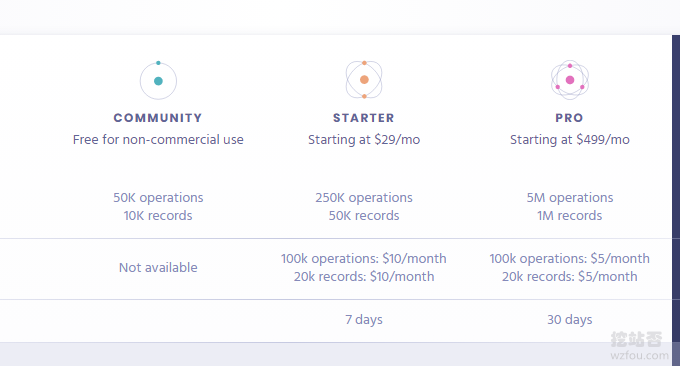
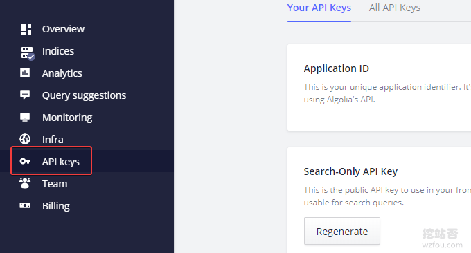
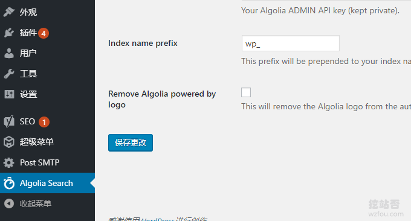
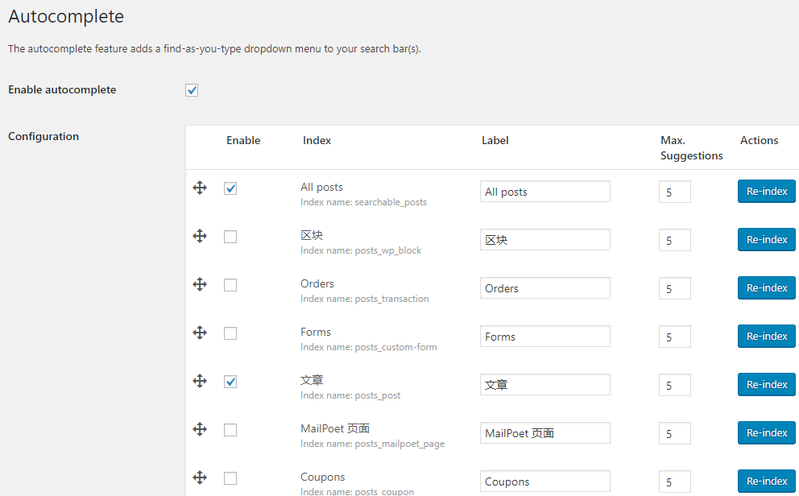
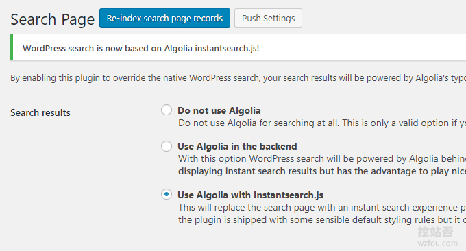
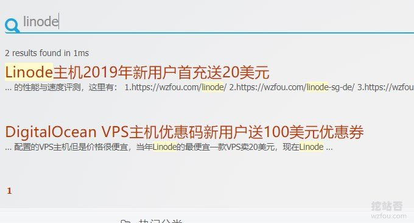
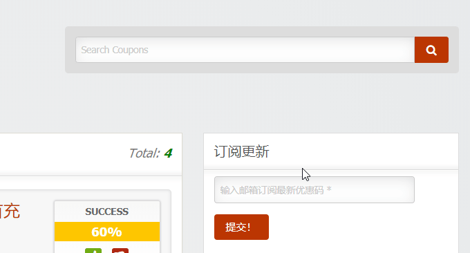
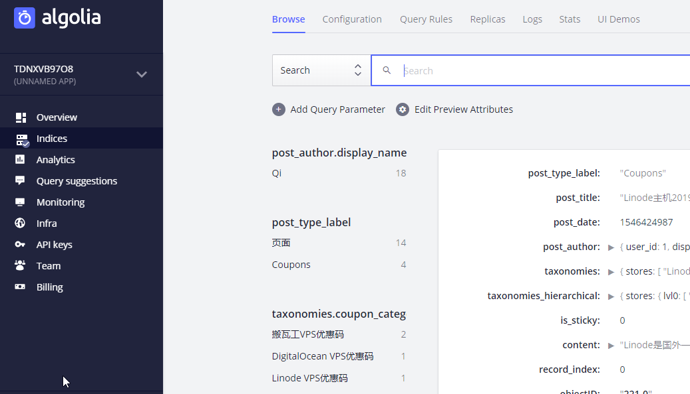

# 用Algolia给WordPress添加实时站内搜索功能-搜索质量更高内容更准
WordPress自带的“软弱”搜索功能一直是我比较介意的，搜索出来的结果相关性不是很高，结果的精准度不够，而且Wordpress自带的搜索不能搜索标签、分类以及其他版块的内容，只能按照时间的先后顺序来列出搜索结果，有的时候找东西真的很麻烦。

通常为了增强Wordpress自带的搜索功能，我们会用到百度和谷歌的自定义搜索，之前我在[百度,Google自定义搜索和Elasticsearch自建搜索](https://wzfou.com/baidu-google-es/)一文有过详细的介绍，有兴趣的朋友可以阅读一下。但是使用百度和谷歌自定义搜索有两个致命的问题：

一是百度站内搜索不支持Https，虽然说网上有不少采用nginx反代（有兴趣的朋友可以看这篇：[Nginx反向绑定,缓存加速,自动更新缓存和获取真实IP](https://wzfou.com/nginx-cdn/)）的方式来解决Https调用的问题，但是折腾过程太复杂，而且也存在图片无法打开和额外增加费用的问题。

第二个是Google自定义搜索在国内无法使用，这一项基本上是“废掉”谷歌站内搜索了。两个大型的搜索引擎不能使用了，我们找到了小众的搜索引擎：[Algolia](https://wzfou.com/tag/algolia/)。Algolia由来自法国巴黎的萨科·德赛妮和朱利安·勒莫瓦纳于2012年创办，初期时的主要业务是在手机上进行离线搜索。

现在Algolia已在15个地区设立了47个数据中心。它为1600多个客户提供服务，每月要处理120亿个用户的查询请求，客户主要来自电子商务等领域。对于国内，常见于Hexo静态博客采用了Algolia站内搜索，而[WordPress整合Algolia](https://wzfou.com/tag/wordpress-zh-algolia/)站内搜索更是相当简单。

更多的关于[WordPress优化](https://wzfou.com/tag/wordpress-jiasu/)的文章，这里还有：

1. [DirectAdmin空间启用OpCache和redis缓存加速-WP启用redis缓存](https://wzfou.com/directadmin-cache/)
2. [我正在用的WordPress插件-WP SEO,CDN,缓存,图片,邮件,论坛插件](https://wzfou.com/my-wp-pluins/)
3. [WordPress利用MailPoet自建RSS更新邮件通知系统-用户订阅和管理](https://wzfou.com/mailpoet-3/)

> **PS：2019年9月15日更新**，如果你的Wordpress的文章比较长，这时候加一个目录导航是非常有必要的：[WordPress文章目录侧边固定滚动-Easy Table 和LuckyWP Table插件](https://wzfou.com/wp-toc/)。
> 
> **PS：2019年12月2日更新，**想要构建更为强大的更为快速的免费站内搜索，你还可以试试 RediSearch高性能全文搜索引擎：[RediSearch高性能全文搜索引擎-整合WordPress打造高质量搜索](https://wzfou.com/redisearch/)。

## 一、Algolia注册使用

网站：

1. 官网：https://www.algolia.com/

要使用Algolia站内搜索引擎，我们先需要注册一个账号。

Algolia提供了免费版本，包含5万个查询和1万个记录，基本上只能够一个小博客使用，大型的网站还是用他们的付费版本好一些。

到Algolia的账户管理界面，可以可以找到API，记下他们。

## 二、WP整合Algolia

### 2.1 安装插件

1. https://wordpress.org/plugins/wp-search-with-algolia/

WordPress整合Algolia搜索引擎的插件比较多，这里wzfou.com用的是这个插件：WP Search with Algolia。启用插件后，点击左侧导航栏Algolia，可以对Algolia进行相关的设置。

### 2.2 编入索引

填写好了Algolia的API信息后，选择点击“自动索引”，在这里Algolia允许你指定要编入索引的版块与数据，除了Wordpress的文章、标签和分类目录外，我们还可以加入论坛、商品等，如果你有用[WooCommerce商城](https://wzfou.com/tag/woocommerce/)的话就用上了。（点击放大）

### 2.3 启用Algolia

WordPress启用[Algolia搜索](https://wzfou.com/tag/algolia-sou/)支持两种方式：一是保留Wordpress自带的搜索，Algolia只是作为即时搜索，当用户搜索内容时Algolia会即时显示下拉搜索结果，但是当点击提交时还是会展示Wordpress的搜索结果。

另一种就是Algolia替代Wordpress自带搜索，点击提交后会到了Algolia的搜索结果页面，同时用户也可以在该页面继续搜索内容。这种方式缺点是需要自己修改CSS，好让Algolia完全整合到Wordpress。

## 三、Algolia实时搜索

Algolia实时搜索的效果见本站的右上角，下图为Algolia站内实时搜索结果：

如果对[Algolia搜索](https://wzfou.com/tag/algolia-sou/)结果不满意，你还可以进入到Algolia索引页面对已经编入的搜索页面进行优化。（点击放大）

## 四、总结

Algolia作为一个第三方的搜索引擎，可以完美地嵌入到Wordpress中，替代Wordpress自带的搜索功能。WP Search with Algolia插件会自动将Wordpress的新内容编入到Algolia，搜索结果也是实时展现的。

[Algolia搜索](https://wzfou.com/tag/algolia-sou/)引擎好用，但是它的免费额度其实不是很大，挖站否的Wordpress启用了Algolia搜索后操作记录基本上用掉一大半，如果你的网站流量更大的话，Algolia的搜索请求可能很快就会被用完。