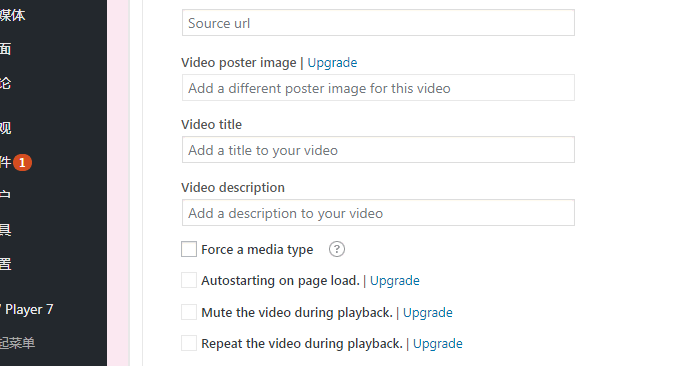

# 用JW Player,ckplayer,Smartideo搭建视频直播站-支持各大视频网站和rtmp
由于一个朋友的问题，最近测试了好几个Wordpress网站播放器，其中包括Smartideo,ckplayer,JW Player。总的感觉就是，在线网络播放器有很多，其中大部分都可以自己上传播放器的JS、CSS等文件快速搭建，而且Wordpress程序本身就自带视频播放器，无需额外安装。

但是，有些朋友可能想要解析优酷、爱奇艺、腾讯视频等视频放在自己的网站上播放，那就需要播放器的外部解析支持了。老牌的ckplayer自带了视频外部解析，可以自动解析国内各大视频网站的视频实现在个人网站上播放，但是经过测试发现解析速度慢且视频速度也受影响。

[Smartideo](https://wzfou.com/tag/smartideo/)也是国人开发的一款基于Wordpress的视频播放器，它的好处就在于可以自动识别你插入到文章当中的视频地址，然后自动解析变成视频嵌入，用户可以直接在网页上点击观看。经过我的测试，Smartideo对于国内各大视频网站支持良好，尤其是B站和腾讯视频，播放流畅。

而[JW Player](https://wzfou.com/tag/jw-player/)则国外一款强大的视频播放器，支持本地上传视频音乐和解析Youtube视频观看。如果利用Wordpress JW Player插件，则可以一键插入Youtube视频，十分地方便。试用了JW Player了后，发现JW Player确实是一个优秀的视频播放器，干净美观，加载起来也是大气。

[](https://wzfou.com/wp-content/uploads/2017/06/jwplayer_00.jpg)

Smartideo,ckplayer,JW Player这三款视频播放器都可以单独安装在网站上，为了方便Wordpress用户可以直接使用插件，不同的播放器有各自的优势与不足，本篇文章就来简单地分析一下，大家可以根据自己的需求来选择。更多的关于建站的文章，可以看看：

1. [使用MailPoet Newsletters插件为WordPress搭建RSS邮件订阅支持SMTP](https://wzfou.com/mailpoet/)
2. [利用MailChimp建立RSS邮件订阅平台-每月免费12000封邮件可加2000用户](https://wzfou.com/mailchimp/)
3. [服务器虚拟化面板SolusVM安装与使用-支持新建管理OpenVZ, KVM和Xen VPS](https://wzfou.com/solusvm/)

## 一、JW Player-干净美观的视频播放器

JW Player是一款非常优秀的网页媒体播放器，支持HTML5和和Flash Player。格式支持H.264 ( .mp4, .mov, .f4v )、FLV ( .flv ) 、3GPP ( .3gp, .3g2 )、OGG Theora ( .ogv )和WebM ( .webm )视频格式，MP3 ( .mp3 )、AAC ( .aac, .m4a )、OGG Vorbis ( .ogg )和WAV ( .wav )音频，同时也支持swf和图片( gif 、jpg、png)和YouTube格式视频。

### 1.1  JW Player 申请使用

首先是进入到JW Player 官网申请一个Key，这个Key是免费的，并且官网还提供了丰富的文档供你参考。

[](https://wzfou.com/wp-content/uploads/2017/06/jwplayer_01.gif)

点击下载，你可以在页面最下方看到JW Player 的Key以及程序安装包。

[](https://wzfou.com/wp-content/uploads/2017/06/jwplayer_02.gif)

### 1.2  JW Player 通用方法

下载下来的JW Player 安装包，你可以解压上传到你的网站根目录。

[](https://wzfou.com/wp-content/uploads/2017/06/jwplayer_03.gif)

以下是JW Player 播放器使用的实例，比较简单，第一步在Head前引入JS和Key，然后第二步在body内添加div设置视频文件路径。

```
<!DOCTYPE html><html lang="zh-CN"><head><meta http-equiv="Content-Type" content="text/html; charset=UTF-8"><meta name="viewport" content="width=device-width, initial-scale=1"><title>视频测试 – 挖站否wzfou.com</title><script src="//wzfou.com/jwplayer/jwplayer.js"></script><script>jwplayer.key="98Sx98LQbaqk/BA4RCpM8AV3aoIscantvQSDjA==";</script></head><body><div id='myplayer'></div> <script type='text/javascript'>     jwplayer('myplayer').setup({        file: '/shi/big.mp4',      width: '640',         height: '480'}); </script></body></html>
```

Key你需要换成你自己的，可以在官网的下载中找到。jwplayer.js文件和file 请换成你自己的路径。效果如下图：

[](https://wzfou.com/wp-content/uploads/2017/06/jwplayer_03_1.jpg)

JW Player 变身直播利器。JW Player 支持rtmp源，你只需要找到合适的rtmp源就可以利用JW Player 在线观看了。效果如下：

[](https://wzfou.com/wp-content/uploads/2017/06/jwplayer_03_2.jpg)

JW Player自定义Logo和链接。JW Player支持你添加自己的视频Logo和视频点击链接地址，你只需要在代码中添加aboutlink、abouttext、logo这几个参数就行了。添加多个视频就是复制代码然后修改Div的Id即可，代码示例如下：

```
<!DOCTYPE html><html lang="zh-CN"><head><meta http-equiv="Content-Type" content="text/html; charset=UTF-8"><meta name="viewport" content="width=device-width, initial-scale=1"><title>视频测试 – 挖站否wzfou.com</title><script src="//wzfou.com/jwplayer/jwplayer.js"></script><script>jwplayer.key="98Sx98LQbaqk/BA4RCpM8AV3aoIscantvQSDjA==";</script></head><body><div id='myplayer'></div> <script type='text/javascript'>    jwplayer('myplayer').setup({       file: 'rtmp://live.hkstv.hk.lxdns.com/live/hks',  aboutlink: "http://wzfou.org", abouttext: "更多视频请进入挖站否",logo: {        file: '//wzfou.com/wp-content/uploads/2017/06/wzfou_logo7.png',        link: 'http://wzfou.com/'    },width: '640',        height: '480'}); </script><br ><br ><br ><div id='myplayer1'></div> <script type='text/javascript'>    jwplayer('myplayer1').setup({       file: 'rtmp://live.hkstv.hk.lxdns.com/live/hks',     width: '640',        height: '480'}); </script></body></html>
```

Logo修改和右键链接效果见下图：

[](https://wzfou.com/wp-content/uploads/2017/06/jwplayer_19.jpg)

### 1.3  JW Player WordPress插件

JW Player 官方开发一个插件，不过我用过之后感觉没有非官方开发的插件好用。JW Player 7 for WordPress官网地址：https://wordpress.org/plugins/jw-player-7-for-wp/

Player 7 for WordPress设置页面，在第一个URL中填写JW Player的js路径。你需要提前将JW Player解压上传到你的网站根目录下，Key和上面一样。JW Player 7 for WordPress可以选择在哪里放置视频，视频的位置是在内容是上还是下。

[](https://wzfou.com/wp-content/uploads/2017/06/jwplayer_04.gif)

JW Player 7 for WordPress还可以设置相关视频、广告和分享。

[](https://wzfou.com/wp-content/uploads/2017/06/jwplayer_06.gif)

如何使用JW Player 7 for WordPress？在写文章时，拉页面到最下方，这里你就可以填写你的视频URL了，支持Youtube或者你自己上传的视频文件地址。

[](https://wzfou.com/wp-content/uploads/2017/06/jwplayer_07.gif)

点击“More Options”可以为视频设置标题、描述、是否自动播放、播放完是否从头开始等等。

[](https://wzfou.com/wp-content/uploads/2017/06/jwplayer_07_0.gif)

另外，JW Player 7 for WordPress会自动将你的文章的特色图片作为视频的封面图片。

[](https://wzfou.com/wp-content/uploads/2017/06/jwplayer_07_1.gif)

这是JW Player 7 for WordPress的视频播放效果。

[](https://wzfou.com/wp-content/uploads/2017/06/jwplayer_08.jpg)

点击还可以分享视频。如果想要国内的分享，你可以修改插件的分享代码部分。

[](https://wzfou.com/wp-content/uploads/2017/06/jwplayer_09.jpg)

## 二、ckplayer-国产优秀在线播放器

ckplayer是一款国人开发的在线网页播放器，支持http协议下的flv,f4v,mp4,支持rtmp视频流和rtmp视频回放,支持m3u8格式，如果搭载视频解析服务，就可以直接嵌入优酷、爱奇艺、腾讯视频等各大视频网站的视频了。

[ckplayer](https://wzfou.com/tag/ckplayer/)官网：http://www.ckplayer.com/，ckplayer提供了一个在线配置工具，你可以选择视频调用方式、播放器配置、广告设置、宽高比、分享等，然后系统会自动生成调用代码，你将这个代码放在Html网页中就可以使用了。

[](https://wzfou.com/wp-content/uploads/2017/06/jwplayer_11_1.gif)

如果你想用ckplayer播放优酷、爱奇艺、腾讯等视频，那么就需要借助视频解析服务了。经过测试，目前免费的视频解析服务Mine还可以用，你可以到官网搜索API接口。如果用的是Wordpress，那么可以直接安装Mine插件。

[](https://wzfou.com/wp-content/uploads/2017/06/jwplayer_12.gif)

Mine插件下载地址：https://www.ucblog.net/mine-video.1.5.3.zip，启用插件，在写文章页面选择播放来源，填写视频ID/URL、高度，最后点击添加视频。

[](https://wzfou.com/wp-content/uploads/2017/06/jwplayer_13.gif)

刷新网页，你就可以看到视频正常播放了。不过，由于受视频解析的影响，感觉视频播放速度方面有些慢了。

[](https://wzfou.com/wp-content/uploads/2017/06/jwplayer_12.jpg)

## 三、Smartideo-WP强大视频播放器

Smartideo 是为 WordPress 添加对在线视频支持的一款插件（支持手机、平板等设备HTML5播放）。 目前支持优酷、搜狐视频、土豆、56、腾讯视频、新浪视频、酷6、华数、乐视、YouTube 等网站。

Smartideo插件地址：https://wordpress.org/plugins/smartideo/，备用：https://www.ucblog.net/smartideo.zip。启用插件，然后进入设置选项，这里你可以设置一些提示语、资源加载方式等等。

[](https://wzfou.com/wp-content/uploads/2017/06/jwplayer_15.gif)

在写文章时，直接粘贴视频播放页完整的URL到编辑器（单独一行），就可以加载视频播放器。

[](https://wzfou.com/wp-content/uploads/2017/06/jwplayer_16.gif)

测试发现，Smartideo对国内大部分的视频网站是有效的，尤其是腾讯视频、B站、A站等效果很不错。

[](https://wzfou.com/wp-content/uploads/2017/06/jwplayer_18.jpg)

## 四、总结

JW Player,ckplayer,Smartideo这三款都是非常优秀的视频播放器，各有各的优缺点，JW Player播放器界面漂亮美观，特别适合本地视频和Youtube视频播放。当然，也有人会修改代码将国内的视频解析服务用在JW Player上。

ckplayer本身是一个强大的视频播放器，官网提供的在线配置也很贴心，对于不懂代码的朋友可以直接复制调用。而作为[WordPress视频播放器](https://wzfou.com/tag/wordpress-spbo/)Smartideo，可以直接将各大视频网址转为嵌入，且支持手机平板观看，使用效果也很不错的。