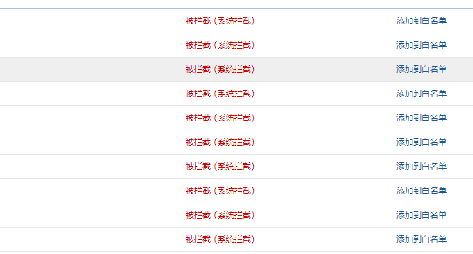

# 三大原因让我放弃腾讯阿里云企业邮箱-附国内外企业(域名)邮箱汇总
一直以来挖站否都在使用腾讯企业邮箱的SMTP来作为邮件发送的主要方式，不过最近腾讯企业邮箱发信开始出现各种问题了。一方面随着订阅用户的增多，采用了[MailPoet Newsletters](https://wzfou.com/mailpoet/)，每次一更新文章就要发送大量的推送邮件，会导致腾讯企业邮箱限制发信。

另一方面，我发现在使用[腾讯企业邮箱](https://wzfou.com/tag/tengxun-qiye/)和阿里云企业邮的过程中，有一些正常的邮件会被当成“不正常”的邮件从而发不出去。在这一方面，腾讯企业邮箱稍微好一些，但是阿里云免费企业邮箱限制得更为严格，有时一些注册通知类的邮件都能当成垃圾邮件从而导致发送失败。

总之，腾讯和阿里云免费企业邮箱日均允许发信数量少（每天不能超过500封），而且有严格的发信频率限制，一旦达到就无法再次发信，最后就是“无脑”的反垃圾和过滤机制，不少的正常邮件都能当成垃圾邮件而被禁止发送。基于这样的原因，换成了Gmail的SMTP发信。

相对而言，虽然[Gmail SMTP](https://wzfou.com/tag/gmail-smtp/)免费版每天最多的发信量是500封，但是在反垃圾机制、发信频率等方面做得好一些，不容易出现腾讯和阿里云免费企业邮箱那样的问题。另外，如果想要将自己的域名打造成企业邮箱，可以试试[G Suite](https://wzfou.com/tag/g-suite/) ，最便宜套餐是5美元一个月，比腾讯和阿里云企业邮箱要便宜多了。

本文就来分享一下在使用免费腾讯和[阿里云企业邮箱](https://wzfou.com/tag/aliyun-qiye/)过程中遇到的问题，同时收集整理一下国内外企业(域名)邮箱，包括免费和付费的，正在寻找[邮件发送服务](https://wzfou.com/tag/youjian-fasong/)的朋友可以参考一下。更多的关于邮件邮箱，你可以看看：

1. [利用MailChimp建立RSS邮件订阅平台-每月免费12000封邮件可加2000用户](https://wzfou.com/mailchimp/)
2. [WordPress评论微信通知和邮件提醒-Server酱和第三方SMTP发信](https://wzfou.com/wp-weixin-mail/)
3. [使用MailPoet Newsletters插件为WordPress搭建RSS邮件订阅支持SMTP](https://wzfou.com/mailpoet/)

**PS：2017年12月7日更新，**目前博客的评论邮件通知采用的是Gmail邮箱，而RSS更新邮件通知则采用的是[Zoho企业邮箱](https://wzfou.com/tag/zoho-qiye/)，有关教程：[Zoho Mail好用且便宜的企业邮箱-Zoho企业(域名)邮箱申请使用教程](https://wzfou.com/zoho-mail/)。

## 一、要求各种繁琐认证

腾讯和阿里云[免费企业邮箱](https://wzfou.com/tag/mianfei-qiye-yx/)作为国内的服务，自然少不了各种信息认证，腾讯企业邮箱需要绑定手机号码还有微信号，相当于实名了。

阿里云免费企业邮箱是阿里云账户下管理，自然也是实名的，另外创建的子账号还需要另绑定手机号码，总之就是各种信息认证。

## 二、存在各种发信限制

**发信频率限制严格。**虽然说腾讯企业邮箱每天上限是500封邮件，但是同一个时间内发送的邮件过多，就会直接被禁止使用SMTP发信了。

**无语的反垃圾策略。**正常发出去的邮件有不少的会被判定为垃圾邮件而拒绝发送，这种情况在阿里云免费企业邮箱更甚。

## 三、拒收邮件拖慢速度

**存在拒收邮件的现象。**由于邮箱的反垃圾邮件策略，发往腾讯和阿里云免费企业邮箱很容易被拒收，特别是从一些不常见的邮箱后缀发来的邮件，比如企业邮局，很可能就收不到。

**影响网页加载速度。**从我的Wordpress博客调用腾讯和阿里云免费企业邮箱SMTP发信体验来看，由于我使用的是[阿里云](https://wzfou.com/tag/aliyun/)香港VPS主机，而腾讯和阿里云免费企业邮箱服务器在大陆，禁用了SMTP后提交评论几乎是秒开，但是开启SMTP后至少要等一秒才行。

## 四、国内外企业(域名)邮箱汇总

基于以上原因，我放弃了腾讯和阿里云免费版的企业邮箱，这里还收集整理了国内外各大免费和付费的企业(域名)邮箱，从速度上来看国内的主机选择国内的企业(域名)邮箱更好一些，不过国内免费版的企业(域名)邮箱存在诸多的限制，想要省心的话还是付费吧。国外的企业(域名)邮箱在发信数量和限制要放得宽一些，适合个人或者企业发信需要。

搜索:

| 服务商 | 使用点评 | 评分 | 备注 |
| --- | --- | --- | --- |
| [MailChimp](https://wzfou.com/go/mailchimp) | 每月可以发送12000封的邮件，每个账户可以添加2000个用户，丰富的API，强大的功能，推荐使用。 | 9.3 | 免费 |
| [Amazon SES](https://wzfou.com/go/amazonses) | 亚马逊产品，用户每天发送的邮件数量不超过2,000封 | 9.3 | 免费 |
| [Mailgun](https://wzfou.com/go/mailgun) | 专业级别的邮件发送服务，注册并验证了信用卡的用户每月可以发送1万封邮件 | 9.1 | 免费 |
| [Mailjet](https://wzfou.com/go/mailjet) | 每天有200封的免费邮件发送配额，每月最多是6000封。 | 8.9 | 免费 |
| [Sendgrid](https://wzfou.com/go/sendgrid) | 国外专业级的发信服务，每月40,000封邮件。 | 8.9 | 9.95$/月 |
| [G Suite](https://wzfou.com/go/gsuite) | 谷歌专业办公套件，提供 30GB 存储空间，每封邮件的收件人数上限500，每位用户每天的收件人（位于您网域外部）数量上限3000，自定义域名 | 8.8 | 5美元/月 |
| [Zoho国际版](https://wzfou.com/go/zoho) | 每天限制是200封邮件。[Zoho企业(域名)邮箱申请使用教程](https://wzfou.com/zoho-mail/) | 8.6 | 免费 |
| [Gmail个人](https://wzfou.com/go/gmail) | 单封电子邮件的收件不超过 500 位，一天内发送了不超过 500 封电子邮件 | 8.5 | 免费 |
| [Postmarkapp](https://wzfou.com/go/postmarkapp) | 免费SMTP发邮件配额是10000封，有API | 8.5 | 免费 |
| [腾讯企业邮箱](https://wzfou.com/go/exmailqq) | 初始是500封/天，但系统会根据你的发信质量来调整发信量，根据我的的使用体验，一天超过200封就会受到限制 | 7.9 | 免费 |
| [Yahoo Mail](https://wzfou.com/go/yahoomail) | 没落的雅虎邮箱，这里指的是国际版的，每天最多500封邮件 | 7.7 | 免费 |
| [OpenMailbox](https://wzfou.com/go/openmailbox) | 开源的邮箱系统，5GB存储空间 | 7.7 | 免费 |
| [FastMail](https://wzfou.com/go/fastmail) | 2GB的邮箱存储，自定义邮箱的域名，提供Alias | 7.6 | 3美元/月 |
| [网易企业邮箱](https://wzfou.com/go/163qiye) | 每个用户每天最多只能发送1000封邮件，单个邮件最多包含 500 个收件人邮箱地址。 | 7.5 | 1000元/年 |
| [Mail.com](https://wzfou.com/go/mailcom) | 200个邮箱后缀，官网没有查到明确的发信限制 | 7.5 | 免费 |
| [SendCloud](https://wzfou.com/go/sendcloud) | 搜狐旗下产品，通过注册帐号, 完善信息 ，创建发信域名等完成任务增加额度 | 7.3 | 免费 |
| [QQ邮箱](https://wzfou.com/go/qqmail) | 普通用户：每天最大发信量是100封；QQ会员：VIP1~VIP7每天最大发信量是500封。发送延时 45 | 7.1 | 免费 |
| [阿里云企业邮箱](https://wzfou.com/go/aliyunqiye) | 看了官网，客服说企业邮箱发送数量和频率的限制是“商业秘密”，不公开。Are you OK？ | 7.0 | 免费 |
| [新浪企业邮箱](https://wzfou.com/go/sinamail) | 客户端软件每日域的总发信量限制为150封，购买后发信没有限制。 | 7.0 | 170元/年 |
| [Outlook.com](https://wzfou.com/go/outlook) | 每天发送限量限制为 100封 。每次最多可以将同一封邮件发送给 50 个电子邮件地址。 | 6.9 | 免费 |
| [网易邮箱个人](https://wzfou.com/go/mail163) | 一封邮件最多发送给 40 个收件人 , 每天发送限额为 50 封。 | 6.7 | 免费 |
| [Yandex企业邮箱](https://wzfou.com/go/yandex) | 俄罗斯Yandex企业邮箱，可创建1000邮箱用户，每个用户10G的容量 | 6.7 | 免费 |
| [Mail.ru](https://wzfou.com/go/mailru) | Mail.ru是俄罗斯元老级的邮箱，俄罗斯大多数的个人邮箱后缀都是@mail.ru | 6.6 | 免费 |
| [搜狐免费邮箱](https://wzfou.com/go/sohumail) | 每天发送量限制为 100 封 。 | 6.3 | 免费 |
| [新浪免费邮箱](https://wzfou.com/go/sinamails) | 每天限制发送 30 封 | 6.2 | 免费 |
