# 国外免费电话整理Google Voice,Sonetel,Text free,Textnow-用于短信和语音验证
最近，因为注册[阿里云国际版](https://wzfou.com/tag/aliyun-guoji/)需要用到国外的电话验证，于是又想起了以前在玩免费空间和免费VPS主机时用到过的[免费网络电话](https://wzfou.com/tag/free-sms-call/)。Text free,Textnow是两个免费的接收短信的网络电话，申请和使用都没有门槛，直接使用邮箱注册就会给一个美国电话，这个电话就可以用来接收短信。

但是，[Text free](https://wzfou.com/tag/text-free/),Textnow毕竟是网络电话，大部分号码都已经被别人用过了，所以在一些验证中容易被商家识别出来，从而导致验证失败。这时，如果拥有一个[Google Voice](https://wzfou.com/tag/google-voice/)就不存在这样的问题了，因为Google Voice提供一个[免费美国电话号码](https://wzfou.com/tag/mianfei-us-dianhua/)，可以在美国及加拿大地区免费语音通话和短信服务。

Google Voice申请的门槛还是比较高的，而且长期不用的话还要将被收回电话号码，从我的申请体验来看，如果有钱并且着急用的话，建议直接到某宝上购买一个，这个比自己折腾申请要简单多了。而Sonetel提供了国外十几个国家的免费电话试用，平常很难搞到的日本、韩国、法国、英国、印度等都有免费试用。

Google Voice,[Sonetel](https://wzfou.com/tag/sonetel/),Text free,[Textnow](https://wzfou.com/tag/textnow/)是目前已知的可供大家申请和免费使用的免费网络电话，基本上可以解决你在使用国外主机时遇到的电话验证问题。当然，如果只是想单纯找一个国外电话用来接收短信，这里再分享5个在线接收短信的网站，这类服务特别适合临时使用。

免费的网络电话有诸多的限制，特别是个人隐私得不到保障，如果有能力的话，不防自己搭建各类应用服务，例如自建RSS阅读器、第三方评论系统和挂载扩容硬盘等，参考：

1. [利用Huginn抓取任意网站RSS和微信公众号更新-打造一站式信息阅读平台](https://wzfou.com/huginn-rss/)
2. [HashOver免费开源PHP评论系统安装使用-自建评论系统替代第三方](https://wzfou.com/hashover/)
3. [Linux VPS挂载Google Drive和Dropbox-实现VPS主机数据同步备份](https://wzfou.com/linux-vps-drive/)

**PS：2017年10月26日更新，**除了免费空间、免费电话，最实用的还有免费.edu邮箱，参考：[免费.edu邮箱获取方法-用教育邮箱获取免费VPS\\域名\\软件汇总列表](https://wzfou.com/edu-email/)。

## 一、Google Voice谷歌电话

Google Voice官网：

1. https://www.google.com/voice

Google Voice是由Google于2009年推出的VOIP服务，推出时间也快十年了，但是Google依然维持该服务。使用Google Voice服务可以免费拨打美国或加拿大境内的任何电话，当然在我看来是我们可以得到一个美国电话号码，有了这个电话号码我们就可以接收短信和语音电话了。

Google Voice目前申请的条件是：有一个没有被用过的美国电话号码用于Google Voice验证，全程用美国IP地址，新版可能无法使用按键精灵，你可以切换到老版本。申请不一定成功，坚持一下去多尝试几次可能会成功。不过能真正有耐心坚持下来的恐怕也是够呛的。

[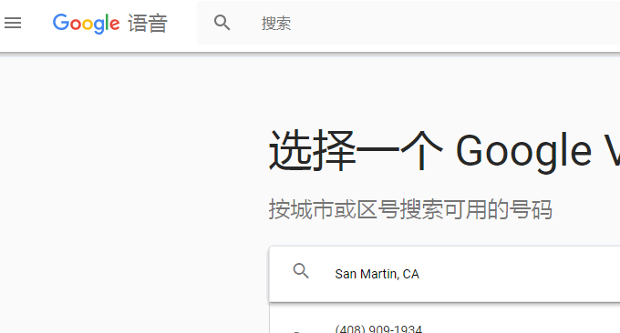](https://wzfou.com/wp-content/uploads/2017/09/phone-sms_13.gif)

## 二、Sonetel免费电话

Sonetel官网：

1. https://sonetel.com/zh-hans/

Sonetel支持以下国家或者地区的电话号码免费试用：

> Argentina(阿根廷)，Australia(澳大利亚)，Austria(奥地利)，Belgium(比利时)，Brazil(巴西)，Bulgaria(保加利亚)
> 
> Canada(加拿大)，Chile(智利)，Colombia(哥伦比亚)，Croatia(克罗地亚)，Cyprus(塞浦路斯)，Czech Republic(捷克共和国)
> 
> Denmark(丹麦)，Dominican Republic(多明尼加共和国)，El Salvador(萨尔瓦多)，Estonia(爱沙尼亚)，Finland(芬兰)
> 
> France(法国)，Georgia(格鲁吉亚)，Germany(德国)，Greece(希腊)，Hong Kong(香港)，Hungary(匈牙利)，India(印度)
> 
> Ireland(爱尔兰)，Israel(以色列)，Italy(意大利)，Japan(日本)，Latvia(拉脱维亚)，Lithuania(立陶宛)，Luxembourg(卢森堡)
> 
> Malaysia(马来西亚)，Malta(马耳他)，Mexico(墨西哥)，Netherlands(荷兰)，New Zealand(新西兰)，Norway(挪威)
> 
> Panama(巴拿马)，Peru(秘鲁)，Philippines(菲律宾)，Poland(波兰)，Portugal(葡萄牙)，Puerto Rico(波多黎各)，Venezuela(委内瑞拉)
> 
> Romania(罗马尼亚)，Singapore(新加坡)，Slovakia(斯洛伐克)，Slovenia(斯洛维尼亚)，South Korea(韩国)，Spain(西班牙)
> 
> Sweden(瑞典)，Switzerland(瑞士)，Turkey(火鸡)，US Virgin Islands(美属维尔京群岛)，United Kingdom(英国)，United States(美国)

进入到Sonetel，选择你要试用的电话号码，先选择国家，然后再选择号码，看到“免费试用”表示支持免费试用，你可以放心注册了。

[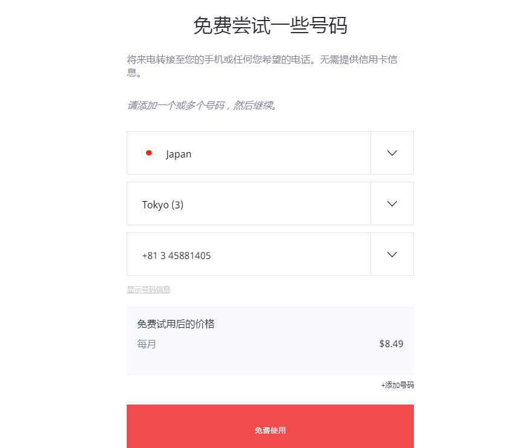](https://wzfou.com/wp-content/uploads/2017/09/phone-sms_06.gif)

注册过程需要填写邮箱和验证电话，支持国内的电话号码，你也可以在本文下方找那些临时号码用来接收短信。

[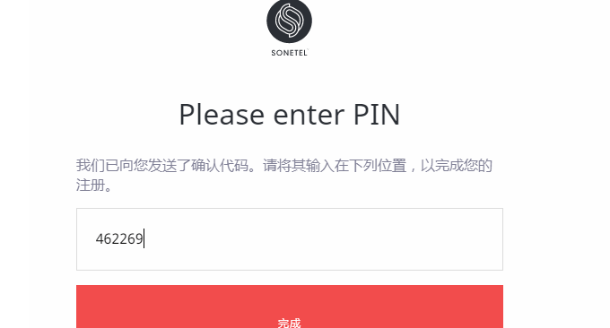](https://wzfou.com/wp-content/uploads/2017/09/phone-sms_09.gif)

Sonetel注册成功后，你就可以登录到Sonetel管理后台，这里我选择了一个[免费日本电话号码](https://wzfou.com/tag/mianfei-jp-dianhua/)，而且你的账户上会得到0.5美元，这个是用来给你试用的。

[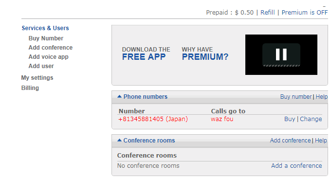](https://wzfou.com/wp-content/uploads/2017/09/phone-sms_10-1.gif)

点击电话号码，然后填写转发号码，这里就可以填写你国内的手机号码了。支持语音转接。

[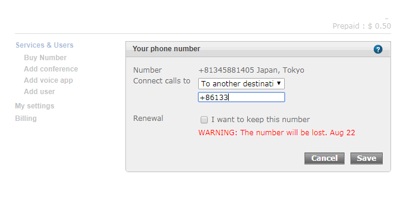](https://wzfou.com/wp-content/uploads/2017/09/phone-sms_11.gif)

## 三、Text free免费电话

Text free官网：

1. https://textfree.us/

Text free由Pinger开发的一款手机应用，当然也有网页版的，不需要下载App直接就可以在线接收发短信。Text free最早在好几年前申请OVH免费VPS时被大家所熟知，而现在依然可以免费使用。

[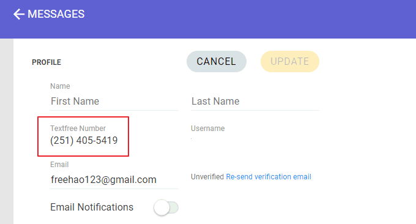](https://wzfou.com/wp-content/uploads/2017/09/phone-sms_05.gif)

到Text free注册一个账号，然后选择一个电话号码。Text free提供的都是免费的美国号码，网页版本的Text free足够我们在线收发短信了，以下是我的Text free使用界面。

[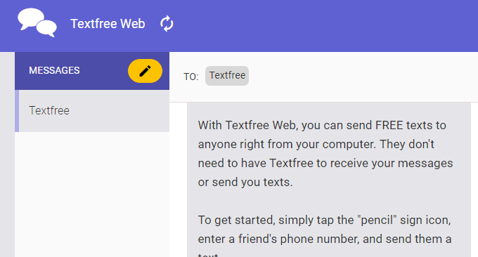](https://wzfou.com/wp-content/uploads/2017/09/phone-sms_04.gif)

## 四、Textnow免费电话

Textnow官网：

1. https://www.textnow.com

Textnow也是一款类似于Text free的免费电话服务，有手机APP和网页版，先注册一个Text free账号，然后选择一个美国区号。

[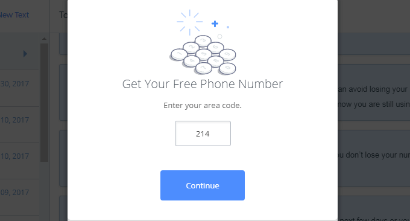](https://wzfou.com/wp-content/uploads/2017/09/phone-sms_01.gif)

接着，Text free就会分配一个免费美国电话号码给你了。

[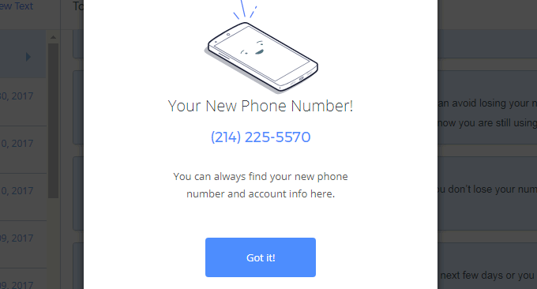](https://wzfou.com/wp-content/uploads/2017/09/phone-sms_02.gif)

用Text free提供的电话接收短信，来了短信会收到提醒，同时你的邮箱也会有提醒。以下是我的Text free界面，刚刚用过[阿里云国际版](https://wzfou.com/tag/aliyun-guoji/)的电话验证。

[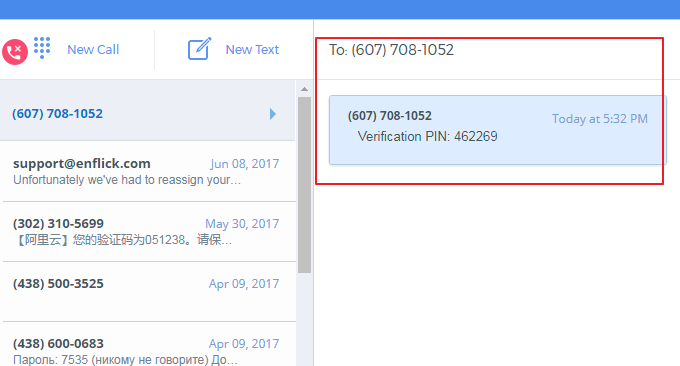](https://wzfou.com/wp-content/uploads/2017/09/phone-sms_07.gif)

## 五、免费短信在线接收网站

[免费短信在线接收](https://wzfou.com/tag/mianfei-sms/)网站是一种提供公共电话号码供大家临时用于各类网站注册验证，这类网站使用起来很方便，直接在线选择一个号码就行，如果收到短信网页会刷新然后显示出短信内容。缺点就是短信是公开在网页上，所以个人隐私可能没法保证。

目前，提供免费美国、德国、加拿大、英国等国家的免费电话号码在线接收短信的服务有：

> https://smsreceivefree.com/
> 
> https://freesmscode.com/
> 
> http://receivefreesms.net/
> 
> http://www.freesmsverifications.com/
> 
> https://www.receive-sms-online.info

直接进入到免费短信在线接收网站，选择一个号码，将号码填入到需要验证的网页中，然后就刷新这边的网页看看是不是有显示短信内容了。

[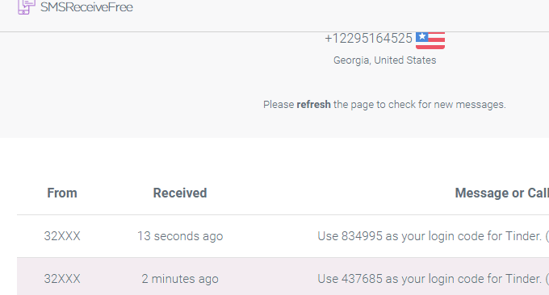](https://wzfou.com/wp-content/uploads/2017/09/phone-sms_14.gif)

## 六、总结

Google Voice,Sonetel,Text free,Textnow这几个免费电话当中，Google Voice适合长期持有，因为它已经相当于一个真实的美国电话号码了，不同于Text free,Textnow，Google Voice提供的电话号码可以通过大多数网站的短信验证。

Sonetel只是提供电话号码试用，支持电话转接，因此适合语音验证。不过，Sonetel还提供了韩国、日本、印度、英国、法国等这些非美国的电话号码，这些号码在我们申请[日本VPS](https://wzfou.com/tag/jp-vps/)、韩国主机等可以用到。免费短信在线接收服务就适合作一次性使用。