# 日本Xrea免费空间申请与使用-优秀稳定的免费主机1GB空间免费SSL
Xrea是日本GMO Internet Inc公司旗下的免费主机产品，已经提供免费服务有十几年的历史了。GMO Internet Inc公司可能有不少有没听说，但它旗下的Z.com服务器、value-domain域名解析、[ConoHa.jp](https://wzfou.com/tag/conoha/)主机等产品相信大部分人都用过，价格便宜且还支持支付宝付款。

Xrea是不少玩[免费空间](https://wzfou.com/mianfei-kongjian/)的朋友特别想注册的一个空间，因为Xrea提供的虚拟主机服务既稳定同时功能强大，例如新版的Xrea空间面板就支持自动申请let’s encrypt 免费SSL证书，也支持安装自定义SSL证书。另外，后台还提供了MysqL数据库和网站文件自动备份和恢复功能。

可以说[Xrea](https://wzfou.com/tag/xrea/)免费空间在某些方面甚至强于一些便宜的虚拟主机，最重要的是Xrea的服务器位于日本，国内访问Xrea免费空间的速度还是比较快的。一直以来，Xrea免费空间是实行开放注册，新服务器人员满了话又得等下一波才行。从官网来看，Xrea免费空间的服务器已经达到了上百台了。

当然，[Xrea空间](https://wzfou.com/tag/xrea-kongjian/)也有不少的问题，例如空间有强制广告（我新申请的Xrea免费空间并未见到广告，不知道以后有没有）、主机资源限制严格（一些论坛程序等资源消耗大的可能不好跑）。以前Xrea貌似FTP限制日本IP，不过我新申请的Xrea空间FTP等一切使用正常。

另外，感谢[Naifu](https://wzfou.com/host1plus/#comment-2193)博主的提醒，当前新开放的Xrea服务器申请可以免费注册一个.shop顶级域名，免费空间+[免费域名](https://wzfou.com/tag/mianfei-yuming/)+免费SSL+日本IP，这样的空间真的很值一试。更多的[免费资源](https://wzfou.com/mianfei-ziyuan/)与[免费空间](https://wzfou.com/mianfei-kongjian/)，你还可以试试：

1. [BlueMix免费Kubernetes集群申请使用教程-4GB内存支持Root权限登录管理](https://wzfou.com/bluemix-kubernetes/)
2. [利用MailChimp建立RSS邮件订阅平台-每月免费12000封邮件可加2000用户](https://wzfou.com/mailchimp/)
3. [三大免费工具助你检测VPS服务器真伪-VPS主机性能和速度测试方法](https://wzfou.com/vps-ceping-gongju/)

> **PS：2019年9月20日更新，**正在寻找免费VPS主机的朋友，可以试试：[Oracle Cloud甲骨文免费VPS主机申请使用-日本,韩国和美国等免费云VPS主机](https://wzfou.com/oraclecloud/)。

## 一、新版Xrea免费空间申请

官网：

1. Xrea：https://www.xrea.com/
2. 账号注册：https://www.value-domain.com/signup_buy/
3. 空间面板：https://cp.xrea.com

首先，请到账号注册网址点击注册，填写你个人的基本信息，注册一个value-domain账号。在第四步中，**需要填写日本人的个人信息资料，其它的如用户名等可用拼音代替。**

[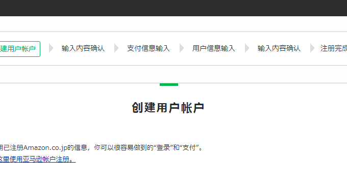](https://wzfou.com/wp-content/uploads/2017/09/xrea_00_1.gif)

账号注册成功后，登录到Xrea网站，然后选择申请免费空间，想要申请一个免费的.shop域名的，直接在申请页面上方填写你想要注册的域名。下面是选择服务器，我注册时已经开放了s1003号服务器了。

[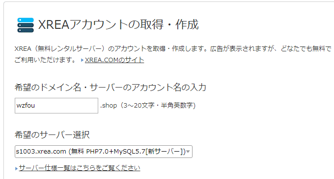](https://wzfou.com/wp-content/uploads/2017/09/xrea_01.gif)

提交注册，稍等一会儿免费空间就开通好了。打开空间面板登录地址，输入你的邮箱收到的Xrea发来的空间后台登录账号与密码。然后在下方选择你选择的服务器地址，最后登录。

[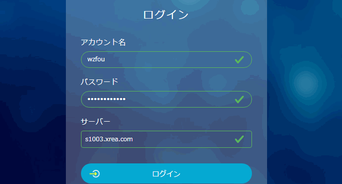](https://wzfou.com/wp-content/uploads/2017/09/xrea_02.gif)

这是Xrea免费空间的后台控制面板，我们[建站](https://wzfou.com/jianzhan/)要用到的域名绑定、网站管理、数据库管理、安全备份等都可以在后台找到。建议使用Chrome自带的翻译来解决语言不通的问题。

[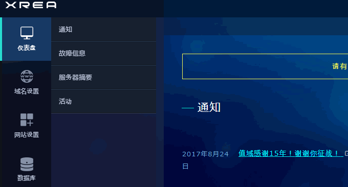](https://wzfou.com/wp-content/uploads/2017/09/xrea_03.gif)

## 二、新版Xrea免费空间使用

### 2.1  绑定域名

点击“域名设置”，如果你之前选择申请免费的.shop域名的话，你在域名列表中就可以看到你刚刚申请到的域名了。

[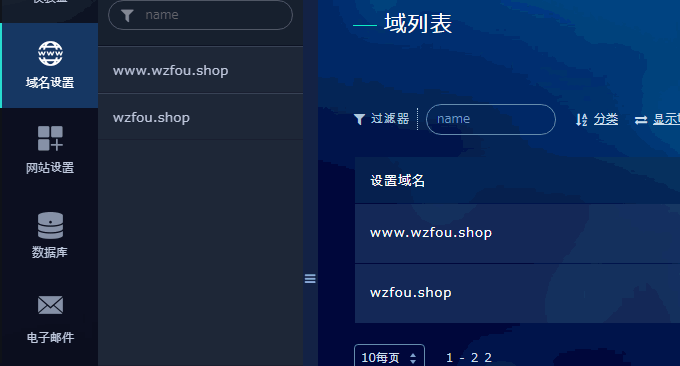](https://wzfou.com/wp-content/uploads/2017/09/xrea_04.gif)

想要绑定自己的域名的话，点击右边的创建新的域名，然后填入你的域名。**在绑定域名之前，最好是先把你的域名的DNS解析记录解析到Xrea空间的IP上**，以免出现未知的错误。

[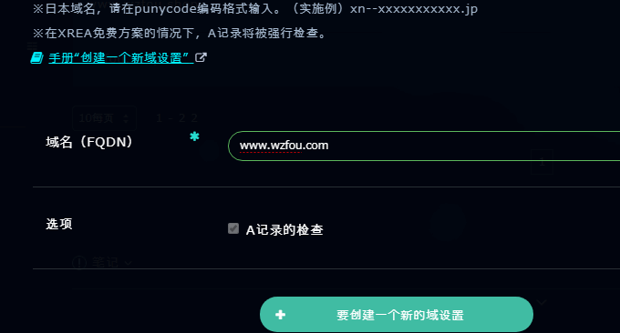](https://wzfou.com/wp-content/uploads/2017/09/xrea_05.gif)

### 2.2  网站管理

**新建与管理网站。**这是Xrea空间的网站管理页面，在这里你可以查看已经创建好的网站，也可以点击添加新的网站，在添加新的网站前你需要绑定好域名。已经添加的网站也可以重新修改和配置。（点击放大）

[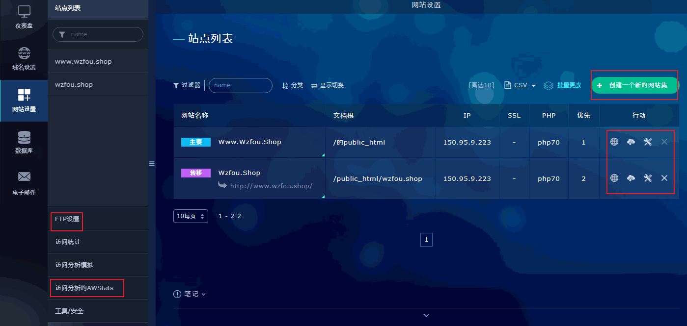](https://wzfou.com/wp-content/uploads/2017/09/xrea_06.gif)

**FTP创建账号与使用。**在Xrea空间面板中你可以点击网站后面的FTP小图标，直接打开进入到Xrea空间的Web FTP界面，在这里你可以管理空间上的文件，上传、删除、移动等和我们用的FTP客户端是一样的。

[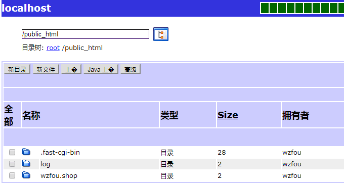](https://wzfou.com/wp-content/uploads/2017/09/xrea_07.gif)

如果有FTP客户端，你可以直接在本地登录Xrea空间。FTP账号和密码你可以在邮件中找到，也可以在上面介绍的**新建与管理网站的**空间面板中左下方找到。不知道如何填写FTP信息的朋友，可以参考wzfou.com的示例：

[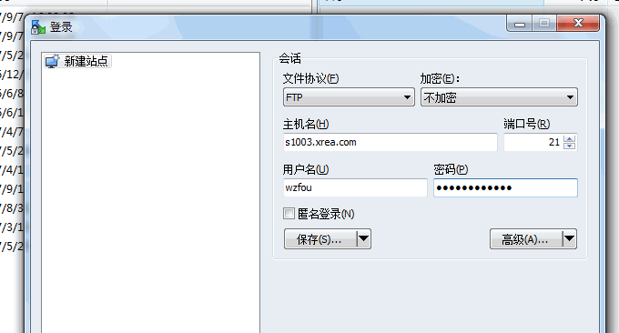](https://wzfou.com/wp-content/uploads/2017/09/xrea_08.gif)

这是FTP客户端成功登录的界面，有了FTP客户端我们管理文件就方便多了。

[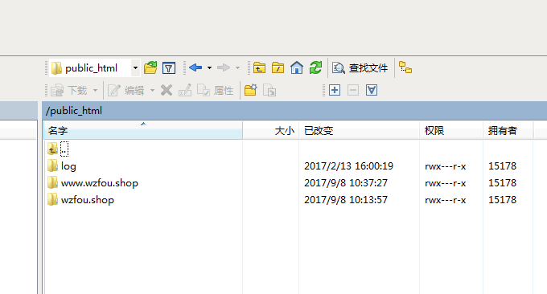](https://wzfou.com/wp-content/uploads/2017/09/xrea_09.gif)

### 2.3  SSL证书

**Xrea开通免费SSL证书。**Xrea空间开通免费SSL证书是一件非常简单的事情，你可以在绑定域名时在SSL一栏中选择“免费SSL”，也可以重新编辑网站，然后选择免费SSL证书。

[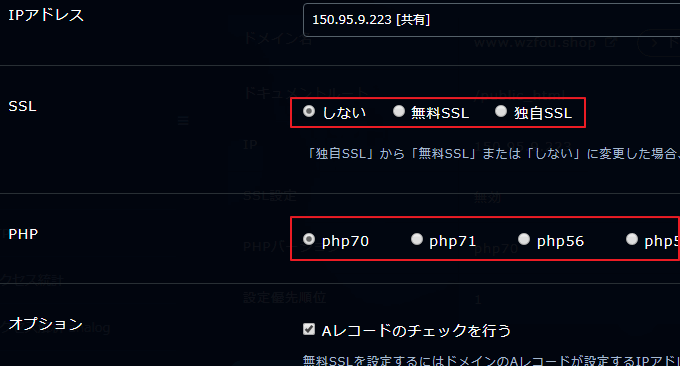](https://wzfou.com/wp-content/uploads/2017/09/xrea_11.gif)

特别要注意的是：如果你是绑定的自己的域名然后开通免费SSL证书，你需要确保域名已经成功解析到了Xrea空间的服务器上。提交，完成免费SSL证书申请。

[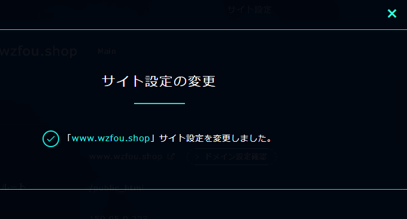](https://wzfou.com/wp-content/uploads/2017/09/xrea_12.gif)

稍等一会儿，打开你的域名，这时可以看到SSL证书已经成功配置好了。

[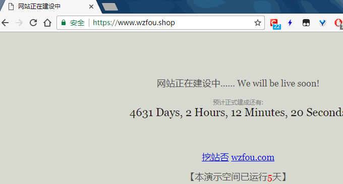](https://wzfou.com/wp-content/uploads/2017/09/xrea_13.gif)

查看SSL证书详情，我们可以看到用的是let’s encrypt 免费SSL证书，有效期是三个月，到期前会自动续期。

[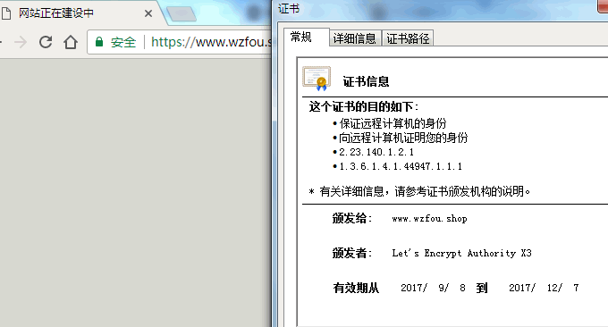](https://wzfou.com/wp-content/uploads/2017/09/xrea_14.gif)

**Xrea绑定自己的证书。**如果你的域名有自己的证书，你可以在创建网站时选择自定义SSL。

[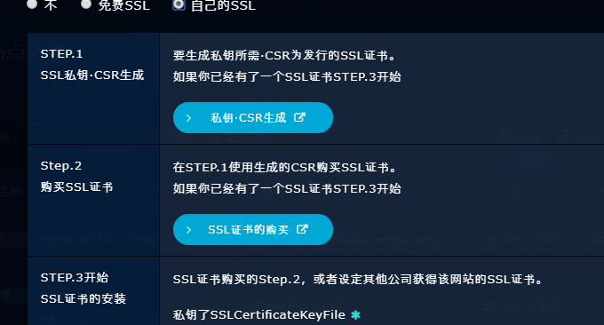](https://wzfou.com/wp-content/uploads/2017/09/xrea_15.gif)

将你的域名SSL证书的CRT、Key和CA CRT填入到Xrea中，再刷新一下就好了。

[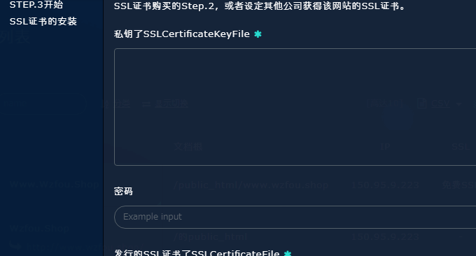](https://wzfou.com/wp-content/uploads/2017/09/xrea_16.gif)

### 2.4  MysqL数据库

在Xrea空间后台点击“数据库”，然后你就可以创建MysqL数据库了。

[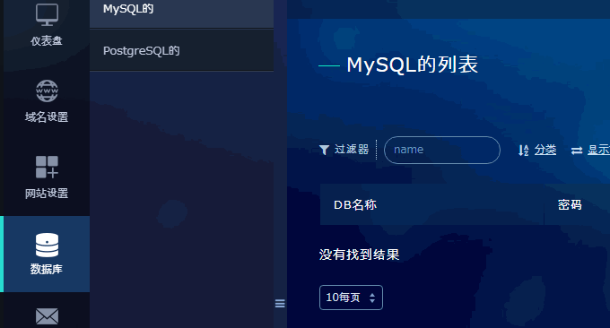](https://wzfou.com/wp-content/uploads/2017/09/xrea_17.gif)

设置好数据库名称、密码，点击创建。

[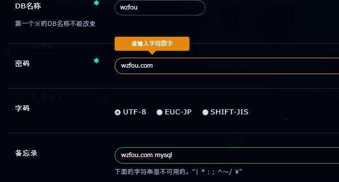](https://wzfou.com/wp-content/uploads/2017/09/xrea_18.gif)

在MysqL数据库列表中可以对已经创建好的数据库进行查看、备份、导出、删除等操作。

[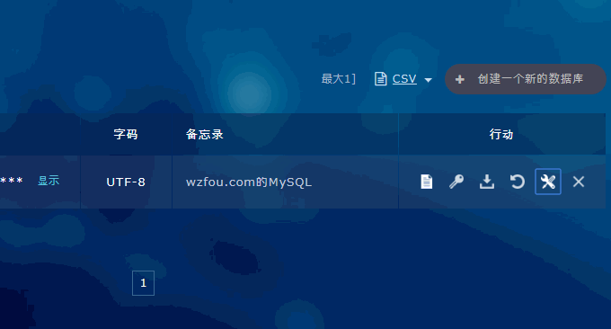](https://wzfou.com/wp-content/uploads/2017/09/xrea_19.gif)

Xrea也有PHPMyAdmin管理，不过默认的是没有安装的，你需要点击“工具”中的PHPMyAdmin进行安装。

[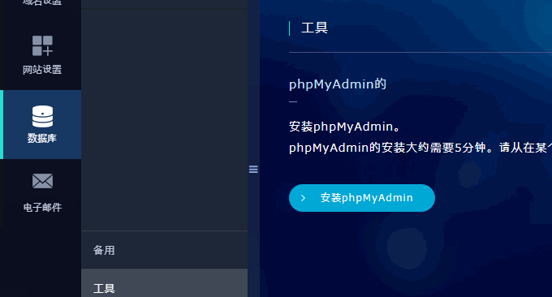](https://wzfou.com/wp-content/uploads/2017/09/xrea_21.gif)

## 三、新版Xrea免费空间评测

Xrea免费空间服务器位于日本大阪府大阪 gmo.jp，走的IIJ.Net线路，从路由追踪数据来看，Xrea服务器其实与ConoHa VPS差不多，有兴趣的可以对比我之前写的：[ConoHa日本VPS主机使用感受](https://wzfou.com/conoha/)。

[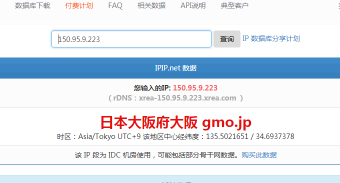](https://wzfou.com/wp-content/uploads/2017/09/xrea_25.gif)

这是Xrea免费空间的Ping值，电信、联通和移动等表现一般。

[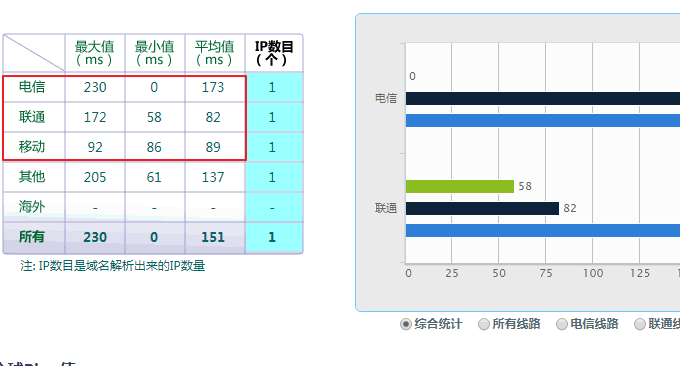](https://wzfou.com/wp-content/uploads/2017/09/xrea_24.gif)

我从本地电信网络上传文件到Xrea免费空间上，速度可以达到满速。

[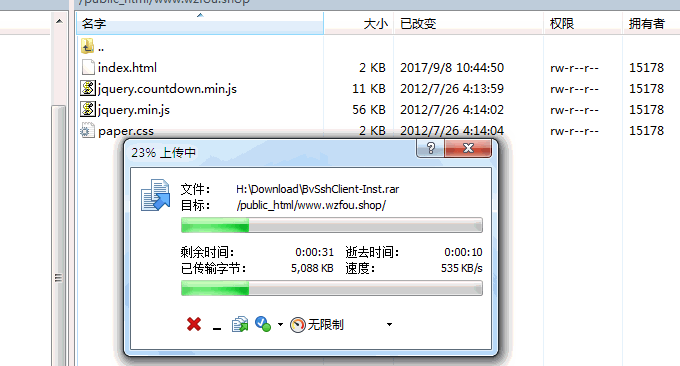](https://wzfou.com/wp-content/uploads/2017/09/xrea_22.gif)

但是Xrea免费空间下载文件到本地的速度有点慢了，保持在100KB/s左右。

[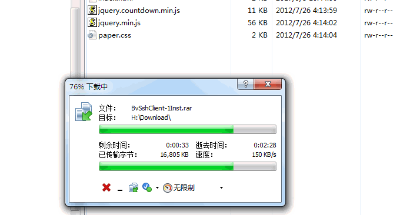](https://wzfou.com/wp-content/uploads/2017/09/xrea_23.gif)

更多体验可以查看演示网站：https://www.wzfou.shop/（.shop免费一年，之后如果我不续期的话该演示网站可能无法打开。）

## 四、总结

**Xrea免费空间稳定。**无论从空间的速度，还有后台建站功能，Xrea[免费空间](https://wzfou.com/mianfei-kongjian/)都是一个非常优秀的虚拟主机，我从部落开始建立的Xrea免费空间至今也依然保留着，可见Xrea空间对于删除账号并不是很严格。

**Xrea空间注意问题。**Xrea空间可能会有广告，这一点可以用JS或者CSS的方法去除，但是不建议这么做。Xrea空间支持在后台一键切换PHP版本，从5.5到7.1都可以自由选择。最后，不建议放论坛等程序在Xrea空间上。

**PS：2017年12月11日更新，**感谢[好友](https://wzfou.com/xrea/#comment-3736)的提醒，官方自带去广告功能，只需要在要去广告的页面的<body>后加入<!–nobanner–>即可。