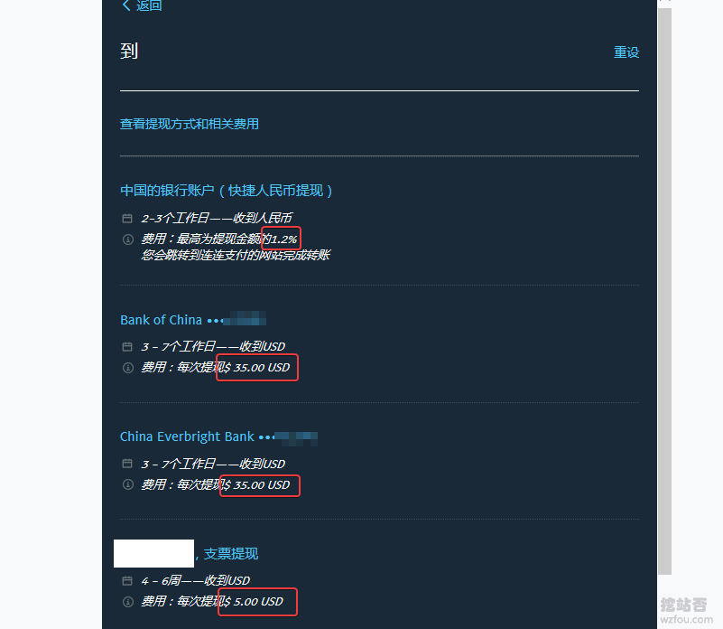
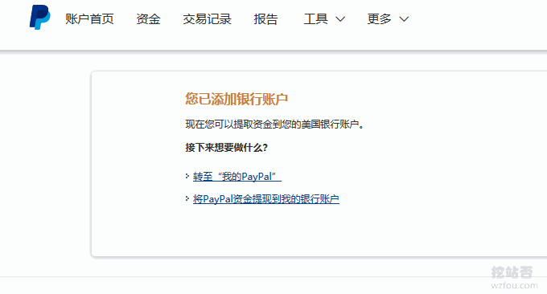

# Paypal通过Payoneer提现到国内银行全过程-新Paypal余额提现方法
Paypal余额提现到国内银行一直以来都不是很方便，官方一直采用的是电汇的方式，只可惜手续费太贵了，无论成功与否，Paypal单次电汇到国内要收取35美元的手续费。而到了国内，不同的银行可能还会收取额外的手续费。

例如之前使用的Paypal电汇到中国银行的方式除了扣除35美元的手续费，银行这边也要收取12美元的手续费，也就是说提现1000美元最终到账只有953美元。当然也有银行不收手续费的，例如之前用过光大银行Paypal电汇的，仅扣除35美元。

如果说手续费这一块可以通过提高单次[Paypal提现](https://wzfou.com/tag/paypal-tixian/)额度来减少支出外，那么另外**两个“门槛”**则是Paypal提现到国内银行的最大问题：**一是5万美元外汇额度的问题；二是电汇时间过长，且银行存在入账的问题。**

基于多种原因，我选择了使用连连支付提现，在这篇文章中详细介绍过：[PayPal连连提现五个注意事项](https://wzfou.com/paypal-lianlian/)，很可惜的是连连支付这项业务在2018年7月1日终止了。这几天经朋友提醒，现在又可以使用[Payoneer](https://wzfou.com/tag/payoneer/)来提现Paypal美元余额了。

本篇文章就来分享一下使用Payoneer来提现Paypal美元到国风银行的全过程，更多的关于[网站建设](https://wzfou.com/tag/jianzhan-jiaocheng/)以及如何从建站中获得收入，下面或许会给你一点提示：

1. [WHMCS添加支付宝微信付款、主题模板修改方法和PDF发票乱码问题解决](https://wzfou.com/whmcs-alipay/)
2. [WHMCS整合VPS.net自动开通VPS主机教程-在WHMCS上卖VPS服务器](https://wzfou.com/whmcs-vps-net/)
3. [WordPress添加支付宝,微信打赏按钮制作实例和Paypal.me打赏链接](https://wzfou.com/dashang-anniu/)

## 一、 Paypal提现方式手续费与时长对比

网站：

1. [https://www.paypal.com](https://www.paypal.com/)
2. [https://www.payoneer.com/](https://wzfou.com/go/payoneer)
3. 25美元奖励：[https://share.payoneer.com/nav/rJczASWfnL8bCuFAjQYWpOFKuoRZIyE9d30Y5A0jXs-eTazOEdrTpRcsJhp_E0IjbZmpTiwqLEFbi2ArhZHArQ2](https://share.payoneer.com/nav/rJczASWfnL8bCuFAjQYWpOFKuoRZIyE9d30Y5A0jXs-eTazOEdrTpRcsJhp_E0IjbZmpTiwqLEFbi2ArhZHArQ2)

Paypal目前支持的提现方式主要是电汇和支票，电汇又分为电汇到国内银行、电汇到美国银行、电汇到香港银行。不同的提现方式的到账时间与手续费见下图：（点击放大）

显然，电汇的成本还是蛮高的，个人认为到账时间的不确定性也增加了Paypal提现的成本，个别银行可能还会拒绝Paypal这种公对私的电汇，所以大家在提现之前记得咨询好自己的银行。（点击放大）

## 二、Paypal通过Payoneer提现一：关联账号

还没有Payoneer万事达预付卡的朋友，可以点击官网链接注册一个，目前通过Payoneer好友的链接注册的用户可以获得25美元的奖励，前提是Payoneer达到收款1000美元。（PS：之前是100美元，官方现在提高了门槛）

打开你的Paypal账户，点击“资金”，然后点击“关联新的银行账户”。

然后填写你的Payoneer银行信息：地区选择美元，类型为支票，银行名称以及银行代号、账号等。

Payoneer银行信息可以在**global payment service**中找到。

Payoneer目前和三家银行合作：First Century Bank，Bank of America，Community Federal Savings Bank。

经过我的测试，使用Payoneer签发的**Community Federal Savings Bank（美国社区联邦储蓄银行）**可以成功绑定Paypal账号。而使用First Century Bank，Bank of America会出现失败的情况。

大家可以给Payoneer客服发Tickets要求再签发一个**Community Federal Savings Bank**银行账号即可，一般是1天内下发。或者是直接联系Paypal客服，要求他们协助绑定美元银行账户，但是记得不要说是Payoneer的。

最后，看到如下提示就表示已经成功将Payoneer美元银行绑定到了Paypal账户了。

## 三、Paypal通过Payoneer提现二：申请转账

将Paypal绑定到了Payoneer后，我们就可以点击“Paypal”中的提现，然后选择将Paypal的美元余额提现到美国银行。

核对好你要提现的金额。

Paypal提示提现要通过审核。

接着，Paypal会提示正在处理提现。

大约过了1个工作日，Payoneer收到了Paypal的银行转账。

按照规定，Payoneer的美元入账要收取1%的手续费，有朋友提示也可以联系Payoneer客服请求降低入账费率，有兴趣的朋友可以试试。

## 四、Paypal通过Payoneer提现三：国内银行

### 4.1  最快提现到国内：ATM取现

找一个有MasterCard标识的银行ATM机，插入你的Payoneer卡。 输入你的Payoneer卡的PIN码，点击确认，然后选择“支票账户”。 选择你要取现的金额，因为Payoneer每次取现都要收取3.15美元的手续费，所以尽量每次取现时取现的金额大一些。

### 4.2  大额度提现国内：银行转账

Payoneer可以直接提现到国内的银行，且不占用个人的年度外汇额度。目前美元提现到国内银行收1.2%的手续费，不过你也可以联系客服要求降低费率。

**PS：2018年12月21日更新**，感谢热心朋友“[小雨](https://wzfou.com/paypal-payoneer-tixian/#comment-8610)”的提醒，安派赢手续费封顶1.5%支持提现到中国银行卡不占用国家规定的外汇额度因为通过内部汇率转换之后直接用人民币打账，可以申请降低费率，目前开账户必须收款达到40刀才能申请p卡，额度大的话必须提供有效合法的收来源才能提款。

### 4.3  最省钱提现国内：在线支付

Payoneer资金入账和提现到国内银行都要收取一定的手续费，如果自己的Payoneer内的余额比较少的话，建议直接将Payoneer绑定到淘宝中，然后在淘宝购物中使用Payoneer付款即可。

## 五、总结

使用[Payoneer提现](https://wzfou.com/tag/payoneer-tixian/)Paypal余额，一方面可以节约手续费，提现时长缩短，且一旦成功绑定后续的Paypal余额提现基本上在一天内到账；另一方面Payoneer可以取现、消费、转账等，大大提升的Paypal余额的利用效率。

需要指出的是，Paypal使用Payoneer提现会收取一定的手续费，一般地入账1%+转账2%，经常提现的朋友建议你直接联系Payoneer的客服请求降低资金入账与转账的费率，总得来说比Paypal电汇要方便了不少。