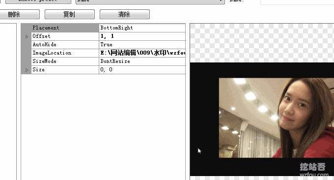

# 一软在手截图无忧 ShareX截图神器-短小精悍功能完备 自动化任务可截动图截视频
我们在写文章时经常要用到截图软件，之前Qi就在[站长必备技能批量给图片添加水印](https://wzfou.com/watermark/)文章中提到过使用XnView和美图秀秀批量给图片添加水印的方法，不少的朋友给我留言说其实可以用ShareX截图神器：一键截图→自动添加水印→自动上传，真正实现截图工作流。

ShareX是一个开源免费的截图软件，软件小巧精悍，整个安装包不到5MB。与其它的截图不同，ShareX可以真正实现截图自动化，独有的任务设置系统，你可以添加截图任务，并设置截图后自动处理（例如裁剪、水印、编辑），最后保存或者上传截图，整个操作过程可以在后台自动完成。

[ShareX](https://wzfou.com/tag/sharex/)自动上传支持国外各大相册（例如Imgur、Flickr、Google Photo）、各大网盘（例如Dropbox、OneDrive、Amazon S3、Google Drive）、各大文件分享平台等，当然ShareX支持自定义上传，例如你可以将ShareX的截图上传到七牛、又拍等云存储中。

从我使用[ShareX](https://wzfou.com/tag/sharex/)的体验来看，ShareX截图功能足够强大，其它截图软件有的功能ShareX都有了，而ShareX还有其它的截图没有的，例如图片编辑（添加标注、红线、图像合并等等）、图片上传（你再也不着FTP或者其它上传工具）、Gif动图以及视频截屏等，基本上有了一个ShareX就可以完成你的图片工作了。

[](https://wzfou.com/wp-content/uploads/2018/04/ShareX_00.jpg)

本篇文章就来分享一下ShareX截图软件的使用，实际上ShareX可能还有更多高效率的玩法有待大家一同去挖掘。更多的优秀的站长工具，你可以试试：

1. [五款优秀的RSS阅读器推荐-附国内外各大RSS阅读器收集整理汇总](https://wzfou.com/rss-readers/)
2. [两款优秀的服务器网络流量监控工具：Ntopng和Munin-功能强大直观](https://wzfou.com/ntopng-munin/)
3. [Smokeping安装与配置-免费开源网络性能监控工具可视化主/从部署](https://wzfou.com/smokeping/)

> **PS：2020年2月6日更新，**批量给图片和视频转换格式的软件还可以试试开源免费的FFmpeg：[免费开源的视频音频格式转换和压缩软件FFmpeg-快速转换格式和压缩视频](https://wzfou.com/ffmpeg/)。

## 一、ShareX截图设置

链接网址：

1. 官网：https://getsharex.com/
2. 项目：https://github.com/ShareX/ShareX
3. 同类：https://wzfou.com/watermark/

下载并安装ShareX，左边有屏幕截图、上传、快捷动作、工具、应用程序设置、热键设置等等。右边就是截图区域了。（点击放大）

[](https://wzfou.com/wp-content/uploads/2018/04/ShareX_02.jpg)

点击屏幕截图，ShareX有全屏、矩形、屏幕录制、滚动捕捉、网页捕捉、文本捕捉、自动捕捉等。

[](https://wzfou.com/wp-content/uploads/2018/04/ShareX_03.jpg)

点击“热键设置”除了软件自带了几个截图快捷键外，你还可以自己自定义快捷键，例如截取矩形区域、图像编辑器等。

[](https://wzfou.com/wp-content/uploads/2018/04/ShareX_04.gif)

热键设置也是任务设置，在任务中你可以设置截图、上传、录制、工具等任意操作，非常地方便。

[](https://wzfou.com/wp-content/uploads/2018/04/ShareX_05.gif)

关于ShareX截图更多的介绍，大家可以点击观看以下视频。

视频播放器

00:00

01:00

## 二、ShareX自动化任务

### 2.1  截图后自动化任务

你可以设置[ShareX截图](https://wzfou.com/tag/sharex-jietu/)后添加特效水印、打开图像编辑器、保存图片、执行命令操作、文本识别、上传图片等等。

[](https://wzfou.com/wp-content/uploads/2018/04/ShareX_06.gif)

### 2.2  上传图片后自动化

你还可以设置上传图片后ShareX为你显示短网址、分享网址、打开网址、打开二维码、复制URL等等。

[](https://wzfou.com/wp-content/uploads/2018/04/ShareX_07.jpg)

## 三、ShareX截图上传

### 3.1  上传到网盘存储

ShareX与其它的截图软件最大的不同就是ShareX支持自动将截图上传到网络相册、文件存储、网盘等等，几乎已经囊括了市面绝大多数公共存储平台（仅国外的）。

[](https://wzfou.com/wp-content/uploads/2018/04/ShareX_08.gif)

甚至一些自建网盘如[NextCloud](https://wzfou.com/tag/nextcloud/)等都支持。关于Nextcloud网盘的安装与使用方法参见：[Nextcloud个人云存储绝佳选择：一键自动安装方法和云盘使用体验](https://wzfou.com/nextcloud/)。

[](https://wzfou.com/wp-content/uploads/2018/04/ShareX_10.gif)

### 3.2  上传到FTP/SFTP空间

如果你有FTP/SFTP空间，你可以将ShareX截图上传FTP看。如果你有使用又拍CDN的话就可以使用又拍的FTP账户来登录上传ShareX截图了。

[](https://wzfou.com/wp-content/uploads/2018/04/ShareX_09.gif)

### 3.3  上传到七牛CDN

**PS：2018年5月2日更新，**关于七牛云CDN存储申请与使用方法，见：[七牛云CDN镜像存储加快图片/CSS/JS文件访问速度-可申请免费SSL](https://wzfou.com/qiniu-cdn/)。

1. 工具：https://www.ucblog.net/wzfou/qiniutoken-windows.7z
2. 其它版本：[https://pan.baidu.com/s/1yQzlZ3Yt3JRtE4rtdJpujQ](https://pan.baidu.com/s/1yQzlZ3Yt3JRtE4rtdJpujQ)（提取密码：tev3）

首先获取qiniu token。本工具支持 windows, linux, osx , 基本命令如下：

```
qiniutoken -h
Usage of qiniutoken:
  -ak string
        ACCESS_KEY
  -bk string
        bucket name
  -ex uint
        Expires (default 15552000)
  -sk string
        SECRET_KEY

```

参数说明：

> ak ACCESS_KEY 在七牛个人中心密钥管理界面获取
> 
> sk SECRET_KEY 在七牛个人中心密钥管理界面获取
> 
> bk bucket name 存储空间的免名称
> 
> ex Expires time , token过期时间 默认 `3600 * 24 * 180`(180天)

**windows使用示例:** 按着shift 右键文件夹空白打开命令行，输入以下命令， 把ak sk bk换成自己的:

```
qiniutoken.exe -ak=lPNn5sBYjqUhn_DhMOkHzoznYM3KwUt2sE1W21F1 -sk=E45Ox_RlUdrz0YOtasiuerLtKZxALiX9-7NduzHT -bk=images

```

现在导入配置文件。注意事项：

1. token字段使用上面提供的Token获取工具可以获得
2. 上传的文件名格式为 `201717051546-t.png`, `-`后面的为随机数字或字母。
3. 文件保存为 `qiniu.sxcu` 然后在下图所示界面导入 。或者直接复制到剪贴板导入。
4. `RequestURL` 可能因为每个对象存储的区域不一样， 华东，华北，华南，北美 的地址分别为 `http://up-z0.qiniu.com/` `http://up-z1.qiniu.com/` `http://up-z2.qiniu.com/` `http://up-na0.qiniu.com/`
5. URL字段在七牛存储空间的内容管理页面的`外链默认域名` 下拉菜单能找到

配置代码如下：

```
{
  "Name": "qiniu",
  "DestinationType": "ImageUploader, FileUploader",
  "RequestType": "POST",
  "RequestURL": "http://up-z2.qiniu.com/",
  "FileFormName": "file",
  "Arguments": {
    "token": "这个填写自己的",
    "key": "%y%yy%d%h%mi-%ra.png",
    "file": "$input$"
  },
  "ResponseType": "Text",
  "URL": "http://osloqpukl.bkt.clouddn.com/$json:key$"
}

```

导入配置文件后效果如下：（点击放大）

[](https://wzfou.com/wp-content/uploads/2018/04/ShareX_11.gif)

完成以上设置后你就可以使用ShareX一键上传图片到七牛云存储平台了。

[](https://wzfou.com/wp-content/uploads/2018/04/ShareX_12.jpg)

## 四、ShareX实用功能

### 3.1  图片编辑器

ShareX自带的图片编辑器，可以在截图时或者截图后对图片添加线条、模糊化、加文字、加印章、添加边框等多种操作，基本上可以抛弃那些第三方的图片编辑器了。

[](https://wzfou.com/wp-content/uploads/2018/04/ShareX_13.jpg)

[ShareX图片编辑器](https://wzfou.com/tag/sharex-tuxiang/)还可以旋转图片、添加特效、合成图片等。

[](https://wzfou.com/wp-content/uploads/2018/04/ShareX_13_1.jpg)

### 3.2  添加文字图片水印

点击图片效果，可以利用ShareX快速给图片添加水印，包括文字和图片水印。如下图：（点击放大）

[](https://wzfou.com/wp-content/uploads/2018/04/ShareX_14.gif)

添加水印可以设置水印位置、大小、效果等。

[](https://wzfou.com/wp-content/uploads/2018/04/ShareX_15.gif)

### 3.3  图像特效

上面分享的给图片添加水印只是ShareX图像效果的一种，实际上ShareX还可以对图片色道、锐化、像素化、浮雕、反射等等，总之一些PS特效ShareX都可以实现。

[](https://wzfou.com/wp-content/uploads/2018/04/ShareX_16.jpg)  
[](https://wzfou.com/wp-content/uploads/2018/04/ShareX_16.gif)

## 五、总结

ShareX是一款截图神器，功能全但是软件小，堪称精悍。除了各种截图功能，ShareX还有图像编辑、图像特效、上传分享、Gif录制、文本识别等等，有了ShareX足以应付日常的截图需要了。

ShareX神奇之处在于ShareX可以帮助你建立一整套的截图工作流程，上面介绍的ShareX各项功能，都可以使用截图后以及上传后自动完成，这对于批量截图和批量处理来说绝对地提升工作效率。