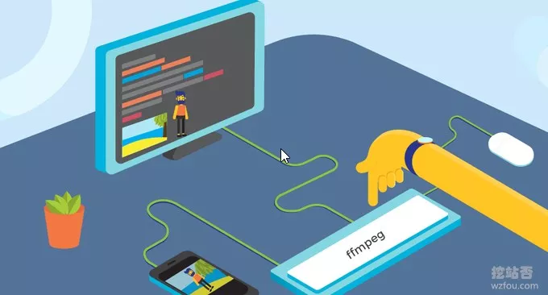
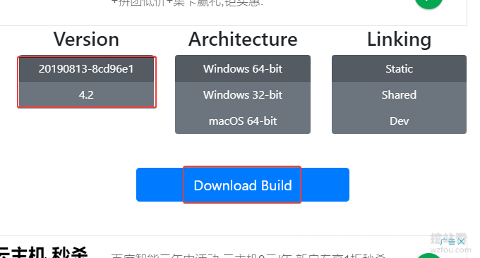
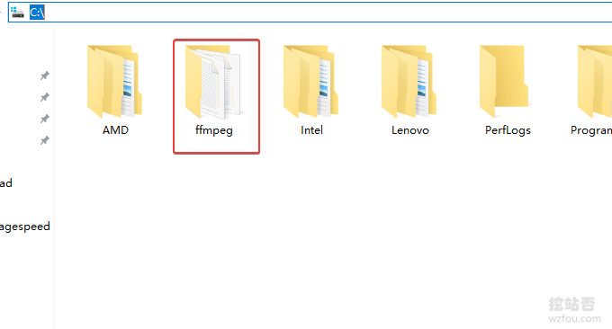
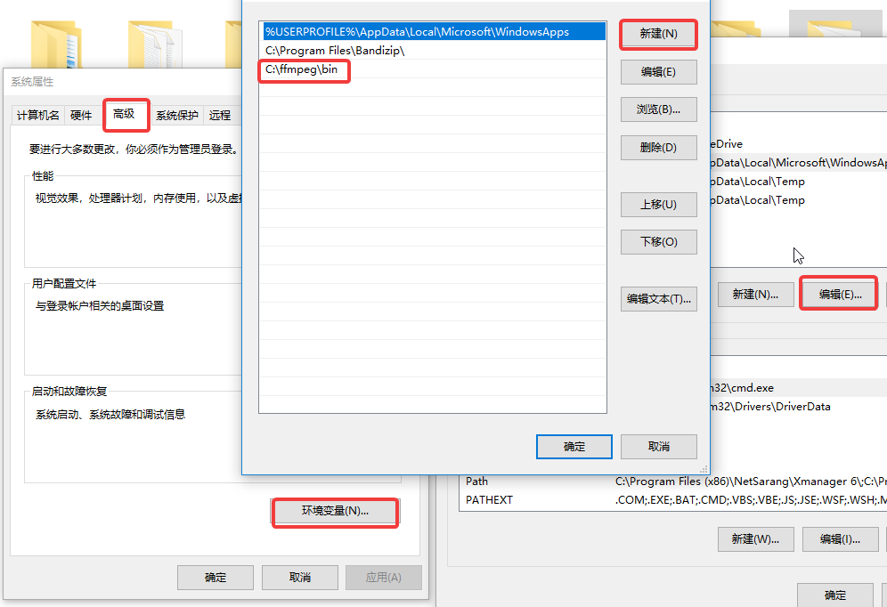
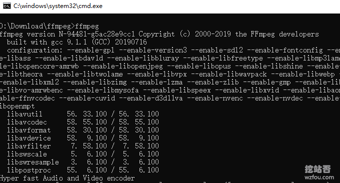
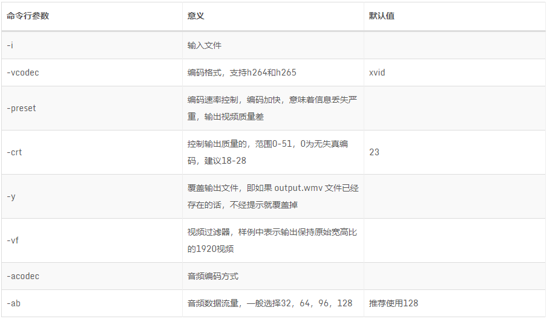
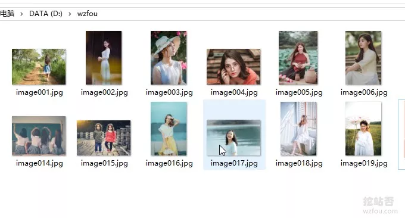

# 免费开源的视频音频格式转换和压缩软件FFmpeg-快速转换格式和压缩视频
FFmpeg可能不少的朋友没有怎么听说过，但是这几个软件中必有一个你曾经用过：暴风影音、QQ影音、KMP、GOM Player、PotPlayer（2010）、KMPlayer。FFmpeg是开源软件，按照协议采用FFmpeg的软件也必需开源，但是这几个影音软件不遵守协定，于是被上了[FFmpeg](https://wzfou.com/tag/ffmpeg/)的“黑名单”了。

[FFmpeg](https://wzfou.com/tag/ffmpeg/)是一套领先的音视频多媒体处理开源框架，采用LGPL或GPL许可证。它提供了对音视频的采集、编码、解码、转码、音视频分离、合并、流化、过滤器等丰富的功能，包含了非常先进的音频/视频编解码库libavcodec，具有非常高的可移植性和编解码质量，是一个多媒体处理神器。

同时[FFmpeg](https://wzfou.com/tag/ffmpeg/)也提供了命令包，可以在Windows、Linux等平台上使用，很多人觉得FFmpeg用起来难，其实只要我们安装好了FFmpeg命令工具后，就可以在Windows上快速实现视频格式转换、视频压缩以及视频与图片之间的相互转换了。

更多的[站长工具](https://wzfou.com/tag/zhanzhang-gongju/)和[站长软件](https://wzfou.com/tag/zhanzhang-ruanjian/)，这里有：

1. [站长必备技能批量给图片添加水印-XnView和美图秀秀批量处理方法](https://wzfou.com/watermark/)
2. [WordPress最佳编辑器:Windows Live Writer安装与使用(Windows 10)](https://wzfou.com/wlr/)
3. [一软在手截图无忧:ShareX截图神器-短小精悍功能完备 自动化任务可截动图截视频](https://wzfou.com/sharex/)

## 一、FFmpeg软件安装

网站：

1. 官网：https://ffmpeg.zeranoe.com/builds/
2. 备用下载：https://wzfou.com/down/ffmpeg64（64位）

进入网站后，选择你要安装的版本，支持Windows 7 和 Mac OS X 10.10及以上。

下载的压缩包解压获得 ffmpeg-xxx-win64-static 文件夹，将其重命名为 ffmpeg ，然后将 ffmpeg 文件夹放置到程序文件夹，例如wzfou.com放置路径为：C:\\。

打开环境变量设置页：资源管理器 > 此电脑 > 右键-属性 > 高级系统设置 \> 环境变量。双击 Path 项进入编辑页，选择新建，将 路径C:\\ffmpeg\\bin 粘贴至输入框后确定保存。（点击放大）

现在打开你的CMD，输入 `ffmpeg` 回车执行，看到有返回信息就说明你安装FFmpeg成功了。

## 二、FFmpeg快速使用

如果不是影音专业需求户，可以只看这一部分FFmpeg的常用操作，后面的更为复杂的操作可“按需观看”。

### 2.1 转换格式

[FFmpeg转换格式](https://wzfou.com/tag/ffmpeg-convert/)最简单最常用的一个命令就是：

ffmpeg -i input.xxx output.xxx

mp4和flv格式转换，命令如下：

ffmpeg -i input.flv output.mp4
#或者
ffmpeg -i input.mp4 output.flv

mp4和webm格式转换，命令如下：

ffmpeg -i input.mp4 output.webm
#或者
ffmpeg -i input.webm output.mp4

### 2.2 压缩视频

[FFmpeg压缩视频](https://wzfou.com/tag/ffmpeg-ya/)的命令如下：

ffmpeg -i input.mp4 -r 10 -b:a 32k output.mp4 #对它降低fps和音频码率的方法大大压缩文件大小，而清晰度不变。
#或者
ffmpeg -i input.mp4 -vcodec libx264 -crf 20 output.mp4 #采用H.264视频压缩算法和AAC音频压缩算法，视频帧率10fps，音频码率32k
#或者是
ffmpeg -i wzfou.mp4 -crf 20 wzfou.mp4
ffmpeg -i wzfou1.flv -crf 20 wzfou1.mp4
ffmpeg -i wzfou1.mp4 -crf 30 wzfou30.mp4
ffmpeg -i 480p.mp4 480p.webm

### 2.3 转换gif

把视频转换为gif，命令如下：

#把视频的前 30 帧转换成一个 Gif
ffmpeg -i input_video.mp4 -vframes 30 -y -f gif output.gif

#将视频转成 gif 将输入的文件从 (-ss) 设定的时间开始以 10 帧频率，输出到 320x240 大小的 gif 中，时间长度为 -t 设定的参数。
ffmpeg -ss 00:00:00.000 -i input.mp4 -pix_fmt rgb24 -r 10 -s 320x240 -t 00:00:10.000 output.gif

## 三、FFmpeg视频操作

FFmpeg的命令参数如下：

**相关说明：**

> -crt: 这个选项会直接影响到输出视频的码率，当设置了这个参数之后，再设置－b指定码率不会生效，crt的取值范围是0-50，0为无失真编码，建议18-28。
> 
> -preset: 指定编码的配置,x264提供了一些预设值，而这些预设值可以通过preset指定。preset主要是影响编码的速度，并不会很大的影响编码出来的结果的质量。

执行完一条转码命令之后，调整-crf参数值，分别设为19、20、28、51，重新转码输出为不同的MP4文件。记录数据，对比如下：

> **源                文件大小      缩减比率**  
> crf = 18       46.3              21%  
> crf = 19       36.7              33%  
> crf = 20       31.2              43%  
> crf = 28       26.5              83%  
> crf = 51       1.25              97%

### 3.1 指定转换格式

一般FFmpeg会根据文件格式选择最合适的容器格式与编码格式，也可以手动指定。例如：

ffmpeg -i out.ogv -vcodec h264 out.mp4
ffmpeg -i out.ogv -vcodec mpeg4 out.mp4
ffmpeg -i out.ogv -vcodec libxvid out.mp4
ffmpeg -i out.mp4 -vcodec wmv1 out.wmv
ffmpeg -i out.mp4 -vcodec wmv2 out.wmv

`-i` 后面是输入文件名。`-vcodec` 后面是编码格式，h264 最佳，但 Windows 系统默认不安装。如果是要插入 ppt 的视频，选择 wmv1 或 wmv2 是最合适了。

另外还有附加选项：`-r` 指定帧率，`-s` 指定分辨率，`-b` 指定比特率；于此同时可以对声道进行转码，`-acodec` 指定音频编码，`-ab` 指定音频比特率，`-ac` 指定声道数，例如：

ffmpeg -i out.ogv -s 640x480 -b 500k -vcodec h264 -r 29.97 -acodec libfaac -ab 48k -ac 2 out.mp4

**原样转换格式**，即保持原来的视频和音频编码格式，命令如下：

ffmpeg -i input.flv -vcodec copy -acodec copy out.mp4 #-vcodec copy 和 -acodec copy 表示所使用的视频和音频编码格式，为原样拷贝。

### 3.2 合并MP4视频

FFmpeg可以将多个视频合并，mp4的合并最好是先转成无损质量的ts，再合并。命令如下：

ffmpeg -i 1.mp4 -vcodec copy -acodec copy -vbsf h264_mp4toannexb 1.ts
ffmpeg -i 2.mp4 -vcodec copy -acodec copy -vbsf h264_mp4toannexb 2.ts
ffmpeg -i "concat:1.ts|2.ts" -acodec copy -vcodec copy -absf aac_adtstoasc output.mp4

### 3.3 更改分辨率大小

如果想要调整视频的分辨率，可以使用以下命令：

ffmpeg -i input.mp4 -filter:v scale=1280:720 -c:a copy output.mp4
\# or
ffmpeg -i input.mp4 -s 1280x720 -c:a copy output.mp4

如果要调整视频的宽高比，可以使用以下命令：

ffmpeg -i input.mp4 -aspect 16:9 output.mp4
#常见的宽高比：16:9、4:3、16:10、5:4

### 3.4 转换视频码率

ffmpeg 码率相关的参数主要有 -minrate, maxrate, -b:v，命令如下：

ffmpeg -i input.mp4 -b:v 2000k output.mp4

#把原始视频转换成 2 Mbps 码率视频。ffmpeg 官方建议，在设置 -b:v 时，同时加上 -bufsize 用于设置码率控制缓冲器大小，让整体码率更加趋近于希望的值，减少波动。
ffmpeg -i input.mp4 -b:v 2000k -bufsize 2000k output.mp4

\# -minrate 和 -maxrate 比较简单，设置码率不要低于或者超过某一个阈值
ffmpeg -i input.mp4 -b:v 2000k -bufsize 2000k -maxrate 2500k output.mp4

### 3.5 剪辑和裁剪视频

想要改变截取部分视频或者保留某一部分视频，命令如下：

ffmpeg -i a.mov -ss 00:00:21 -t 00:00:10 -acodec aac -vcodec h264 -strict -2 out.mp4
#其中 -ss 00:00:21 表示开始剪辑的位置（时间点），-t 00:00:10 表示剪辑的长度，即 10 秒钟

ffmpeg -i a.mov -strict -2 -vf crop=1080:1080:0:420 out.mp4
#将竖向的视频 1080 x 1920，保留中间 1080×1080 部分，其中的 crop=1080:1080:0:420 才裁剪参数，具体含义是 crop=width:height:x:y，其中 width 和 height 表示裁剪后的尺寸，x:y 表示裁剪区域的左上角坐标。比如当前这个示例，我们只需要保留竖向视频的中间部分，所以 x 不用偏移，故传入0，而 y 则需要向下偏移：(1920 – 1080) / 2 = 420

## 四、图片操作

### 4.1 合并图片为视频

首先，将你要合并的图片放在一个文件夹当中，然后重命名为：img001.png, img002.png, img003.png, 这样。

最后执行合并图片为视频的命令：

ffmpeg -framerate 24 -i img%03d.png output.mp4
#或者
ffmpeg -r 0.5 -i  img%03d.jpg  video.avi

### 4.2 图片与视频转换

命令如下：

#将图片序列合成视频
ffmpeg -f image2 -i image%d.jpg video.mpg

#将视频分解成图片序列
ffmpeg -i video.mpg image%d.jpg

#截取一张352x240尺寸大小的，格式为jpg的图片：
ffmpeg -i test.asf -y -f image2 -t 0.001 -s 352x240 a.jpg

#把视频的前30帧转换成一个Animated Gif ：
ffmpeg -i test.asf -vframes 30 -y -f gif a.gif

#在视频的第8.01秒处截取 352*240 的缩略图
ffmpeg -i test2.asf -y -f image2 -ss 08.010 -t 0.001 -s 352x240 b.jpg
ffmpeg -r 0.5 -i d:/tmpImg/image%04d.jpg -i d:/time.mp3 -vcodec mpeg4 d:/video5.avi

## 五、FFmpeg常用命令

以下是ffmpeg格式转换、压缩视频、合并和切割视频等常用命令：

\# 去掉视频中的音频
ffmpeg -i input.mp4 -vcodec copy -an output.mp4
// -an: 去掉音频；-vcodec:视频选项，一般后面加copy表示拷贝

\# 提取视频中的音频
ffmpeg -i input.mp4 -acodec copy -vn output.mp3
// -vn: 去掉视频；-acodec: 音频选项， 一般后面加copy表示拷贝

\# 音视频合成
ffmpeg -y –i input.mp4 –i input.mp3 –vcodec copy –acodec copy output.mp4
// -y 覆盖输出文件

#剪切视频
ffmpeg -ss 0:1:30 -t 0:0:20 -i input.mp4 -vcodec copy -acodec copy output.mp4
// -ss 开始时间; -t 持续时间

#视频截图
ffmpeg –i test.mp4 –f image2 -t 0.001 -s 320x240 image-%3d.jpg
// -s 设置分辨率; -f 强迫采用格式fmt;

\# 视频分解为图片
ffmpeg –i test.mp4 –r 1 –f image2 image-%3d.jpg
// -r 指定截屏频率

\# 将图片合成视频
ffmpeg -f image2 -i image%d.jpg output.mp4

#视频拼接
ffmpeg -f concat -i filelist.txt -c copy output.mp4

#将视频转为gif
ffmpeg -i input.mp4 -ss 0:0:30 -t 10 -s 320x240 -pix_fmt rgb24 output.gif
// -pix_fmt 指定编码

#将视频前30帧转为gif
ffmpeg -i input.mp4 -vframes 30 -f gif output.gif

#旋转视频
ffmpeg -i input.mp4 -vf rotate=PI/2 output.mp4

#缩放视频
ffmpeg -i input.mp4 -vf scale=iw/2:-1 output.mp4
// iw 是输入的宽度， iw/2就是一半;-1 为保持宽高比

#视频变速
ffmpeg -i input.mp4 -filter:v setpts=0.5*PTS output.mp4

#音频变速
ffmpeg -i input.mp3 -filter:a atempo=2.0 output.mp3

#音视频同时变速，但是音视频为互倒关系
ffmpeg -i input.mp4 -filter_complex "\[0:v\]setpts=0.5*PTS\[v\];\[0:a\]atempo=2.0\[a\]" -map "\[v\]" -map "\[a\]" output.mp4

\# 视频添加水印
ffmpeg -i input.mp4 -i logo.jpg -filter\_complex \[0:v\]\[1:v\]overlay=main\_w-overlay\_w-10:main\_h-overlay_h-10\[out\] -map \[out\] -map 0:a -codec:a copy output.mp4
// main\_w-overlay\_w-10 视频的宽度-水印的宽度-水印边距；

\# 截取视频局部
ffmpeg -i in.mp4 -filter:v "crop=out\_w:out\_h:x:y" out.mp4

\# 截取部分视频，从\[80,60\]的位置开始，截取宽200，高100的视频
ffmpeg -i in.mp4 -filter:v "crop=80:60:200:100" -c:a copy out.mp4

\# 截取右下角的四分之一
ffmpeg -i in.mp4 -filter:v "crop=in\_w/2:in\_h/2:in\_w/2:in\_h/2" -c:a copy out.mp4

\# 截去底部40像素高度
ffmpeg -i in.mp4 -filter:v "crop=in\_w:in\_h-40" -c:a copy out.mp4

## 六、FFmpeg软件效果

下面为FFmpeg压缩视频效果演示（视频大小不到1.3MB）：

视频播放器

00:00

00:34

下面为FFmpeg转化为WebP动画图片（不到700KB，点击观看动画）：

## 七、总结

FFmpeg是一个格式转化的神器，虽然没有客户端使用方便，但是只要掌握了几个基本的命令就足以完成MP4、FLV、Gif、WebP等格式的转换和体积压缩，Windows和Linux平台通用。

同时，FFmpeg也适合专业用户使用，如果对视频、音频等格式有指定的要求，可以参考FFmpeg的官方参数，只需要在转换格式和压缩视频中添加几个参数即可，转换和压缩速度非常快。