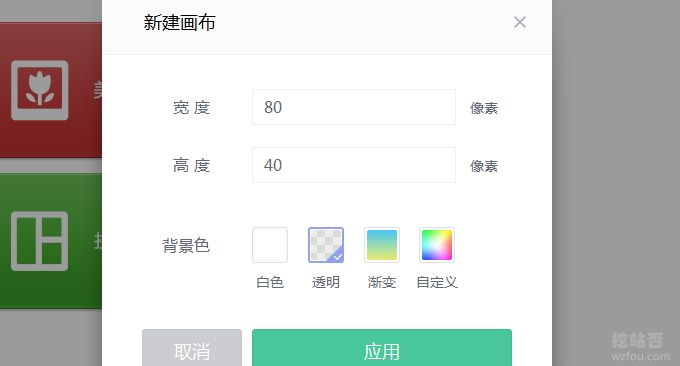
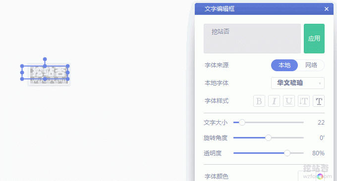
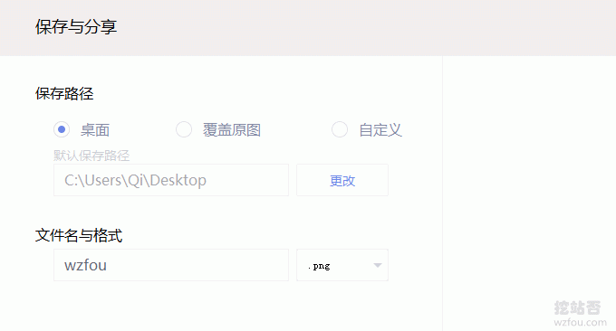
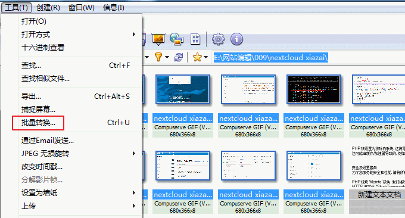
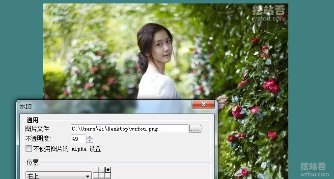
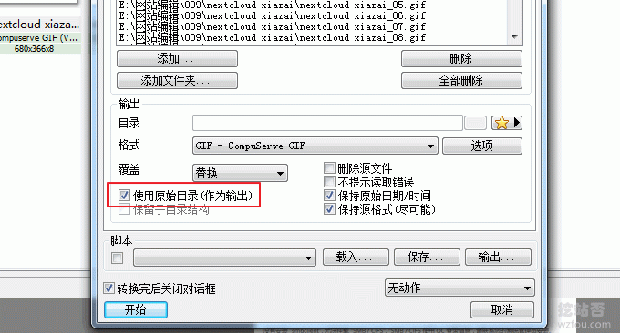
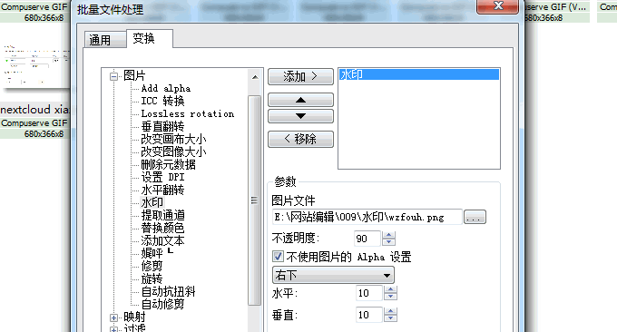
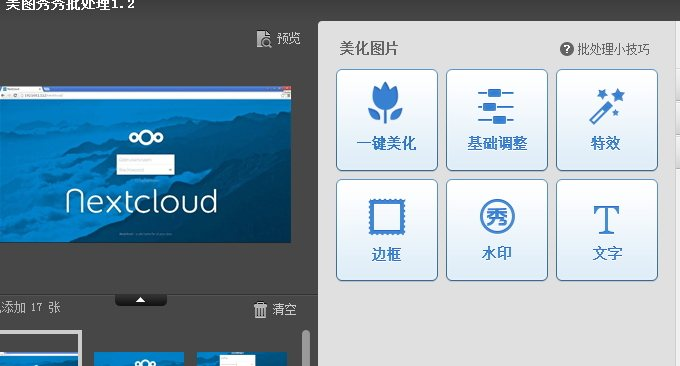
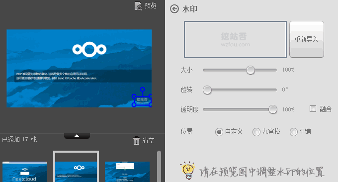

# 站长必备技能批量给图片添加水印-XnView和美图秀秀批量处理方法
之前在写博客时喜欢给图片添加水印，主要原因是看到其它博主也是这样做的。后来嫌图片水印实在太难看了，同时写文章插入的图片也是越来越多，添加水印耗费了大量的时间，也就没有给图片添加水印了。这次之所以“旧事重提”主要是有不少的朋友反馈说挖站否的文章被恶意“抄”了。

这里说的“抄”不是简单的“抄袭”。从我这么多年建站的观察来看，原创的博客其实不用担心那种用机器人复制粘贴的“垃圾站”，因为随着搜索引擎得法的改进，现在垃圾站生存的可能越来越小了。最“难缠”就是人工手动抄袭，它会去掉原文中的链接、关键字，变成“自己的”，搜索引擎也识别不出来。

当前，还流行一种更加高级的抄袭的方法：洗文。类似于“洗牌”，把别人的文章换种描述方式，“洗”成自己的文章，避开了原创标识，别人也不容易看出来。这种方法常见于微信公众号、知乎专栏、头条、门户等文章质量比较高的地方，洗一下就变成自己“原创”的了。对于“洗文”只能投诉了。

今天要说的给图片添加水印的事，这只能是最初的防“盗”措施了，但“有总比没有好”。给图片添加水印我想主要做到两点：一是不能“喧宾夺主”，水印不能影响原图；二是不能太复杂，简单最好，这样可以节省大量的时间。这里就讲讲最常用的XnView和[美图秀秀](https://wzfou.com/tag/meitu-xiuxiu/)批处理图片方法。

想要了解更多的[站长工具](https://wzfou.com/tag/zhanzhang-gongju/)和[建站](https://wzfou.com/jianzhan/)技能，这里还有：

1. [五款优秀的RSS阅读器推荐-附国内外各大RSS阅读器收集整理汇总](https://wzfou.com/rss-readers/)
2. [两款优秀的开源RSS阅读器工具:Miniflux和Tiny Tiny RSS-自建在线RSS阅读器](https://wzfou.com/miniflux-tt-rss/)
3. [生成和订阅任意网站RSS工具-实现RSS全文,邮箱和手机APP提醒](https://wzfou.com/rss-any/)

**PS：2018年5月2日更新，**使用ShareX可以在截图时自动完成水印添加，方便快捷：[一软在手截图无忧:ShareX截图神器-短小精悍功能完备 自动化任务可截动图截视频](https://wzfou.com/sharex/)。

## 一、制作和生成水印

制作和生成水印可以用Photoshop，也可以用美图秀秀等常用的软件，这里以美图秀秀为例，首是新建画布，然后选择背景为透明。

接着就是设计文字或者Logo了，根据你自己的需要设置好文字颜色、大小还有透明度等等。

创建完成后，你就可以保存到本地了。

## 二、XnView批量添加水印

[XnView](https://wzfou.com/tag/xnview/)是一个非常优秀的看图软件，同时软件自带了不少的实用功能，批量转换就是XnView一个非常好用的功能，你可以在几秒种内给几百张图片批量添加上水印。

打开XnView，点击浏览文件，然后全选图片，在“工具”中选择“批量转换”。

在“批量转换”中可以选择使用原始目录作为输出，保持源格式等。

点击“变换”，在这里就可以选择批处理动作了，点击水印，添加水印图片，设置好不透明度，还有水印位置，最后确定即可。

## 三、美图秀秀批处理图片方法

美图秀秀也是一款大家非常熟悉的图像编辑软件，自带的“批量处理”可以帮助快速给大量图片添加水印。首先，打开美图秀秀，选择批量处理。

然后在功能上选择“水印”。

这里就可以添加你的水印图标、设置水印大小、透明度、位置等等。最后点击保存图片即可。以下是wzfou.com的演示：

## 四、总结

给图片添加水印还是挺简单的，对于一些自己原创的图片更应该添加水印保护，以免被人盗用产生不利的影响。而对于图片处理需求量特别大的朋友，批量添加水印最节省时间的，XnView和美图秀秀这些常用软件都自带了添加水印的功能。

虽说给图片添加水印是一个人人都会做的事，但是要想把水印添加地优雅且还能达到“锦上添花”的效果，这个就需要下一定的功夫了。上图就是一个将水印完全融入到图片的优秀示例，有兴趣的朋友可以找一些美图研究一下高手是如何添加水印的。