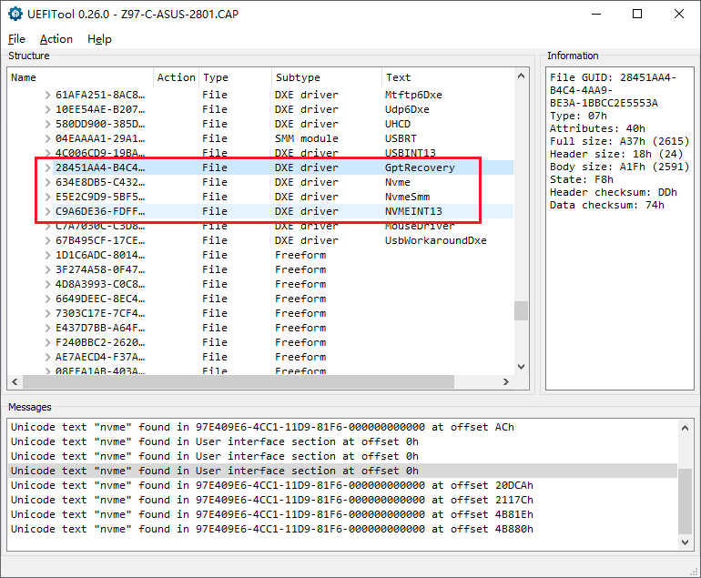

# 家用服务器之装机篇：自制主板 BIOS

https://www.snailium.net/server/bios-modding.html

因为嫌之前用的 Asus Z97-C 上面有太多用不到的 PCI 接口（不是 PCIe），而且仅有的一条 PCIe x16 又没办法分成两个 x8 使用，用来做外部扩展的 Dell H310 只能跑在 x4 模式下面，性能损失较大。于是就去 eBay 买了块很便宜的拆机主板 Asus Z97M/G30AK。

首先这款主板是 mATX 尺寸，机箱里就省出三个 PCIe 插槽的位置可以放 HP SAS Expander 卡。其次这款主板上面的四个扩展槽全部都是是 PCIe，而且可以把 x16 分成两个 x8 使用。完美符合我的需求。

但是，有个问题，这主板的 BIOS 没有 NVMe 支持，也没有内置 SLIC（很怀疑之前机器上怎么装的 Windows）。于是，只能通过修改 BIOS，至少加入 NVMe 支持。

## I. 备份 BIOS

所需工具：[AfuWinX64](https://www.bios-mods.com/tools/index.php?dir=AMI Flash Tools (Aptio and AMI)%2F)

```
afuwinx64.exe G30AK.ROM /O
```

[](http://www.snailium.com/usr/uploads/2019/06/1978194745.png)

## II. 加入 NVMe

所需工具：[UEFITool](https://github.com/LongSoft/UEFITool/releases)

通过对比 Z97M 和 Z97-C 的 BIOS，发现 Z97M 缺少了四个跟 NVMe 相关的模块。

[](http://www.snailium.com/usr/uploads/2019/06/1464972811.png)

- GptRecovery
- Nvme
- NvmeSmm
- NVMEINT13

从 Z97-C BIOS 里面抽取上面四个模块，并加到 Z97M BIOS 中 USBINT13 模块下面。

[](http://www.snailium.com/usr/uploads/2019/06/2864257953.png)

这样 NVMe 支持就加好了。

## III. 加入 SLIC

所需工具：[PhoenixTool](https://mega.nz/#!ZxBDmAxK!f44DavumKImYgtIwmFvhHxQQSpAA11JEvOD8B1c8T74)

这方面教程太多了，在这里就不说了。就是强调一下只需要填写以下几项，其他留空。

- Manufacturer
- SLIC
- KEY：9C134SIMF51GYI8HEDJ2F47ZW

[](http://www.snailium.com/usr/uploads/2019/06/3189944562.png)

## IV. 刷写 BIOS

所需工具：[AfuWinX64](https://www.bios-mods.com/tools/index.php?dir=AMI Flash Tools (Aptio and AMI)%2F)（3.06 版本或更低）

Z97M 这款主板带有 BIOS 写入保护，所以改版的 BIOS 没办法通过 EzFlash 刷入。最简单的办法就是利用 AfuWin 的工程模式。

```
afuwinx64.exe G30AK.ROM /GAN
```

[](http://www.snailium.com/usr/uploads/2019/06/2043730436.png)

注意：AfuWin 3.07 版本开始去掉了所有未公开的功能，其中包括`/GAN`选项。所以只能使用老版本的 AfuWin。

## V. 会出现的问题

### AfuWinX64 提示文件大小错误

[](http://www.snailium.com/usr/uploads/2019/06/3713706379.png)

所需工具：[UEFITool](https://github.com/LongSoft/UEFITool/releases)

遇到这种情况说明修改时没有使用备份 BIOS，而是使用官方 BIOS 文件（.CAP 文件）。要解决这个问题需要[对 CAP 进行脱壳处理](https://www.win-raid.com/t286f16-Guide-Deprecated-Flashing-modified-AMI-Aptio-UEFI-using-AFU.html#msg3577)。

具体做法就是

1. 使用 UEFITools 打开 CAP 文件
2. 右键单击最顶层的 AMI Aptio capsule
3. 选择 Extract body... 另存为 .ROM 文件

[](http://www.snailium.com/usr/uploads/2019/06/2786189352.png)

### 网卡的 MAC 地址变成 88-88-88-88-87-88

所需工具：Rufus，[EEUpdate](https://www.dropbox.com/s/u0hsje73rl7v6w7/ChangeMac.zip?dl=0)

这也是因为没有使用备份 BIOS，造成 MAC 地址被清掉了。要恢复的话，首先要找到正确的 MAC 地址。G30AK 的 MAC 地址写在 ATX 24 针接口侧面的贴纸上。然后根据[这个视频教程](https://youtu.be/sIrgdNk35TU)重新写入 MAC 地址就可以了。（[原教程](https://rog.asus.com/forum/showthread.php?101242-How-to-change-fix-and-flash-your-Mac-Address-Asus-Motherboard-Intel-NIC)）

------

## VI. 其他资料

- [PhoenixTool 发布页面](https://forums.mydigitallife.net/threads/tool-to-insert-replace-slic-in-phoenix-insyde-dell-efi-bioses.13194/)