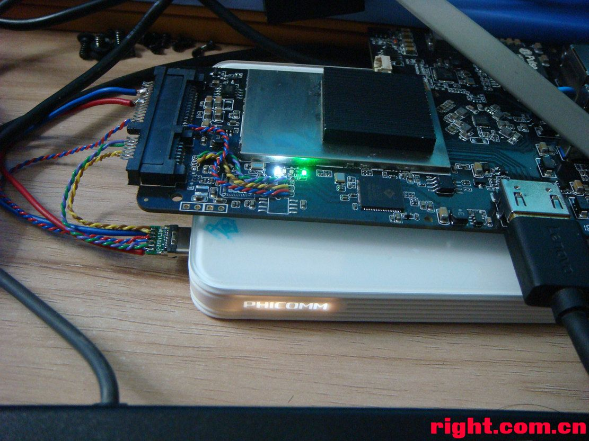
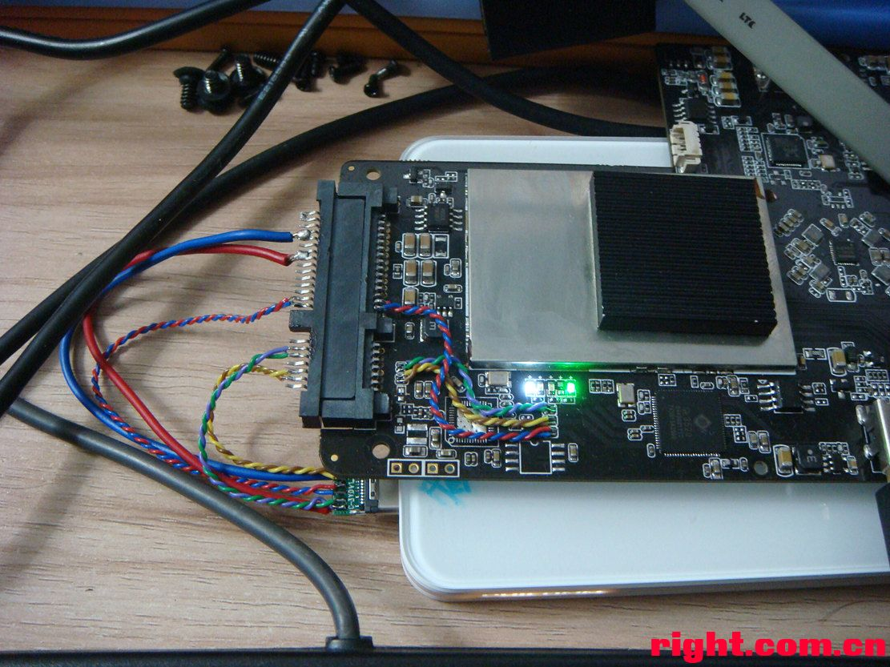
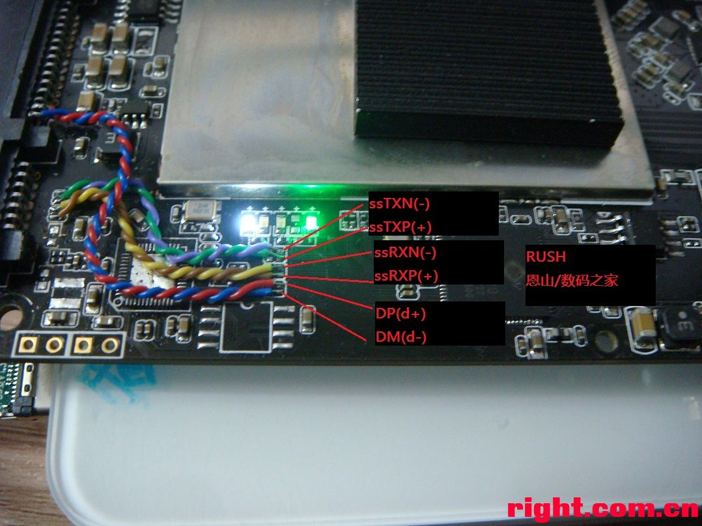
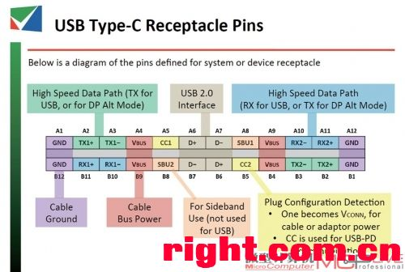
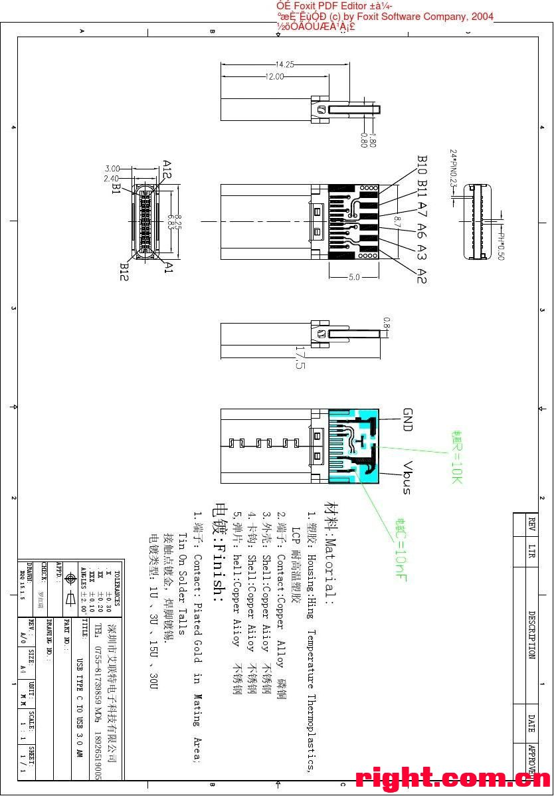
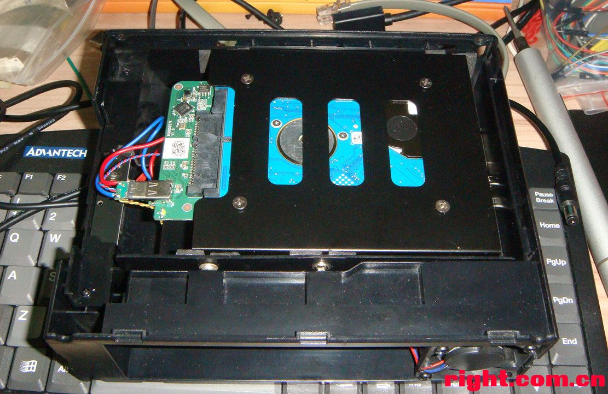
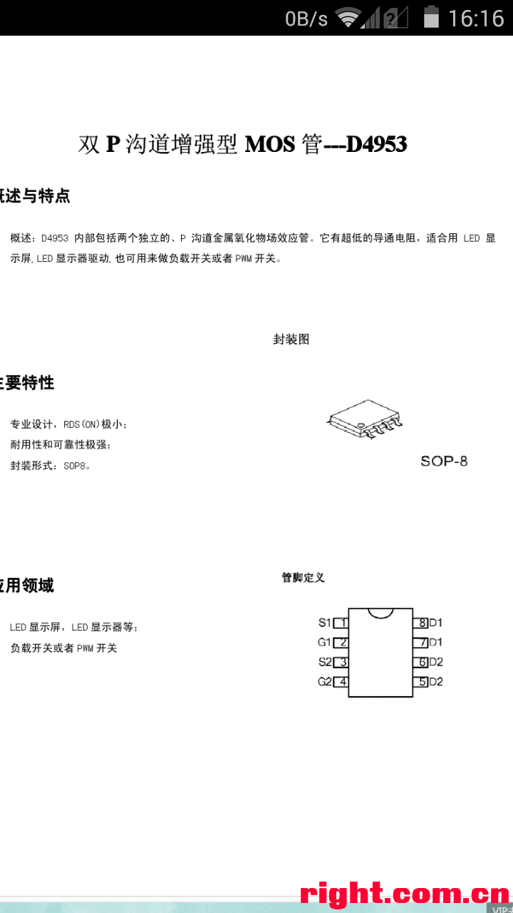
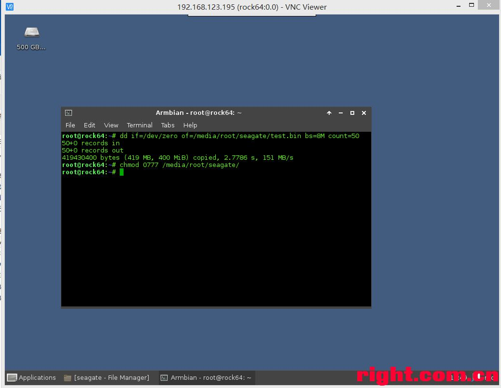
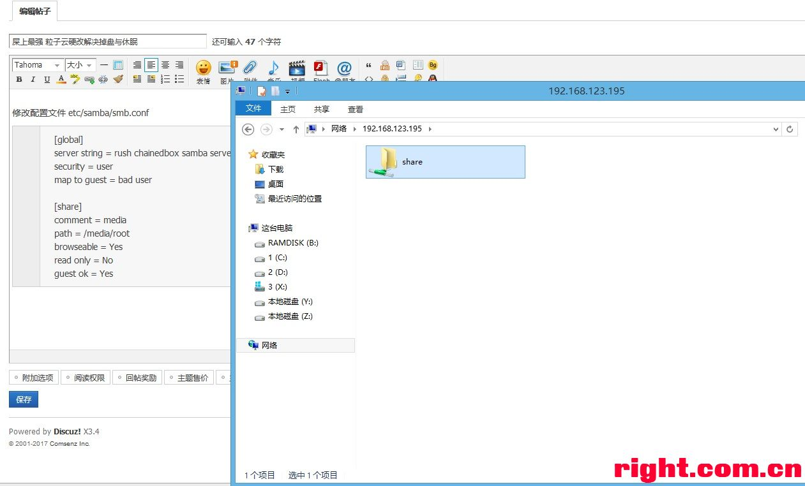
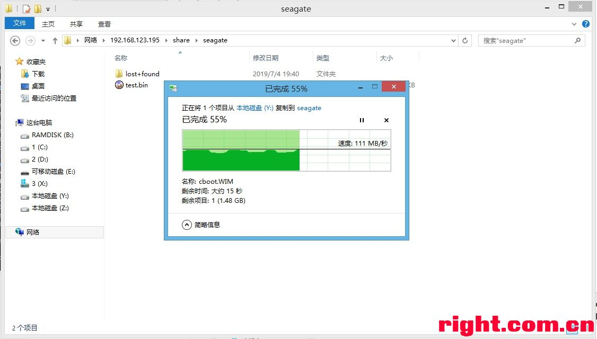

## 屎上最强 粒子云硬改解决掉盘与休眠

https://www.right.com.cn/forum/thread-777370-1-1.html

思路：粒子云本来就是把“主板”和“3.0移动硬盘”合体的产物，可惜内置的移动硬盘不兼容LINUX系统的UAS高速驱动程序，我们通过废除原有移动硬盘，换成完全兼容LINUX的H1移动硬盘，解决这个问题。

材料：垃圾粒子云，H1硬盘（电路板），SATA7+15母头一个，tpC插头一个，导线，风枪和烙铁

步骤1：
拆除原有USB转SATA芯片，然后引出它占用的USB3.0接口
可以解决：内置硬盘不支持UAS的问题
我是放在SATA口上面，反正他就是一个接口，你们具体怎么做反正能实现功能就行
最后一张图片附上实测的 usb 定义，请注意ssTX/S-S RX需要交叉！！主板的TX要接到 H1 的RX 上面去！

步骤2：短接硬盘控制MOS
为什么：即使通过gpio控制管理了这个MOS，如果系统reboot/halt前没有执行hdparm -y 休眠，硬盘将还在转动时断电（敲盘）

改造后硬盘自动休眠，hdparm -y 休眠，随便休眠！！！！！

更新：已经把他装进原来的盒子啦！并且基于armbian制作了奔放的无需用户密码的samba公交车NAS

搭建不需要密码的samba服务器

apt-get install samba

chmod 0755 /media
chmod 0777 /media/root

修改配置文件 etc/samba/smb.conf

1. [global]
2. server string = rush chainedbox samba server
3. security = user
4. map to guest = bad user
5. 
6. [share]
7. comment = media
8. path = /media/root
9. browseable = Yes
10. read only = No
11. guest ok = Yes

*复制代码*

 

