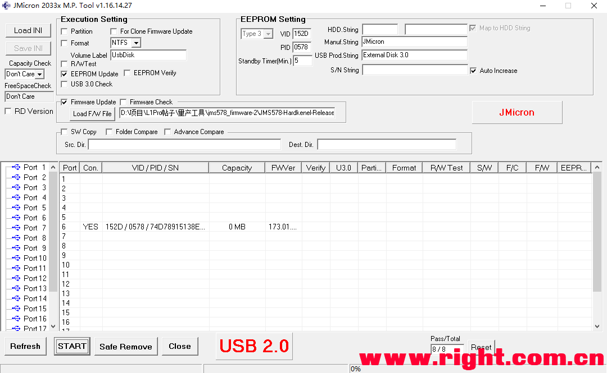
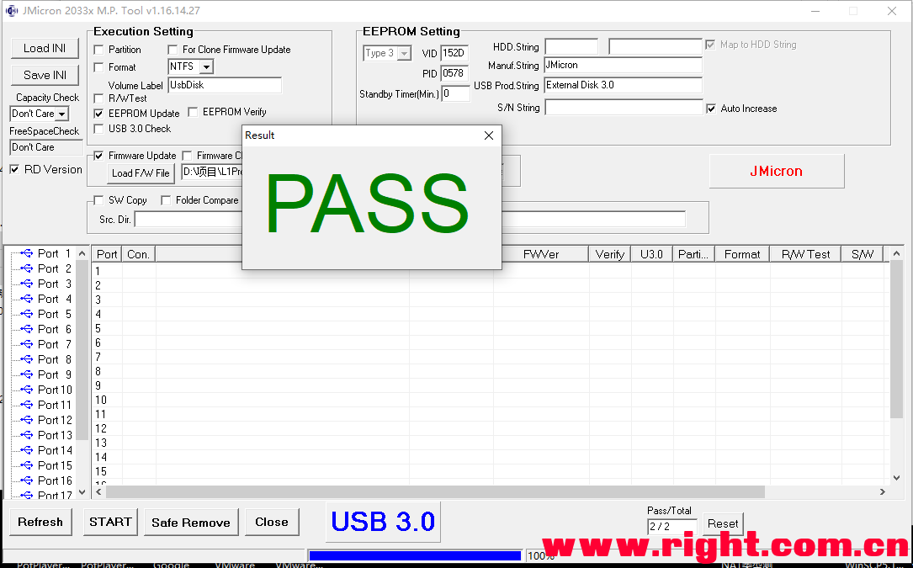

## 我家云免硬改不掉盘 保姆级使用方法

https://www.right.com.cn/forum/thread-4053648-1-1.html

相关帖子
[我家云硬改折腾记录+硬改指难+改USB2.0或换JMS578带3.5盘+omv设置休眠+风扇降噪](https://www.right.com.cn/forum/thread-3486158-1-1.html)
[我家云armbian下升级修改JMS578的睡眠时间](https://www.right.com.cn/forum/thread-4055465-1-1.html)
由于网友反应之前的我家云硬改的帖子文字多，毫无章法，看着就是头痛；特别推出保姆及教程。
解决办法购买JMS578芯片的硬盘盒子连接外置USB3.0

1稳定不掉盘；
2支持2T以上大硬盘；
3支持omv设置休眠（前提是硬盘支持休眠设置，我有一块西数500g的2.5蓝盘就不支持休眠设置,最新发现量产时候填入的休眠时间决定这块硬盘的休眠，其他操作无法更改）；
4USB3.0 不影响硬盘读写速度；
5缺点占用外置USB3.0接口；（想要多余USB3.0的朋友可以增加USB3.0 hub，最好带5v供电口。 ）
6缺点放弃内置硬盘位；

既然是保姆级教程就教教大家量产JMS578硬盘盒，下面是工具和固件；
附件：

 [jms578_firmware-2.7z](tools\jms578_firmware-2.7z) 

1 “RD Version” 打勾，密码“jmicron”
2 打勾“Firmware Update” ，然后点击“load F/W File” 加载最新固件“JMS578-Hardkenel-Release-v173.01.00.02-20190306.bin”文件
3 “EEPEROM Update”打勾，“standby Timer”值为“0”（0表示取消休眠，需要不支持OMV设置休眠时间的硬盘，建议休眠时间输入11，单位分钟，猜测量产后omv无法修改这个值，这个提供不支持休眠设置的硬盘，有效时间3-11min)
4 点击“start”开始升级固件并量产。（如果硬盘盒没有插硬盘量产，PASS通过会较长时间，等待就好）

