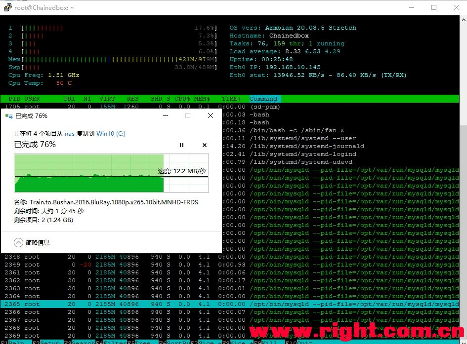
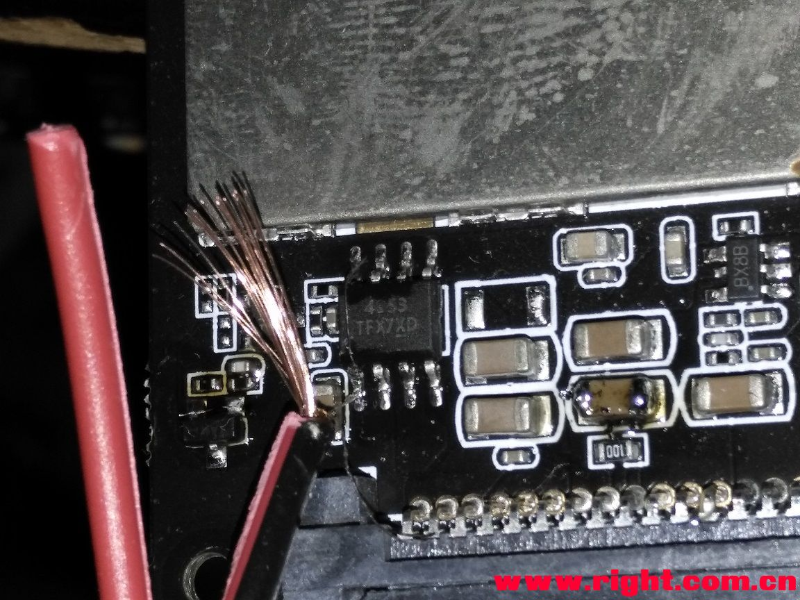

## 我家云硬改内置硬盘不掉盘 sata转USB2.0 保姆级硬改基础篇

https://www.right.com.cn/forum/thread-4053587-1-1.html

由于网友反应之前的我家云硬改的帖子文字多，毫无章法，看着就是头痛；家中还有一台我家云待改，特别推出保姆及硬改教程。本篇是基础篇，追求最简单的硬改，硬改后（在此硬改基础上还可以进一步硬改期待高级篇）：
1稳定不掉盘，强调一下12v3a 电源够用了，用插排实测日立3t 3.5硬盘 启动时功率最高27w，硬盘旋转时11W左右；
2支持2T以上大硬盘；
3支持omv设置休眠（前提是硬盘支持休眠设置，我有一块西数500g的2.5蓝盘就不支持休眠设置）；
4但是硬盘读写速度降低，此篇方法硬改后如图（最新发现，关掉下图中 “启用异步I/O（AIO）支持” 我家云到Win10速度会有提升，30MB/s左右，由于改了USB3.0，现无法测试速度了）：

我家云掉盘原因：
1 硬件内置硬盘供电bug，断电导致内置硬盘掉盘。（随主板温度升高内置硬盘供电电流减小）
2 sata转3.0芯片bug，导致内置硬盘掉盘。
硬改方法说明：
1 电源硬改 短接负责控制电流的pmos，黄接黄，红接红，如图：（简单粗暴，reboot时不会因为掉电导致硬盘保护，用细铜丝短接即可，唯一问题刷机时候硬盘会启动，如果你的铜丝太细可能会烧掉，所以铜丝粗细要自己把握，觉得自己铜丝太细可以并联2，3根，用细铜丝的目的是方便焊接和焊接后可以起到保险的作用）

2 强制让USB转SATA芯片中作在USB2.0模式，去掉红框中4个电阻。

以上完成硬改，我的建议是大家可以请修手机的师傅帮帮忙改一下即可。
但是既然是保姆级教程，应网友需求下面进入详细操作过程。
准备工具及耗材
十字螺丝刀（头痛除了知道是7310外还真不知道是多大的）

烙铁 （这个不是广告很重要，个人推荐黄花内热式20W非恒温电烙铁，如果你追求需要更好的烙铁，千万不要购买分离式恒温烙铁，直接一步到位T12，T13恒温烙铁，我目前用的是T12，但是为了降低硬改的成本，这次硬改我特意翻出了好久没有使用的20W黄花电烙铁为大家踩坑。下面测试一下室温，烙铁通电较长时间后最高的温度。在室温十多度的环境下20w黄花NO。420的最高温度稳定在340度，这是个比较安全的温度，烙铁接触焊点温度最好不要超过2秒，我家云板子上的锡溶解温度220左右。）

2020年11月16日由于普通烙铁超低感应电（实测最高33V真有效值感应电）的优势，拥有T12焊台的我还是喜欢用普通内热黄花420C，因为对芯片跟安全，尽管真有效值高达124V感应电T12焊接芯片也没有翻过车，但用T12的时候心总是怕怕的。前几天又下单买了个全新的NO.420C,回来测温发现稳定温度高达450度左右，如下图，这个温度焊接我家云肯定要搞坏焊盘；

所以买新烙铁NO.420C的朋友建议用烙铁时串联一颗整流用的二极管1N4002，给烙铁降温；

串联二极管时建议正规一些，用一个插板转接，上图是为了简单的测试温度零时搭的，温度稳定后316度左右，我平时用T12时也就250度，非恒温烙铁316度也是相当好用的，焊接我家云温度够了

焊锡丝 推荐含锡63%的183度融化的普通焊锡丝，对焊锡丝要求不高，用量不多，一小段足够。
助焊剂 重中重 用它代替松香等，助焊膏是BGA焊接时使用的助焊神器，焊接时侯涂适量可帮助锡在器件引脚间分离清晰，尤其适合小焊点（网友推荐Pop707>UP78>om338pt>阿毛易修M50>Uv223，处于成本考虑这里推荐阿毛易修M50）

多芯铜线一小段

卫生纸
剪刀或斜口钳，可以用刀尖剪短细铜丝的工具。
实操作
练习焊接，如果你是第一次使用烙铁，请练习，不要直接用我家云的板子操作；拆机什么的就略过了；重点就是焊接操作。
1 剥开适量长度铜线用来短接pmos芯片的，什么工具都行，指甲刀，或那个直接牙咬随便；
2 烙铁头上锡（一般新烙铁都吃锡的），先涂适量助焊膏到烙铁焊锡面，烧热烙铁，焊锡丝接触烙铁头，融适量锡到烙铁头；

3 细铜丝上锡;拨离两根铜丝，在铜丝上涂一点点助焊膏，用烙铁头上的锡，在铜丝上滑动,结果如下图

4 待焊接芯片除氧化层，芯片引脚涂适量助焊膏，卫生纸搽干净烙铁头，去掉多余的焊锡，这时烙铁头是被一层薄薄的锡包裹（注意卫生纸叠几层不要烫到手），去融化要焊接的4个引脚上的锡，烙铁不可在引脚上用力压，应该在引脚上轻轻拖动，接触时间不可超过两秒，如何判断锡已经融化，暗淡的焊锡变亮，有反光想镜子，锡就全融化了。烙铁离开后可能又暗了，不用管。

5 短接poms，芯片引脚上再涂点助焊膏（如果还残存又助焊膏可以不要再加），先用细铜丝焊接上面引脚，（如果烙铁头烧黑要重新上锡，擦掉多余的焊锡，）经过两边上锡和涂助焊膏应该非常容易就焊接好了，可以亲亲拉拉铜线看是否焊接牢固，把铜线拉直，焊接下面的引脚，用精致的工具剪断铜丝；再完成另外一根焊接。

6 拆焊电阻 电阻上涂上助焊膏，烙铁分别融化电阻两端锡，这时可用堆锡法，用63%焊锡丝给电阻两端加一点点熔点较低的锡，这时烙铁头可用同时接触电阻两端，电阻两端融化烙铁头不用费力电阻就移动了，用烙铁头将它轻轻把拨开到没有焊盘的地方，电阻就会粘到烙铁头上了。由于焊盘小烙铁不能长时间接触，每次接触不要超过1秒，时间长可能烫掉焊盘。

7 安装测试。
硬改完后想改USB3.0的可以继续等等，保姆级硬改高级篇，透露一下，为了给大家踩坑，我硬改USB3.0翻车了，USB3.0 HUB 可能已经烧掉。高级篇将晚一些，因为要换下图中右面的大芯片，6块钱又没有了。

本贴不设置任何顶贴的机关，如果有什么问题，可以反馈我慢慢改进。
想要了解更多的可以看看我之前乱七八糟的帖子，谢谢所以人的付出。
我家云硬改折腾记录+硬改指难+改USB2.0或换JMS578带3.5盘+omv设置休眠+风扇降噪
https://www.right.com.cn/forum/thread-3486158-1-1.html