## 我家云硬改折腾记录+硬改指难+改USB2.0或换JMS578带3.5盘+omv设置休眠+风扇降噪 

https://www.right.com.cn/forum/thread-3486158-1-1.html

今天20201003 由于网友反应之前的我家云硬改的帖子文字多，毫无章法，看着就是头痛；家中还有一台我家云待改，特别在出两篇保姆及硬改教程。

我家云免硬改不掉盘 保姆级使用方法
https://www.right.com.cn/forum/thread-4053648-1-1.html
我家云硬改内置硬盘不掉盘 sata转USB2.0 保姆级硬改基础篇
https://www.right.com.cn/forum/thread-4053587-1-1.html
我家云硬改内置硬盘不掉盘 加西数2.5硬盘盒 JMS578芯片 sata转USB3.0 保姆级硬改高级篇
https://www.right.com.cn/forum/thread-4054845-1-1.html
为了给填给大家挖的坑，我现在坑中，GL3520芯片已烧，如果踩坑成功将，推出高级篇。
踩坑，难免误伤自己，购买的GL3520 USB 3.0 HUB 芯片一直没有发货，硬改高级篇只能往后推推了，现在有空准备科普一下Ride_Wind大佬打包的镜像，水平有限欢迎指正：

科普一下Ride_Wind大佬打包我家云最新固件使用
https://www.right.com.cn/forum/thread-4053775-1-1.html
我家云轻NAS兼顾docker旁路由
https://www.right.com.cn/forum/thread-4053820-1-1.html

今天20200820，硬改内置硬盘芯片后经过长时间的使用，我可以肯定的告诉大家，我下文的硬改方案是成功的！但是就技术和成本而言挡住了大家的实现；
最简单使用方法我家云稳定挂硬盘的方法，是购买JMS578芯片的2.5硬盘盒子直接连接我家云的USB3.0接口；一般硬盘盒默认固件是1分钟休眠，需要OMV修改定时休眠的朋友可以，参考我下面文中的JMS578量产软件和方法。（强调一下为什么用JMS578，因为是最新，最稳，芯片温度最低的方案，不推荐其它芯片。）像我这样有强迫症，想硬改又没动手能力的朋友可以请那些修手机什么的师傅帮一下忙，自己还是不要随便动手。

正文（硬改内置硬盘的方法）（焊接内部usb3.0硬改很难，推荐Uv223焊油，上电前检查芯片到芯片的线是否正确，不能错误，短路。不然会烧的掉USB3.0 Hub 接口1， 别问我怎么知道的。）
经过十来天的各种折腾，我的结论是我家云硬改没有完美的方案，不是没性能就是高难度，折腾后的经验告诉我，我家云有两大硬件Bug，
一是温度升高内置硬盘掉电问题（导致掉盘），（具体表现是裸奔不易掉盘，装上壳子后掉盘严重）；
二是GL3321G带芯片固件跑不稳（导致掉盘），不带芯片固件系统休眠成问题；
三据网友反映，粒子云的网卡刷Ride_wind大佬最新的Armbian_Mix_With_Navi_1213，网卡不能识别（导致没有ip或叫路由器没有设备），据说是网卡芯片版本问题，我未证实建议大家购买刷好Armbian_Mix_With_Navi_1213可以识别的机器。
针对以上问题说说硬改方案。
硬改第一步，内置电源硬改，由于我家云原装硬盘功耗很低，要是我们自己装的硬盘功耗高，温度稍微升高就会导致内置电源供电减小，导致硬盘掉电，这时需要硬改内置硬盘供电。网上流传的硬改方法是短接Pmos，按照图中8角芯片的图，用细铜丝短接，红色画线12v入短接到红色画线12V出，黄色画线5v入短接黄色画线5v出。或者保留Pmos控制功能，我提供我的硬改方法，在如图三极管 Q1 e极和b极处并联1K电阻或一根细铜丝（我用白色细线画出，建议直接并联细铜丝），另外保留pmos的硬改方案时，用细铜丝短接三极管时能提供最大电流，带动日立3T硬盘，5V450mA 12V850mA没问题，温度升高后会出现复制断流的情况，我是单独给5V并联2200uf电容解决。（用5V1A的2.5的硬盘还是会在出现掉电的情况，如果这时候还要使用功率较大的2.5的硬盘，建议细铜丝短接pmos 5V端或者给sata电源接口5V输出电容并联2200uF 耐压大于等于6V的电容，注意正负极，并联电容的方法我没有实际验证，主要是提供给偶尔会因读写量大掉盘的朋友提供的方法。注意细铜丝短接三极管是从控制电路入手增加SATA电流输出能力，如果你的2.5盘在短接三极管后，直接带不动那么再并联电容也是无效的了），还有的电源问题下面文字还有详细的记录或看我 20200318 的失败历史纪录；
简单总结一下硬改第一步
1 不保留pmos控制功能 直接短接Pmos，用细铜丝短接，红色画线12v入短接到红色画线12V出，黄色画线5v入短接黄色画线5v出。
2 保留pmos控制功能 先用细铜丝短接如下图三极管 Q1 e极和b极提高12v5v供电电流，由于5V部分电流要求较高，再用细铜丝短接如下图pmos 5V （黄色画线5v入短接黄色画线5v出）建议5v短接，或者非常想保留开关功能的朋友，可以给sata电源接口5V输出电容并联大于等于2200uF 耐压大于等于6V的电容，注意正负极。
3 是否保留Pmos功能下面会有说明，这里我建议保留。
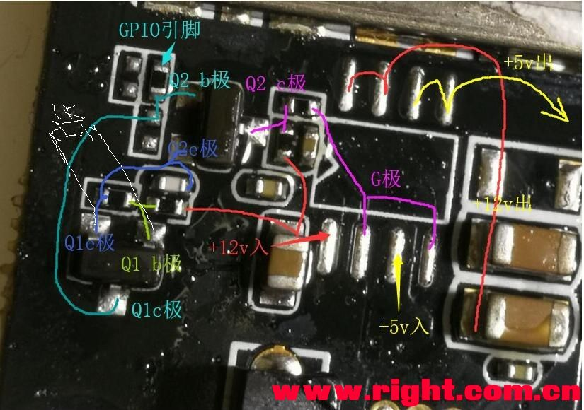
经过硬改第一步，我家云配合不掉盘固件稳定性会大大的提高，但是根据我的个人经验，高速复制文件时候，掉速3回就会再次发生掉盘问题，这个时候掉盘就是GL3321G和GL3321G的固件导致，固件芯片是FM25F01；
于是硬改第二步有了几种硬改方案：
改法1：简单的去掉下图中红框中4个0欧电阻，让GL3321G工作在USB2.0状态，好处是硬改简单，不影响我家云的所有功能，缺点是硬盘工作在USB2.0状态，速度太慢，我测试了一下读共享目录速度是28MB/s，写共享目录15MB/s左右。这个改法建议电源保留Pmos控制功能，不然上电开机会敲盘（由于保留了PMOS的控制功能，很多系统没有很好的支持PMOS控制功能，所以不能reboot了，会敲盘。这也是我的硬改中留下的唯一问题。总的来说完美了）；
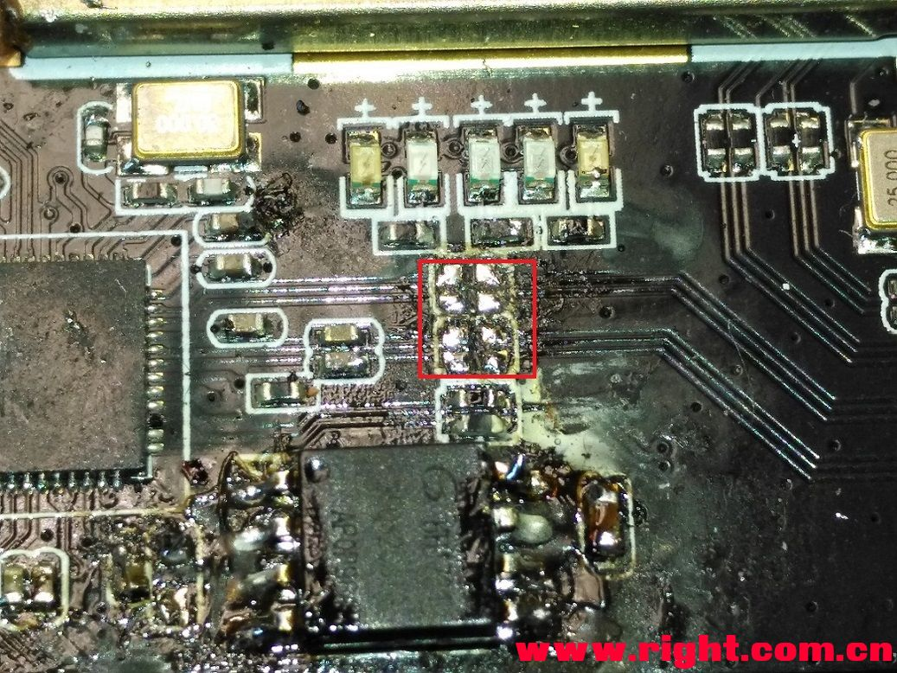
改法2：wdmomo大佬的方法，拆掉GL3321G的固件芯片，具体方案百度一下；由于GL3321G片内固件不完善，会导致睡眠功能有问题，所以wdmomo大佬的我家云固件可能添加了复位机制，另外据网友说不支持大于2T的硬盘，我没使用过，更多具体细节不清楚。
改法3：自己跟换USB3.0转sata板，由rush大佬提供https://www.right.com.cn/forum/thread-777370-1-1.html。io控制pmos的问题，后面的固件关机已经解决（如Ride_wind大佬Armbian_Mix_With_Navi_1213），但是reboot还是会紧急保护磁头。 下面我将用JMS578硬改我家云带日立3t硬盘，之前用ASM1053硬改失败，后来决定购买JMS578硬改，1：JMS578芯片使用时候温度低（有条件的还是建议添加散热器），2：固件多，我硬改后就选用最新固件成功实现休眠，启动也正常识别硬盘。下面是换芯片硬改的具体步骤：
1：我买的是WD的2.5硬盘的板子，刚开始给寄了个IS621，当然是用不了，而且死机，后来联系客服才给我发JMS578，所以购买时一定要联系好；再建议买一条配套的USB3.0的线，用来焊接用。
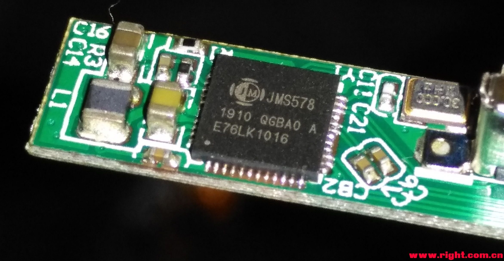
2：到手后先用sata电源线焊接在硬盘板子上（下面有图），方便我家云供电，然后usb连电脑刷固件，带日立3.5 3t硬盘（或者说功耗较高的硬盘）必须要硬改我家云内置硬盘供电电源（上面硬改第一步）；我是先升级（百度一下jms578的升级固件，有详细的教程，建议备份一下原始固件），后用量产软件修改eeprom（eeprom修改前可以截图备份一下参数），插usb3.0测试功能正常再硬改。附JMS578 19年3月固件，硬盘休眠时间像是10分钟固定时间，由eeprom决定的，可以百度jms578量产工具修改休眠时间为30，下面给出在线量产软件，使用要用电脑usb连接jms578带硬盘。经过电脑量产后不但我家云正确识别了硬盘，还可以omv设置休眠时间，但是发现改了eeprom后，会出现假掉盘现象，后来我重新挂载内置硬盘，才正常，可能是修改eeprom后需要从新挂载硬盘，吓我一跳，以为又失败了。
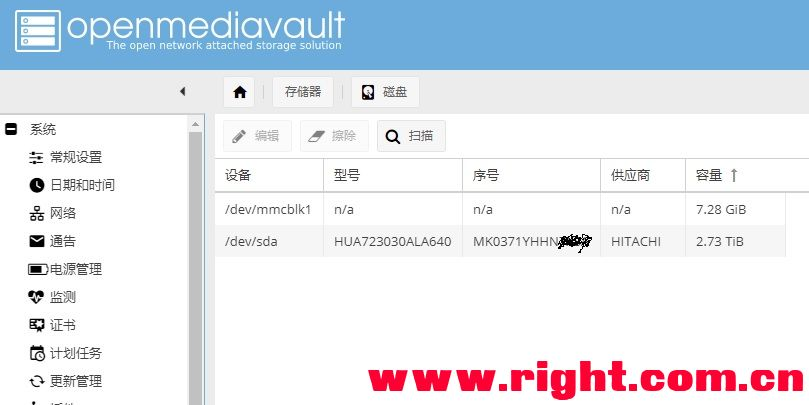

附件：

 [JMS578-Hardkenel-Release-v173.01.00.02-20190306.rar](tools\JMS578-Hardkenel-Release-v173.01.00.02-20190306.rar) 

 [jms578_firmware-2.7z](tools\jms578_firmware-2.7z) 

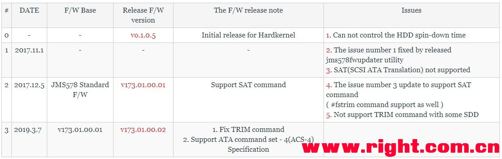
3：焊下图中红框中桥接电阻，断开GL3321电源；
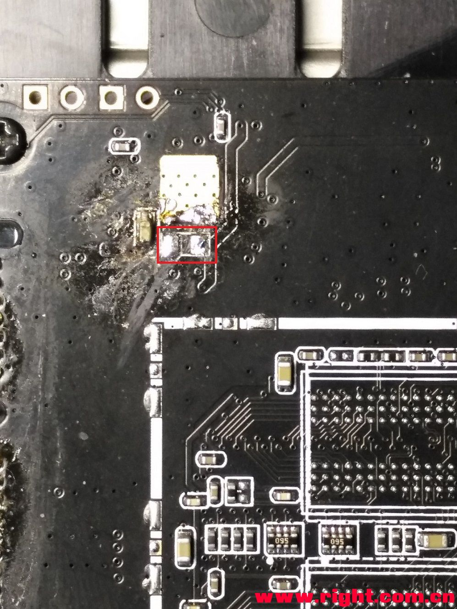
下面是具体连接图，硬盘电源建议用SATA电源接口焊接在JMS578板上，焊接好数据线后，建议用轧带固定数据线在sata接口上。
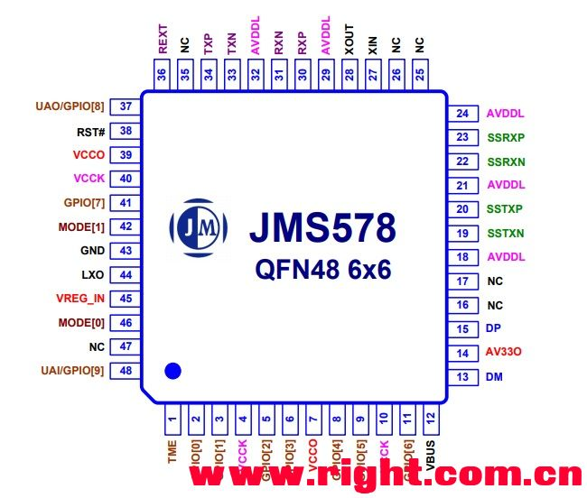
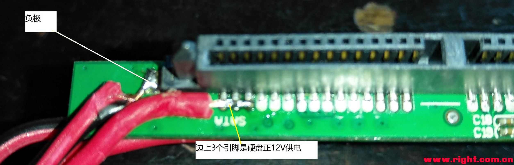
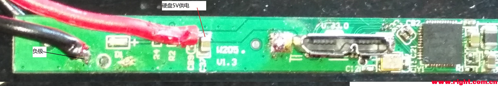

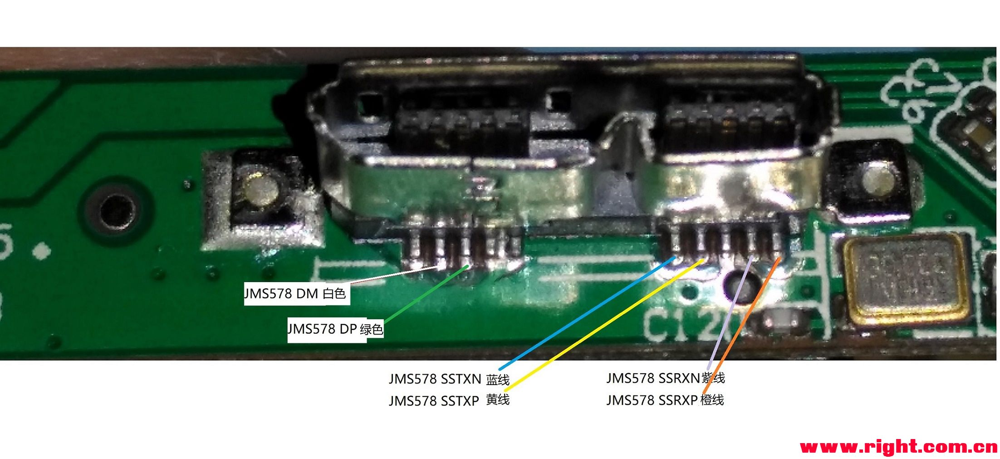
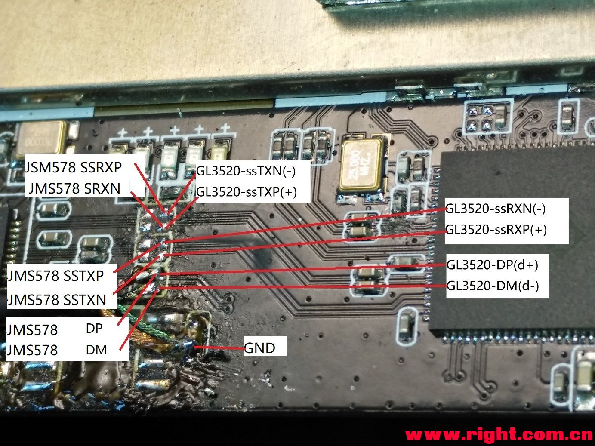
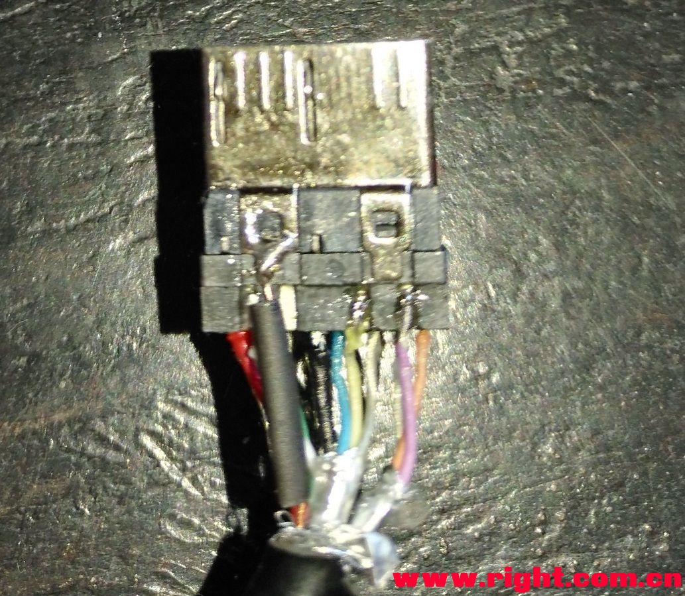
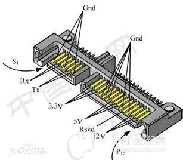

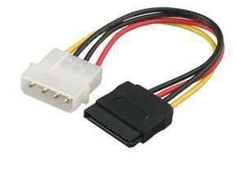
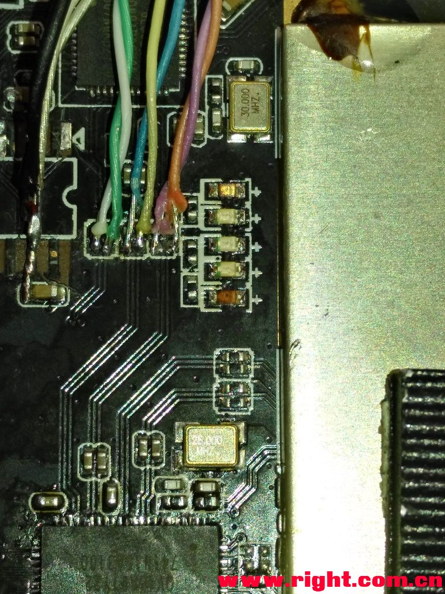
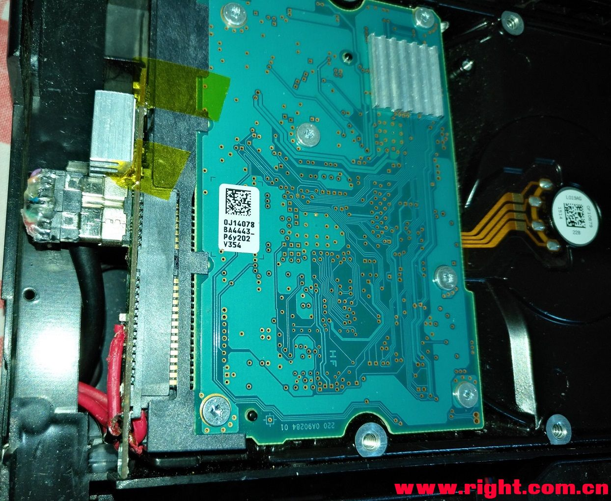
经过以上硬改，刷Ride_wind大佬Armbian_Mix_With_Navi_1213固件基本已经玩美，只剩下风扇噪音问题，下面就调整Ride_wind大佬的代码解决噪音问题：
Ride_wind大佬的博客已经给出代码，我的想法是让风扇保持一个低转速，持续为我家云降温，先用WinSCP打开路径/sbin/fan文件，修改温度55000（表示55度）为45000（根据自己环境修改，我的环境下风扇基本上就不会在停），然后修改pwm 2000（决定风扇转速，噪音），我改成了3000，这个值可根据大家风扇情况自己修改，保存关机，再开机生效。（如果觉得65000温度下风扇吵的，同样可修改6000的值，修改后还是要自己观察一下温度情况，75000下的10000建议不要改了，为了安全嘛）（由于我保留了PMOS的控制功能，因为这样改电源简单，短接Pmos很难操作，但很多系统没有很好的支持PMOS控制功能，所以不能reboot了，会敲盘。这也是我的硬改中留下的唯一问题。总的来说完美了）由于我带的3t日立硬盘发热大，需要硬盘工作时风扇保持散热状态，如何要保证硬盘休眠时风扇可以停止？先想我这样设置，让硬盘休眠，这时风扇也会保持散热，等待一段时间，可能10分钟，可能1小时，用PuTTY连接我家云，看温度稳定后的cpu温度，再用这个温度加2000替换修改后的45000，可以保证硬盘休眠一段时间后，风扇可以停转。目前我用手机appOMV home控制关机，智能插板控制电源，也可以用https://www.right.com.cn/forum/thread-3701441-1-1.html 固件或dtb替换，增加关机建功能。
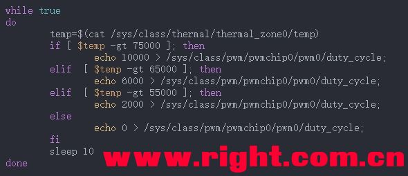
---------------------------------------------------------下面部分是我的失败的硬改折腾史---------------------------------------------------------------------------------------------------
20200329
看见这个没有flash芯片的图，我的心凉了。果然换上GD25Q32C后我家云GL3321G还是跑不稳，GL3321G去掉固件芯片裸奔没问题。
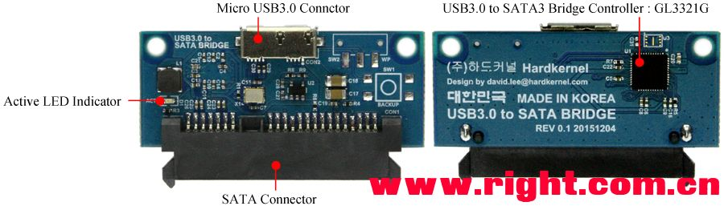
20200326-20200327
拆掉固件芯片FM25F01后GL3321G确实能跑稳了，平均速度70MB/s左右，但是拆掉FM25F01芯片后，就没有了配合系统休眠的功能，目前不知道GL3321G芯片自带的初始固件是否休眠，多少时间休眠。
用hdparm -Y /dev/sda1命令测试，
/dev/sda1:
issuing sleep command
SG_IO: bad/missing sense data, sb[]: 70 00 01 00 00 00 00 0a 00 00 00 00 00 1d 00 00 00 00 00 00 00 00 00 00 00 00 00 00 00 00 00 00
虽然能休眠，但是却成了sdb，掉盘了。

hdparm -y /dev/sda1
/dev/sda1:
issuing standby command
SG_IO: bad/missing sense data, sb[]: 70 00 01 00 00 00 00 0a 00 00 00 00 00 1d 00 00 00 00 00 00 00 00 00 00 00 00 00 00 00 00 00 00
虽然能休眠，但是也成了sdb，掉盘了。

如果用跟换芯片，比如ASM1053的板子，休眠时间由ASM1053的固件确定，网上提供了10分钟休眠固件，问题还是没彻底解决问题。
难道鱼和熊掌不能兼得？为什么芯片内置固件能跑稳，而外置不行，我尝试跟换spi flash看是否可以解决问题。因为手头没有128kB的芯片跟换了片从路由器上拆下的MX25L3206E，目前稳了复制了100GB没有任何掉速掉盘。11：20 复制160GB/s左右又出现了连续掉速，难道GL3321G是flash杀手，我还是不死心网上订购了两片GD25Q32C，这个速度可以到120Mhz，感觉这是最后的希望了。

我25号5点才拍下的ASM1053E板子老板当天就发货了，今天已经收到，在3.0hub芯片插上用USB2.0的线试了一下（没有3.0的线），hdparm -Y /dev/sda1，hdparm -y /dev/sda1均可以正常休眠，设置5分钟休眠，看看功能正常不，5分钟过去了没有自动休眠（为了方便测试，我先用的西数2.5的蓝盘，同时在网上发现WDC驱动器不支持 hdparm -S命令，所以还不知道日立的盘能成功设置休眠不）。另外还发现这个芯片有点小烫，如果真要用我肯定要加散热片。用usb2.0数据线，接上3t 日立硬盘后，在网上找到ASM1053E的10分钟休眠固件，刷上，可以通过 hdparm -S 25 /dev/sdb命令设置休眠时间，25 *5 秒后= spindown，hdparm -S 245 /dev/sdb ( 245 -240 ) *30分钟后= spindown更详细内容请百度hdparm命令，测试可以通过OMV修改休眠时间，通过命令行hdparm -C /dev/sdb可以查看，但是好像要重启系统才生效。
注：以上测试基于Ride_Wind大佬19年11月25号的固件。
20200325
跟换日立硬盘后，最高速度跑到113MB/s，复制文件超过250G左右，出现掉速度（实际还是掉盘只是有概率能找回），于是，还是外接电源测试吧，我发现我自己已经不在自己的硬改声明范围，因为我现在外接电源也掉速，掉盘，折腾了很多方案，发现还是GL3321G芯片不稳，难怪rush大佬要换别的芯片求解。想要真正的稳就换芯片吧，rush大佬有帖子，我折腾了好几天，仅仅发现用导线短接三极管Q1，能提高sata口的输出电流，可以带动功率大的硬盘，但是GL3321G芯片Sata转usb3.0不稳，我考虑买块硬盘盒板子更换。 在某宝搜索“硬盘盒 板”，找到一块ASM1053的支持UASP协议的USB转sata板子71X22mm，好像正好装下，5.5元加6.5运费，拍下。
既然决定换板子，在等的时候再折腾一下，取掉GL3321G的spi芯片。22：44去掉GL3321G的spi 1MFlash芯片后，成功复制1T文件没有掉速和不稳的情况，收动hdparm -y /dev/sda1 和 hdparm -Y /dev/sda1 有一堆字符提示，错误io，停掉硬盘后也能成功启动，启动时间较长。看来掉盘是GL3321G的鸡血固件导致，我在网上找到一个V1.8的固件，准备明天试试。我在某宝定的板子好像可以退了！

20200324
尽管温度开关已经全开，3T日立硬盘速度最高已经跑到111MB/s，掉速，掉盘还是严重，在增加一个改进，用一片12V到5vDC-DC单独为GL3321G芯片供电，如图，先去掉红框中零欧电阻（我的已经去掉），DC-DC的输入端连SATA 电源12V。（不直接连接电源12V，因为SATA 电源的12v是通过MOS控制的，再掉盘和休眠的情况下，方便系统断电复位GL3321G芯片。）我买的DC-DC模块是mini360很便宜，但是需要手动调整输出电压，得有万用表，没有的朋友可以买小功率的固定12V-5V的DC-DC模块。（带可变电阻也不好，暴露在空气中时间长了会失效，使用我用胶布密封起，还能起到绝缘作用。）
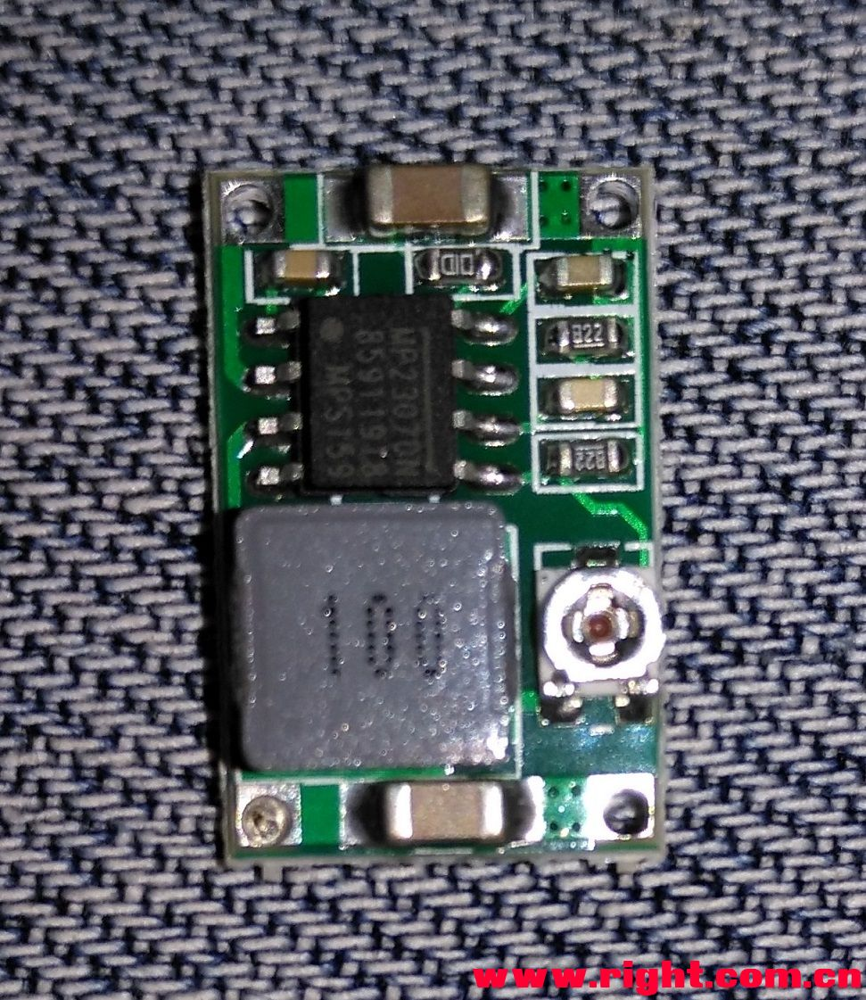 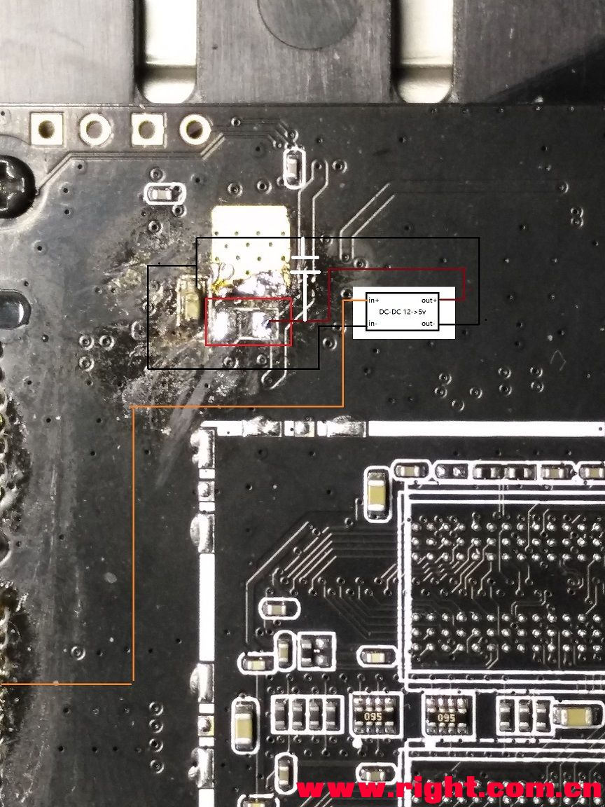
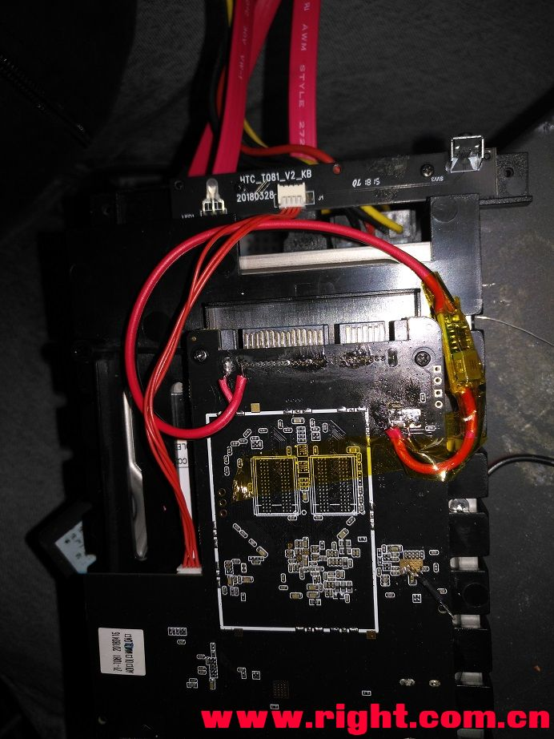
通过以上改进，不掉盘了，但是掉速度（实际还是掉盘，只是能找回来），再增加DC-DC的电容2200uf耐压大于等于6v，增加一根地对地导线6。
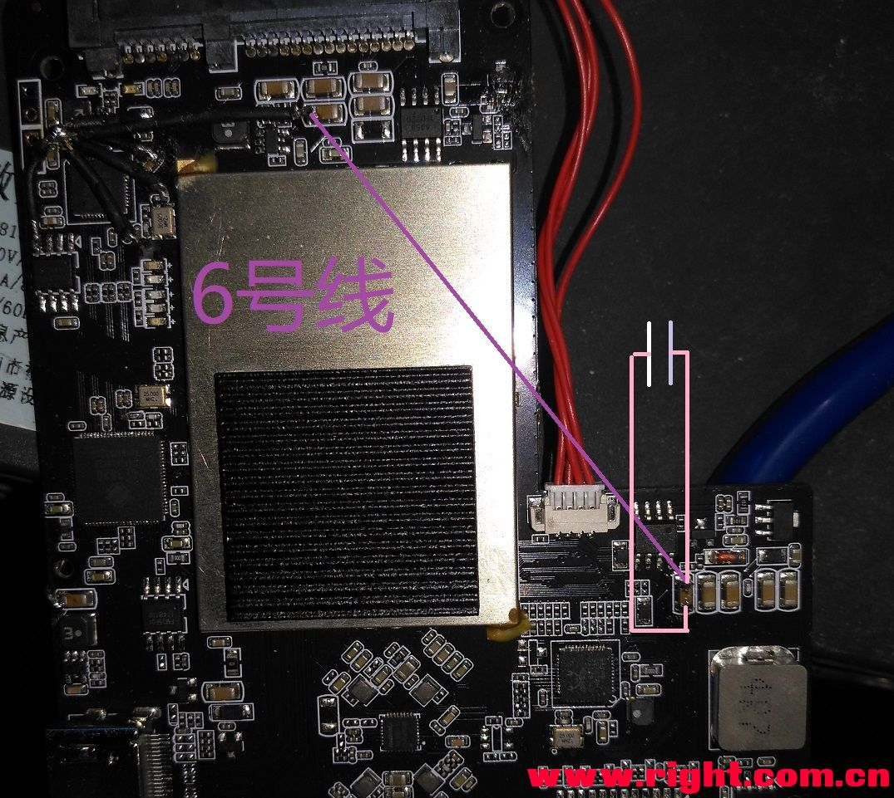

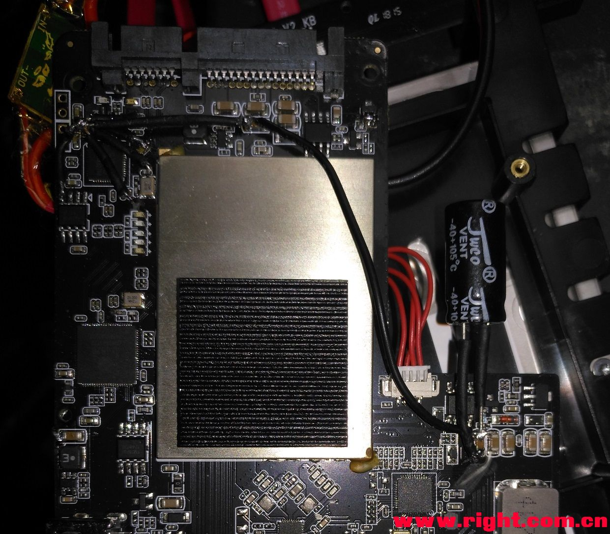
目前测试了100G没有掉盘现象，并且可以休眠，我会继续测试。
晚上22：44，日立硬盘复制了250G个后再度掉盘，比加电容之前明显稳定，我决定明天去掉电容，换成一个功率大一些的DC-DC并入5V。

3T日立硬盘用一下来功耗太高，我家云启动瞬间我的智能插排显示功率达到27W，已经临界30W的电源功耗了。（当然我的智能插排功率计不太精确，精度偏差1W吧），3T日立硬盘温度也高，我室温18度，硬盘43度；另外寻道动静也很大，都没读写盘了还一个劲响。推荐大家购买低功耗硬盘。

20200323
Ride_Wind 推荐购买的3T日立硬盘到了，速度换上，装上壳子，复制跑起来！准备开香槟的时候掉盘啦！对，又掉盘了！
为了带动我专门为了我家云的购买的神器，郁闷之下将1K电阻换成了导线！我想现在应该没问题了吧！跑起来！测试中.....

前几天看到我家云的矿渣太晚，原谅我来的太晚。收货期间浏览了大家的帖子，
声明：本硬改适用于外接SATA电源，内接sata接口不掉盘的机器。
20200318
判断依据
1：替换GL3321G芯片可以解决掉盘问题；
2：单独为内置硬盘供电可以解决掉盘问题；
3：有人提出硬盘供电设计缺陷问题，太麻烦没仔细看，但有大佬提出疑问，我看了觉得是个硬件温度保护开关，在1k电阻上并联一个1k电阻（或者细铜丝）解决问题；
4：有人肯定3A的电源还是很稳的。
结论，综合上述问题，我判断是pcb走线问题，由于没找到原理图，pcb图更是无从谈起，只能通过GL3321G的数据手册看一下端口，自己重新搭建GND回路，初步解决了掉盘问题。虽然我已经在我的我家云得到验证，但还需大家的肯定。验证固件用的是[https://www.right.com.cn/forum/f ... id=341574&typeid=18](https://www.right.com.cn/forum/forum.php?mod=viewthread&tid=341574&typeid=18)中的常期掉盘固件。

由于PCB太小，又是要焊接导热较强的地线焊盘，操作难度较高，动手能力较弱的朋友请小心，请小心，请小心，弄坏了别怪我。

由于我焊接顺序1导线到5导线，导致不明确是1还是5导线起到作用，2号导线是必须焊接的，由于较难操作我就不想再拆线确认了。请朋友们先焊接2号导线和Q1的1k电阻，测试一下，是否还掉盘，如果还掉盘或其它奇怪现象再补焊接1号3，4，5，等导线。

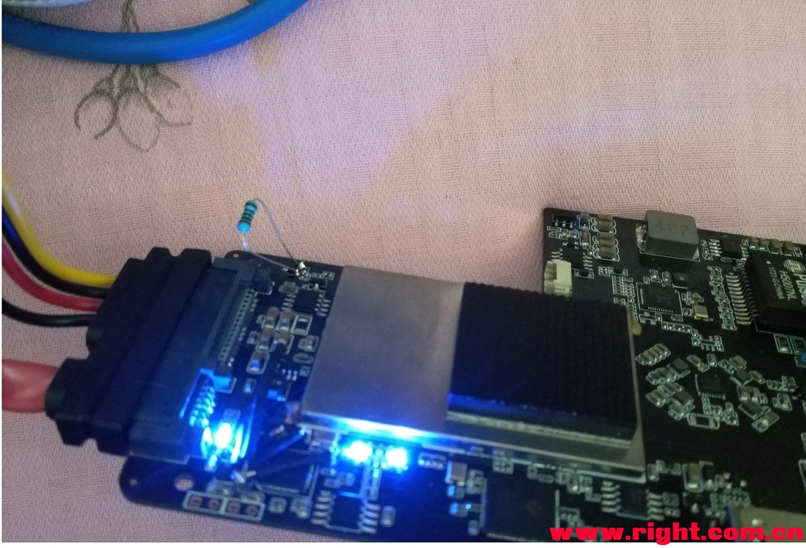
2扯淡了没意义推荐硬改顺序
1 先添加1K电阻，是为了解决温度升高导致的供电电流减少，引发的硬盘掉电问题，个人觉得比直连MOS管安全；感谢https://www.right.com.cn/forum/thread-1313598-1-1.html提供图纸；
如果你尝试并联1k电阻后还无法带动硬盘，说明你的盘电流太大，不建议使用了。如果你一定要用，尝试并联更小的电阻，或者直接并联1k变阻器，减小电阻值就可以增加电流。我不能保证也能带动你的神器。但是我的硬改方案是尊重原设计的。

3 焊接注意事项
由于是焊接线，导热性能好，电烙铁温度要高于300度，刚好可以融化电容GND端又不至于焊下整颗电容；
1 先在公共地电容端补锡加焊，所有要连接的电容GND都要从新上锡；
2 准备上好锡的导线；
以上是焊接的小技巧和常识，希望大家不要失败。
谢谢所有人的付出。