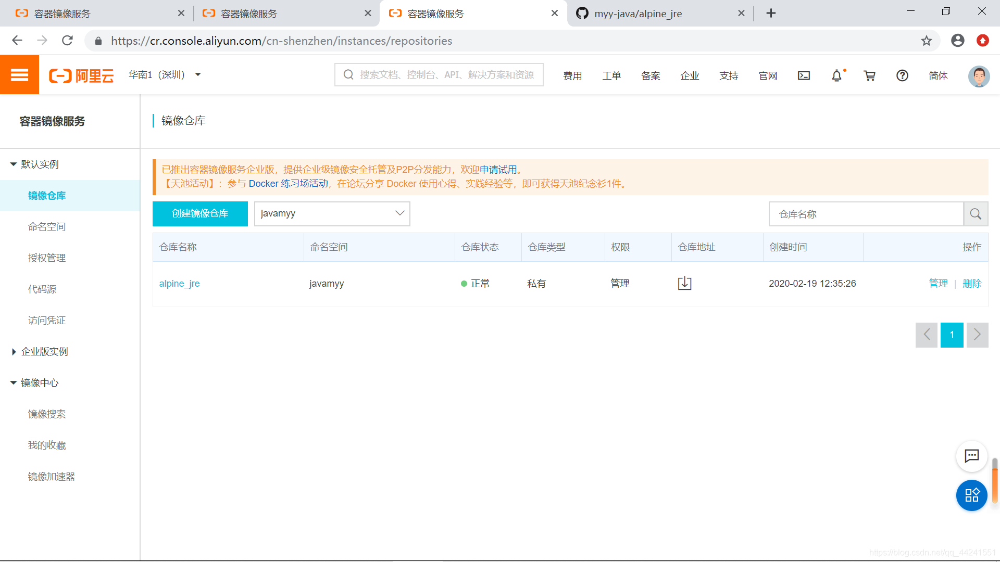

## Docker之alpine自定义阿里云镜像

https://blog.csdn.net/qq_44241551/article/details/104388874


Appline
1、alpine制作jdk镜像
alpine Linux简介
基于alpine制作JDK8镜像
2、Alpine制作jre镜像（瘦身）
Docker容器之最小JRE基础镜像
3、Docker镜像上传至阿里云
前期准备
push(推)镜像
pull(拉)镜像
结合上一篇Dockerfile制作镜像博客来说，jdk8 v1.0的版本有610MB,非常大，对于部署项目而言太占用空间了。学了apline之后，在不影响功能的情况下，对jdk进行瘦身（200MB左右）

1、alpine制作jdk镜像
alpine Linux简介
Alpine Linux是一个轻型Linux发行版，它不同于通常的Linux发行版（centos、Ubuntu），Alpine采用了musl libc 和
BusyBox以减少系统的体积和运行时的资源消耗。
Alpine Linux提供了自己的包管理工具：apk(注意：ubuntu中是apt-get)，我们可以通过https://pkgs.alpinelinux.org/packages 查询包信息
Alpine Docker镜像继承了Alpine Linux发行版的这些优势，相比于其他Linux Docker镜像，它的体积非常小
对比常用的、没有压缩过的基础镜像（查看当前的:latest标签）：
Alpine - 4.8MB
centos - 124.8 MB
Debian - 125.1MB
Centos - 196MB
建议使用Alpine Linux 3.10.0版本，这也是 v3.10 稳定系列的首个版本
alpine:3.10
基于alpine制作JDK8镜像

1. 下载镜像

docker pull alpine:latest


2. 创建并编辑dockerfile
把原来的Dockerfile删除，重新再创建写入内容

cd /moyuanyuan_docker/jdk/
rm -rf Dockerfile


touch Dockerfile 
vi Dockerfile

注意：Dockerfile内容

```
#1.指定基础镜像，并且必须是第一条指令
#FROM alpine:latest
FROM alpine:3.10

#2.指明该镜像的作者和其电子邮件
MAINTAINER myy "1272034403@qq.com"

#3.在构建镜像时，指定镜像的工作目录，之后的命令都是基于此工作目录，如果不存在，则会创建目录
WORKDIR /moyuanyuan_docker/jdk

#4.将一些安装包复制到镜像中，语法：ADD/COPY <src>... <dest>
## ADD与COPY的区别：ADD复制并解压，COPY仅复制
ADD jdk-8u221-linux-x64.tar.gz /moyuanyuan_docker/jdk/
## glibc安装包如果从网络下载速度实在是太慢了，先提前下载复制到镜像中
COPY glibc-2.29-r0.apk /moyuanyuan_docker/jdk/
COPY glibc-bin-2.29-r0.apk /moyuanyuan_docker/jdk/
COPY glibc-i18n-2.29-r0.apk /moyuanyuan_docker/jdk/

#5.更新Alpine的软件源为阿里云，因为从默认官源拉取实在太慢了
RUN echo http://mirrors.aliyun.com/alpine/v3.10/main/ > /etc/apk/repositories && \
    echo http://mirrors.aliyun.com/alpine/v3.10/community/ >> /etc/apk/repositories
RUN apk update && apk upgrade

#6.运行指定的命令
## Alpine linux为了精简本身并没有安装太多的常用软件,apk类似于ubuntu的apt-get，
## 用来安装一些常用软V件，其语法如下：apk add bash wget curl git make vim docker
## wget是linux下的ftp/http传输工具，没安装会报错“/bin/sh: 　　wget: not found”，网上例子少安装wget
## ca-certificates证书服务，是安装glibc前置依赖
RUN apk --no-cache add ca-certificates wget \
    && wget -q -O /etc/apk/keys/sgerrand.rsa.pub https://alpine-pkgs.sgerrand.com/sgerrand.rsa.pub \
    && apk add glibc-2.29-r0.apk glibc-bin-2.29-r0.apk glibc-i18n-2.29-r0.apk \
    && rm -rf /var/cache/apk/* glibc-2.29-r0.apk glibc-bin-2.29-r0.apk glibc-i18n-2.29-r0.apk

#7.配置环境变量
ENV JAVA_HOME=/moyuanyuan_docker/jdk/jdk1.8.0_221
ENV CLASSPATH=.:$JAVA_HOME/lib/dt.jar:$JAVA_HOME/lib/tools.jar
ENV PATH=$JAVA_HOME/bin:$PATH

#容器启动时需要执行的命令
#CMD ["java","-version"]

```

上面第一步glic安装包如果从网络下载速度实在太慢，就先提前下载复制到镜像中
选择文件上传

```
rz
```


3.执行dockerfile创建镜像

```
docker build -t jdk8:v2.0 .
```


4.创建并启动容器

```
 docker create -it jdk8:v2.0 
 docker start 容器ID
```


5.进入容器

5.进入容器

```
docker exec -it 容器ID /bin/sh
```

> 注1：最后是sh而非bash
> 也可直接 启动并进入容器
> docker run -it --name myjdk 容器ID

注1：最后是sh而非bash
也可直接 启动并进入容器
docker run -it --name myjdk 容器ID

6.测试jdk

```
java -version
```


> 注1：docker exec -it 容器ID /bin/sh 默认使用当前帐号(即root)登入，通过whoami命令可以查看当前用户名，
> 还可以通过如下命令切换到其它帐号
> docker exec -it --user root <容器ID> /bin/sh
> 注2：openjdk:8-jdk-alpine这个镜像就和我们自己创建的镜像是一样，只不过JDK瘦身过了，体积更小
> 大家可以自己下来，创建一个容器试一下
> 注3：最后制作完成后的镜像大小为400M左右

2、Alpine制作jre镜像（瘦身）

> 还可以进行二次缩减
> 常识：Java应用程序运行的时候，依赖的是class文件，并不需要Java文件
> jdk:编译Java的 .java源文件+运行Java的class文件
> jre:运行Java的class文件
> 使用Linux系统主要是为了运行class文件，部署项目用的；所以（编译Java的 .Java源文件这一功能是不需要的）

Docker容器之最小JRE基础镜像
1.首先下载jre
下载地址是https://www.java.com/en/download/manual.jsp，大概是77M
最终下载的资料为：/jre-8u221-linux-x64.tar.gz
2.rz上传至centos，并删除无用的文件，并重新压缩


解压

```
tar -zxvf jre-8u221-linux-x64.tar.gz
```


解压后把原有的压缩包删掉（这个看你自己想删就删，不想删就不删，反正也没啥用了）

解压后把原有的压缩包删掉（这个看你自己想删就删，不想删就不删，反正也没啥用了）

```
rm -rf jre-8u221-linux-x64.tar.gz 
```


查看jre大小(瘦身前230M)

```
du -sh jre1.8.0_221
```


进入jre目录，并执行瘦身命令

```
cd jre1.8.0_221
```


执行瘦身命令（瘦身111M）

执行瘦身命令（瘦身111M）

```
#删除文本文件
rm -rf COPYRIGHT LICENSE README release THIRDPARTYLICENSEREADME-JAVAFX.txtTHIRDPARTYLICENSEREADME.txt Welcome.html \
#删除其他无用文件
rm -rf lib/plugin.jar \
lib/ext/jfxrt.jar \
bin/javaws \
lib/javaws.jar \
lib/desktop \
plugin \
lib/deploy* \
lib/*javafx* \
lib/*jfx* \
lib/amd64/libdecora_sse.so \
lib/amd64/libprism_*.so \
lib/amd64/libfxplugins.so \
lib/amd64/libglass.so \
lib/amd64/libgstreamer-lite.so \
lib/amd64/libjavafx*.so \
lib/amd64/libjfx*.so
```


返回上级目录，重新打包jre

```
cd ../
tar -cvf jre1.8.0_221.tar.gz jre1.8.0_221
```


压缩是xvf,解压是cvf或zcvf


压缩是xvf,解压是cvf或zcvf

把原来的111M的jre删除和Doerfile删除

```
rm -rf jre1.8.0_221
rm -rf Dockerfile
```


3.创建并编辑dockerfile

```
touch Dockerfile
vi Dockerfile
```

> 注1：dockerfile内容如下
>

注1：dockerfile内容如下

```
#1.指定基础镜像，并且必须是第一条指令
#FROM alpine:latest
FROM alpine:3.10

#2.指明该镜像的作者和其电子邮件
MAINTAINER myy "1272034403@qq.com"

#3.在构建镜像时，指定镜像的工作目录，之后的命令都是基于此工作目录，如果不存在，则会创建目录
WORKDIR /moyuanyuan_docker/jdk

#4.将一些安装包复制到镜像中，语法：ADD/COPY <src>... <dest>
## ADD与COPY的区别：ADD复制并解压，COPY仅复制
## 注意~~~上传的瘦身后的jre
ADD jre1.8.0_221.tar.gz /moyuanyuan_docker/jdk/
## glibc安装包如果从网络下载速度实在是太慢了，先提前下载复制到镜像中
COPY glibc-2.29-r0.apk /moyuanyuan_docker/jdk/
COPY glibc-bin-2.29-r0.apk /moyuanyuan_docker/jdk/
COPY glibc-i18n-2.29-r0.apk /moyuanyuan_docker/jdk/

#5.更新Alpine的软件源为阿里云，因为从默认官源拉取实在太慢了
RUN echo http://mirrors.aliyun.com/alpine/v3.10/main/ > /etc/apk/repositories && \
    echo http://mirrors.aliyun.com/alpine/v3.10/community/ >> /etc/apk/repositories
RUN apk update && apk upgrade

#6.运行指定的命令
## Alpine linux为了精简本身并没有安装太多的常用软件,apk类似于ubuntu的apt-get，
## 用来安装一些常用软V件，其语法如下：apk add bash wget curl git make vim docker
## wget是linux下的ftp/http传输工具，没安装会报错“/bin/sh: 　　wget: not found”，网上例子少安装wget
## ca-certificates证书服务，是安装glibc前置依赖
RUN apk --no-cache add ca-certificates wget \
    && wget -q -O /etc/apk/keys/sgerrand.rsa.pub https://alpine-pkgs.sgerrand.com/sgerrand.rsa.pub \
    && apk add glibc-2.29-r0.apk glibc-bin-2.29-r0.apk glibc-i18n-2.29-r0.apk \
    && rm -rf /var/cache/apk/* glibc-2.29-r0.apk glibc-bin-2.29-r0.apk glibc-i18n-2.29-r0.apk

#7.配置环境变量
## 注意~~~没有jdk啦，直接指向jre
ENV JAVA_HOME=/moyuanyuan_docker/jdk/jre1.8.0_221
ENV CLASSPATH=.:$JAVA_HOME/lib/dt.jar:$JAVA_HOME/lib/tools.jar
ENV PATH=$JAVA_HOME/bin:$PATH

#容器启动时需要执行的命令
#CMD ["java","-version"]
```

4.执行dockerfile创建镜像

```
docker build -t jdk8:v3.0 .
```


5.创建并启动容器

5.创建并启动容器

```
docker create -it jdk8:v3.0 
docker start 容器ID
```


**6.进入容器 **

**6.进入容器 **

```
docker exec -it 容器ID /bin/sh 
```


7.测试jdk

7.测试jdk

```
java -version
```


> 注1：openjdk:8-jdk-alpine这个镜像就和我们自己创建的镜像是一样，只不过JDK瘦身过了，体积更小。
> 另外，openjdk和jdk也是有一定区别的，大家可以看下资料“14 OpenJDK与JDK的区别分析 - 简书.mht”了解一下
> 注2：Alpine制作JDK8镜像是有时区问题的，可以使用时区查看命令看一下

三个版本的jdk镜像结果如下：
V1.0：centos7+jdk1.8制作而成
V2.0：alpine3.10+jdk1.8制作而成
V3.0：alpine3.10+jre1.8+瘦身命令制作而成


3、Docker镜像上传至阿里云
将Docker镜像上传至阿里云(或从阿云下载镜像)

前期准备
1.注册阿里云账户
阿里云官方网站链接：https://dev.aliyun.com
2.登陆账户
3.配置Docker加速器
搜索“容器镜像服务”进入控制台


4.创建镜像仓库的命名空间
例如：javamyy

5.创建镜像仓库(创建镜像仓库时要绑定一个代码托管网站，例如：github)
例如：alpine_jre
绑定账号


选择了提前在github创建的私有仓库




push(推)镜像
点进去后有操作步骤


将镜像推送到Registry
1.登录到阿里云的doker仓库，–username为阿里云的用户名，另外，密码为开通镜像服务时设置的密码，忘记密码可以点击菜单：“容器镜像服务”->“默认实例”–>“访问凭证”进行修改

```
docker login --username=javamyy registry.cn-shenzhen.aliyuncs.com
```


2.为本地镜像添加tag

2.为本地镜像添加tag

```
docker tag [ImageId] registry.cn-shenzhen.aliyuncs.com/javamyy/alpine_jre:[镜像版本号]
```


3.推送镜像(jdk8-alpine:1.0)

```
docker push registry.cn-shenzhen.aliyuncs.com/javamyy/alpine_jre:[镜像版本号]
```


检测镜像版本


再把本地的jdk都删掉


pull(拉)镜像
1.登录到阿里云的doker仓库

```
docker login --username=javamyy registry.cn-shenzhen.aliyuncs.com
```


从Registry中拉取镜像

从Registry中拉取镜像

```
docker pull registry.cn-shenzhen.aliyuncs.com/javamyy/alpine_jre:[镜像版本号]
```


> 注1：仓库（Repository ）是集中存放镜像的地方，又分公共仓库和私有仓库
> 有时候容易把仓库与注册服务器（register）混淆 实际上注册服务器是存放仓库的具体服务器，每个注册服务器上可以有多个仓库，而每个仓库下面可以有多个镜像

检测


