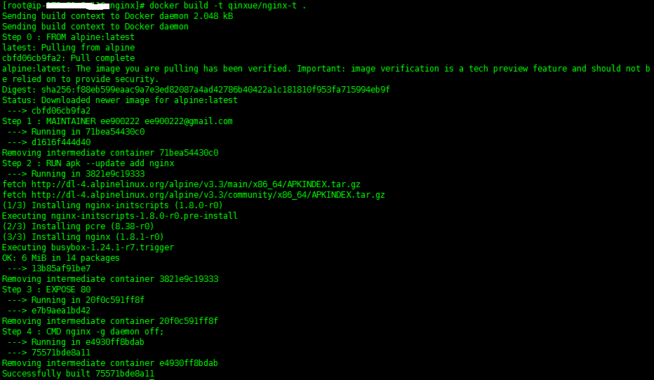
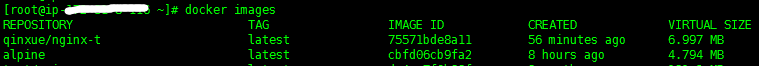
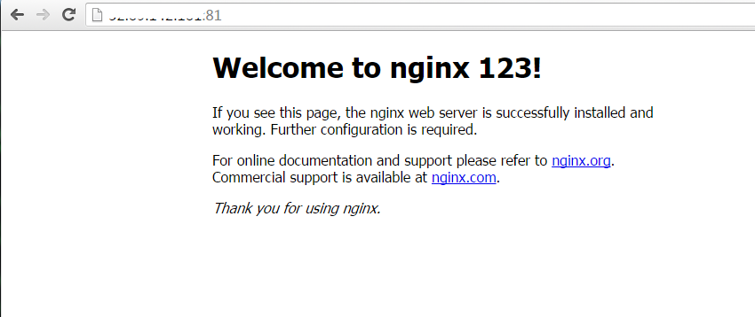

## Docker微容器Alpine Linux

https://www.jianshu.com/p/4fcdb9892b88


# 1. 前言

使用Docker创建容器时，基础镜像通常选择Ubuntu或Centos，不管哪个镜像的大小都在100MB以上。

Alpine Linux是一个面向安全的轻型的Linux发行版。

Alpine Linux采用了 [musl libc](http://musl-libc.org/) 和 [busybox](http://busybox.net/)以减小系统的体积和运行时资源消耗。

在保持瘦身的同时，Alpine Linux还提供了自己的包管理工具apk。

关键的是，相比于其他Linux的Docker镜像，它的容量非常小，仅仅只有5MB。

Alpine Linux的官网：
 http://www.alpinelinux.org/
 https://pkgs.alpinelinux.org/packages

## 2. 使用Alpine镜像

下面使用Alpine镜像，来制作nginx容器。

### 2.1 制作Dockerfile

Docker内容非常简单，基础镜像使用Alipine，用apk安装nginx，指定暴露的端口，启动nginx


```ruby
# vi Dockerfile

FROM alpine:latest

MAINTAINER ee900222 ee900222@gmail.com

# install nginx

RUN apk --update add nginx

EXPOSE 80

CMD [``"nginx"``, ``"-g"``, ``"daemon off;"``]
```

### 2.2 用Dockerfile创建镜像

```
# docker build -t qinxue/nginx-t .
```

###  image

出现下面错误的时候，重启Docker可以解决。

```
ERROR: http:``//dl-4``.alpinelinux.org``/alpine/v3``.3``/main``: temporary error (try again later)
```

### 2.3 用创建好的镜像启动容器

确认镜像信息

```
# docker images
```



image

可以看到，Alpine的镜像不到5MB，用Alpine作为基础镜像的nginx镜像不到7MB。

启动容器

```
# docker run --name da1 -d -p 81:80 qinxue/nginx-t
```

通过浏览器访问



image

# 3. 问题点

\1. Alpine Linux使用了musl，可能和其他Linux发行版使用的glibc实现会有些不同。

\2. musl实现的DNS服务不会使用resolv.conf文件中的search和domain两个配置，通过DNS来进行服务发现时需要注意。

# 4. 后记

Alpine Linux的最大优势是小，有消息说Docker官方镜像将会使用Alpine Linux替换Ubuntu。


作者：中v中
链接：https://www.jianshu.com/p/4fcdb9892b88
来源：简书
著作权归作者所有。商业转载请联系作者获得授权，非商业转载请注明出处。

