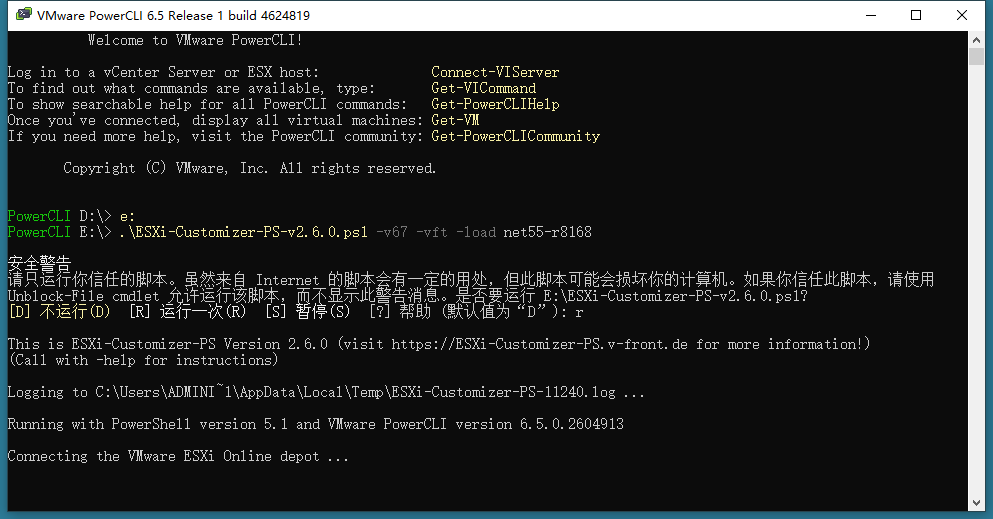

# ESXI 添加网卡驱动并生成新的ISO镜像


安装[ESXI](https://www.smbinn.com/tag/esxi)时，一些网卡可能会遇到上图中找不到[驱动](https://www.smbinn.com/tag/驱动)的情况。其实通过 [VMware](https://www.smbinn.com/tag/vmware)-PowerCLI 和 ESXi-Customizer-PS 可以完美解决问题，这种方式是选择相应的ESXI版本和对应的网卡驱动后直接生成一个完整的ISO[镜像](https://www.smbinn.com/tag/镜像)文件，可以把这个ISO镜像文件直接写入U盘在物理机进行安装。

## 所需软件

VMware-PowerCLI 6.5 或 10

- 网盘下载 [https://pan.baidu.com/s/1YBKfvtDK45rsr4O-Vq20RQ](https://pan.baidu.com/s/1YBKfvtDK45rsr4O-Vq20RQ#qt0t) 提取码：qt0t
- 官网下载[https://code.vmware.com/web/tool/6.5%20R1/vmware-powercli](https://code.vmware.com/web/tool/6.5 R1/vmware-powercli)

ESXi-Customizer-PS 2.60

- 直接下载http://vibsdepot.v-front.de/tools/ESXi-Customizer-PS-v2.6.0.ps1
- 官网下载https://www.v-front.de/p/esxi-customizer-ps.html

## 安装软件


## 封装步骤

安装完 VMware-PowerCLI 后桌面会生成快捷方式，首次运行会看到下图中的错误信息。


不要慌！打开开始菜单找到 Windows PowerShell 用管理员身份运行，输入以下代码并确认执行脚本。

```
Set-ExecutionPolicy Unrestricted
```


第二次打开 VMware-PowerCLI 会加载如下信息，直接按回车确认，然后将其关闭。


将 ESXi-Customizer-PS-v2.6.0 放在X盘根目录（X指你实际的盘符）然后再次打开 VMware-PowerCLI ，首先切换执行目录为 ESXi-Customizer-PS-v2.6.0 所在的盘符（输入X:切换）接着输入以下代码回车确认。

```
.ESXi-Customizer-PS-v2.6.0.ps1 -v67 -vft -load net55-r8168
```

代码中的 -V67 代表创建新的 ESXi 6.7 ISO 镜像，以下作为参考；

- -v50 : Create the latest ESXi 5.0 ISO
- -v51 : Create the latest ESXi 5.1 ISO
- -v55 : Create the latest ESXi 5.5 ISO
- -v60 : Create the latest ESXi 6.0 ISO
- -v65 : Create the latest ESXi 6.5 ISO
- -v67 : Create the latest ESXi 6.7 ISO

代码中的 net55-r8168 代表所要封装的网卡驱动型号，以下作为参考；

- net-e1000e: Obsolete – Driver for Intel I217/I218/82579LM/82574L
- net-tulip: DECchip 21140 Ethernet driver (This driver allows running ESXi as a VM under Microsoft Hyper-V)
- net55-r8168: Updated driver for Realtek 8168/8111/8411/8118 based NICs
- net51-r8169: Adds the blacklisted ESXi 5.1 built-in net-r8169 driver back to ESXi 6.0
- net51-sky2: Adds the blacklisted ESXi 5.1 built-in net-sky2 driver back to ESXi 6.0
- net51-drivers: Deprecated – Adds all blacklisted ESXi 5.1 NIC drivers back to ESXi 6.0
- net-atl1: Attansic/Atheros L1 Gigabit Ethernet driver
- net-atl1e: Driver for Atheros(R) AR8121/AR8113/AR8114/AR8131/AR8132/AR8152 PCI-E Ethernet NICs
- net-igb: Intel(R) Gigabit Ethernet Network Driver (modified to ignore invalid NVM checksums)
- net-r8101: Realtek RTL8101E/RTL8102E driver
- net-r8139too: Realtek RTL-8100/8101L/8139 PCI Fast Ethernet Adapter Driver
- net-skge: Driver for Marvell Yukon chipset and SysKonnect Gigabit Ethernet Adapters



如果执行时有杀毒软件拦截点击允许即可


如果遇到如下错误，请使用全局代理（科学上网）再次尝试


当所有项目显示完成 OK All done 后，即可在 ESXi-Customizer-PS-v2.6.0 所在根目录找到生成的镜像文件，将其写入U盘插入物理机就可以安装了。


 

------

原文地址：https://www.smbinn.com/vmnetwork.html