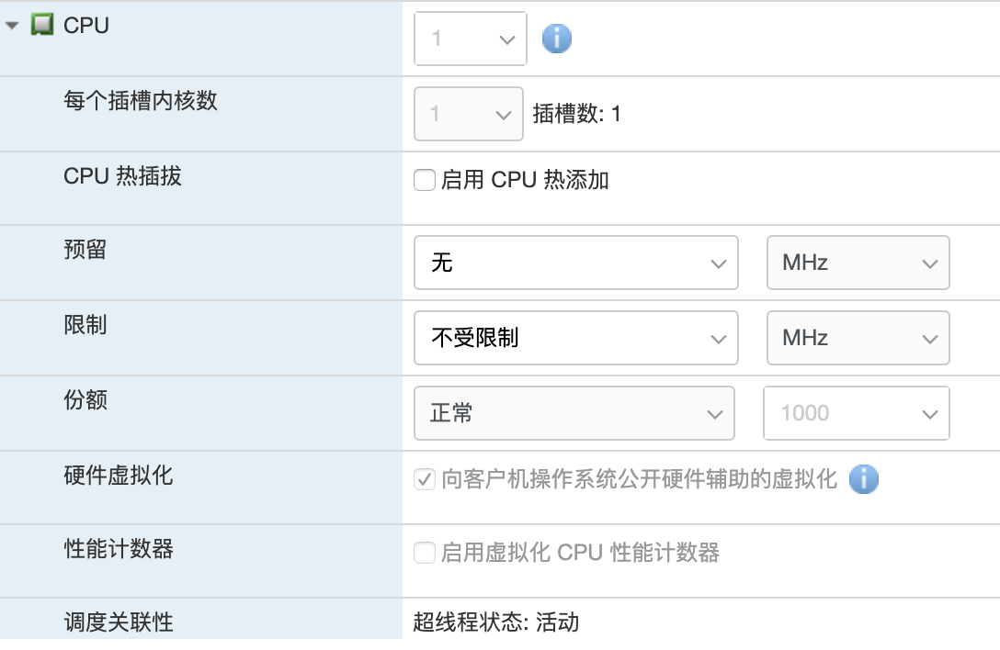
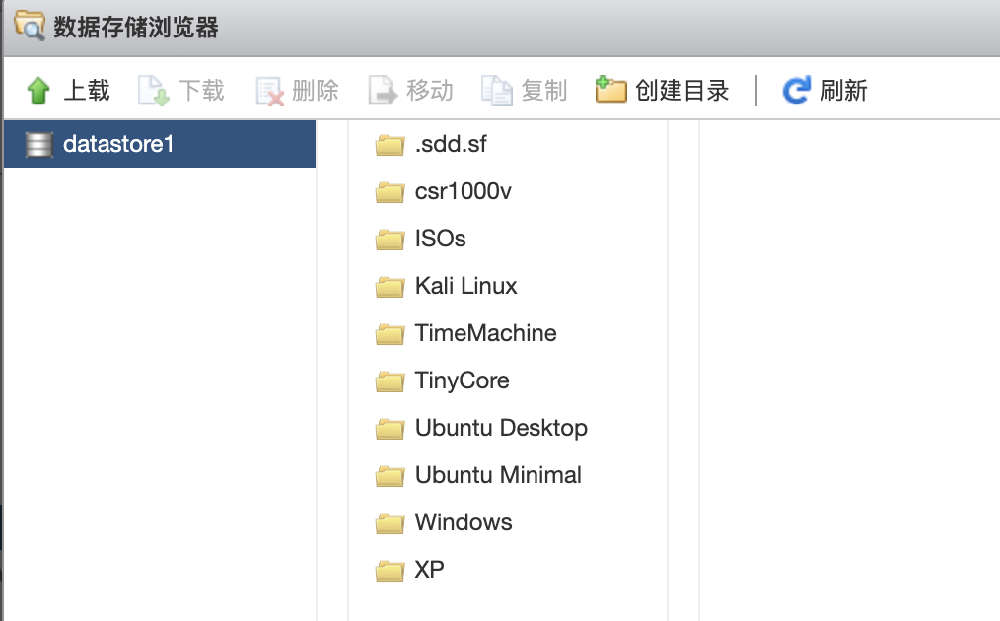
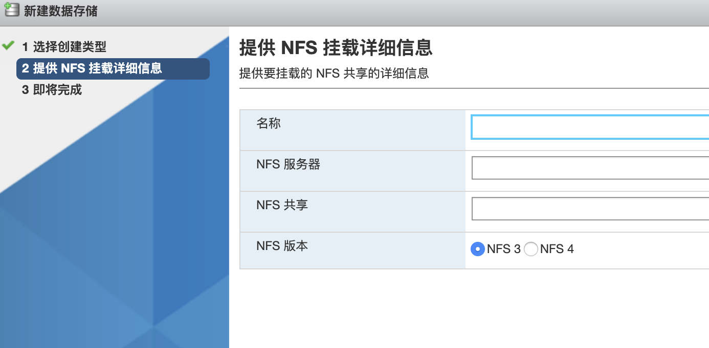

# ESXi 入门指南

## 什么是 ESXi

> VMware ESXi 是由 VMware 开发的用于部署和服务虚拟计算机的企业级 1 类管理程序。作为 Type-1 虚拟机管理程序，ESXi 不是操作系统上安装的软件应用程序；相反，它包括并集成了重要的 OS 组件，例如内核。在 4.1 版之后，VMware 将 ESX 重命名为 ESXi。

摘自维基百科英文版翻译

简单的说，ESXi 就是一个虚拟机。但是与 VMware Workstation、VirtualBox 等工具却又有些不同。更具体的说，VMware Workstation 等工具是运行在操作系统之上的一个软件，如果没有对应的操作系统（Windows、macOS、Linux）等，它自身是无法运行的，操作系统不让它做的事情它也做不了，这种虚拟机我们一般叫 “Type 2” 虚拟机。

既然有 Type 2，那也是有 Type 1 的，所谓 Type 1 虚拟机，就是它本身就是一个操作系统，直接运行在裸机上。ESXi 就属于这种。

 

“人傻钱多戴，美帝良心想”

提到戴尔，我相信绝大部分人的印象都是这家伙不是卖笔记本、卖显示器，还卖服务器的吗？

哦好吧，其实 **VMware 是 DELL 的子公司**。是这样的，VMware 被 EMC 收购了，DELL 又把 EMC 收购了。

## 

## 

## ESXi 硬件要求

ESXi 的硬件要求很低，总结来说大概如下：

- 至少双核 CPU
-  至少 4G 内存
- 以太网控制器

除此之外，最好再支持硬件虚拟化 Intel VT-x 或 AMD RVI

具体详细硬件配置可以查看官网的文档 [ESXi 硬件要求](https://docs.vmware.com/cn/VMware-vSphere/6.5/com.vmware.vsphere.install.doc/GUID-DEB8086A-306B-4239-BF76-E354679202FC.html)

相信大家的配置绝对足够跑 ESXi 了，不过有几点需要注意的地方

- ESXi 本身不支持无线网卡，但是我们可以把无线网卡直通给虚拟机
-  “不支持”Realtek 螃蟹?️网卡，VMware 因为商业化原因移除了对 Realtek 的支持，但是可以找办法添加回去的

## 

## 

## 使用什么设备运行 ESXi

很简单，用旧的笔记本，各种服务器…… 好吧，对于个人使用来说，服务器还是算了，那个耗电和噪音受不了的。

对于个人使用来说， 淘汰的笔记本（配置足够的话）、各种迷你主机是比较好的选择。

比如说 [Intel NUC](https://www.intel.cn/content/www/cn/zh/products/boards-kits/nuc.html) 就是很不错的选择，但是 NUC 价格又有些贵；所以最终我选择的是占美主机，便宜省电呀…… 如下图所示

只不过这个无线网卡，被我拆了卖咸鱼了。

由于 NUC 这类都是不带内存硬盘的，所以咱要自己买。推荐的话，既然都跑虚拟机了，起步 16G 为佳。存储的话，自然是 M2 NVME 或者 mSATA 的固态了。SATA 接口建议还是别插固态，SATA 接口留给普通的机械硬盘，做备份存储之类的用途。土豪直接上 1T 的固态那就不算啦！

这个功耗很低吧，一个月下来也就是三四块钱的电费

## 

## 

## ESXi 安装镜像调整（打补丁）

### 判断网卡类型

前面说过，ESXi 不支持?️网卡（有好些网卡都是不支持的，所以可以参考上面的硬件要求链接），所以这里需要先判断下自己的机器上什么网卡？如果是螃蟹卡的话，那么需要对安装镜像进行调整。具体判断方法，拆开看芯片，看产品介绍，Live CD 下 lspci 什么的都可以

### 下载 ESXi 镜像

ESXi 介绍页面

[https://www.VMware.com/products/vsphere.html](https://www.vmware.com/products/vsphere.html)

ESXi 下载

[https://my.VMware.com/en/web/VMware/info/slug/datacenter_cloud_infrastructure/VMware_vsphere/6_7](https://my.vmware.com/en/web/vmware/info/slug/datacenter_cloud_infrastructure/vmware_vsphere/6_7)

我们就点击页面上的 VMware vSphere Hypervisor (ESXi) 6.7U3 下载就可以了。

镜像有两种类型

第一种的 ISO，直接能启动；第二种下载回来说一个 zip 包，我们可以用它来打补丁。如果你是?️卡，那就选第二种吧

### ESXi 打补丁

这个网上文章真的是太多了，基本上就是用 ESXi-customer-PS 之类的把网卡驱动添加进去

ESXi-customer-ps 官网

[https://www.v-front.de/p/ESXi-customizer-ps.html](https://www.v-front.de/p/esxi-customizer-ps.html)

需要先安装 powercli，下载页面

[https://code.VMware.com/web/tool/11.2.0/VMware-powercli](https://code.vmware.com/web/tool/11.2.0/vmware-powercli)

网卡补丁，根据自己的型号下载 offline-bundle，避免网络问题

https://vibsdepot.v-front.de/wiki/index.php/List_of_currently_available_ESXi_packages

如何打补丁可以自己搜索下，我这里贴上来两篇

https://www.smbinn.com/vmnetwork.html

https://rexzhang.com/post/cf06a796-44d5-11e4-9bb5-f23c9150b910

简单描述是这样的，打开 powershell，切换到对应的目录

1. \# 取消可能的系统限制
2. Set-ExecutionPolicy -ExecutionPolicy RemoteSigned
3. Set-ExecutionPolicy Unrestricted
4.  
5. \# 离线打补丁 official.zip是ESXi的offline bundle，drivers目录包含了vib文件的目录
6. .\ESXi-Customizer-PS-v2.6.0.ps1 -izip .\official.zip -pkgDir C:\Users\abc\Dropbox\ESXi\drivers
7.  
8. \# 在线打补丁，依赖比较好的网络环境
9. .\ESXi-Customizer-PS-v2.6.0.ps1 -v67 -vft -load net55-r8168
10.  

### 

### 

### 支持 Realtek 8168/8111/8411/8118 的成品

如果你的网卡也是 Realtek 8168/8111/8411/8118 的话，并且信任我，可以考虑用我的现成的（[点我下载](https://dl.gxnas.com:1443/VMware vSphere（EXSI虚拟平台）/ESXI-6.7-U2-Build-13473784.iso)）

## 

## 

## ESXi 安装

把 iso 写到 U 盘中，比如说使用 rufus 这种，然后启动插 U 盘启动电脑，哦对了还要有个显示器和 HDMI……

安装过程很简单，接受，输入密码，下一步，下一步……

 

小提示：没有显示器怎么办？

靠着虚拟机、网卡指示灯、硬盘灯摸索着来吧。

哦当然了，ESXi 要插网线直接连到网络设备（如路由器）的，要不玩什么呀！

## 

## 

## ESXi 管理

ESXi 安装完成之后，会直接显示它的 IP 地址，直接在浏览器输入这个地址就可以访问了（需要注意的是这个地址是用https，而不是http）。

### 

### 使用 ESXi 网页端管理虚拟机

界面很简洁，看着就会用

### 

### 使用 VMware Workstation 管理虚拟机

如果你的电脑上装有 VMware Workstation 的话，文件 - 连接到服务器，输入 IP 用户名（root）、密码也是可以进行简单的管理的

### 

### 进一步的管理：Vcenter

ESXi 本身的管理功能比较基础，甚至连克隆、迁移等功能都没有。为了做到这点，可以开个虚拟机安装 vcenter。

什么是注册虚拟机

## 

## 

## ESXi 创建虚拟机方法

ESXi 的使用非常简单，只要是用过虚拟机的人应该就是十分清楚的，傻瓜化操作

### 直接创建虚拟机

### 

### 

### 从 ovf 部署虚拟机

从 VMware Workstation 和 virtualbox 导出的文件都可以导入进来的

### 

### 

### 注册虚拟机

假如已经有了虚拟机的 vmdk 文件，并且这个文件在 datastore 中，那么我们可以直接注册虚拟机的。方法太简单了，不说了。

### 

### 

### 使用 cloud image

作为非常爱惜硬盘的我，如果从 Ubuntu Server 安装一个服务器版 Ubuntu 的话，不仅浪费时间，需要手工干预安装，而且还很占用硬盘。所以 ubuntu 官方维护了一个云镜像，其中包含各种环境使用的镜像，可以直接导入。

下面这个链接是每日构建的，点进去选一个日期，下载对应的 ovf/ova 文件就可以了

https://cloud-images.ubuntu.com/bionic/

这个链接是发布版的，同样下载 ovf/ova 文件

https://cloud-images.ubuntu.com/releases/

下载回来直接导入就可以了

但是这个 cloud image 的 root 密码是什么呀！别怕，随机密码。开机按 shift 进 grub，选择 recovery mode 破个密码就好了。然后再 parted 或者 fdisk 弄下分区，完美。Cloud image 安装完占用硬盘不到 1G 哦～

## 

## 

## ESXi 虚拟机设置

### CPU 资源限制

如下图所示，我们可以为此虚拟机预留一定的 CPU 资源、限制 CPU 资源（虚拟机不会使用超过这个频率的 CPU）、份额，以及常见的硬件虚拟化、性能计数器等。

份额这个概念比较特殊，详细解释如下：

> 份额指定虚拟机（或资源池）的相对重要性。如果某个虚拟机的资源份额是另一个虚拟机的两倍，则在这两个虚拟机争用资源时，第一个虚拟机有权消耗两倍于第二个虚拟机的资源。
>
> 份额通常指定为高、正常或低，这些值将分别按 4:2:1 的比例指定份额值。还可以选择自定义为各虚拟机分配特定的份额值（表示比例权重）。

举个例子，

> 一台聚合 CPU 容量为 8 GHz 的主机上运行着两个受 CPU 约束的虚拟机。它们的 CPU 份额设置为正常，因此各得 4GHz。
>
> 现在打开了第三个受 CPU 约束的虚拟机的电源。它的 CPU 份额设置为高，这意味着它拥有的份额值应该是设置为正常的虚拟机的两倍。新的虚拟机获得 4GHz，其他两个虚拟机各自仅获得 2GHz。如果用户为第三个虚拟机指定的自定义份额值为 2000，也会出现相同的结果。

### 

### 内存资源限制

与 CPU 资源限制类似，内存也是可以进行限制的，道理类似

### 

### 硬盘资源限制

同理，可以限制硬盘写入，所以知道怎么做**石头盘**了吧！

### 

### 添加其他设备

前面提过，ESXi 不支持无线网卡，但是我们可以把无线网卡直接分配给虚拟机，那么就要用到网卡直通。具体方法就是编辑虚拟机设置，添加其他设备 - PCI 设备 / USB 设备

### 

### 虚拟机引导选项

和 VMware Workstation 的设置基本差不多，一看就懂

## 

## 

## ESXi 控制台连接

我们可以直接通过网页端访问控制台端口，也可以通过下载 VMware Remote Console，或是 VMware Workstation 访问。

## 

## 

## 数据存储管理

要装虚拟机，自然就要用 ISO 镜像，那 ISO 镜像自然就要上传到 ESXi 中…… 具体就是使用数据存储功能。

左侧导航栏直接点进去存储

### 数据存储管理器

点击数据存储管理器，太简明易懂了…… 上传就是了。

### 添加存储

ESXi 默认会识别接驳的硬盘等设备，但是我们也可以添加网络存储，比如 NFS，点击新建数据存储，选择 NFS

相应的添加就好了

## 

 

## ESXi 网络设置之物理网卡

熟悉 VMware Workstation 可能知道，VMware Workstation 的网络可以分为桥接、NAT、host only 等，那么 ESXi 呢…… 对不起，ESXi 天生桥接。

在 ESXi 的网络设置中……

物理网卡的概念很好理解，就是真实接线的网卡，ESXi 本身是支持多网卡的，利用多网卡可以玩出很多花样，比如软路由……

## 

## 

## ESXi 网络设置之虚拟交换机

交换机这个概念，对于不是搞网络的人来说，可能很生疏。路由器、交换机、集线器这三者究竟有啥区别啊？这不是本文讨论的重点。

ESXi 中的虚拟机交换机的概念很简单，简单的说就是连到虚拟机的那个 “设备”，由 ESXi 的内核提供，只有二层桥接的功能，不像真实的交换机，又能配 ACL 又能配这配那的。比如我们看下下面的这个图

这么多台虚拟机都 “连接” 到了这一虚拟交换机上，然后这个虚拟交换机用两条真实的网线连接到了我的路由器上。

虚拟交换机有啥意义呢？比如我有两块物理网卡，一块是 192.168.1.0/24，另一块是 192.168.2.0/24，那么我们就可以通过添加两个 vSwitch，然后不同的虚拟机就可以属于不同的网段啦。

### 

### 添加 vSwitch

虚拟交换机这东西，由于是内核虚拟的，自然也可以自己添加。方法也很简单，直接点击添加，起个名字，选择绑定到哪块物理网卡，确定就可以了。如下图所示

当然了需要注意的是，一块网卡一旦属于某个虚拟交换机，那它就不能属于其他的虚拟交换机了。

### 

### 虚拟交换机、添加上行链路

俗话说，狡兔三窟。一个虚拟交换机，如果增加网线作为备份线路，那也是有备无患的。

所以编辑 vSwitch，添加另外一条上行链路作为冗余。这样当你拔掉一条网线，虚拟机们还能无缝切换（真的是无缝，可能连 TCP 丢包都没有），一点不受影响。

添加方法很简单，直接编辑，添加另一条物理链路就好了

另外，假如你的 ESXi 不接网线，那么属于同一个 vSwitch 之间的虚拟机还是能通信的，而且是万兆网卡哦！只是流量不能往外走，要不怎么叫上行链路呢。

## 

## 

## 虚拟交换机 网卡绑定

所谓网卡绑定，就是当你为一个虚拟交换机添加多条上行链路的时候，想让 ESXi 怎么调度啊？类似链路聚合，你是想 round-robin，还是 active backup，还是 load balance 呢？网卡绑定就是干这个事情的。

ESXi 的这四种模式，对应的意义如下：

- 基于源端口 ID 的路由（默认）：则根据流量进入虚拟交换机的虚拟端口选择上行链接。

基于 IP 哈希的路由：根据每个数据包的源和目标 IP 地址的 Hash 选择上行链接。对于非 IP 数据包，会使用位于这些偏移上的任何内容计算 Hash。

- 基于源 MAC 哈希的路由：根据源以太网的 Hash 选择上行链接。
- 使用明确故障切换顺序：始终使用 “活动适配器” 列表中位于最前列的符合故障切换检测标准的上行链路。（本图就是 vmnic0）

### 

### 虚拟交换机 流量调整

买 VPS 的时候…… 你这个口不是独享的！好吧，ESXi 也能针对虚拟交换机进行流量限制，如下图所示

## 

## 

## ESXi 网络设置 端口组

实际上呢，虚拟机并不是直接连到 vSwitch 的。虚拟机上直接连接到端口组上的。不同的虚拟机可以属于不同的端口组。

端口组与虚拟机网络设置

添加端口组

## 

## 

## ESXi VMkernel 网卡

ESXi 本身是通过网络管理的，那么自然也要有一个对应的 “网卡”，这里就是 vmk 网卡。可以把它理解成一个特殊的端口组，主要就是提供管理相关的访问。

有的时候，我们可能希望，所有虚拟机使用某一段的 IP，但是管理使用另一段 IP，这里就可以通过添加 VMKernel 网卡做到。

比如我们希望 ESXi 的管理 IP 能够有多个，做个备份，那么添加 vmkernel 也能做到

添加之后的结果

此时 Vmkernel 的拓扑

## 

## 

## ESXi 常见玩法（可以选择单个或者多个组合）

- NAS：装个黑群晖；
- Windows 7：用来下载115，百度网盘，迅雷、远程桌面等等；
- Centos 7：安装宝塔，架设个人博客，群晖导航网站等等；
- 软路由：OPENWRT、ROS、爱快、高恪，可以根据自己实际情况做主路由或者主路由+旁路由。

## 

## 

## 总结

ESXi 真是太强大了，开虚拟机随便玩，部分硬件可以直通到虚拟机中；甚至可以给 ESXi 主机开 ssh，然后可以执行一些 ssh 命令，甚至可以运行 Python，吼。

 

------

原文地址：https://dmesg.app/esxi-tutorial.html