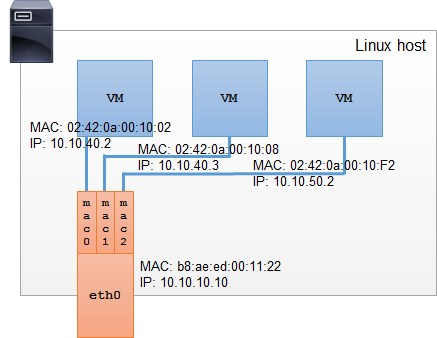
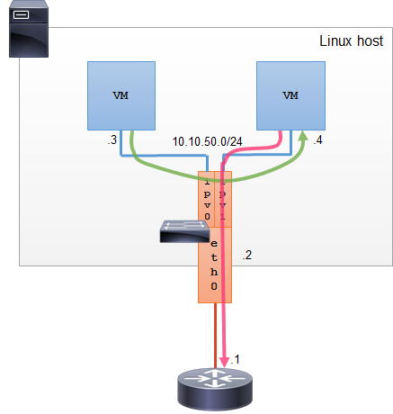
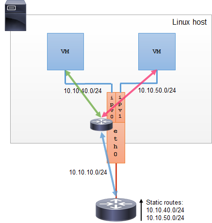

# Macvlan vs Ipvlan

I’ve covered [macvlans](http://hicu.be/2016/03/bridge-vs-macvlan/) in the [Bridge vs Macvlan](http://hicu.be/2016/03/bridge-vs-macvlan/) post. If you are new to macvlan concept, go ahead and read it first.

## Macvlan

To [recap](http://hicu.be/2016/03/bridge-vs-macvlan/): Macvlan allows you to configure sub-interfaces (also termed slave devices) of a parent, physical Ethernet interface (also termed upper device), each with its own unique MAC address, and consequently its own IP address. Applications, VMs and containers can then bind to a specific sub-interface to connect directly to the physical network, using their own MAC and IP address.

Macvlan is a near-ideal solution to natively connect VMs and containers to a physical network, but it has its shortcomings:

- The switch the host is connected to may have a policy that limits the number of different MAC addresses on a physical port. Although you should really work with your network administrator to change the policy, there are times when this might not be possible (or you just need to set up a quick PoC).
- Many NICs have a limit on the number of MAC addresses they support in hardware. Exceeding the limit may affect the performance.
- IEEE 802.11 doesn’t like multiple MAC addresses on a single client. It is likely macvlan sub-interfaces will be blocked by your wireless interface driver, AP or both. There are somehow complex ways around that limitation, but why not stick to a simple solution?

------

 

## Ipvlan

Ipvlan is very similar to macvlan, with an important difference. Ipvlan does not assign unique MAC addresses to created sub-interfaces. All sub-interfaces share parent’s interface MAC address, but use distinct IP addresses.

Because all VMs or containers on a single parent interface use the same MAC address, ipvlan also has some shortcomings:

- Shared MAC address can affect DHCP operations. If your VMs or containers use DHCP to acquire network settings, make sure they use unique ClientID in the DHCP request and ensure your DHCP server assigns IP addresses based on ClientID, not client’s MAC address.
- Autoconfigured EUI-64 IPv6 addresses are based on MAC address. All VMs or containers sharing the same parent interface will auto-generate the same IPv6 address. Ensure that your VMs or containers use static IPv6 addresses or IPv6 privacy addresses and disable SLAAC.

### Ipvlan modes

Ipvlan has two modes of operation. Only one of the two modes can be selected on a single parent interface. All sub-interfaces operate in the selected mode.

#### Ipvlan L2

Ipvlan L2 or Layer 2 mode is analogue to the macvlan bridge mode.

Parent interface acts as a switch between the sub-interfaces and the parent interface. All VMs or containers connected to the same parent Ipvlan interface and in the same subnet can communicate with each other directly through the parent interface. Traffic destined to other subnets is sent out through the parent interface to default gateway (a physical router). Ipvlan in L2 mode distributes broadcasts/multicasts to all sub-interfaces.

#### Ipvlan L3

Ipvlan L2 mode acts as a bridge or switch between the sub-interfaces and parent interface. As name suggests, Ipvlan L3 or Layer 3 mode acts as a Layer 3 device (router) between the sub-interfaces and parent interface.

Ipvlan L3 mode routes the packets between all sub-interfaces, thus providing full Layer 3 connectivity. Each sub-interface has to be configured with a different subnet, i.e. you cannot configure 10.10.40.0/24 on both interfaces.

Broadcasts are limited to a Layer 2 domain, so they cannot pass from one sub-interface to another. Ipvlan L3 mode does not support multicast.

Ipvlan L3 mode does not support routing protocols, so it cannot notify the physical network router of the subnets it connects to. You need to configure static routes on the physical router pointing to the Host’s physical interface for all subnets on the sub-interfaces.

> Ipvlan L3 mode behaves like a router – it forwards the IP packets between different subnets, however it does not reduce the TTL value of the passing packets. Thus, you will not see the Ipvlan “router” in the path when doing traceroute.

*Ipvlan L3 can be used in conjunction with [VM or Container ran BGP](https://github.com/osrg/gobgp), used as a service advertisement protocol to advertise service availability into the network. This advanced scenario exceeds the purpose of this post.*

------

 

## Macvlan vs Ipvlan

Macvlan and ipvlan cannot be used on the same parent interface at the same time.

Use Ipvlan when:

- **Parent interface is wireless.**
- Your parent interface performance drops because you have exceeded the number of different MAC addresses. For production, you should consider swapping your NIC for a better one and use macvlans.
- Physical switch limits the number of MAC addresses allowed on a port ([Port Security](https://www.cisco.com/c/en/us/td/docs/switches/lan/catalyst6500/ios/12-2SX/configuration/guide/book/port_sec.html)).  For production, you should solve this policy issue with your network administrator and use macvlans.
- You run an advanced network scenario, such as advertising the service you run in the VM or container with the BGP daemon running in the same VM or container.

Use Macvlan:

- In every other scenario.

### References

- [Ipvlan Kernel Documentation](https://www.kernel.org/doc/Documentation/networking/ipvlan.txt)

### Next

- [Configure Docker macvlan network](http://hicu.be/docker-networking-macvlan-bridge-mode-configuration)
- [Configure multiple Docker macvlan networks on 802.1Q trunk VLANs](http://hicu.be/docker-networking-macvlan-vlan-configuration)